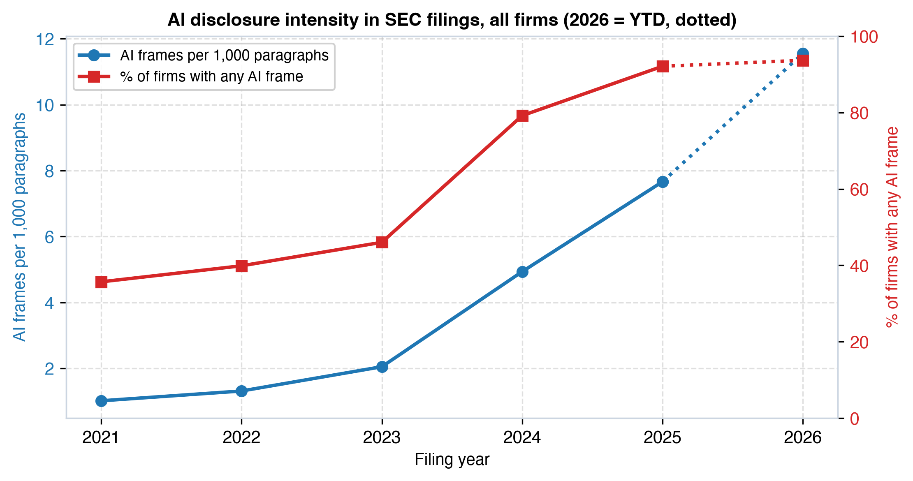
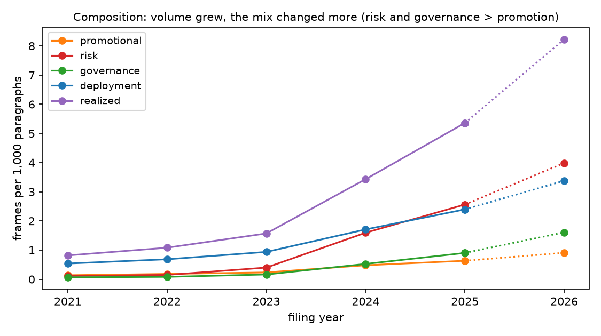
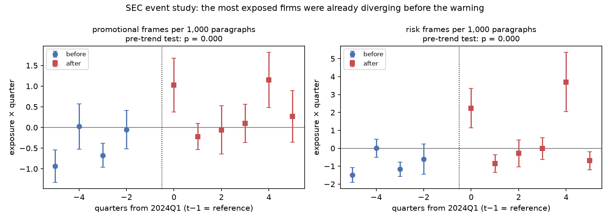
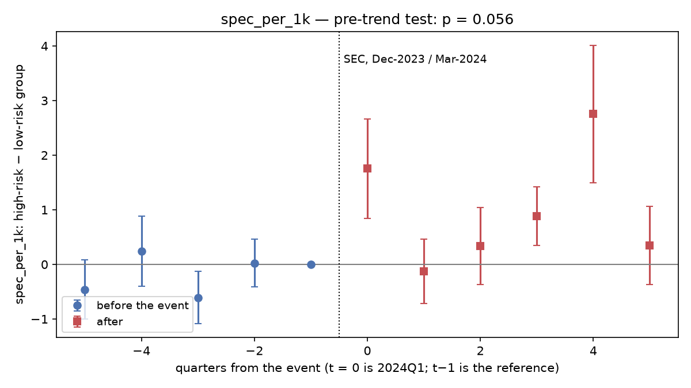

# Executive summary {.unnumbered}

Between 2021 and 2025, artificial intelligence went from a topic that one in three S&P 500 companies mentioned in their SEC filings to one that nine in ten address, and the density of that language grew almost eightfold. Regulators noticed. In December 2023 the Chair of the U.S. Securities and Exchange Commission (SEC) coined the term "AI washing" [@gensler2023]; in March 2024 the agency brought its first enforcement actions against it [@sec2024pressrelease]. This dissertation asks whether that flood of language carries information, whether firms differ in *what* they say about AI rather than only in *how much*, and whether the regulator's scrutiny changed anything.

The evidence base is a paragraph-level corpus of every 10-K, 10-Q, proxy statement (DEF 14A), 8-K and earnings-call transcript of S&P 500 constituents from 2021 to 2025: 55,981 documents and 8.35 million paragraphs. A validated classifier identifies the paragraphs that mention AI, and a large language model decomposes each of them into structured *frames*: whether the claim is realized or hypothetical, whether it names a process, product, vendor, metric or date, whether it is promotional, and whether it concerns adoption, capabilities, risk or governance. The analysis is run on the *extensive margin*: every firm and every document counts, with a zero when it says nothing about AI, and disclosure is measured as frames per 1,000 paragraphs. That choice matters, because the firm that says nothing about AI is part of the phenomenon, not a missing value.

Five findings anchor the dissertation. First, the composition of AI disclosure changed more than its quantity: between 2021 and 2025 risk language grew twenty-two-fold and governance language thirteen-fold, while promotional language fell from 11% to 5% of AI statements in filings. Second, firms sort into three reproducible disclosure archetypes, Product Deployers, Governance Adopters and Risk Listers, plus a fourth group that does not disclose AI at all; the archetypes separate firms on R&D intensity, margins, beta and valuation they were never built to predict, and Product Deployers remain distinct within their own sector and year. Third, and centrally, the *content* of AI disclosure adds explanatory power over fundamentals and disclosure volume for beta, idiosyncratic volatility, price-to-sales, R&D intensity and next-year revenue growth: two to four points of partial R², confirmed by bootstrap, a joint Wald test and a permutation test within sector-year. The dimension that carries the signal is specificity. Promotional tone carries none. Fourth, the SEC's 2024 scrutiny cannot be separated from the generative-AI boom it landed in: more and less exposed firms were already diverging before the regulator spoke, and every design that compares them fails its pre-trend test. Fifth, the one design that removes the boom, comparing the same firm in the same fiscal year on its earnings call and in its filings, shows that firms put twenty times more promotional AI claims per paragraph in front of analysts than in what they file, that this gap tripled between 2022 and 2025, and that it did not narrow when the regulator announced it would look for exactly that.

For issuers, the practical implication is to audit the distance between what is said on the call and what is filed, rather than the tone of any single document. For capital allocators, the volume and the promotional tone of AI talk are not worth pricing; the specificity of the claims is. For regulators, the gap between venues is where the mechanism the SEC itself described in its correspondence with Welltower lives, and it has not moved. For management scholarship, the greenwashing framework transfers only partially to AI: signalling operates through the concreteness of claims, and the three empirical definitions of "washing" that this dissertation builds identify almost disjoint sets of firms.

# Introduction {.unnumbered}

Corporate disclosure about artificial intelligence became, in the space of three fiscal years, a near-universal feature of the annual reports, proxy statements and earnings calls of large U.S. companies. The public release of ChatGPT in November 2022 started the wave; the 2024 filing season, the first written with a full year of generative AI behind it, is where it breaks. Growth in volume does not, however, answer the question that the readers of those documents care about: is the firm describing something it does, something it plans to do, or something it would simply like investors to associate with it?

The SEC gave that question regulatory weight. Its Chair used the term "AI washing" publicly for the first time in December 2023 [@gensler2023], and in March 2024 the agency charged two investment advisers with false and misleading statements about their use of AI [@sec2024pressrelease]. In 2025 the same concern reached an S&P 500 operating company: in its correspondence with Welltower, the SEC's objection was not that the 10-K was promotional, but that the earnings call described "industry-leading" AI capabilities without proportional support in the filing. That case defines the mechanism this dissertation ends up measuring most precisely.

The managerial relevance is direct. Boards, investor-relations teams and general counsels now choose how to talk about AI under a regime where the choice has compliance consequences, without a benchmark of what their peers say and how. Investors read hundreds of AI statements per quarter without a way to tell which features of that language are worth pricing. And management scholarship has a ready-made analogue, greenwashing, whose transfer to a new technology narrative has not been tested at scale.

**Research questions.** The main question is: *how do public firms differ in their AI disclosure behaviours regarding adoption, capabilities, risks and governance, and which distinct disclosure archetypes emerge from those differences?* Five extended questions follow. RQ2 asks whether it is *what* firms say or simply *how much* they say that distinguishes them. RQ3 asks whether the archetypes correspond to coherent economic characteristics: R&D intensity, growth, margins, valuation, risk. RQ4, the central one, asks whether the semantic content of AI disclosure carries information beyond conventional fundamentals and simple AI-mention intensity. RQ5 asks how disclosure evolved over 2021–2025 and whether firms with more promotional disclosure before 2024 changed behaviour after the SEC's scrutiny. RQ6 asks whether the DeepSeek shock of January 2025 changed how firms framed AI capabilities and competition.

**Methodology in outline.** The dissertation treats AI disclosure as a measurement problem before it treats it as a policy question. A corpus of 55,981 documents is embedded, filtered by a validated classifier that asks only "does this paragraph mention AI?", deliberately not "is it substantive?", because vagueness is the object of study, and decomposed by a large language model into structured frames. Frames are aggregated to firm-year and firm-quarter *intensities* per 1,000 paragraphs, with zeros where a firm says nothing, so that no analysis conditions on the phenomenon it studies. On that panel the dissertation runs a stability-selected segmentation, a voice-versus-disclosed-behaviour grid, sector-year-adjusted economic profiles, nested regressions that isolate the incremental explanatory power of content over volume and fundamentals, event studies around the SEC and DeepSeek dates, a within-firm cross-channel comparison of calls and filings, and a calibrated statistical score of promotional excess.

A terminological caution runs through the whole document. When this dissertation writes "behaviour", "conduct" or "substance" about a firm's AI activity, it means *disclosed* behaviour: statements that describe deployment, results or capabilities. Nobody verified the deployment. The only places where talk is compared with something outside the text are the economic profiles of Chapter 4 and the outcome regressions of Chapter 5, where disclosure is set against R&D, margins, beta, volatility, valuation and growth.

**Expected outcomes and roadmap.** Chapter 1 places AI washing in its regulatory context and derives six hypotheses from signalling, cheap-talk, legitimacy and greenwashing theory. Chapter 2 describes the corpus, the measurement pipeline, its validation and the extensive-margin design. Chapter 3 documents how AI disclosure evolved between 2021 and 2025. Chapter 4 identifies the disclosure archetypes, the voice-versus-disclosed-behaviour grid and the economic profile of each group. Chapter 5 tests whether content carries information beyond volume and fundamentals. Chapter 6 studies disclosure under scrutiny: the SEC and DeepSeek shocks, and the gap between earnings calls and filings. Chapter 7 compares three empirical definitions of AI washing and draws the implications for issuers, investors, regulators and management theory. The Conclusions state what was found, what it means for managers, and what remains open.

# AI washing: context and theory

## The post-ChatGPT disclosure wave

In the filings of S&P 500 companies, AI was a minority topic in 2021: 36% of firms had at least one AI-related statement in their annual filings, at a density of one AI frame per 1,000 paragraphs. By 2025 the share was 92% and the density 7.7 per 1,000; the partial 2026 filing season runs at 11.6 (Chapter 3). The jump is concentrated in the 2024 filing season, when the 10-Ks covering fiscal 2023, the first written with a year of generative AI behind them, went from 39% to 72% of documents with an AI statement.

The wave was not uniform in content. The statements that firms added between 2023 and 2025 were, above all, an AI risk factor and a line on AI governance. Promotional language grew with volume but lost weight within it. That is the fact that conditions everything that follows: in the filing, AI became a matter of risk and oversight; the selling of the product happens on the earnings call, and the distance between the two venues is the dissertation's cleanest measurement.

## The SEC's position and enforcement

The SEC's concern moved from remarks to enforcement in five months. The Chair's December 2023 speech introduced "AI washing" by explicit analogy to greenwashing: a favourable label adopted without the substance the label implies [@gensler2023]. The March 2024 actions against Delphia and Global Predictions charged false statements about the use of AI in investment processes [@sec2024pressrelease]. In April 2025 a comment letter to Welltower, an S&P 500 real-estate company, took the concern to an operating company and, crucially, to a *cross-venue* mechanism: language used on the earnings call and in the press release was not proportionally supported in the 10-K.

Three features of that position shape the design. First, the concern is about the gap between disclosure and reality, not about volume as such. The frame schema of Chapter 2 is built to measure that gap through the temporal status of each claim (realized versus planned, expected or hypothetical) and its specificity (does it name a process, product, vendor, metric or date). Second, the enforcement actions targeted investment advisers, outside the S&P 500 operating-company sample; the scrutiny is a shift in regulatory posture that every firm observed at the same time, not a treatment applied to some firms and not others. Chapter 6 shows why that makes its effect unidentifiable against the concurrent generative-AI boom. Third, the Welltower case names the mechanism precisely: not promotional filings, but calls that promise more than filings support. Chapter 6 measures exactly that.

## Theoretical lenses

Four lenses frame the empirical work. Each predicts a different observable pattern in frame-level data.

**Voluntary disclosure and signalling.** Verrecchia's discretionary-disclosure framework [@verrecchia1983] and Spence's signalling model [@spence1973] share a mechanism: a costly, hard-to-imitate signal separates firms with good private information from those without. Applied to AI, specificity and realization are costly because they are falsifiable. A firm that names a product, a vendor, a metric or a date creates a verifiable trail that a firm with nothing concrete cannot cheaply fabricate. This motivates **H1**: specificity and realization behave as a separating signal, so disclosure archetypes should organise along those dimensions rather than along volume alone.

**Cheap talk and impression management.** Where a claim cannot be verified in the short run, Crawford and Sobel's result [@crawford1982] implies management has no cost-based reason to report truthfully, and the narrative-disclosure literature documents the resulting incentive to manage impressions [@merkldavies2007; @huang2014]. This motivates **H2**: promotional rhetoric and hypothetical framing should concentrate together, in the same firms and the same venues, because both are symptoms of a claim insulated from verification.

**Legitimacy and institutional isomorphism.** Suchman's account of legitimacy-seeking [@suchman1995] and DiMaggio and Powell's mimetic isomorphism [@dimaggio1983] predict that firms adopt AI language because peers and stakeholders expect the topic to be addressed, not because they have something specific to report. That produces low-specificity disclosure that diffuses by sector and imitation, **H3**, and it is the lens most at odds with H1.

**Greenwashing as the reference case.** Delmas and Burbano's drivers-of-greenwashing framework [@delmas2011] and Lyon and Montgomery's account of greenwashing as strategic communication [@lyon2015] give the closest structural analogue, and Marquis, Toffel and Zhou [@marquis2016] the regulatory precedent: external scrutiny reduces selective disclosure. Applied to AI this motivates **H5**, that scrutiny should reduce the promotional and hypothetical share of disclosure more than it raises the realized or specific share, and **H6**, that voluntary venues (earnings calls) should react more than mandated ones (10-K), because mandated text already carries legal review. Cheng et al.'s study of blockchain-mania 8-K disclosures [@cheng2019] is the nearest prior case of a technology label attached opportunistically to a corporate narrative.

A fifth prediction, **H4**, follows from combining the lenses rather than from any one of them: if content reflects private information (H1) rather than mimicry (H3) or cheap talk (H2), it should be informative about firm outcomes beyond what mention volume and fundamentals already capture. Chapter 5 is built to test H4 directly.

## Prior empirical work and the gap

Three literatures precede this work. In finance, Eisfeldt, Schubert and Zhang [@eisfeldt2023] link occupational exposure to generative AI to firm value; Basnet et al. [@basnet2025] classify 10-K AI narratives as actionable or speculative and find that only actionable narratives earn a valuation premium; Song et al. [@song2026] compare BERT-classified AI claims with AI patents and find that unsubstantiated claims attract attention and then underperform; Anantharaman, Parker and Rozario [@anantharaman2026] document the evolution of AI risk, ethics and opportunity disclosure in 10-Ks; Babina et al. [@babina2024] measure AI investment from résumés and link it to product innovation and growth; Strauss et al. [@strauss2025] study AI disclosure in 8-Ks and argue for a 10-K mandate. In accounting, the readability and tone-management literature [@li2008; @huang2014] and the Loughran–McDonald tradition of transparent, dictionary-based textual analysis [@loughran2011] frame the measurement choices of Chapter 2. In methods, the use of large language models as annotators, validated against human coders [@gilardi2023], underpins the frame-extraction layer.

The gap is specific. Prior work collapses AI disclosure to a binary substantive/speculative split at the document or claim level. None characterises a multi-dimensional structure of disclosure style across adoption, capabilities, risk and governance; tests whether that structure survives controlling for volume and fundamentals; measures the same firm across mandated and voluntary venues in the same fiscal year; or studies the whole population of firms, including the ones that say nothing. This dissertation does those four things.

## Hypotheses

| # | Lens | Hypothesis | Tested in |
|---|---|---|---|
| H1 | Signalling | Specificity and realization are costly to fabricate, so they separate disclosure archetypes and carry the signal. | Ch. 4, Ch. 5 |
| H2 | Cheap talk | Promotional and hypothetical framing concentrate where verification is hardest. | Ch. 4, Ch. 6 |
| H3 | Legitimacy | Low-specificity AI talk spreads by sector and imitation rather than by firm economics. | Ch. 3, Ch. 4 |
| H4 | Informativeness | Semantic content adds explanatory power for firm outcomes beyond AI-mention volume and fundamentals. | Ch. 5 |
| H5 | Regulatory response | The SEC's 2024 scrutiny reduces the promotional and hypothetical share more than it raises the realized or specific share. | Ch. 6 |
| H6 | Venue | Voluntary venues (earnings calls) react more to scrutiny than mandated venues (10-K). | Ch. 6 |

: Hypotheses, theoretical lens and the chapter that tests each. {#tbl-hyp}

# Data and measurement

## Corpus and sources

The corpus covers S&P 500 constituents across five disclosure venues: Form 10-K (annual, mandated), Form 10-Q (quarterly, mandated), DEF 14A proxy statements (annual, governance-focused), Form 8-K (event-driven) and earnings-call transcripts (quarterly, voluntary). Filings run from November 2020 to September 2026; transcripts cover fiscal years 2021–2025, with the last transcript in mid-2025. @tbl-funnel reports the full funnel from documents to frames.

| Stage | 10-K | 10-Q | DEF 14A | 8-K | Calls | Total |
|---|---:|---:|---:|---:|---:|---:|
| Documents | 2,873 | 8,099 | 2,646 | 34,416 | 7,947 | 55,981 |
| Paragraphs (instances) | 1,544,496 | 1,736,542 | 3,679,553 | 1,623,906 | 554,281 | 9,138,778 |
| Scorable paragraphs | 1,422,746 | 1,593,351 | 3,254,803 | 1,529,705 | 553,942 | 8,354,547 |
| Unique scorable texts | 855,682 | 849,415 | 2,273,716 | 406,756 | 483,235 | 4,868,804 |
| Unique texts flagged by the prefilter | 11,293 | 2,933 | 6,383 | 384 | 9,584 | 30,577 |
| Unique texts classified by the LLM judge | 11,294 | 2,933 | 6,384 | 384 | 9,584 | 30,579 |
| Unique texts with ≥1 frame | 10,532 | 2,587 | 5,216 | 232 | 7,902 | 26,469 |
| Unique frames | 16,245 | 3,409 | 7,168 | 295 | 16,249 | 43,366 |
| Frames as instances (in documents) | 17,758 | 4,590 | 7,284 | 313 | 16,270 | 46,215 |
| Documents with ≥1 frame | 1,681 | 1,431 | 1,090 | 206 | 2,709 | 7,117 |

: Corpus funnel, S&P 500 constituents, U.S. filings and earnings calls. Prefilter v2 at threshold 0.17; LLM judge qwen3.7-flash. {#tbl-funnel}

Three features of the funnel matter downstream. Deduplication: 8.35 million scorable paragraph instances are 4.87 million unique texts, and embedding, prefiltering and frame extraction happen once per unique text; the frames of each unique text are then joined back to every document in which it appears (43,366 unique frames become 46,215 in documents, a factor of 1.07, so repeated boilerplate weighs little). The judge discards 13% of what the prefilter flags: 26,469 of 30,579 flagged texts receive at least one frame; the rest are prefilter false positives that the extraction filters by returning zero frames. And the 8-K layer is almost pure noise: 34,416 documents, 206 with a frame. Earnings calls are the dense channel: a transcript has a tenth of the paragraphs of a 10-K, yet the 7,947 transcripts yield as many frames as the 2,873 annual reports.

## From text to frames

Measurement proceeds in three stages, each producing a persisted artefact keyed by the paragraph's text hash.

**Embedding.** Every unique paragraph is embedded once with BAAI/bge-m3 [@chen2024bge], 1,024 dimensions.

**AI prefilter.** A gradient-boosted classifier over 39 signals answers "does this paragraph mention AI?". The signals combine a lexical gate (strong and weak AI vocabulary with word-boundary matching), the paragraph's semantic margin against curated positive and negative anchor sets, text-form features, and a sentence-level signal computed only on sentences that themselves contain an AI term, which matters in long structural text such as board skills matrices where the paragraph vector is dominated by non-AI content. Document type is deliberately excluded as a feature so that cross-venue comparisons are not circular. The deployed threshold is 0.17, chosen for recall: the object of study is vagueness, so the classifier must not pre-select for substance.

**Frame extraction.** Each flagged paragraph is sent to a large language model (Qwen 3.7 Flash, via OpenRouter, fixed prompt version) that returns zero or more *frames*, coherent propositions about AI, with evidence given as sentence indices rather than copied text. Each frame records a subject (the firm, its suppliers or partners, customers, competitors or the industry), an AI type (generative, predictive, unspecified), a temporal status (realized, planned, expected, hypothetical), a domain (internal, customer-facing), a set of topical concepts covering adoption stage (early stage, deployed, scaled), outcomes (revenue, cost), capabilities (AI investment, infrastructure, talent, proprietary AI, third-party AI), risk sub-types and governance, five specificity flags (process, product or system, vendor or partner, quantified metric, date or timeline) and two rhetoric flags (promotional, strategic importance).

## Validation

The prefilter is validated against an LLM-judged golden set with `GroupKFold` grouped by document, so paragraphs from the same filing never span train and test, and the judge itself is checked against an independent model (Gemini), with κ = 0.87 [@cohen1960]. Performance differs by venue, and the difference is carried as a caveat through the whole dissertation: precision is 0.98 in 10-K and 10-Q text, 0.73 in proxy statements and 8-Ks, and 0.60 in earnings-call transcripts; the weighted F1 is 0.96 in 10-K text against 0.82 in DEF 14A. Every comparison *between* venues therefore mixes a difference in discourse with a difference in measurement error; comparisons *within* a firm over time do not.

Frame extraction has not yet been validated against human coding at scale. A stratified sample of 400–500 paragraphs, by form, year, prefilter score, promotional flag and realization status, is the pending step, with a local annotation tool built for it. The fields that carry the dissertation's central claims, temporal status, specificity and promotional rhetoric, are the ones whose agreement will be checked first; a field with poor agreement is collapsed to a coarser category (for instance realized versus not realized) and the analyses re-run, which is the only event that reopens the frozen instrument. Every result in Chapters 3–7 rests on LLM labels, and this is stated as the dissertation's main limitation rather than buried.

## The extensive margin: every firm and every document counts

The unit of analysis throughout is *intensity per 1,000 paragraphs*: for a firm-year, the number of frames of a given kind across all its documents in that year, divided by the scorable paragraphs of those documents, times one thousand. A firm that says nothing about AI has an intensity of zero, not a missing value. This is the single most consequential design decision in the dissertation, and it was made after an earlier design that conditioned on speaking (a firm-year entered the panel only with a minimum number of frames) was found to select on the phenomenon itself: the firm that stops talking about AI dropped out of the panel instead of counting as a zero. Two-thirds of firm-years in 2021 and fewer than one in ten in 2025 have no AI frame at all; a design that drops them cannot describe the boom.

Where a *rate* is needed (the share of a firm's AI statements that are promotional, say), it is defined only for firms with frames, shrunk toward the corpus mean with an empirical-Bayes prior in proportion to how few frames the firm has, and the firm with no frames is assigned to an explicit "no AI" group rather than excluded. Instances, not unique texts, enter both numerator and denominator of every intensity, from the same documents. Fiscal-year alignment follows what each document covers: 10-K and 10-Q by period end date with each firm's fiscal year-end month, earnings calls by the fiscal quarter in the transcript identifier, DEF 14A and 8-K by filing date. The firm-year panel used in Chapters 3–5 has 2,964 firm-years for 510 firms with filings; the sub-panel with market data for fiscal years 2021–2025 has 2,475 firm-years for 508 firms, 59% of which have at least one AI frame.

## Firm-period features

| Feature | Definition | Serves |
|---|---|---|
| AI volume | AI frames per 1,000 paragraphs of the firm's documents in the period; zero when none | RQ2, H4 |
| Realized | Frames with temporal status = realized, per 1,000 paragraphs | H1 |
| Deployment | Frames with the *deployed* concept, per 1,000 paragraphs | H1 |
| Capability | Frames with *AI investment* or *AI infrastructure*, per 1,000 paragraphs | H1 |
| Risk | Frames with any risk concept, per 1,000 paragraphs | H3, H5 |
| Governance | Frames with any governance concept, per 1,000 paragraphs | H3, H5 |
| Promotional | Frames flagged promotional, per 1,000 paragraphs | H2, H5 |
| Specificity | Mean number of the five specificity flags per frame, summed, per 1,000 paragraphs | H1, H4 |
| Quantified | Frames with a quantified metric, per 1,000 paragraphs | H1 |
| Shares (rates) | Each of the above as a share of the firm's AI frames, EB-shrunk, defined only for firms with frames | Ch. 4 |
| Cross-venue gap | Call intensity minus filing intensity, same firm and fiscal year | H6 |

: Firm-period features. All intensities include zeros for firms or periods with no AI frame. {#tbl-features}

## Financial and market data

Fundamentals come from the EDGAR XBRL financial-statement data sets with concept fallback chains (coverage 98% for revenue and net margin, 87% for capex, 80% for SG&A, 44% for R&D, which is reported only by firms that separate it). Ratios with non-positive denominators are set to missing rather than computed. Growth variables are set to missing when the fiscal gap falls outside 340–380 days. Market variables are computed from daily prices and Fama–French factors around each 10-K filing date: CAPM beta from a 252-trading-day market-model regression of excess returns on the market factor before the filing; *idiosyncratic volatility* as the annualised standard deviation of that regression's residuals over the same window; total realized volatility over 60 days before the filing; market capitalisation and multiples at the filing date. Cost of capital uses a geometric equity risk premium of 6.48%. All financial variables are winsorised at the 1st and 99th percentiles in the regressions of Chapters 4 and 5. Sector is SIC two-digit; sector-year fixed effects absorb 200-odd cells.

## Analytical strategy

Chapter 3 is descriptive on the full firm-year panel. Chapter 4 runs a K-means segmentation on EB-shrunk shares plus log intensity, with the number of segments chosen by bootstrap stability rather than by silhouette [@rousseeuw1987], and a "no AI" segment by rule; a voice-versus-disclosed-behaviour grid on tercile cuts of two rates; and sector-year-adjusted profiles of each segment on fundamentals, with standard errors clustered by firm. Chapter 5 is the central test: for each of five outcomes, four nested models, fundamentals only, plus volume, plus the seven semantic intensities, or plus segment dummies, with sector-year fixed effects; the statistic reported is the increment in R² from the semantic block, with a firm-cluster bootstrap, adjusted R², a joint Wald test with firm-clustered standard errors and a permutation test that reshuffles the semantic block among firms within the same sector and year. Chapter 6 runs event studies with continuous exposure and two-group difference-in-differences around the SEC and DeepSeek dates on the firm-quarter panel, reporting pre-trend tests as the primary result [@bertrand2004; @callaway2024], and a within-firm-year comparison of earnings calls against filings. Chapter 7 adds a calibrated binomial test of promotional excess. None of the analysis scripts calls a language model; everything after frame extraction is deterministic and regenerable.

# The AI disclosure wave, 2021–2025

This chapter answers the descriptive half of RQ5 on the full firm-year panel: all firms with SEC filings (10-K, 10-Q, DEF 14A, 8-K), with a zero when a firm says nothing about AI. Year is the filing year; 2026 is a partial season and is shown as year-to-date only.

## How much: intensity and reach

| Year | Firms | With any AI frame | AI frames per 1,000 paragraphs |
|---|---:|---:|---:|
| 2021 | 496 | 36% | 1.0 |
| 2022 | 499 | 40% | 1.3 |
| 2023 | 491 | 46% | 2.0 |
| 2024 | 495 | 79% | 4.9 |
| 2025 | 494 | 92% | 7.7 |
| 2026 YTD | 489 | 94% | 11.6 |

: AI disclosure intensity and reach in SEC filings, all S&P 500 firms with filings. {#tbl-evol-a}

{#fig-evol-int}

Between 2021 and 2025 intensity multiplied by 7.6 and the share of firms that address AI went from one in three to nine in ten. The step is the 2024 filing season: the 10-Ks covering fiscal 2023 are the first written with a year of generative AI behind them, and the share of annual reports with an AI statement went from 39% to 72% in a single season. A balanced cohort of the 475 firms present in both 2021 and 2026 gives the same figures to one decimal (36% to 93%; 1.0 to 11.5 frames per 1,000), so the evolution is not sample composition.

## What: the mix changed more than the quantity

| Year | Promotional | Risk | Governance | Deployment | Realized |
|---|---:|---:|---:|---:|---:|
| 2021 | 0.14 | 0.11 | 0.07 | 0.54 | 0.82 |
| 2022 | 0.18 | 0.15 | 0.08 | 0.68 | 1.08 |
| 2023 | 0.23 | 0.40 | 0.16 | 0.94 | 1.57 |
| 2024 | 0.48 | 1.60 | 0.53 | 1.71 | 3.43 |
| 2025 | 0.63 | 2.56 | 0.90 | 2.40 | 5.36 |
| 2026 YTD | 0.91 | 3.99 | 1.61 | 3.38 | 8.23 |
| **Multiplier 2021→2025** | **×4.6** | **×22** | **×13** | **×4.4** | **×6.6** |

: Composition of AI disclosure in filings, frames per 1,000 paragraphs by type, all firms. {#tbl-evol-b}

{#fig-evol-comp}

Risk language grew five times faster than promotional language, and governance language three times faster. Measured as a share of a firm's AI statements, promotional content *fell* from 11% in 2021 to 5% in 2025, while risk *rose* from 12% to 47%. What firms added to their filings between 2023 and 2025 was, first of all, an AI risk factor and a line on AI governance; promotion grew with the volume but lost weight within it. In the filing, AI became a matter of risk and oversight.

This is the reading that conditions everything that follows. It is consistent with H3 in one respect, near-universal adoption of the topic within two seasons is the signature of mimetic diffusion, and it sets up the venue contrast of Chapter 6: if the product is not being sold in the filing, it is being sold somewhere else. Two descriptive facts from the frame fields sharpen the picture. Across filings, 72% of AI statements are about something already realized, 12.5% planned, 8% expected and 7% hypothetical; on earnings calls the hypothetical share is under 1%. And the AI type shifted from predominantly predictive machine learning in 2021 to generative AI in about 93% of typed statements by 2026, while predictive mentions stayed flat.

## Limitations

Year is filing year, so a 10-K filed in February 2025 counts in 2025 although it describes fiscal 2024. Intensity per paragraph depends on document length. All labels are LLM labels pending human validation.

# Disclosure archetypes

This chapter answers the main research question and RQ3. It builds a segmentation of firms by how they disclose AI, a two-axis grid of voice against disclosed behaviour, and the economic profile of each group within its own sector and year. Throughout, "behaviour" means *disclosed* behaviour: the share of a firm's AI statements that describe a stage of use, a result or a capability. It is what the firm says it does, and it is validated against the firm's economics, not against an independent observation of each deployment.

## A stability-selected segmentation

All 510 firms with filings enter. The features are the dimensions of the research question, each a share of the firm's AI statements, shrunk toward the corpus mean with an empirical-Bayes prior in proportion to how few frames the firm has, plus AI intensity as one more dimension.

| Dimension of the question | Features |
|---|---|
| Adoption | % deployment, % scaled, % early stage (pilot or exploration), % outcomes |
| Capabilities | % own capability (investment, infrastructure, talent, proprietary AI), % third-party AI |
| Risks | % risk, % hypothetical |
| Governance | % governance |
| Register | % promotional, % quantified, % product-facing |
| Intensity | log(1 + AI frames per 1,000 paragraphs) |

: Segmentation features. Shares are over the firm's own AI frames, so none rewards the firm that talks most; intensity carries that information separately. {#tbl-seg-features}

Four construction decisions. Rare concepts are pooled into their dimension: AI investment, infrastructure, talent and proprietary AI each appear in 2–3% of frames and are noise separately, "capabilities" together. Rates are shrunk, so a firm with eight frames is pulled toward the average; a firm with zero frames has no rate and goes to a **No AI** segment by rule, and the clustering is fitted on the firms that do speak. Intensity is a dimension, not a filter: without it, the firm with 3 frames and the firm with 300 and the same shares would be the same firm. And the number of segments is chosen by *stability*, not silhouette: each firm's frames are resampled and the segmentation refitted, and the question is whether a firm that had drawn other frames of its own would land in the same group (@tbl-seg-k).

| k | Per-segment Jaccard stability | Usable |
|---|---|---|
| 2 | 0.80 / 0.89 | yes |
| **3** | **0.71 / 0.75 / 0.73** | **yes, chosen** |
| 4 | 0.58 / 0.72 / 0.59 / 0.77 | no |
| 5 | 0.50 / 0.77 / 0.69 / 0.31 / 0.56 | no |

: Choice of the number of segments by bootstrap stability under frame-level resampling. {#tbl-seg-k}

Three segments are the largest stable solution. A four-archetype solution developed earlier in the project fell exactly at k = 4 and is not reproducible; it was dropped.

## Four segments: three by clustering, one by rule

| | Product Deployers | Governance Adopters | Risk Listers | No AI |
|---|---:|---:|---:|---:|
| **Firms** | **113** | **222** | **158** | **17** |
| Frames (median) | 97 | 24 | 18 | 0 |
| AI frames per 1,000 paragraphs (median) | **8.4** | 1.6 | 1.2 | 0 |
| Stability (Jaccard) | 0.75 | 0.73 | 0.71 | 1 (by rule) |
| % deployment | **42.2** | 24.8 | 12.0 | — |
| % outcomes | **26.1** | 14.2 | 5.4 | — |
| % product-facing | **45.8** | 17.3 | 12.1 | — |
| % own capability | **11.7** | 8.3 | 3.2 | — |
| % governance | 9.1 | **24.4** | 11.7 | — |
| % risk | 23.8 | 35.8 | **70.4** | — |
| % hypothetical | 6.2 | 6.1 | **25.6** | — |
| % promotional | **11.5** | 3.8 | 1.3 | — |
| % quantified | **6.4** | 2.9 | 0.6 | — |

: Segment profiles, 510 firms, pooled 2021–2026. Shares are means of each firm's share of AI statements. {#tbl-segments}

Segments are named from the dimension where each departs most from the corpus average, in z-scores, not from a presumed good-to-bad order.

**Product Deployers** (113 firms) describe AI working and facing the customer: 42% of their statements are deployment, 26% outcomes, 46% product-oriented, and they devote five to seven times more of their filings to AI than the other two groups. They are also the most promotional *and* the most quantified segment: loud and numeric are not mutually exclusive, which is itself evidence against a pure cheap-talk reading of promotional language (H2). Software and hardware; firms closest to the centroid are HPE, Paychex, Etsy, Trimble, ServiceNow, NetApp, HP and Keysight.

**Governance Adopters** (222 firms), the largest segment, adopt (25% deployment) but their distinctive mark is governance, 24% of statements, two and a half times the Deployers' share. Banks, insurers, utilities; State Street, Berkshire Hathaway, Quanta, Danaher, Cincinnati Financial.

**Risk Listers** (158 firms) devote 70% of their AI statements to risk, a quarter are hypothetical, and there is practically no promotional (1.3%) or quantified (0.6%) language. It is risk-factor boilerplate. TransDigm, Caesars, Las Vegas Sands, D.R. Horton, Nike, TJX.

**No AI** (17 firms pooled; 1,088 firm-years) has no AI statement in the period's filings. Pooled over six years almost nobody stays silent, and several of the 17 are firms acquired or removed from the index with few years of filings. Where the segment matters is in the panel: 66% of firm-years in 2021, 56% in 2023, 21% in 2024, under 10% from 2025. The boom is the emptying of this segment.

@tbl-substance isolates the *disclosed behavioural substance* behind the segmentation: the adoption-stage, outcome, capability and evidence dimensions on their own. Each is a share of the firm's AI statements.

| Behavioural dimension | What it represents | Product Deployers | Governance Adopters | Risk Listers |
|---|---|---:|---:|---:|
| Early stage | pilot or exploration | 1.6 | 2.6 | 2.0 |
| Deployed | implemented use | 42.2 | 24.8 | 12.0 |
| Scaled | adoption at scale | 11.0 | 7.9 | 4.1 |
| Outcomes | stated results (revenue, cost) | 26.1 | 14.2 | 5.4 |
| Own capability | investment, infrastructure, talent, proprietary AI | 11.7 | 8.3 | 3.2 |
| Third-party AI | reliance on vendors' AI | 3.5 | 2.5 | 3.0 |
| Quantified | a metric attached to the claim | 6.4 | 2.9 | 0.6 |

: Disclosed behavioural substance by segment: share of each firm's AI statements, mean by segment. These are statements about conduct, not observed conduct. {#tbl-substance}

The ordering is monotonic on every row except early-stage and third-party AI, which are flat and small. The segmentation is a split on *what kind* of AI content a firm emphasises; the segments persist year to year in 65% of consecutive firm-year pairs, and most of the transitions are exits from No AI.

## Voice against disclosed behaviour: two axes, nine cells

The grid is the direct form of the thesis question, does the firm talk more than it describes doing, with the two axes explicit instead of hidden inside a clustering. **Voice** is the share of a firm's AI statements in promotional or strategic-importance register (corpus mean 14.4%). **Disclosed behaviour** is the share that describes concrete conduct, a stage of use, a result or a capability (mean 44.9%). Both are shares over the firm's own frames, so neither rewards the firm that talks most; both are EB-shrunk; the 17 firms with no frames form their own cell. The correlation between the axes is 0.29: they are not the same axis, which is the condition for the grid to have content. Each axis is cut into terciles.

| | Low behaviour | Medium | High behaviour |
|---|---:|---:|---:|
| **High voice** | **absolute voice–behaviour decoupling: 36** | 44 | **substantive and vocal: 90** |
| **Medium voice** | 60 | 68 | 42 |
| **Low voice** | **silent: 79** | 53 | **quiet substance: 38** |

: Voice × disclosed-behaviour grid, 493 firms with AI frames, plus 17 in a separate No-AI cell. {#tbl-grid}

| Corner | Firms | % voice | % behaviour | Frames (median) | Examples (by volume) |
|---|---:|---:|---:|---:|---|
| Absolute decoupling (high voice, low behaviour; the region consistent with washing) | 36 | 33.1 | 22.8 | 17 | UNH, CI, AAPL, PYPL, ELV, AMT, AAL, SO |
| Quiet substance (low voice, high behaviour) | 38 | 4.3 | 70.5 | 30 | FTNT, OKTA, DDOG, STX, NET, EXPE, ZBH, ZTS |
| Substantive and vocal | 90 | 28.7 | 72.6 | 77 | MSFT, NVDA, GOOGL, ADBE, INTC, CRM, SNOW, AMD |
| Silent | 79 | 1.8 | 19.0 | 14 | BAC, MCHP, ISRG, BAX, WELL, UAL, PGR |

: The four corners of the grid. {#tbl-corners}

Under frame-level resampling (25 replicates), a firm lands in the same cell 61% of the time and in the same or an adjacent cell 99% of the time; when a firm moves, it moves one step, never across the grid. Each firm carries a cell confidence, and 149 of 510 exceed 0.80; with confidence ≥ 0.70 the corners keep 16, 15, 49 and 52 firms respectively. Year-to-year persistence of the cell is 48.5%, low and not disguised: with few frames a share jumps on its own, so time-series work should use the continuous axes, not the cell.

The corners separate things that did not enter their construction. The decoupled corner is low R&D (median 1.5% of revenue), low beta (0.76), non-tech, and talks little about AI in volume (1.3 frames per 1,000 paragraphs): firms that devote little of the filing to AI but what little they say is strategic register without described conduct. Quiet substance resembles the substantive-and-vocal corner in beta (0.97 versus 1.05) and valuation with half the intensity. This is the first place the dissertation can say that the promotional register, on its own, is not where the substance is.

## Economic profiles within sector and year

RQ3 asks whether the segments correspond to economically coherent types of firm, including *within* comparable sectors. Panel A of @tbl-profiles reports raw medians on the 2,475 firm-years of 2021–2025 with segment assigned by firm-year (No AI 1,047; Product Deployers 554; Governance Adopters 512; Risk Listers 362). Panel B residualises each variable on sector × year fixed effects and reports the difference of each segment against the No-AI firms of the same sector and year, with standard errors clustered by firm.

| | No AI | Risk Listers | Governance Adopters | Product Deployers |
|---|---:|---:|---:|---:|
| Market cap (median) | $26B | $31B | $37B | $39B |
| R&D / sales | 3.3% | 4.0% | 6.4% | **12.3%** |
| Gross margin | 39.3% | 42.3% | 43.6% | **59.5%** |
| Operating margin | 16.7% | 16.9% | 15.5% | 16.5% |
| Revenue growth t+1 | 8.1% | 4.6% | 6.0% | 8.5% |
| Beta | 0.87 | 0.74 | 0.86 | **1.06** |
| Total volatility, pre-filing | 26.5% | 23.0% | 25.1% | **30.0%** |
| Price / sales | 2.6 | 2.7 | 2.7 | **4.0** |
| ROIC − WACC | +4.8% | +3.8% | +5.4% | +5.6% |

: Panel A. Raw medians by segment, firm-years 2021–2025, winsorised 1/99. {#tbl-profiles}

| | Risk Listers | Governance Adopters | Product Deployers |
|---|---:|---:|---:|
| log market cap | +0.06 (p=0.56) | +0.20 (p=0.03) | **+0.38 (p<0.001)** |
| R&D / sales | +4.6 pp (p=0.01) | +2.5 pp (p=0.005) | **+5.7 pp (p<0.001)** |
| Gross margin | +3.4 pp (p=0.11) | +2.8 pp (p=0.14) | **+9.5 pp (p<0.001)** |
| Operating margin | −4.5 pp (p=0.05) | −1.3 pp (p=0.36) | −1.8 pp (p=0.34) |
| Revenue growth t+1 | +0.9 pp (p=0.54) | −0.0 pp (p=0.96) | +0.9 pp (p=0.48) |
| Beta | +0.02 (p=0.49) | +0.00 (p=0.92) | **+0.09 (p=0.006)** |
| Total volatility | +0.0 pp (p=0.98) | −0.1 pp (p=0.88) | **+2.5 pp (p=0.03)** |
| Price / sales | +0.00 (p=0.99) | −0.14 (p=0.64) | **+0.90 (p=0.04)** |
| ROIC − WACC | −2.2 pp (p=0.31) | +1.7 pp (p=0.38) | −1.0 pp (p=0.61) |

: Panel B. Difference against No-AI firms of the same sector and year, sector × year fixed effects, standard errors clustered by firm. {#tbl-profiles-b}

Three readings. **Product Deployers are a type of firm, also within their sector and year**: 46% larger by market capitalisation, 5.7 points more R&D over sales, 9.5 points more gross margin, higher beta, more volatile and more expensive (price-to-sales +0.9). None of that is industry composition. **Risk Listers and Governance Adopters are not distinguishable from the No-AI firms of their sector** in size, margins, risk or valuation, apart from somewhat more R&D; the difference between the two is one of discourse, not of economic type. **No segment grows more or creates more value** than the No-AI firms of its sector and year; growth and the ROIC–WACC spread do not separate segments.

For the hypotheses: H1 receives its first support here, a segmentation built only from *what kind* of AI language a firm uses separates firms on R&D, margins, beta and valuation it never saw, and the separation survives sector-year adjustment for the segment where specificity and realization dominate. H3 receives partial support: two of the three speaking segments are economically indistinguishable from silence within their sector, which is what conformity looks like. Whether the content carries information beyond volume and fundamentals, rather than merely sorting types of firm, is the question of the next chapter.

## Limitations

With intensity as a dimension, the Deployer segment is partly "the firms that talk most about AI"; that is deliberate and visible in the table. No AI is a rule, not a cluster, and its stability of 1 is not evidence. SIC two-digit is coarse and part of the residual may be sub-sector. Segments by firm-year change as No AI empties, so the panel mixes type of firm with moment in the boom; sector × year absorbs the moment only on average. All labels are LLM labels pending human validation.

# Do the words carry information?

This is the central chapter (RQ4, H4). The question is whether the *content* of AI disclosure adds explanatory power for firm outcomes once fundamentals, sector, year and the *volume* of AI disclosure are already observed. If the answer were no, the dissertation would still have a coherent taxonomy but no economic signal; if yes, the next question is which dimension carries it.

## Design

The panel is all firm-years with filings and market data, fiscal years 2021–2025: 2,475 firm-years, 508 firms, 59% with at least one AI frame, zeros for the rest. Financials winsorised 1/99. For each outcome Y, four nested models with sector × year fixed effects (absorbed by within-cell demeaning):

| Model | What the model knows |
|---|---|
| M0 | Fundamentals: log market cap, gross margin, operating margin, asset turnover |
| M1 | M0 + **volume**: log(1 + AI frames per 1,000 paragraphs) |
| M2 | M1 + **content**: log(1 + x per 1,000 paragraphs) for realized, deployment, capability, risk, governance, promotional and specificity |
| M3 | M1 + segment dummies (Chapter 4) |

: Nested models. {#tbl-nested}

The statistic is **ΔR² = R²(M2) − R²(M1)**, how much the words add once fundamentals, sector, year and the volume of AI disclosure are observed, and the partial R² of the semantic block, (R²M2 − R²M1)/(1 − R²M1), with a bootstrap interval by firm (300 replicates). Because seven extra regressors never lower a raw R², three further checks are applied to the same increment. *Adjusted R²* for each model, counting the absorbed sector-year cells as parameters; if the block added nothing, the adjusted increment would be at or below zero. A *joint Wald test* (F with firm-clustered standard errors) of the null that the seven semantic coefficients are all zero in M2. And a *permutation test*: 200 replicates in which the seven semantic features are reshuffled among firm-years *within* each sector-year cell, which preserves sector, year, fundamentals and volume and destroys only the association between content and outcome; p is the share of null increments at least as large as the observed one.

Five outcomes and no more: beta; *idiosyncratic volatility*, the annualised standard deviation of the market-model residuals over the 252 trading days before the filing; price-to-sales; R&D over sales; and revenue growth in the following fiscal year. Total pre-filing volatility is kept as a robustness outcome.

## Result

| Outcome | n | R² M0 | R² M1 | R² M2 | ΔR² volume | **ΔR² content** | 95% bootstrap CI | ΔR² adj. content | Partial R² | Wald F (7) | p Wald | p perm. | ΔR² segments |
|---|---:|---:|---:|---:|---:|---:|---|---:|---:|---:|---:|---:|---:|
| Beta | 1,037 | 0.039 | 0.078 | 0.110 | +0.039 | **+0.032** | [+0.019, +0.085] | +0.029 | 3.5% | 3.08 | 0.004 | 0.005 | +0.010 |
| Idiosyncratic volatility | 1,037 | 0.182 | 0.198 | 0.223 | +0.016 | **+0.025** | [+0.015, +0.059] | +0.022 | 3.1% | 3.76 | 0.001 | 0.005 | +0.007 |
| Price / sales | 1,039 | 0.233 | 0.234 | 0.261 | +0.000 | **+0.027** | [+0.015, +0.079] | +0.024 | 3.5% | 2.98 | 0.005 | 0.005 | +0.001 |
| R&D / sales | 649 | 0.453 | 0.497 | 0.519 | +0.044 | **+0.021** | [+0.011, +0.070] | +0.017 | 4.2% | 2.51 | 0.019 | 0.005 | +0.005 |
| Revenue growth t+1 | 1,003 | 0.021 | 0.043 | 0.066 | +0.022 | **+0.023** | [+0.007, +0.088] | +0.018 | 2.4% | 1.89 | 0.072 | 0.015 | +0.012 |

: Incremental explanatory power of AI-disclosure content over fundamentals and volume. Sector × year fixed effects, all filings, fiscal years 2021–2025; bootstrap by firm; Wald test with firm-clustered standard errors; permutation within sector × year (200 replicates). {#tbl-incremental}

Adjusted R² (M0 / M1 / M2 / M3) is −0.098 / −0.054 / −0.026 / −0.047 for beta; 0.065 / 0.083 / 0.105 / 0.088 for idiosyncratic volatility; 0.125 / 0.124 / 0.149 / 0.123 for price-to-sales; 0.409 / 0.455 / 0.472 / 0.458 for R&D; and −0.122 / −0.099 / −0.081 / −0.089 for growth. The negative values in beta and growth arise because the 200-odd sector-year cells cost more than they explain; what matters is that M2 raises the adjusted figure in all five. The null distribution of the permutation test has a mean increment of +0.005 to +0.009 and a 95th percentile between +0.010 and +0.017; the observed increment exceeds it in every outcome.

**The semantic content adds two to four points of partial R² over fundamentals and volume, in all five outcomes.** The bootstrap intervals exclude zero, the adjusted increment is positive throughout, the joint Wald test rejects at 5% in four outcomes (growth at 7%), and the within-sector-year permutation rejects in all five. It is of the same order as what volume adds (0–4 points) and more than what the segments add as dummies (0–1 points). Modest, not zero, and consistent. H4 holds.

## Which dimension carries it

| Outcome | Dimension with most weight | Standardised β | p |
|---|---|---:|---:|
| Beta | specificity | +0.37 | <0.01 |
| Idiosyncratic volatility | specificity | +0.32 | <0.01 |
| Price / sales | specificity | +0.45 | <0.01 |
| R&D / sales | deployment (−), volume (+) | −0.24 / +0.25 | 0.03 / 0.09 |
| Revenue growth t+1 | specificity | +0.37 | 0.01 |

: Standardised coefficients of M2, the dimension with the largest absolute weight per outcome, standard errors clustered by firm. {#tbl-loading}

**The signal is specificity**: how much of what the firm says about AI comes with processes, products, vendors, figures or dates. Given the volume, the firm that talks about AI concretely carries more idiosyncratic risk, is more expensive and grows more than the firm that talks about AI in the abstract. Promotional language adds nothing (β ≈ −0.1 on price-to-sales, p = 0.07; zero elsewhere); governance language lowers beta (−0.12, p = 0.04). For the theory, this is the sharpest result the dissertation offers on H1 and H2 together: the dimension that signalling theory says should be costly to fake is the one the market's risk and valuation measures respond to, and the dimension that cheap-talk theory says is free carries no information.

## Robustness

| Outcome | Main | Composition (shares) | 10-K only | Excl. IT and communications (SIC 35/36/48/73) | Firm fixed effects |
|---|---:|---:|---:|---:|---:|
| Beta | +0.032 (0.004) | +0.031 (0.014) | +0.031 (0.001) | +0.056 (0.002) | +0.022 (0.005) |
| Idiosyncratic volatility | +0.025 (0.001) | +0.019 (0.091) | +0.026 (0.001) | +0.063 (0.022) | +0.010 (0.197) |
| Price / sales | +0.027 (0.005) | +0.014 (0.111) | +0.015 (0.078) | +0.012 (0.516) | +0.006 (0.188) |
| R&D / sales | +0.021 (0.019) | +0.023 (0.029) | +0.021 (0.042) | +0.028 (0.013) | +0.008 (0.281) |
| Revenue growth t+1 | +0.023 (0.072) | +0.012 (0.259) | +0.034 (0.007) | +0.007 (0.407) | +0.012 (0.016) |
| Total volatility, 60-day pre-filing | +0.021 (0.068) | — | +0.021 (0.055) | — | — |

: ΔR² of the semantic block under alternative specifications; p of the joint Wald test in parentheses. {#tbl-robust}

**Composition (shares).** The semantic block enters as each dimension's share of the firm's AI frames, EB-shrunk toward the corpus mean (a firm without frames sits at the prior), with volume kept separately: this separates "how the talk is distributed" from "how much". The result survives in beta and R&D; in volatility, price-to-sales and growth the increment halves and the Wald test stops rejecting. Part of the content signal is therefore the *intensity* of each dimension, not only its mix; the mix alone still informs systematic risk and R&D. **10-K only**: unchanged; it is not the proxy statement or the 8-K. **Excluding IT and communications**: equal or larger on risk (beta, volatility), smaller on valuation and growth; the signal is not "software versus the rest". **Firm fixed effects**: half or less, and the Wald test rejects only for beta and growth. As throughout the project, most of the information in the text is cross-sectional, it separates firms, and a smaller but non-zero part is within-firm. **Total volatility**: same magnitude as idiosyncratic, slightly less precise.

## Reading for the thesis

The semantic parsing produces a coherent disclosure taxonomy (Chapter 4) and, in addition, incremental economic signal: two to four points of partial R² over fundamentals and volume on idiosyncratic risk, valuation, R&D and growth, concentrated in the specificity of the claims, and surviving adjusted R², a joint cluster-robust Wald test and a permutation within sector and year. It is a signal of *type of firm* more than of *change within the firm*. The result would have supported the thesis with any sign: had the increment been zero, the conclusion would have been "taxonomy yes, economic signal no". It came out positive and small, and that is what is written.

## Limitations

R² is low for beta, volatility and growth: the outcomes are noisy and the increment is read relative to them, which is why the partial R² is reported. Idiosyncratic volatility comes from a one-factor market model and does not net out size, value or momentum. With shares instead of intensities the signal weakens in three of five outcomes: content is not only mix. R&D over sales has 44% XBRL coverage, so its row has half the sample. The labels are LLM labels pending human validation, and the sensitivity to collapsing fields with poor agreement is the pending step.

# Disclosure under scrutiny

This chapter answers the second half of RQ5, the SEC's 2024 scrutiny, and RQ6, the DeepSeek shock, and then turns to the one design that can subtract the generative-AI boom from the regulator's effect: the same firm, in the same fiscal year, on its earnings call and in its filings.

## The SEC shock: a well-measured non-identification

**Dates.** The first public warning is the SEC Chair's "AI washing" speech of 5 December 2023; enforcement (Delphia, Global Predictions) followed on 18 March 2024. The 10-Ks covering fiscal 2023 were written in January and February 2024, after the warning, so the cut is placed at the start of 2024Q1 with 2023Q4 as the reference quarter.

**Design.** The panel is all filings (10-K, 10-Q, DEF 14A, 8-K) by firm and calendar quarter of filing: 11,302 firm-quarters, 510 firms, intensities per 1,000 paragraphs with zeros. The event study uses firm fixed effects (within transformation) and quarter fixed effects, a ±5-quarter window, standard errors clustered by firm, treatment as continuous pre-2023 exposure to AI (log frames per 1,000 paragraphs before 2023, over all firms) interacted with event-time dummies, and controls for the mix of forms and the log of paragraphs. The pre-event coefficients are tested jointly with an F-test, and that test is the primary result.

| Outcome per 1,000 paragraphs | Pre-trend test | Causal effect estimable |
|---|---|---|
| Promotional | fails (p<0.001) | no |
| Risk | fails (p<0.001) | no |
| Hypothetical | fails (p<0.001) | no |
| AI frames | fails (p<0.001) | no |
| Specificity | fails (p<0.001) | no |

: Exposure-based event study around 2024Q1; 5,366 firm-quarters, 489 firms. {#tbl-sec-es}

{#fig-sec}

The pre-event coefficients are not zero and they have the shape of the 10-K season (positive in the first quarter of each year, negative otherwise): the most exposed firms were already diverging from the rest before the warning, and the seasonality of their filings is not absorbed by a common quarter effect (@fig-sec).

A two-group difference-in-differences tells the same story from the other side. The treated group is the half of firms more promotional per 1,000 paragraphs before December 2023 (108 treated, 382 controls; 5,374 firm-quarters), and the outcomes are measured on dimensions *other than* the grouping variable, because defining the group and measuring the effect on the same variable produces mechanical convergence whether or not anything happened.

| Outcome per 1,000 paragraphs | DiD | p | Pre-trend p |
|---|---:|---:|---:|
| Promotional *(grouping dimension, internal check)* | +0.91 | <0.001 | 0.060 |
| Quantified | +0.33 | 0.082 | 0.389 |
| Governance | +0.57 | <0.001 | 0.087 |
| Specificity | +1.15 | <0.001 | 0.056 |

: Two-group difference-in-differences around 2024Q1, firm and quarter fixed effects, standard errors clustered by firm. {#tbl-sec-did}

{#fig-did}

The more promotional firms added more governance and more specificity per paragraph after December 2023 than the rest, which is the direction of a response to scrutiny, but with pre-trends at the margin (p between 0.06 and 0.09) and with the 2024 10-K season concentrating the jump (@fig-did).

**Conclusion.** The firms most exposed to AI were already separating from the rest before December 2023; the SEC's warning and enforcement fell in the middle of the diffusion of generative AI, and there is no control group that was not in it. *The regulator's effect cannot be isolated from the boom with this design*, and what is observed in filings after 2024, more risk, more governance, less weight on promotion (Chapter 3), is consistent both with a response to scrutiny and with what any firm adds to its 10-K when a technology becomes material. No attempt is made to rescue identification with synthetic controls, matching or other treatments: a universal regulatory event in the middle of a technology boom is not identified by a before-and-after comparison between more and less exposed firms, and stating that is the result. H5 is therefore neither supported nor rejected at the cross-firm level.

## DeepSeek: a short section, a null result

The same design with the cut at 2025Q2 (release on 20 January 2025; 5,287 firm-quarters, 484 firms) fails its pre-trend test on specificity, risk, hypothetical and total frames (p<0.001) and sits at the margin on promotional (p=0.079). The cut falls in the middle of generative-AI diffusion and exposed firms were separating on their own. There is no detectable discontinuity separable from the trend, and the event-specific outcomes (competitive framing, cost and capex, generative AI) are not estimated: without identification there is nothing to attribute. RQ6 is outside what this corpus can answer, and the dissertation says so.

## The cross-venue gap: the same firm, the same fiscal year, call against filing

The only way to subtract the boom is within the firm and the period. The design is the one the Welltower case describes: the SEC did not object to the 10-K for being promotional; it objected that the earnings call said "industry-leading" without proportional support in the 10-K. The object is the *gap* between venues, not the level in either.

A cell is a firm × fiscal year with at least one transcript and one filing; the outcome is intensity per 1,000 paragraphs in each venue, *zero* when the venue says nothing about AI. There are 2,281 cells for 479 firms, 449 of them on both sides of 2024; 1,021 cells have calls with no AI frame at all (5,238 of the 7,947 transcripts do not mention AI). Fiscal-year alignment follows what each document covers, not when it is filed. With firm × period fixed effects and exactly two venues per cell, the estimator is the within-cell difference:

```
gap[i, t] = y[i, call, t] − y[i, filing, t] = a_i + c · post[t] + e
```

Everything common to the firm in that period, the boom, its sector, its cycle, cancels in the subtraction. Firm fixed effects on the gap, standard errors clustered by firm, only firms present on both sides of the cut; an event study by fiscal year with 2021 as base and a joint pre-trend test; document-weighted estimation and exclusion of cells that mix documents from before and after December 2023, as robustness.

| Dimension, per 1,000 paragraphs | Call | Filing | Gap (call − filing) |
|---|---:|---:|---:|
| AI frames | 39.4 | 4.0 | +35.4 |
| **Promotional** | **8.6** | **0.4** | **+8.2** |
| Quantified | 8.1 | 0.2 | +7.9 |
| Governance | 0.7 | 0.4 | +0.3 |
| Documents with any AI (share) | 0.55 | 0.65 | −0.10 |

: Mean over the 2,281 firm × fiscal-year cells. {#tbl-gap-level}

**The same firm, in the same fiscal year, puts twenty times more promotional AI claims per paragraph on the call than in the filing**, and forty times more quantified claims. The filing has more documents with some mention of AI (65% against 55%) but at a tenth of the density: in the filing AI is a risk factor and a governance line; on the call it is the product. This is a promotional gap between venues, not evidence that the claims are false; it is the kind of cross-venue mismatch the SEC named in the Welltower correspondence, measured across the whole corpus.

| Gap, per 1,000 paragraphs | b (post) | p | Weighted | Excl. mixed cells | Pre-trends | Event study vs. 2021 (2022 / 23 / 24 / 25) |
|---|---:|---:|---:|---:|---|---|
| AI frames | +31.8 | <0.001 | +32.1 | +31.3 | fails (p<0.01) | +0.4 / **+27.6** / +39.6 / +42.9 |
| **Promotional** | **+8.2** | <0.001 | +8.2 | +7.9 | fails (p<0.01) | −0.0 / **+5.9** / +9.1 / +11.3 |
| Quantified | +9.3 | <0.001 | +9.2 | +10.1 | fails (p<0.01) | +0.1 / **+4.5** / +9.3 / +12.6 |
| Governance | +0.0 | 0.98 | +0.1 | −0.2 | fails (p=0.01) | −0.1 / +0.5 / +0.3 / −0.0 |

: Effect of the post-2024 period on the call-minus-filing gap, firm fixed effects, 449 firms. {#tbl-gap-post}

Decomposed by venue, the promotional intensity on the call rises by +5.9 per 1,000 paragraphs in fiscal 2023 over the 2021 base, +9.3 in 2024 and +11.7 in 2025; the filing rises +0.2 and +0.4. **The promotional gap opens in fiscal 2023, a year before the scrutiny, and keeps opening afterwards with no break in 2024.** The only gap that does not grow is governance: filings add AI governance at the same pace calls add promotion, so the difference stays at zero. The pre-trend test fails everywhere, and it has to: the curve was already rising in 2023. The SEC's scrutiny is not identifiable on the gap either. What the design does say, with all the precision one can ask of it, is that the distance between what the firm sells on the call and what it signs in the filing tripled between 2022 and 2025 and did not slow when the regulator announced it would look for exactly that.

A secondary check normalises by how much is said: on the 640 cells with at least three frames in each venue, the promotional *share* of AI statements is 17.9% on the call against 7.9% in the filing, a gap of 10.0 points, and it does not move after 2024 (b = +0.015, p = 0.36, flat pre-trends, the same weighted or excluding mixed cells). The governance share of the filing rises four points after 2024. Read in shares, the message is the same: the call did not lower its tone when the regulator arrived; the filing added governance.

At the firm level the gap is persistent for the firms that talk most: NVIDIA's promotional gap widens from 2023, Palantir's stays above +0.3 throughout, Tesla's is flat, Alphabet's and Microsoft's turn from zero or negative to positive, HPE's closes. Welltower itself, the case that motivates the design, barely mentions AI on its calls before 2025 and the transcripts end in mid-2025: one cell with frames on the call (fiscal 2024, three frames, 26% promotional against 0% in the filing). It is a case, not an estimate. The firm-level gap does not correlate with the promotional-excess score of Chapter 7 (Spearman −0.07): that score measures excess *within* filings given what the firm describes, the gap measures how much more it promises on the call. They are two different kinds of mismatch, and the second is the one that coincides with the mechanism the SEC named in the Welltower correspondence.

For the hypotheses: H6, that voluntary venues react more to scrutiny than mandated ones, receives a narrow reading. The venues kept their separate registers, the voluntary one did not converge toward the mandated one, and the only movement attributable to the period is the filing adding governance. H2 receives its clearest support: promotional and quantified claims concentrate on the venue with the least legal review, while hypothetical framing is nearly absent there (under 1% of call statements against 7% in filings), which is the cheap-talk pattern of confident, unfalsifiable-in-the-short-run selling.

## Limitations

Both venues pass through the same prefilter and judge with different measurement error (precision 0.98 in 10-K and 10-Q, 0.73 in proxy and 8-K, 0.60 in calls); part of the *level* of the gap may be differential error, but the within-firm event study does not suffer from it. Intensity per paragraph depends on genre: a call has about 70 paragraphs and a 10-K about 500, so the gap in frames per 1,000 paragraphs is also a gap in genre density, which is why the share-based check is reported. Transcripts cover about 3.2 of 4 calls per firm-year and end in mid-2025. The promotional flag is an LLM label pending human validation. Designs the gap does not support are stated rather than attempted: a difference-in-differences with treatment defined by the prior gap is mean reversion; a synthetic control needs a longer pre-period than four annual points.

# Three definitions of AI washing, and implications for management

## Three definitions that select different firms

There is no single empirical definition of "saying more than one does". This dissertation has three, each answers a different question, and they barely overlap in the firms they mark. That is a result, not a problem.

| Definition | Question | Where | Unit | What it marks |
|---|---|---|---|---|
| **Absolute voice–behaviour decoupling** | Does the firm speak in promotional register and describe little conduct, in absolute terms? | Ch. 4 grid | corner of a tercile grid | 36 firms: UNH, CI, AAPL, PYPL… non-tech, low R&D, little AI |
| **Conditional promotional excess** | Does the firm promote more than its own described conduct and its document mix predict? | this chapter | binomial test with FDR, and an intensity residual for all 510 | 8 firms: GOOGL, CRWD, PANW, CDNS, INTU, ADP, CRM, YUM, all Deployers that describe a lot of conduct |
| **Cross-venue promotional gap** | Does the firm tell analysts on the call more than it signs in the filing? | Ch. 6 | same firm, same fiscal year, call − filing | +8.2 promotional per 1,000 paragraphs, almost every firm |

: Three empirical definitions of AI washing. {#tbl-three}

The correlations between them are low: Spearman −0.07 between the cross-venue gap and the conditional excess; seven of the eight firms flagged for excess fall in the "substantive and vocal" corner of the grid, not in the decoupled one. **These are three phenomena: talking without doing, talking more than what is done justifies, and telling different things to different audiences.** The third coincides with the mechanism the SEC named in the Welltower correspondence; the greenwashing literature usually measures the first; the second is the one a per-firm statistical score can test. The first and third were built in Chapters 4 and 6; what follows is the second.

## Conditional promotional excess: a calibrated score

Instead of estimating a rate per firm and comparing it with a frontier, the score models *counts* and asks whether a firm's promotional excess exceeds what sampling, its disclosed conduct and the mix of documents in which it speaks explain. The unit is the unique frame (22,643 unique frames from 10-K, DEF 14A and 8-K filings), so repeated boilerplate enters once. At frame level, a logistic model of the promotional flag on the firm's disclosed-conduct index plus form fixed effects:

```
logit P(promotional) = −4.297 + 2.913 × conduct index + 0.970 × [DEF 14A] + 0.054 × [8-K]
```

The conduct index is computed only on each firm's *non-promotional* frames, because a promotional frame describes conduct 93% of the time against 55% for the rest, and using all frames would tie voice to conduct mechanically. At firm level the null count is a Poisson-binomial (each frame with its own probability by form), corrected for intra-document dependence (ICC 0.036–0.043, design effect 1.18), with Benjamini–Hochberg at 5% over the 449 firms with at least five frames, in both tails.

The form coefficient matters: proxy statements have 14.7% promotional frames against 7.1% in 10-Ks, so a firm whose proxy supplies half of its frames looked promotional by document composition. Without that control the washing tail has 41% proxy frames against 23% in the rest of the corpus. The slope on conduct is positive and large: the more conduct described, the more promotional language. Promotion and substance go together; washing is a deviation from that relation, not the relation itself.

| Ticker | Frames | Promotional obs. | Expected | Obs. rate | Exp. rate | z |
|---|---:|---:|---:|---:|---:|---:|
| GOOGL | 497 | 98 | 46.4 | 19.7% | 9.3% | 8.0 |
| CRWD | 172 | 48 | 18.0 | 27.9% | 10.5% | 7.5 |
| PANW | 236 | 71 | 35.4 | 30.1% | 15.0% | 6.5 |
| CDNS | 170 | 50 | 22.2 | 29.4% | 13.1% | 6.3 |
| INTU | 229 | 51 | 22.7 | 22.3% | 9.9% | 6.2 |
| ADP | 200 | 37 | 15.4 | 18.5% | 7.7% | 5.7 |
| CRM | 340 | 66 | 35.9 | 19.4% | 10.6% | 5.3 |
| YUM | 38 | 9 | 2.0 | 23.7% | 5.2% | 5.1 |

: Firms flagged for promotional excess relative to their own disclosed conduct and document mix, FDR 5%. Quiet-substance tail: MSI, MSCI, STX. {#tbl-washing}

Eight firms in the washing tail, three in the quiet-substance tail, 438 indistinguishable. Under the naive specification (instances, no form control, no dispersion correction) there would be 23 and 9, most of them by document composition. Power is concentrated in firms with a lot of text: of 210 firms with 25 or fewer frames, none is flagged in either direction. **It cannot be concluded that large technology firms do more AI washing.** It can be concluded that they are the only firms about which this corpus allows a statement. To put all 510 firms on one scale, a companion regression of log promotional intensity on log conduct intensity and log AI intensity (R² 0.75) yields a standardised residual per firm; the firm with no AI has zero in everything and sits at the centre, without evidence rather than excluded. The eight flagged firms all sit in the top 5% of that scale, joined by NVIDIA, Adobe, Workday, Snowflake, Accenture and Microsoft, whose excess is large in volume but not disproportionate to their hundreds of frames. The two instruments order the extreme the same way; the test is the one that gives a threshold with false-discovery control.

**Validation** without a gold standard proceeds as for any instrument: calibration, reliability, persistence, sensitivity. Permuting the promotional label within each form (which preserves each form's rate and each firm's document mix and destroys only the firm-rhetoric association) yields zero false positives in five runs, in both tails; the test is conservative, not inflated. Splitting each firm's frames in two random halves (268 firms with ≥10 frames in both) gives a Spearman correlation of 0.45 between the two scores and 54% overlap of the top decile: real, stable, moderate signal that orders the extremes well and the middle badly. Across periods (filings up to 2023 against 2024 onward, 98 firms), Spearman is 0.37, and one firm, CrowdStrike, is flagged in the pool and in both eras separately. Across five specifications, only three firms stay in the tail under all of them: Cadence, CrowdStrike and Palo Alto Networks; adding sector fixed effects leaves those three, because the tail is almost all software and industry absorbs most of the variation. Whether "more than the corpus" or "more than its own industry" is the right question is a thesis decision, stated here rather than resolved by default; both are reported. The one external criterion, the Welltower letter, the score does not flag (66th percentile, z = −0.42), and that is a difference of construct, not a bug: the score measures excess *within* the filing; the mechanism the regulator pursued is a gap *between* venues, and Chapter 6 measures it.

## For the disclosing firm

A board or investor-relations team can locate its firm in the grid of Chapter 4 and in the segment profiles against the S&P 500 distribution. Five questions organise the self-assessment that this positioning supports:

| Question | Maps to | Reference |
|---|---|---|
| Of your AI statements, what share names a process, product, vendor, metric or date? | Specificity, the one dimension that carries economic signal (Ch. 5) | Product Deployers quantify 6.4% of statements; Risk Listers 0.6% |
| What share is promotional, and does your quantified share keep pace with it? | Promotional / quantified balance | Deployers run high on both; promotional without quantification is the profile closest to cheap talk |
| What share of your AI language is realized rather than planned, expected or hypothetical? | Realization | 72% realized in filings on average; a quarter hypothetical among Risk Listers |
| Is your promotional tone on the earnings call proportionate to what the same fiscal year's filings support? | Cross-venue gap (Ch. 6), the mechanism in the SEC's Welltower correspondence | Average gap +8.2 promotional per 1,000 paragraphs; median promotional share 17.9% on calls against 7.9% in filings |
| Does your proxy statement cover AI governance, or only your 10-K risk factors? | Governance presence by venue | Governance Adopters devote 24% of statements to governance |

: Issuer self-assessment. {#tbl-issuer}

The practical indication is to audit the distance between venues, not the tone of any single filing. A 10-K that reads as disciplined is not evidence of disciplined AI communication if the same year's earnings call is not, and the regulator has said as much.

## For capital allocators

| Feature | What the analysis found | How to use it |
|---|---|---|
| AI-mention volume | Adds 0–4 points of R² over fundamentals; the No-AI firm is the smaller, faster-growing firm in 2021–2022, not the laggard | Not a standalone signal of substance |
| Promotional tone, standalone | No incremental information for risk, valuation or growth (β ≈ 0 in Ch. 5) | Do not price |
| Specificity of AI claims | The loaded dimension: +0.3 to +0.45 standardised on beta, idiosyncratic volatility, price-to-sales and next-year growth, net of volume and fundamentals | The one textual feature worth reading; a marker of type of firm and of idiosyncratic risk, not a stock-picking rule |
| Segment (Ch. 4) | Separates R&D, margins, beta and valuation; Deployers remain distinct within sector-year | Use for risk assessment and peer grouping |
| Within-filing promotional excess (Ch. 7) | Real, calibrated, detectable only for high-volume firms; 8 firms, 3 under every specification | A governance-risk flag for the flagged names, not a ranking of the universe |
| Cross-venue promotional gap (Ch. 6) | The largest, most stable stylised fact in the corpus; tripled 2022–2025; unmoved by scrutiny | The most defensible AI-washing screen available from this analysis |

: Investor screening heuristics. {#tbl-investor}

The two features an allocator might reach for first, how much a firm talks about AI and how promotional the talk is, carry the least information. The feature that carries information is how concrete the claims are, and the feature closest to a genuine AI-washing signal is not a firm's tone in any one venue but the difference in tone between its filings and its calls.

## For management theory

Three lenses receive differentiated support. **Signalling (H1)** holds at the level of the concreteness of claims: specificity separates archetypes, survives sector-year adjustment for the segment where it dominates, and is the one dimension with incremental explanatory power for risk and valuation. Individual promotional claims carry none, which is what a separating equilibrium predicts when the costly signal is verifiability. **Cheap talk (H2)** is visible where theory says it should be, on the venue with the least legal review: promotional and quantified claims concentrate on the earnings call and hypothetical framing is almost absent there. **Legitimacy and mimicry (H3)** is visible in the near-universal adoption of the topic within two filing seasons and in the fact that two of the three speaking segments are economically indistinguishable from silence within their sector: conformity language, not information. The **greenwashing precedent** transfers unevenly. Marquis, Toffel and Zhou's finding that scrutiny reduces selective disclosure [@marquis2016] cannot be tested cleanly here, because the scrutiny arrived in the middle of the boom it was reacting to, but the mechanism the regulator named, a gap between an unregulated and a regulated venue, is present, large and unmoved by scrutiny, which is a more specific parallel to the Welltower case than a volume-based analogy would suggest. And the fact that three reasonable empirical definitions of "washing" select almost disjoint sets of firms is itself a contribution to the X-washing literature: the construct is plural, and a study that measures one of the three should say which.

| Frame field | Generalised question |
|---|---|
| Subject | Who is making the claim: the firm itself, or its industry and peers? |
| Temporal status | Is this realized, planned, expected, or hypothetical? |
| Specificity | Does the claim name a process, product, vendor, metric or date? |
| Rhetoric | Is the claim promotional in register, and does it claim strategic importance? |
| Venue | Does the same claim, in the same period, look the same in a mandated filing as on an unregulated call? |
| Population | Are the firms that say nothing in the sample as zeros, or dropped? |

: A generalised X-washing lens: the frame schema restated as questions for any technology narrative. {#tbl-lens}

The lens does not require AI-specific vocabulary. The same six questions apply to quantum computing, blockchain or any technology label a firm attaches to its story.

# Conclusions {.unnumbered}

This dissertation set out to measure how S&P 500 firms differ in what they disclose about AI, not merely in how much, and to test whether that difference is informative, whether it moved under regulatory scrutiny, and what it implies for managers. Five outcomes stand.

First, between 2021 and 2025 AI disclosure in filings grew almost eightfold in density and from a third to nine-tenths of firms in reach, but its composition changed more than its quantity: risk and governance language grew several times faster than promotion, which fell from 11% to 5% of AI statements. In the filing, AI became a matter of risk and oversight.

Second, firms sort into three reproducible disclosure archetypes, Product Deployers, Governance Adopters and Risk Listers, plus the firms that say nothing, whose emptying is the boom. The archetypes separate firms on R&D intensity, margins, beta and valuation they were never built to predict, and Product Deployers remain a distinct type of firm within their own sector and year. The two other speaking segments are economically indistinguishable from silence within their sector: their difference is one of discourse.

Third, and centrally, the content of AI disclosure carries information beyond fundamentals and volume: two to four points of partial R² on beta, idiosyncratic volatility, price-to-sales, R&D and next-year revenue growth, confirmed by bootstrap, adjusted R², a joint cluster-robust Wald test and a permutation test within sector and year. The dimension that carries it is specificity. Promotional tone carries none. It is a signal of type of firm more than of change within the firm.

Fourth, the SEC's 2024 scrutiny cannot be separated from the generative-AI boom it landed in. Every cross-firm design fails its pre-trend test, because the most exposed firms were already diverging before the regulator spoke; the DeepSeek shock is likewise outside what this corpus can identify. Stating that non-identification, rather than rescuing it with more elaborate estimators, is the result.

Fifth, the one design that removes the boom, the same firm in the same fiscal year on its call and in its filings, shows the largest and most stable fact in the corpus: twenty times more promotional AI claims per paragraph in front of analysts than in what is filed, a gap that tripled between 2022 and 2025 and did not narrow when the regulator announced it would look for exactly that.

For **issuers**, the indication is to audit the distance between what is said on the call and what is filed, and to invest in the specificity of claims, processes, products, vendors, metrics and dates, rather than in their tone. For **capital allocators**, volume and promotional tone of AI talk are not worth pricing; the concreteness of the claims is, as a marker of type and of idiosyncratic risk; and the cross-venue gap is the most defensible AI-washing screen this analysis offers. For **regulators**, the mechanism named in the Welltower correspondence is measurable across the whole index and has not moved. For **management scholarship**, AI washing is a case where the greenwashing framework transfers partially: signalling operates through verifiability, cheap talk through venue, legitimacy through the near-universal adoption of the topic, and "washing" itself is three constructs that select different firms.

Two limitations bound these conclusions. Every result rests on labels produced by a large language model that have been checked for agreement between two models at the prefilter stage but not yet against human coding at the frame level; the stratified validation sample is the next concrete step, and the fields it will test first, temporal status, specificity and promotional rhetoric, are exactly the ones the central claims depend on. And "behaviour" throughout is disclosed behaviour: what firms say they do. The only external anchors are the economic profiles and the outcome regressions, where talk was set against R&D, margins, risk, valuation and growth, and it is there, not in the text alone, that the words were found to carry information.

# AI statement {.unnumbered}

A large language model (Qwen 3.7 Flash, via OpenRouter) is used as a classification instrument in the measurement pipeline described in Chapter 2: it extracts structured AI frames from paragraphs already selected by a separately validated, non-LLM prefilter, and its outputs feed the analyses of Chapters 3–7 subject to the validation status stated in Chapter 2. A second model (Gemini) was used only to check the first model's labels at the prefilter stage. No generative AI is used to fabricate data, quotations or results; every figure and table in this document is computed by deterministic scripts from the pipeline's stored outputs, and the scripts, the frozen instrument and the intermediate data are versioned. Generative AI assistance (Claude, Anthropic) was used in drafting and structuring the prose of this document from the underlying analysis and in writing the analysis code; all analytical decisions, interpretation and final wording are the author's.

# References {.unnumbered}
