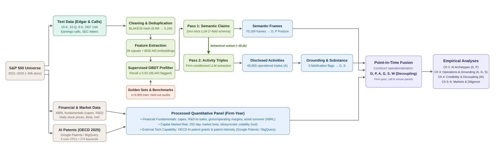

```{python}
#| include: false
# Global chart styling: register Calibri -- the template's own body/heading
# font (template/reference.docx docDefaults; the "Ttulo1..4" heading styles
# don't override it, so it's also the font under the 008B7B accent color
# used for the MIB palette below) -- so every matplotlib figure uses the
# same typeface as the surrounding Word prose. Calibri itself is a licensed
# Microsoft font (pulled from this machine's Office install, see the
# .gitignore note next to assets/fonts/) so it isn't committed to the repo;
# Carlito, its metric-compatible open-source twin, ships in assets/fonts/
# and is registered too, purely as a portable fallback if Calibri isn't
# present on whatever machine renders this next.
from pathlib import Path
import matplotlib
import matplotlib.pyplot as plt
import matplotlib.font_manager as fm
from matplotlib.colors import LinearSegmentedColormap

_font_dir = Path("../thesis_document/assets/fonts")
if not _font_dir.exists():
    _font_dir = Path("assets/fonts")
for _f in _font_dir.glob("*.ttf"):
    fm.fontManager.addfont(str(_f))
_HAS_CALIBRI = any(_font_dir.glob("Calibri*.ttf"))

# Two palettes, because they answer different questions. A DIVERGING scale
# reads deviation from a centre and needs one cool pole, one warm pole and a
# near-white middle. A QUALITATIVE set separates categories and needs hues far
# enough apart to be told apart at a glance -- the earlier rule of keeping
# every colour within ~35 degrees of one hue plus a single complement gave the
# charts unity and cost them legibility, since three archetypes or ten sectors
# then differ only in lightness. The sets share anchors so the document still
# reads as one system, and MIB teal stays a heading accent rather than the
# default data colour.
MIB = {
    "ink": "#446582", "ink_light": "#7D97AC",
    "terracotta": "#C9826B", "terracotta_light": "#E2B4A4",
    "eucalyptus": "#67958A", "eucalyptus_light": "#9DBDB5",
    "violet_grey": "#9385A6", "violet_grey_light": "#BCB2C9",
    "ochre": "#B69A59", "ochre_light": "#D5C398",
    "ivory": "#FAF8F4",
    "deep": "#263B4A", "deep_light": "#6A89A0",
    "petrol_dark": "#18323A", "petrol": "#355F6B", "petrol_light": "#7AA2AE",
    "teal": "#008B7B", "teal_light": "#69B5AC",
    "sage": "#8EA7A3", "sage_light": "#D9E3E1",
    "rust": "#B85F42", "rust_light": "#D5B1A5", "rust_wash": "#EFE4E1",
    "ink_950": "#1C1F22", "ink_800": "#454E54", "ink_600": "#73828C",
    "ink_400": "#A5AFB6", "ink_200": "#D5D9DD", "ink_100": "#F1F2F4",
}
# Qualitative: five hues that separate, each with a lighter companion for the
# 6-10 category charts.
MIB_QUAL5 = [MIB["ink"], MIB["terracotta"], MIB["eucalyptus"], MIB["violet_grey"], MIB["ochre"]]
MIB_QUAL10 = [MIB["ink"], MIB["ink_light"], MIB["terracotta"], MIB["terracotta_light"],
              MIB["eucalyptus"], MIB["eucalyptus_light"], MIB["violet_grey"],
              MIB["violet_grey_light"], MIB["ochre"], MIB["ochre_light"]]
# Diverging: terracotta -> ivory -> ink, warm pole to cool pole through a
# near-white centre, so zero reads as zero.
MIB_DIV = LinearSegmentedColormap.from_list("ink_terracotta",
                                            [MIB["terracotta"], MIB["ivory"], MIB["ink"]], N=256)

plt.rcParams.update({
    "font.family": ["Calibri", "Carlito", "DejaVu Sans"] if _HAS_CALIBRI else ["Carlito", "DejaVu Sans"],
    "font.size": 9.0,
    "text.color": MIB["ink_950"],
    "axes.edgecolor": MIB["ink_400"],
    "axes.labelcolor": MIB["ink_950"],
    "xtick.color": MIB["ink_800"],
    "ytick.color": MIB["ink_800"],
    "axes.prop_cycle": matplotlib.cycler(color=[
        MIB["petrol"], MIB["rust"], MIB["deep"], MIB["teal"], MIB["sage"], MIB["ink_600"],
    ]),
})

# Data access. Every number in this document is read from the gold data
# (data/gold, models/) or the analytics results (data/results/<topic>/) built by
# `make layers analytics`; nothing is queried or fitted inline.
import json
import sys
import pandas as pd

_repo_root = next(r for r in (Path("..").resolve(), Path(".").resolve()) if (r / "scripts" / "common" / "layers.py").exists())
sys.path.insert(0, str(_repo_root / "scripts" / "common"))
import layers as L  # noqa: E402

_MAKE_HINT = "run `make layers analytics` from the repository root"


def results(topic, name):
    """data/results/<topic>/<name>, written by scripts/analytics/<topic>/."""
    p = L.RESULTS / topic / name
    if not p.exists():
        raise FileNotFoundError(f"{p} is missing: {_MAKE_HINT}")
    return p


def gold(kind, grain, name):
    """data/gold/<kind>/<grain>/<name>.parquet (docs/gold_pipeline.md)."""
    p = L.GOLD / kind / grain / f"{name}.parquet"
    if not p.exists():
        raise FileNotFoundError(f"{p} is missing: {_MAKE_HINT}")
    return p


def results_json(topic, name):
    return json.loads(results(topic, name).read_text())


# In-memory parquet cache: several chunks read the same gold/results files.
_orig_read_parquet = pd.read_parquet
_parquet_cache = {}

def _cached_read_parquet(path, *args, **kwargs):
    try:
        resolved_path = str(Path(path).resolve())
    except Exception:
        return _orig_read_parquet(path, *args, **kwargs)
    cols = kwargs.get("columns", None)
    if not args and (set(kwargs.keys()) <= {"columns"}):
        if resolved_path not in _parquet_cache:
            _parquet_cache[resolved_path] = _orig_read_parquet(resolved_path)
        cached_df = _parquet_cache[resolved_path]
        if cols is not None:
            return cached_df[list(cols)].copy()
        return cached_df.copy()
    return _orig_read_parquet(path, *args, **kwargs)

pd.read_parquet = _cached_read_parquet

# Headline corpus quantities used in the front matter (analysis universe: S&P 500
# at 2021-01-01).
_hc = results_json("corpus", "headline_counts.json")
hd_n_docs, hd_n_paragraphs, hd_n_universe = _hc["hd_n_docs"], _hc["hd_n_paragraphs"], _hc["hd_n_universe"]
hd_paragraphs_m = f"{hd_n_paragraphs / 1e6:.1f}"
_a = pd.read_parquet(gold("spines", "activity", "activity"), columns=["ticker", "text_hash", "activity_id"])
hd_n_activities = len(_a)
hd_n_activity_firms = int(_a["ticker"].nunique())

# Headline results quoted in the front matter and conclusions, read from the
# same artifacts the empirical chapters use.
_m = pd.read_parquet(gold("covariates", "firm_year", "disclosure_volume"), columns=["ticker", "year", "any_ai", "frames_per_1k"])
_yr = _m.groupby("year").agg(any_ai=("any_ai", "mean"), frames=("frames_per_1k", "mean"))
hd_share = {int(y): float(v * 100) for y, v in _yr["any_ai"].items()}
hd_frames = {int(y): float(v) for y, v in _yr["frames"].items()}
hd_frames_ratio = hd_frames[2025] / hd_frames[2021]
hd_frames_ratio_26 = hd_frames[2026] / hd_frames[2021]

# Same-window seasonal adjustment for the partial 2026 year: the change in a
# measure between the 2025 window that ends on the same calendar day as the
# 2026 cut-off and the full 2025 year is applied to the 2026 year-to-date value.
_dp_all = L.read_gold("document", ("covariates", "disclosure_volume"))
_dp = _dp_all[_dp_all["form"].isin(["10-K", "10-Q", "DEF 14A", "8-K"])].copy()
_dp["year"] = _dp["fecha"].dt.year
_dp["md"] = _dp["fecha"].dt.month * 100 + _dp["fecha"].dt.day
hd_cutoff = _dp.loc[_dp["year"] == 2026, "fecha"].max()
hd_cutoff_md = int(hd_cutoff.month * 100 + hd_cutoff.day)
hd_cutoff_str = hd_cutoff.strftime("%-d %B")

def _fy_measures(sub):
    g = sub.groupby("ticker").agg(w=("n_words", "sum"), fr=("n_frames", "sum"))
    return float((1000 * g["fr"] / g["w"]).mean()), float((g["fr"] > 0).mean() * 100)

_full25 = _fy_measures(_dp[_dp["year"] == 2025])
_win25 = _fy_measures(_dp[(_dp["year"] == 2025) & (_dp["md"] <= hd_cutoff_md)])
_ytd26 = _fy_measures(_dp[(_dp["year"] == 2026) & (_dp["md"] <= hd_cutoff_md)])
hd_int_factor = _full25[0] / _win25[0]
hd_share_factor = _full25[1] / _win25[1]
hd_int_est_2026 = _ytd26[0] * hd_int_factor
hd_share_est_2026 = min(_ytd26[1] * hd_share_factor, 100.0)
hd_int_ratio_est = hd_int_est_2026 / hd_frames[2021]
# Activity volumes: same-window factor on the activity count itself.
_ad = pd.read_parquet(gold("spines", "activity", "activity"), columns=["accession_number", "text_hash", "activity_id"]).drop_duplicates()
_ad = _ad.merge(_dp_all[["accession_number", "fecha"]], on="accession_number", how="inner")
_ad["year"] = _ad["fecha"].dt.year
_ad["md"] = _ad["fecha"].dt.month * 100 + _ad["fecha"].dt.day
hd_act_factor = float(((_ad["year"] == 2025).sum()) / ((_ad["year"] == 2025) & (_ad["md"] <= hd_cutoff_md)).sum())
# Share of 10-K filings with at least one AI frame, by filing year.
_tenk = _dp_all[_dp_all["form"] == "10-K"].assign(y=lambda d: d["fecha"].dt.year)
hd_tenk_share = {int(y): float((g["n_frames"] > 0).mean() * 100) for y, g in _tenk.groupby("y")}
_gapw = results_json("channel_gap", "channel_gap_words_robustness.json")
hd_promo_ratio = _gapw["promo_per_1k_words"]["ratio"]
hd_quant_ratio = _gapw["quant_per_1k_words"]["ratio"]
_sm = results_json("posture", "strategy_dimensions_diagnostics.json")
hd_corr = _sm["correlation_matrix"]
hd_stab = {int(k): v for k, v in _sm["stability_by_k"].items()}
hd_stab3 = dict(zip(_sm["cluster_sizes"].keys(), hd_stab[3])) if len(_sm["cluster_sizes"]) == 3 else {}
hd_pca_ev = [x * 100 for x in _sm["pca_diagnostic"]["explained_variance_ratio"]]
_var = _sm["activity_volume_regression"]
hd_vs_ratio = _var["volume_adjusted"]["Vocal Substantives"]["ratio"]
hd_gl_ratio = _var["volume_adjusted"]["Governance-Led Disclosers"]["ratio"]
hd_vol_r2 = _var["r2_adjusted"]
_wv = results_json("washing", "washing_score_validation.json")
hd_w_rho = _wv["persistence"]["spearman"]
_apj = results_json("posture", "activity_profiles.json")
hd_quant_pooled = _apj["top_behaviours"]["quantified_outcome"]
hd_quant_filings = _apj["top_behaviours_filings_only"]["quantified_outcome"]
hd_obj_unspec_firms = _apj["object_families"]["AI, unspecified object"]["pct_firms"]
hd_src_unspec = _apj["distributions"]["source"]["unspecified"]
_inc = results_json("shock", "incremental_signal.json")["outcomes"]["beta"]
hd_inc_n = int(_inc["n_washing"])
hd_inc_r2_base = _inc["r2_M3_washing_sample"]
hd_inc_r2_w = _inc["r2_M4"]
hd_inc_dr2 = _inc["delta_r2_washing"]
hd_inc_F = _inc["wald_washing"]["F"]
hd_inc_p = _inc["wald_washing"]["p"]
_cg = results_json("washing", "activity_grounding.json")["channel_gap"]["pooled"]
hd_gap_quant_pp = _cg["quantified_outcome"]["gap_pp"]
hd_gap_named_pp = _cg["named_product_or_process"]["gap_pp"]

# --- Generic lookups so inline numbers read one value from one place --------
_res_table_cache = {}


def _res_table(topic, name):
    """Cached DataFrame for a results/<topic>/<name> csv or parquet."""
    p = results(topic, name)
    key = str(p)
    if key not in _res_table_cache:
        _res_table_cache[key] = pd.read_csv(p) if p.suffix == ".csv" else pd.read_parquet(p)
    return _res_table_cache[key]


def pick(topic, name, **where):
    """The single row of a results table matching every column=value filter."""
    df = _res_table(topic, name)
    for col, val in where.items():
        df = df[df[col] == val]
    if len(df) != 1:
        raise ValueError(f"{topic}/{name} {where} matched {len(df)} rows")
    return df.iloc[0]


def coef(topic, name, **where):
    """(standardized coefficient, p-value) of one regression row."""
    row = pick(topic, name, **where)
    return float(row["beta_std"]), float(row["p"])


def fmt_beta(b, dec=3):
    return f"{b:+.{dec}f}"


def pstr(p, dec=3):
    """p-value rendered as the prose does: '= 0.046', or '< 0.001' at the floor."""
    floor = 10.0 ** (-dec)
    return f"< {floor:.{dec}f}" if p < floor else f"= {p:.{dec}f}"


def bh_family():
    """The archetype test family and its Benjamini-Hochberg outcome: size,
    rank-1 critical value, and the tests that survive the step-up."""
    df = _res_table("crash_archetypes", "call_archetype_full_battery_bh.csv")
    survivors = df[df["survives"]]
    return {"m": len(df), "crit1": float(df["bh_crit"].min()),
            "n_survivors": len(survivors), "survivors": survivors,
            "n_weights": int(df["variable"].nunique()),
            "n_outcomes": int(df["target"].nunique())}


# Universe composition (analysis universe, S&P 500 at 2021-01-01).
_us = pd.read_parquet(results("corpus", "universe_sectors.parquet"))
uni_n_sic2 = int(_us["sic2"].nunique())
uni_n_sectors = int(_us["agg_sector"].nunique())
_sic2_counts = _us["sic2"].value_counts()
uni_top_sic2 = str(_sic2_counts.index[0])
uni_top_sic2_n = int(_sic2_counts.iloc[0])

# XBRL coverage of the firm-year financial panel (Appendix D).
_fin_fy = pd.read_parquet(gold("covariates", "firm_year", "financials"))
fin_n_firmyears = int(len(_fin_fy))


def fin_cov(col):
    """Share of firm-years with a non-missing value for an XBRL-derived column."""
    return float(_fin_fy[col].notna().mean() * 100)


def fin_n(col):
    return int(_fin_fy[col].notna().sum())


# Archetype-count bootstrap, judge funnel, and horse-race quantities quoted
# outside the chunks that build their figures.
hd_boot_reps = int(results_json("posture", "bootstrap_jaccard_results.json")["replicates"])
hd_pass1_paragraphs = int(results_json("prefilter", "run_diff.json")["current_positive"])
_inc_all = results_json("shock", "incremental_signal.json")["outcomes"]
hd_inc_dr2_max = max(v["delta_r2_washing"] for v in _inc_all.values())
hd_inc_ps_pp = (_inc_all["price_to_sales"]["delta_r2_postura"]
                + _inc_all["price_to_sales"]["delta_r2_actividad"]) * 100
hd_loyo_pmax = float(_res_table("call_beta", "call_beta_robustness_leave_one_year_out.csv")
                     .query("variable == 'intensity_expanding'")["p"].max())
cb_base = pick("call_beta", "call_beta_regression_samples.csv", model="baseline")

# Prefilter gate validation (Appendix B evaluation table).
_pf_cv = results_json("prefilter", "logit_cv_metrics.json")
pf_golden_n = int(_pf_cv["golden_set_labels"])
pf_cv = _pf_cv["cv_metrics"]
_pf_forms = {r["form"]: r for r in results_json("prefilter", "form_validation_metrics.json")["rows"]}
```



# Executive Summary {.unnumbered}

After ChatGPT's launch in late 2022, artificial intelligence became nearly universal in S&P 500 corporate communication: the share of firms mentioning it rose from about a third in 2021 to more than nine in ten by 2025. In that setting, keyword counts no longer distinguish generic AI rhetoric from operationally grounded disclosure. This thesis develops an AI Disclosure Credibility Framework that separates how much firms discuss AI, how they frame it, what activities they disclose, how concretely those activities are evidenced, and whether the same evidence survives across communication venues, and organizes that separation into three sequential due-diligence questions: does a firm's posture match grounded execution, and does that execution hold across venues?

Reading `{python} hd_paragraphs_m` million paragraphs from `{python} f"{hd_n_docs:,}"` SEC filings and earnings-call transcripts, the study catalogs `{python} f"{hd_n_activities:,}"` distinct AI activities disclosed by `{python} hd_n_activity_firms` firms and finds that communication posture matters: it predicts how much grounded activity a firm actually discloses, beyond how often the firm talks about AI. Three recurring archetypes emerge. Vocal Substantives talk about AI often and back it up with broad, mature activity portfolios. Governance-Led and Defensive Disclosers talk about AI just as much but lean on oversight or risk language instead, and disclose less concrete activity for the same amount of narrative. Most of what firms disclose is applied AI -- embedding external tools into products, customer service, and internal workflows -- rather than in-house foundational development. The 2023-2025 surge in AI talk multiplied the number of activities firms chose to describe, but not how well-evidenced each one was: firms wrote more about AI without writing better about it.

Credibility also depends on where a claim is made. Within the same firm and year, earnings calls and SEC filings describe a similar mix of activities, but calls carry markedly more promotional language and quantified claims per word than the matching filings do -- part of that gap reflects filings simply running longer and more boilerplate-heavy, not only what firms chose to say -- and specific figures backing an AI claim are substantially less likely to appear in the filing than in the call that preceded it. The story a firm tells on the earnings call does not travel intact into the document that carries legal exposure. This is not a discrete "washing" style practiced by a few bad actors; it behaves as a general, persistent feature of firm communication that shows up more in some firm-years than others, and functions as a due-diligence flag rather than proof of wrongdoing. The one case in the sample where the SEC directly questioned a company's AI disclosure, Welltower, is consistent with that kind of scrutiny narrowing the gap, though a single case cannot establish a general regulatory effect.

Capital markets do not reward the more verifiable evidence behind a firm's AI claims. It is how much a firm has historically talked about AI -- not the substance behind a given quarter's claims -- that lines up with its subsequent risk profile and fundamentals, and since firms that already talk more about AI already carry more risk before any given call, the call itself does not appear to move the market. That the market prices the talk rather than the substance is itself a finding worth taking seriously, not a gap to explain away. Persistent disclosure volume is also associated with lower downside crash risk, while a governance-oriented disclosure posture shows the same direction nominally but not once the test family is corrected for multiple comparisons. Rather than labeling any firm as fraudulent or technologically capable, the framework gives managers, boards, regulators, and investors a disciplined, three-step way to move beyond AI mention counts: identify a firm's disclosure posture, test whether that posture is backed by grounded execution, and check whether the same claims hold from the earnings call to the statutory filing.



# Introduction

## Problem and practical relevance

Corporate AI disclosure has become increasingly difficult to interpret. Investors and analysts need to distinguish firms with substantive AI adoption from those making primarily promotional claims, because genuine adoption may affect productivity and firm value [@basnet2025; @song2026]. Managers and boards, meanwhile, must communicate technical initiatives without overstating their maturity or creating unnecessary legal and reputational exposure. Regulators face a related challenge: determining whether public AI claims reflect meaningful organizational activity or amount to "AI washing" [@gensler2023; @sec2024pressrelease]. Recent SEC comment letters illustrate that inconsistencies between promotional earnings-call statements and formal filings can trigger direct regulatory scrutiny [@welltower2025letter].

The problem has become more relevant since the release of ChatGPT, after which artificial intelligence rapidly became a standard feature of corporate communication [@anantharaman2026]. In the S&P 500, the share of firms mentioning AI in SEC filings increased from {python} f"{hd_share[2021]:.0f}"% in 2021 to {python} f"{hd_share[2025]:.0f}"% in 2025. Over the same period, narrative intensity across the panel increased {python} f"{hd_frames_ratio:.1f}"-fold and, when annualizing 2026 observations, reaches approximately {python} f"{hd_int_ratio_est:.0f}" times its 2021 level. Once AI appears in the disclosures of nearly every large public company, simple mention counts provide little information about whether firms are describing material operational activity or merely participating in a broader communication trend.

This creates a measurement problem. Conventional textual approaches in finance typically rely on keyword frequencies or dictionary-based sentiment [@loughran2011], approaches that can treat a routine risk disclaimer and a detailed account of an AI deployment, investment, or commercial partnership as equivalent textual evidence. Evaluating the substance and credibility of corporate AI disclosure therefore requires moving beyond how often firms mention AI toward how they frame those claims, what operational activities they report, and how concretely those activities are supported by disclosed evidence.

## Main research question

Motivated by these practical tensions, this study addresses one central question:

> **To what extent does distinguishing disclosure volume, communication posture, and disclosed operational substance reveal real economic differences across firms, and support a credible assessment of corporate AI claims?**

## Objectives and contributions

This thesis examines whether corporate AI disclosures contain sufficiently grounded evidence of operational activity to support a credible assessment of corporate AI claims. To test this, it develops an open measurement framework that audits corporate AI communication across `{python} f"{hd_n_docs:,}"` SEC filings and earnings-call transcripts, evaluating credibility across texts, disclosure channels, SEC comment letters, and market prices.

The thesis makes three main contributions. First, **a practical credibility framework for issuers and investors**: translating measurement into practical tools, the study introduces a disclosure-intensity/substance screening matrix and a due-diligence checklist to help investors and managers distinguish real technical integration from promotional cheap talk. Second, **empirical tests linking theory to corporate evidence**, tested across four empirical settings: market-wide diffusion and disclosure archetypes, operational activity mapping and firm fundamentals, cross-venue credibility gaps under SEC comment letters, and market pricing of systematic risk. Third, **a multi-dimensional measurement architecture** that moves beyond keyword counts and simple sentiment dictionaries, combining a tree-based classifier with zero-shot large language models into a six-construct architecture reconciled across communication venues (earnings calls versus statutory filings); because the architecture is modular and general, it serves as a reusable template to study corporate credibility in other narrative settings, such as ESG, cybersecurity, or future technology waves.

## Theoretical foundations and state of the art

### What the literature knows and prior empirical evidence

This thesis connects with computational linguistics in corporate finance [@li2008; @loughran2011; @gentzkow2019; @hoberg2016; @hassan2019] and with recent work documenting a surge in corporate AI discussions since the generative-AI shock [@anantharaman2026]. Scholars have characterized that surge by classifying disclosure into actionable versus speculative text [@basnet2025], measuring planned versus implemented AI via patents and job postings [@song2026; @babina2024; @eisfeldt2023], and, closest to the present design, by combining disclosure with employment data to validate its credibility against an external benchmark [@barrios2025]. This thesis instead examines communication posture, disclosed activities, and their grounding within corporate text, treating internal disclosure consistency and independently observed implementation as distinct questions.

Market enthusiasm has concurrently heightened scrutiny over what @elhajjar2025 conceptualize as "AI washing": the misrepresentation or exaggeration of AI capabilities for marketing advantage [@gensler2023; @sec2024pressrelease], connecting to foundational research on greenwashing and symbolic impression management [@delmas2011; @lyon2015; @marquis2016] and to evidence that managers adjust disclosure tone independently of fundamentals and expand speculative talk during technology booms [@huang2014; @cheng2019].

### Theoretical concepts and mechanisms

Four theoretical perspectives motivate the empirical design:

* **Signalling and cheap talk.** Claims gain credibility when they contain details that are costly to fake or easy to verify [@spence1973; @crawford1982; @dye1985]; without that cost, promotional talk defaults to ungrounded claims [@rogers2011]. This thesis operationalizes verifiable evidence as named systems, deployment stages, quantified metrics, and identified technology partners. For a board or investor, AI language lacking a named system, stage, metric, or partner should be discounted regardless of how often it recurs.
* **Institutional legitimacy and diffusion.** Under technological uncertainty, organizations adopt popular terminology to appear modern independent of internal change [@meyer1977; @dimaggio1983; @suchman1995], which is why AI language spreads across industries and clusters into recurring postures. A rising count of AI mentions across a peer group signals industry-wide pressure rather than firm-specific capability, and should not alone move a valuation or lending decision.
* **Decoupling and symbolic management.** Formal statements can diverge from day-to-day operations [@meyer1977; @westphal1994; @crilly2012; @bromley2012], a gap @seele2022 term machinewashing in algorithmic communication. This thesis measures a narrower, observable version: the distance between narrative volume and grounded activity disclosed by the same firm. Directors should treat high narrative volume paired with low grounded activity as a governance flag warranting internal audit, not proof of misconduct.
* **Regulatory enforcement and credibility boundaries.** Regulators can raise the cost of unfounded claims [@gensler2023; @sec2024pressrelease]; attorney-reviewed statutory filings carry more legal exposure than the less formal discussion on earnings calls [@matsumoto2011; @frankel1999]. Investors should watch whether a claim made on a call is later carried into the statutory filing with the same evidentiary detail, since only the filing carries comparable liability discipline -- the credibility risk is not that calls lack evidence, but that supporting detail need not travel with the claim.

### What decision-makers cannot answer today

Corporate AI disclosures have grown rapidly, and managers adjust qualitative tone strategically. That leaves investors, board members, and regulators facing three practical questions that existing tools and evidence do not answer:

1. **Flagging decoupling without an internal audit.** With no access to a company's internal AI program and no time to read every filing by hand, can an outside analyst separate mentions that name a system, a deployment stage, or a quantified result from undifferentiated promotional text, and use the resulting gap as a governance flag?
2. **Weighting a claim by where it was made.** Should an analyst treat the same AI initiative as equally credible on an earnings call and in the 10-K filed weeks later, or does promotional language outrun verifiable evidence more on the call than in the filing that carries statutory liability?
3. **Deciding whether grounding is priced.** If two firms disclose AI initiatives with similar frequency but only one grounds its claims in named systems, metrics, and partners, does that difference show up in operating characteristics or market risk, or does the market treat both alike?

## Hypotheses and research questions

To address these gaps, this thesis states a central hypothesis and four guiding research questions:

**Main hypothesis.** This splits into two claims that need not receive the same verdict, since operating characteristics and market risk are distinct outcomes with no reason to move together:

Disclosure posture and grounded operational substance carry incremental information about firm operating characteristics beyond narrative disclosure volume alone (**H-operational**), and separately about market risk beyond narrative disclosure volume alone (**H-market**).

Four research questions guide the empirical analysis:

- **RQ1: Evolution and composition.** *How has corporate AI disclosure evolved across the market, and what concrete operational activities do firms report?*
- **RQ2: Strategic heterogeneity and economic coherence.** *Which recurring communication archetypes set firms apart, and does that posture cohere with disclosed operational activity and economically relevant firm outcomes?*
- **RQ3: Credibility, decoupling, and venue divergence.** *Where do gaps open between narrative volume and grounded substance, and how do promotional claims shift between informal calls and statutory filings?*
- **RQ4: Market pricing and information content.** *Does capital-market pricing reflect grounded operational substance, or do investors respond indiscriminately to narrative volume?*

Each research question derives from a distinct theoretical mechanism, carries a corresponding expected outcome, and is answered in a specific later chapter:

| RQ | Theory | Expected outcome | Chapter |
|---|---|---|---|
| **RQ1** | Institutional diffusion | AI language spreads broadly across the market while disclosed, verifiable activity grows more slowly than narrative volume. | 3–4 |
| **RQ2** | Configuration theory and signalling | A small number of stable, economically coherent archetypes emerge, with posture predicting disclosed activity and firm outcomes beyond narrative volume alone. | 3, 6 |
| **RQ3** | Cheap talk, decoupling, and regulatory enforcement | Promotional language runs further ahead of grounded evidence on earnings calls than in statutory filings, with SEC scrutiny narrowing that gap. | 5 |
| **RQ4** | Signalling theory | Capital markets price grounded substance rather than narrative volume alone, if signalling dominates corporate AI communication. | 6 |

: Theoretical grounding, expected outcome, and answering chapter for each research question. {#tbl-rq-theory}

## Methodology overview

The empirical analysis fixes the firm sample to S&P 500 constituents as of January 1, 2021, and covers `{python} f"{hd_n_docs:,}"` SEC filings and earnings-call transcripts drawn from that panel. A supervised gradient-boosted classifier first screens paragraphs for AI relevance at high recall, and a zero-shot large language model then extracts structured claims from the retained text, producing six constructs: narrative intensity ($D$), communication posture ($P$), disclosed activity ($A$), verification grounding ($G$), disclosed substance ($S$), and decoupling ($W$). Three empirical designs organize the tests that follow: an archetype design that groups firms by communication posture and links those groups to disclosed activity and firm outcomes; a cross-venue design that compares the same firm-year's earnings call against its statutory filing under SEC comment-letter scrutiny; and a market design that regresses systematic risk and firm fundamentals on the six constructs.

Chapters 2 through 6 build and apply this measurement framework, Chapter 7 operationalizes it into a practical credibility framework for issuers and investors, and Chapter 8 concludes.

# Methodology

To address the research questions above, this thesis constructs an empirical pipeline to extract, verify, and evaluate corporate AI disclosures without relying on coarse keyword counts. This chapter details the study universe, the multi-source data acquisition protocol, the multi-stage extraction funnel, the construction of six analytical constructs, and validation benchmarks.

## Firm sample and universe definition

```{python}
#| echo: false
#| output: false
_hc2 = results_json("corpus", "headline_counts.json")
uni_frame_total = _hc2["uni_frame_total"]
uni_frame_delisted = _hc2["uni_frame_delisted"]
cov_last_date = _hc2["cov_last_date"]
cov_10k_2026 = _hc2["cov_10k_2026"]
cov_10k_2025 = _hc2["cov_10k_2025"]
cov_10q_2026 = _hc2["cov_10q_2026"]
cov_calls_2026 = _hc2["cov_calls_2026"]
cov_months_2026 = _hc2["cov_months_2026"]

uni_n_firms = int(_m["ticker"].nunique())
_yrs = _m.groupby("ticker")["year"].nunique()
bal_n = int((_yrs == 6).sum())
bal_share = (_m[_m["ticker"].isin(_yrs[_yrs == 6].index)]
             .groupby("year")["any_ai"].mean() * 100).to_dict()
uni_n_activity_firms = hd_n_activity_firms
```

The empirical investigation focuses on constituents of the S&P 500 index fixed as of January 1, 2021 (`{python} uni_frame_total` firms). Fixing the cohort at the start of the observation period provides an ex-ante baseline of large-cap U.S. enterprises prior to the commercial diffusion of generative AI. The archived constituent roster as of December 31, 2020 [@wikipedia2020sp500], cross-validated against S&P Dow Jones' replacement announcements, contains `{python} uni_frame_total` unique issuers.[^sp500-lines]

[^sp500-lines]: The same source lists 504 trading lines rather than `{python} uni_frame_total` issuers; the gap reflects minor M&A-related divisor adjustments to the index (e.g., dual-class share reclassifications) that add a line to the roster without changing firm-level membership. All counts in this thesis use the `{python} uni_frame_total`-issuer figure.

This ex-ante construction prevents look-ahead selection bias: defining the universe using later rosters would systematically oversample technology winners that entered the index due to AI-driven market capitalization gains. Furthermore, to guard against survivorship bias, the `{python} uni_frame_delisted` firms subsequently acquired or delisted remain in the panel until their exit date. In total, `{python} uni_n_firms` firms have processed narrative records, `{python} uni_n_activity_firms` report concrete operational AI activities, and `{python} bal_n` firms form a balanced panel observed continuously across all six years (2021–2026).

```{python}
#| label: fig-sic-distribution
#| fig-cap: "[Industrial distribution of the S&P 500 study universe (fixed at 2021-01-01, $N=499$) across three classification tiers.]{custom-style=\"CaptionText\"}"
#| echo: false
#| fig-width: 10.0
#| fig-height: 7.6
import matplotlib.pyplot as plt
import matplotlib.gridspec as gridspec

fu = pd.read_parquet(results("corpus", "universe_sectors.parquet"))
div_counts = fu["division"].value_counts().sort_values(ascending=True)

SIC2_LABELS = {
    "73": "Business Services (73)",
    "38": "Measuring & Optical (38)",
    "28": "Chemicals & Allied (28)",
    "49": "Electric, Gas & Sanitary (49)",
    "35": "Industrial Machinery (35)",
    "67": "Holding & Invest. (67)",
    "63": "Insurance Carriers (63)",
    "36": "Electronic Equipment (36)",
    "60": "Depository Institutions (60)",
    "20": "Food & Kindred Prod. (20)",
    "37": "Transportation Equip. (37)",
    "62": "Security Brokers (62)",
}

s2_counts = fu["sic2"].value_counts()
top_n = 12
top_s2 = s2_counts.head(top_n).sort_values(ascending=True)
other_count = s2_counts.iloc[top_n:].sum()
n_other_groups = len(s2_counts) - top_n

labels_s2 = [f"Other ({n_other_groups} groups)"] + [SIC2_LABELS.get(s, f"SIC {s}") for s in top_s2.index]
vals_s2 = [other_count] + list(top_s2.values)
colors_s2 = ["#A5AFB6"] + ["#355F6B"] * len(top_s2)

sec_counts = fu["agg_sector"].value_counts().sort_values(ascending=True)

fig = plt.figure(figsize=(10.0, 7.6), dpi=300)
gs = gridspec.GridSpec(2, 2, height_ratios=[1.25, 1.1], hspace=0.38, wspace=0.45)
ax1 = fig.add_subplot(gs[0, 0])
ax2 = fig.add_subplot(gs[0, 1])
ax3 = fig.add_subplot(gs[1, :])

# Panel A: Broad SIC Divisions
y1 = range(len(div_counts))
bars1 = ax1.barh(y1, div_counts.values, color="#18323A", alpha=0.85, height=0.6)
ax1.set_yticks(y1)
ax1.set_yticklabels(div_counts.index, fontsize=7.8)
ax1.set_xlabel("Number of firms (N)", fontsize=8.2, fontweight="bold")
ax1.set_title("Panel A: Broad SIC Divisions (N=499)", fontsize=9.0, fontweight="bold", pad=6)
ax1.spines[["top", "right"]].set_visible(False)
ax1.grid(axis="x", linestyle="--", alpha=0.3)
for bar in bars1:
    w = bar.get_width()
    pct = w / len(fu) * 100
    ax1.text(w + 3, bar.get_y() + bar.get_height()/2, f"{w} ({pct:.1f}%)",
             va="center", fontsize=7.2, color="#454E54")
ax1.set_xlim(0, max(div_counts.values) * 1.25)

# Panel B: Major 2-digit SIC Groups + Others
y2 = range(len(vals_s2))
bars2 = ax2.barh(y2, vals_s2, color=colors_s2, alpha=0.85, height=0.6)
ax2.set_yticks(y2)
ax2.set_yticklabels(labels_s2, fontsize=7.5)
ax2.set_xlabel("Number of firms (N)", fontsize=8.2, fontweight="bold")
ax2.set_title("Panel B: 2-Digit Major SIC Groups (Top 12 + Others)", fontsize=9.0, fontweight="bold", pad=6)
ax2.spines[["top", "right"]].set_visible(False)
ax2.grid(axis="x", linestyle="--", alpha=0.3)
for bar in bars2:
    w = bar.get_width()
    pct = w / len(fu) * 100
    ax2.text(w + 2, bar.get_y() + bar.get_height()/2, f"{w} ({pct:.1f}%)",
             va="center", fontsize=7.0, color="#454E54")
ax2.set_xlim(0, max(vals_s2) * 1.25)

# Panel C: Aggregated Economic Sectors
y3 = range(len(sec_counts))
bars3 = ax3.barh(y3, sec_counts.values, color="#B85F42", alpha=0.85, height=0.58)
ax3.set_yticks(y3)
ax3.set_yticklabels(sec_counts.index, fontsize=7.8)
ax3.set_xlabel("Number of firms (N)", fontsize=8.2, fontweight="bold")
ax3.set_title("Panel C: Aggregated Economic Sectors (Used in Archetype Strategy Analysis, N=499)", fontsize=9.0, fontweight="bold", pad=6)
ax3.spines[["top", "right"]].set_visible(False)
ax3.grid(axis="x", linestyle="--", alpha=0.3)
for bar in bars3:
    w = bar.get_width()
    pct = w / len(fu) * 100
    ax3.text(w + 1.5, bar.get_y() + bar.get_height()/2, f"{w} ({pct:.1f}%)",
             va="center", fontsize=7.2, color="#454E54")
ax3.set_xlim(0, max(sec_counts.values) * 1.15)

plt.show()
```

::: {custom-style="FigureNote"}
*Notes:* Panel A: broad SIC divisions. Panel B: two-digit SIC major groups (top 12 plus remaining). Panel C: 11 aggregated economic sectors.
:::

@fig-sic-distribution reports the sample's industrial composition across three classification tiers. Manufacturing, financial intermediaries and real estate, and services are the three largest broad SIC divisions (Panel A), together accounting for nearly three-quarters of the universe. No single two-digit SIC group dominates (Panel B): business services (SIC `{python} uni_top_sic2`, $N=$ `{python} uni_top_sic2_n`) is the largest, and 45 smaller groups together still outnumber it. Aggregating to the `{python} uni_n_sectors` economic sectors used for the sectoral controls in this thesis's regressions (Panel C), technology, financial services, and healthcare & pharma are the three largest, together spanning more than half the sample -- a cross-sector spread that supports testing whether disclosed AI activity reflects genuine operational adoption rather than a promotional narrative concentrated in one industry.

## Data sources and corpus

The empirical analysis combines five primary data sources across textual, financial, and technological domains for the S&P 500 universe from 2021 through early 2026:

1. **Statutory SEC filings:** Annual reports (Form 10-K and 20-F), quarterly reports (Form 10-Q), proxy statements (DEF 14A), and current reports (Form 8-K) retrieved directly from EDGAR.
2. **Earnings-call transcripts:** Oral conference-call transcripts covering quarterly management presentations and executive Q&A sessions.
3. **Market prices and returns:** Daily price, volume, and factor return series retrieved via Yahoo Finance (`yfinance`) to estimate pre- and post-call market betas, idiosyncratic volatility, and market capitalization.
4. **Standardized financial fundamentals:** Balance-sheet and income-statement accounting items extracted from SEC XBRL company facts (capex, R&D, operating margin, revenue growth, and leverage).
5. **AI patent records:** Firm-matched patent grants and applications from Google Patents classified under the OECD AI taxonomy, providing an independent external benchmark of technological capacity.

All document counts and summary metrics are computed directly from the underlying database.

```{python}
#| echo: false
#| output: false
# Firm-quarters the transcript vendors do not cover: spine rows whose calls
# channel has no document in the quarter (null, not zero).
_fq = L.read_gold("firm_quarter", ("covariates", "disclosure_volume"))
_gap = int(_fq["calls_quarter_n_docs"].isna().sum())
cov_fq, cov_call_gap = f"{len(_fq):,}", f"{_gap:,}"
cov_call_gap_pct = f"{100 * _gap / len(_fq):.0f}%"
```

**Call coverage and its limits.** Statutory filings are complete: every 10-K, 10-Q, DEF 14A and 8-K that EDGAR lists for a panel firm while it was listed is in the corpus. Earnings calls are not, because they come from transcript vendors rather than a statutory archive. Three sources are unioned — a public Hugging Face transcript dataset, the Equibles API and stockanalysis.com — and each transcript is checked before it enters the corpus: the host company named in the opening remarks must be the panel firm (vendors file an acquirer's calls under an acquired ticker), the event must be a results call rather than an investor day or an industry conference, the date is taken from the transcript when it states one, and transcripts of the same call from different vendors are collapsed into one. A firm keeps the calls a vendor files under a former symbol, and nothing dated after a firm leaves the index is used. What remains missing is vendor coverage: quarters no source holds, which the calls panel reports as absent rather than as silence, so a firm-quarter without a transcript is never read as a firm that said nothing about AI. `{python} cov_call_gap` of the `{python} cov_fq` listed firm-quarters (`{python} cov_call_gap_pct`) hold no call from any source.


**Time coverage and seasonal adjustment.** Filings extend through `{python} cov_last_date`. For 2026 (year-to-date), `{python} cov_10k_2026` firms have filed 10-Ks (`{python} cov_10k_2025` in full-year 2025), `{python} cov_10q_2026` filed 10-Qs, and `{python} cov_calls_2026` held earnings calls. Cross-sectional analyses use observed year-to-date data, while trend comparisons scale 2026 using the matching 2025 calendar window (`{python} hd_cutoff_str`).

```{python}
#| echo: false
#| output: false
# Corpus totals for the analysis universe (S&P 500 at 2021-01-01), from the
# prefilter funnel's own accounting (results/prefilter/funnel.json), which
# applies the same document scope used throughout this chapter.
_funnel = results_json("prefilter", "funnel.json")["funnel"]
totals = (_funnel["n_docs"], _funnel["n_raw"], _funnel["n_scorable"], _funnel["n_unique"])
```

```{python}
#| label: tbl-documents-by-form-year
#| tbl-cap: "[Current processed U.S. corpus by form.]{custom-style=\"CaptionText\"}"
#| echo: false
from tabulate import tabulate
from IPython.display import Markdown

_form_order = {"10-K": 1, "10-Q": 2, "20-F": 3, "DEF 14A": 4, "8-K": 5}
_dfy = pd.read_parquet(results("corpus", "documents_by_form_year.parquet"))
_by_form = _dfy.groupby("form", as_index=False)["documents"].sum()
_by_form["_order"] = _by_form["form"].map(_form_order).fillna(6)
_by_form = _by_form.sort_values("_order")
rows = list(_by_form[["form", "documents"]].itertuples(index=False, name=None))
rows.append(["Total", sum(n for _, n in rows)])
Markdown(tabulate([[form, f"{n:,}"] for form, n in rows], headers=["Form", "Documents"]))
```

{#fig-pipeline-architecture width="100%"}

This thesis follows a structured pipeline consistent with standard data-mining methodology (KDD/CRISP-DM framing in Appendix A). In practice, this architecture (@fig-pipeline-architecture; @tbl-funnel-summary) converts raw corporate text into structured metrics through two intermediate extraction layers:

$$\text{Raw text} \longrightarrow \text{AI claims (Frames)} \longrightarrow \text{Disclosed AI activities} \longrightarrow \text{Firm-level measures}$$

```{python}
#| label: tbl-funnel-summary
#| tbl-cap: "[Compact summary of the inference funnel.]{custom-style=\"CaptionText\"}"
#| echo: false
from tabulate import tabulate
from IPython.display import Markdown

n_docs, n_raw, n_scorable, n_unique = totals[0], totals[1], totals[2], totals[3]
n_prefiltered = _funnel["n_prefiltered"]
n_framed = _funnel["n_framed"]
n_frames_total = _funnel["n_frames_total"]
share_firm_subject = _funnel["share_firm_subject"]
n_firm_texts = _funnel["n_firm_texts"]
n_activities = hd_n_activities

rows = [
    ("1. Raw Corpus", "Paragraph instances", f"Raw segmentation across {n_docs:,} filings & calls", n_raw, 100.0),
    ("2. Scorable Filter", "Scorable instances", "Length (>3 chars) & alphanumeric content", n_scorable, n_scorable / n_raw * 100),
    ("3. Deduplication", "Unique scorable texts", "BLAKE2b content hash", n_unique, n_unique / n_raw * 100),
    ("4. Machine Learning Gate", "Candidate unique texts", "Supervised GBDT (tau=0.17, 39 signals)", n_prefiltered, n_prefiltered / n_raw * 100),
    ("5. Semantic Frames", "Texts with >=1 frame", f"Zero-shot LLM extractor (yields {n_frames_total:,} claims)", n_framed, n_framed / n_raw * 100),
    ("6. Disclosed AI Activities", "Texts with firm action", f"Firm-conditioned LLM (yields {n_activities:,} activities)", n_firm_texts, n_firm_texts / n_raw * 100),
]
table = [[stage, unit, filt, f"{count:,}", f"{share:.2f}%"] for stage, unit, filt, count, share in rows]
Markdown(tabulate(table, headers=["Stage", "Unit of Observation", "Operational Filter", "Retained Volume", "Share of Raw"]))
```

::: {custom-style="FigureNote"}
*Notes:* This table summarizes the multi-stage inference funnel used to identify corporate AI disclosures across `{python} f"{n_docs:,}"` statutory SEC filings and earnings-call transcripts. Stages 1–2 track raw and scorable paragraph instances, whereas Stages 3–6 trace unique text passages retained across deduplication, supervised GBDT prefiltering, and zero-shot LLM evaluation. From the final retained passages, the pipeline extracts `{python} f"{n_frames_total:,}"` semantic frames (AI claims) and `{python} f"{n_activities:,}"` concrete corporate AI activities. A granular form-by-form decomposition across document types is provided in @tbl-a1-funnel-full (Appendix A).
:::

## Identifying AI disclosure: cleaning, deduplication, and ML gate

Before scoring, scorable paragraphs ($>3$ characters, alphanumeric content) are normalized and hashed with BLAKE2b signatures. Deduplication scores repeated boilerplate once per unique text and maps it across filings, preventing boilerplate from distorting downstream measures.

Candidate passages are screened using a Gradient Boosted Decision Tree (GBDT) prefilter [@friedman2001] calibrated for high recall to avoid discarding relevant disclosures prior to LLM evaluation (feature count and threshold in @tbl-funnel-summary; recall target in Appendix B). Documents lacking AI discussion enter as true zeros rather than missing values (Appendix B, @tbl-evaluation-datasets).

## From paragraphs to individual AI claims: frame extraction

Candidate texts pass to a zero-shot LLM extractor (`openai/gpt-5.6-luna`, selection criteria in Appendix A) that attempts to extract a semantic frame from each passage; roughly `{python} f"{(1 - n_framed / n_prefiltered) * 100:.0f}"`% yield none -- borderline passages that the upstream classifier's high-recall calibration lets through without being able to rule out (error taxonomy in Appendix B). Retained disclosures are scored on a seven-field schema (@tbl-frame-schema); statements describing the firm's own actions or exposures feed directly into Disclosure Intensity ($D$) and Communication Posture ($P$).

```{python}
#| label: tbl-frame-schema
#| tbl-cap: "[Semantic frame schema: operational definitions, categorical levels, and observed corpus distributions.]{custom-style=\"CaptionText\"}"
#| echo: false
from tabulate import tabulate
from IPython.display import Markdown

_fsd = pd.read_parquet(results("corpus", "frame_schema_distribution.parquet"))

def _field_str(field, title=True):
    sub = _fsd[_fsd["field"] == field].sort_values("n", ascending=False)
    return "; ".join(f"{(v.replace('_', ' ').title() if title else v.title())}: {p:.1f}%"
                      for v, p in zip(sub["value"], sub["pct"]))

tot_subj = int(_fsd.loc[_fsd["field"] == "subject", "n"].sum())
subj_str = _field_str("subject")
ai_str = _field_str("ai_type")
temp_str = _field_str("temporal", title=False)

_spec = _fsd[_fsd["field"] == "specificity"].set_index("value")["pct"]
_rhet = _fsd[_fsd["field"] == "rhetoric"].set_index("value")["pct"]
spec_str = (f"Product: {_spec['product']}%; Process: {_spec['process']}%; "
            f"Timeline: {_spec['timeline']}%; Metric: {_spec['metric']}%; Vendor: {_spec['vendor']}%")
rhet_str = (f"Strategic importance: {_rhet['strategic']}%; "
            f"Promotional tone: {_rhet['promotional']}%; Hedged: {_rhet['hedged']}%")

t4_rows = [
    ["Subject", "Identifies the focal entity of the corporate claim", "Firm, partners, customers, industry, regulators", subj_str],
    ["AI Category", "Distinguishes generative AI from classical/predictive ML", "Generative, predictive ML, unspecified general AI", ai_str],
    ["Temporal Stance", "Operational tense, developmental timing, and certainty", "Realized (today), forward-looking (planned or expected), hypothetical", temp_str],
    ["Functional Concepts", "Fixed multi-label vocabulary of operational and oversight stances", "Adoption, capability, commercial offering, risk, governance", "Adoption/deploy: 46.1%; Governance/control: 18.2%; Risk: 22.4%"],
    ["Specificity Signals", "Verifiable objective anchors present in narrative text", "Up to 5 tags: product/system, process, timeline, metric, vendor", spec_str],
    ["Promotional Register", "Rhetorical framing: promotional, strategic, or hedged/cautious", "Promotional, strategic importance, hedged (non-exclusive tags)", rhet_str],
    ["Sentence Anchors", "Sentence-level citation indices for auditability and verification", "List of 0-indexed sentence IDs supporting the frame", "100% anchored (mean 1.8 sentences per claim)"],
]
Markdown(tabulate(t4_rows, headers=["Dimension", "Operational Scope", "Schema Classes", f"Observed Prevalence (n={tot_subj:,})"]))
```

## From claims to concrete AI activities: action, object, and function

Claims attributing operational action to the firm (deploying, developing, partnering, investing) pass to a second extraction prompt conditioned on firm identity. This stage extracts an operational triple (action, object, function), deployment maturity, technology provenance, target user, and supporting sentence evidence (@tbl-activity-schema). In total, this second pass identifies `{python} f"{hd_n_activities:,}"` concrete operational AI activities across `{python} hd_n_activity_firms` firms, providing the empirical foundation for Disclosed AI Activity ($A$) and Activity Grounding ($G$).

```{python}
#| label: tbl-activity-schema
#| tbl-cap: "[Disclosed AI activity schema: operational definitions, taxonomic families, and observed activity volumes.]{custom-style=\"CaptionText\"}"
#| echo: false
import pandas as pd
from tabulate import tabulate
from IPython.display import Markdown

_asd = pd.read_parquet(results("corpus", "activity_schema_distribution.parquet"))
n_act = int(_asd.loc[_asd["field"] == "action", "n"].sum())

def _act_field_str(field, k=4, exclude=()):
    sub = _asd[(_asd["field"] == field) & (~_asd["value"].isin(exclude))].sort_values("n", ascending=False).head(k)
    return "; ".join(f"{v.replace('_', ' ').title()}: {p:.1f}%" for v, p in zip(sub["value"], sub["pct"]))

act_top = _act_field_str("action")
stg_top = _act_field_str("stage")
src_top = _act_field_str("source")
tgt_top = _act_field_str("target")
ev_top = "; ".join(f"{v.replace('_', ' ').title()}: {p:.1f}%"
                    for v, p in zip(_asd.loc[_asd["field"] == "evidence_type", "value"],
                                     _asd.loc[_asd["field"] == "evidence_type", "pct"]))

# Business-function taxonomy: silver.ai_activities' schema-level `domain`
# field is a coarse 3-value split (customer_facing/internal/unspecified),
# not the finer functional taxonomy firms' disclosed activities are actually
# tagged with; that lives on the gold covariate's `function_family` (18
# categories, gold-layer business rule -- see
# scripts/gold/activity/build_activity.py), read directly here rather
# than duplicated into the corpus-level schema-distribution result.
_ff = L.read_dataset("activity", ("covariates", "extraction", ["frame_id"]), ("covariates", "taxonomy", ["function_family"]))[
    ["text_hash", "frame_id", "activity_id", "function_family"]].drop_duplicates(subset=["text_hash", "frame_id", "activity_id"])
counts_func = _ff["function_family"].value_counts()
func_top = "; ".join(f"{k.replace('_', ' ').title()}: {v / len(_ff) * 100:.1f}%"
                      for k, v in counts_func.head(4).items() if k != "unspecified")

n_entities = int(_asd.loc[(_asd["field"] == "named_entities") & (_asd["value"] == "entity_citations"), "n"].iloc[0])

t5_rows = [
    ["Action Verb", "Discrete operational action taken by the disclosing firm", "Deploy, invest, scale, develop, procure, staff", act_top],
    ["Operational Object", "Target system, model family, algorithm, or enterprise asset", "Free-text extraction mapped into 21 standardized object families", "Copilots/LLMs, predictive models, cloud platforms, vision, robotics"],
    ["Business Domain", "Functional enterprise division where AI is implemented", "Operate, Sell, Build, Control, Serve, Enable (6 domains)", func_top],
    ["Maturity Stage", "Operational lifecycle stage of the disclosed initiative", "Deployed in production, scaled firmwide, piloting, exploring", stg_top],
    ["Technology Sourcing", "Intellectual property ownership and technology provenance", "Own proprietary, third-party vendor, acquired, co-developed, open source", src_top],
    ["Target Beneficiary", "Primary constituency receiving or utilizing the system", "Customers, internal workflows, employees, suppliers/partners", tgt_top],
    ["Evidence Attributes", "Verifiable grounding strength anchoring the operational claim", "Generic narrative, named product/process, metric, vendor named", ev_top],
    ["Named Entities", "External commercial partners, cloud providers, and foundation models", "8 entity roles (brands, hyperscalers, partners, acquisitions)", f"{n_entities:,} entity citations (Microsoft, AWS, NVIDIA, OpenAI, etc.)"],
]
Markdown(tabulate(t5_rows, headers=["Attribute", "Operational Scope", "Schema Classes & Taxonomies", f"Observed Distribution (n={n_act:,})"]))
```

## From extracted evidence to analytical constructs

The pipeline aggregates semantic frames and activity records into six core constructs:

$$\underbrace{\text{Semantic frames}}_{\text{frame extraction}} \Longrightarrow D, P \qquad\qquad \underbrace{\text{AI Activity records}}_{\text{activity extraction}} \Longrightarrow A, G \qquad\qquad (D, A, G) \Longrightarrow S \Longrightarrow W$$

1. **AI Disclosure Intensity ($D$):** Narrative volume, measured as AI frames per 1,000 words of scorable text to adjust for document length:

   $$D_{it} = \frac{\text{AI frames}_{it}}{\text{words}_{it} / 1{,}000}$$

2. **Communication Posture ($P$):** A seven-dimensional vector capturing *how* the firm discusses AI: promotional tone, hedging, risk orientation, governance focus, claim realization, customer orientation, and claim specificity.
3. **Disclosed AI Activity ($A$):** Count of discrete operational action triples ($n_{\text{activities}}$) across six business domains.
4. **AI Activity Grounding ($G$):** A verifiability index in $[0, 1]$ measuring the share of five concrete checks met: specific business function, deployed or scaled stage, named product/process, quantified metric, and named technology provider.
5. **Disclosed Substance ($S$):** Grounded operational volume, weighting log activity count by grounding:

   $$S_{it} = \log(1 + n_{\text{activities},it}) \times G_{it}$$

6. **Decoupling ($W$):** The percentile-rank difference between narrative volume and grounded substance across disclosing firm-years:

   $$W_{it} = \text{rank}(D_{it}) - \text{rank}(S_{it}) \in [-1, 1]$$

   A high positive score reflects high narrative volume paired with low grounded substance ("AI washing").

**Aggregation and robustness.** Document rates aggregate to firm-years via the median document rate, which dampens the influence of boilerplate exhibits and other outlier documents that a mean would let dominate a firm-year estimate. Reliability checks on this aggregation -- a comparison of log-transformed against raw concept counts, and empirical-Bayes shrinkage for firms with sparse AI-related text -- are reported in Appendix B.

## Financial and market variables

Firm-year financial and market controls combine SEC XBRL disclosures and daily stock returns aligned to fiscal period ends. Coverage of the firm-year panel reaches `{python} f"{min(fin_cov('revenue'), fin_cov('net_margin')):.0f}"`% for revenue and net margin; less consistently reported items (capex, SG&A) are recovered through standardized XBRL concept-tag fallback hierarchies, with full coverage figures and the fallback mechanism detailed in Appendix D. Annual changes use a [340, 380]-day window.

Baseline controls comprise market capitalization, R&D-to-sales, gross margin, return on assets (ROA), price-to-sales, forward revenue growth, market beta, and idiosyncratic volatility [@campbell2001; @ang2006]. ROA is preferred to margin- or turnover-based accounting controls because it is reported under a near-universal XBRL concept pair (net income, total assets), reaching `{python} f"{fin_cov('roa'):.1f}"`% coverage of the firm-year panel, whereas single-tag ratios such as operating margin concentrate their missingness in regulated financial and insurance sectors. Because XBRL R&D coverage is `{python} f"{fin_cov('rd_expense'):.0f}"`%, this thesis includes a non-reporting indicator rather than imputing zero. Financial ratios are winsorized at the 1st and 99th percentiles (Appendix D).

## Measurement validation

Blind human audits on the production judge's output validate the pipeline: manual review establishes 91.2% precision on GBDT prefiltering and 89.1%–95.8% field-level accuracy across extracted activity parameters (@tbl-evaluation-datasets, Appendix B). Cross-model agreement between two independent foundation models (Gemini and Qwen, $\kappa = 0.81\text{--}0.87$) serves only as a secondary consistency check, since neither model is the production judge.

With the measurement pipeline calibrated and validated, the empirical analyses follow. The next chapter examines how corporate AI disclosure diffused across the S&P 500 from 2021 through 2026, and maps the distinct communication archetypes that emerged as AI language expanded across the market.

# Corporate AI Disclosure Strategies

How did corporate artificial intelligence communication evolve as the technology entered the mainstream, and do firms adopt homogeneous or distinct disclosure strategies? This chapter addresses the first two research questions by analyzing market-wide diffusion patterns and identifying recurring managerial communication postures across the large-cap panel.

## The expansion and diffusion of AI disclosures

Between 2021 and 2025, corporate AI disclosure transitioned from an emerging topic to a standard corporate reporting item (@fig-ai-diffusion). The share of S&P 500 firms mentioning AI rose from `{python} f"{hd_share[2021]:.1f}"`% to `{python} f"{hd_share[2025]:.1f}"`%, while narrative intensity expanded `{python} f"{hd_frames_ratio:.1f}"`-fold (from `{python} f"{hd_frames[2021]:.3f}"` to `{python} f"{hd_frames[2025]:.3f}"` frames per 1,000 words). The sharpest inflection occurred during the 2023–2024 filing season, when 10-K participation surged from `{python} f"{hd_tenk_share[2023]:.0f}"`% to `{python} f"{hd_tenk_share[2024]:.0f}"`% following the commercial release of generative AI.

Because filings cluster heavily in the first quarter, full-year 2026 is projected via same-window adjustment to `{python} f"{hd_int_est_2026:.3f}"` frames per 1,000 words and `{python} f"{hd_share_est_2026:.1f}"`% participation. Tracking a balanced cohort of the `{python} bal_n` firms observed continuously from 2021 to 2026 yields an identical path (`{python} f"{bal_share[2021]:.0f}"`% to `{python} f"{bal_share[2025]:.0f}"`%), confirming that growth reflects market-wide corporate adoption rather than survivorship or index rebalancing.

```{python}
#| label: fig-ai-diffusion
#| fig-cap: "[The diffusion of corporate AI disclosure across the S&P 500, 2021–2025 (2026 shown as year-to-date).]{custom-style=\"CaptionText\"}"
#| echo: false
#| fig-width: 9.5
#| fig-height: 3.8
import pandas as pd
import matplotlib.pyplot as plt

y = _m.groupby("year").agg(
    any_ai=("any_ai", "mean"),
    frames=("frames_per_1k", "mean")
)
main, ytd = y.loc[y.index <= 2025], y.loc[y.index >= 2025]

fig, (ax1, ax2) = plt.subplots(1, 2, figsize=(9.5, 3.8), dpi=300)

years = [2021, 2022, 2023, 2024, 2025]
all_years = sorted(list(set(main.index.tolist() + ytd.index.tolist())))
x_pad = 0.65
x_min, x_max = min(all_years) - x_pad, max(all_years) + x_pad

# Panel A: Diffusion (% of firms)
all_ai = pd.concat([main.any_ai, ytd.any_ai]) * 100
min_ai, max_ai = all_ai.min(), all_ai.max()
y_range_a = max_ai - min_ai
offset_a = y_range_a * 0.045

ax1.plot(main.index, main.any_ai * 100, "o-", color="#355F6B", lw=2.4, ms=6, label="Historical panel (2021–2025)")
ax1.plot(ytd.index, ytd.any_ai * 100, "o:", color="#355F6B", lw=2.0, ms=5, label="2026 YTD")
for yr in years:
    val = main.loc[yr, "any_ai"] * 100
    ax1.text(yr, val + offset_a, f"{val:.1f}%", ha="center", fontsize=8.2, fontweight="bold", color="#454E54")
val_26 = ytd.loc[2026, "any_ai"] * 100
ax1.text(2026, val_26 + offset_a, f"{val_26:.1f}%", ha="center", fontsize=8.2, fontweight="bold", color="#355F6B")

ax1.axvline(2023.5, color="#B85F42", linestyle=":", lw=1.3, alpha=0.8)
ax1.axvspan(2023.0, 2024.0, color="#D5B1A5", alpha=0.35)
ax1.annotate("GenAI boom\n(2023–2024)", xy=(2023.5, 55), xytext=(2021.6, 68),
             arrowprops=dict(arrowstyle="->", color="#B85F42", lw=1.1),
             fontsize=8.0, fontweight="bold", color="#B85F42",
             bbox=dict(boxstyle="round,pad=0.2", facecolor="#D5B1A5", edgecolor="#D5B1A5", alpha=0.9))

ax1.set_title("Panel A: Broadening Participation\nShare of S&P 500 Firms Disclosing AI (%)", fontsize=9.8, fontweight="bold")
ax1.set_ylabel("% of S&P 500 Firms", fontsize=8.8, fontweight="bold")
ax1.set_xlabel("Filing Year", fontsize=8.8, fontweight="bold")
ax1.set_xticks(all_years)
ax1.set_xlim(x_min, x_max)
ax1.set_ylim(max(0, min_ai - y_range_a * 0.25), min(100, max_ai) + y_range_a * 0.25)
ax1.grid(True, linestyle="--", alpha=0.3)
ax1.legend(loc="upper left", fontsize=7.5, framealpha=0.9)
ax1.spines[["top", "right"]].set_visible(False)

# Panel B: Narrative Density (frames / 1k words)
all_frames = pd.concat([main.frames, ytd.frames])
max_f = all_frames.max()
offset_f = max_f * 0.045

ax2.plot(main.index, main.frames, "s-", color="#8EA7A3", lw=2.4, ms=6, label="Historical panel")
ax2.plot(ytd.index, ytd.frames, "s:", color="#8EA7A3", lw=2.0, ms=5, label="2026 YTD")

for yr in [2021, 2022, 2023]:
    val = main.loc[yr, "frames"]
    ax2.text(yr, val + offset_f, f"{val:.3f}", ha="center", fontsize=8.2, fontweight="bold", color="#454E54")

val_24 = main.loc[2024, "frames"]
ax2.text(2024.08, val_24 - offset_f * 1.6, f"{val_24:.3f}", ha="left", fontsize=8.2, fontweight="bold", color="#454E54")

val_25 = main.loc[2025, "frames"]
ax2.text(2024.90, val_25 + offset_f, f"{val_25:.3f}", ha="right", fontsize=8.2, fontweight="bold", color="#454E54")

val_26_f = ytd.loc[2026, "frames"]
ax2.text(2026, val_26_f + offset_f, f"{val_26_f:.3f}", ha="center", fontsize=8.2, fontweight="bold", color="#8EA7A3")

ax2.axvline(2023.5, color="#B85F42", linestyle=":", lw=1.3, alpha=0.8)
ax2.axvspan(2023.0, 2024.0, color="#D5B1A5", alpha=0.35)

ratio = main.loc[2025, "frames"] / main.loc[2021, "frames"]
ax2.annotate(f"{ratio:.1f}× panel growth\n({main.loc[2021, 'frames']:.3f} → {main.loc[2025, 'frames']:.3f})",
             xy=(2024.0, 0.065), xytext=(2021.5, 0.125),
             arrowprops=dict(arrowstyle="->", color="#8EA7A3", lw=1.1),
             fontsize=8.0, fontweight="bold", color="#8EA7A3",
             bbox=dict(boxstyle="round,pad=0.2", facecolor="#D9E3E1", edgecolor="#D9E3E1", alpha=0.9))

ax2.set_title("Panel B: Deepening Narrative Intensity\nAI Frames per 1,000 Narrative Words", fontsize=9.8, fontweight="bold")
ax2.set_ylabel("AI Frames / 1,000 Words", fontsize=8.8, fontweight="bold")
ax2.set_xlabel("Filing Year", fontsize=8.8, fontweight="bold")
ax2.set_xticks(all_years)
ax2.set_xlim(x_min, x_max)
ax2.set_ylim(0, max_f * 1.25)
ax2.grid(True, linestyle="--", alpha=0.3)
ax2.spines[["top", "right"]].set_visible(False)

plt.tight_layout()
plt.show()
```

::: {custom-style="FigureNote"}
*Notes:* Panel A: participation, % of disclosing firms. Panel B: narrative intensity, AI frames per 1,000 words. Generative AI commercialization inflection marked.
:::

Once almost every large firm talks about AI, presence alone says little. At `{python} f"{hd_share[2025]:.1f}"`% participation, *whether* a firm discloses AI no longer separates firms. What separates them is *how* they communicate: the framing, emphasis, risk perception, and specificity that make up their disclosure posture.

## The dimensions of AI disclosure strategy

Seven frame-level dimensions describe Communication Posture ($P$). Disclosure intensity ($D$) captures narrative volume, completing the eight-dimensional strategy space. @tbl-strategy-dimensions defines each dimension and its operational meaning, while @fig-strategy-dimensions-dist shows their distribution across the S&P 500.

| Dimension | Operational Definition | Range | Managerial Meaning |
|---|---|---|---|
| **Promotional posture** | Average of promotional tone and strategic-importance framing | $[0, 1]$ | Extent to which AI is communicated as a transformative strategic asset |
| **Hedging posture** | Share of statements framed with cautious or conditional language | $[0, 1]$ | Degree to which AI claims are qualified rather than asserted outright |
| **Risk orientation** | Share of statements containing risk, uncertainty, or dependency concepts | $[0, 1]$ | Degree to which AI is treated as an operational vulnerability or hazard |
| **Governance orientation** | Share of statements containing oversight, ethics, or compliance policies | $[0, 1]$ | Formal institutionalization of model oversight and responsible AI guardrails |
| **Claim realization** | Share of statements describing current, realized usage rather than planned/future intentions | $[0, 1]$ | Operational maturity: active/realized deployment vs. future roadmap or intent |
| **Customer-facing** | Share of statements oriented toward external clients and commercial offerings | $[0, 1]$ | Commercial orientation: external client products vs. internal operating workflows |
| **Claim specificity** | Mean of 5 binary grounding flags (process, product, vendor, metric, timeline) | $[0, 1]$ | Falsifiability and informational granularity of corporate statements |
| **Disclosure intensity** | Percentile rank of AI semantic frames per 1,000 narrative words | $[0, 1]$ | Overall narrative volume dedicated to artificial intelligence |

: Operational definitions of the eight AI disclosure strategy dimensions. {#tbl-strategy-dimensions}

The empirical distribution across the S&P 500 reveals substantial structural heterogeneity across dimensions (@fig-strategy-dimensions-dist). Risk orientation and disclosure intensity exhibit broad cross-sectional dispersion, spanning virtually the entire range from minimal to extensive discussion. In contrast, promotional posture, hedging, and customer-facing positioning remain compressed near the lower bound for the typical firm, with medians below 0.15. This asymmetry confirms that corporate disclosure strategies cannot be understood as mere differences in verbosity ("talking more or less"); rather, firms differentiate through distinct combinations of thematic emphasis, evidentiary concreteness, temporal commitment, and functional orientation.


```{python}
#| label: fig-strategy-dimensions-dist
#| fig-cap: "[Distribution of Seven AI Disclosure Posture Dimensions and Disclosure Intensity Across the S&P 500.]{custom-style=\"CaptionText\"}"
#| echo: false
#| fig-width: 8.8
#| fig-height: 3.8
import numpy as np
import pandas as pd
import matplotlib.pyplot as plt


df = pd.read_parquet(gold("covariates", "firm", "posture_archetype_static"))

# Seven: the vertices are fitted on posture alone, so there is no intensity
# coordinate to show. Asking for one produced a column of nan.
FEATURES = ["promotional_posture", "hedging_posture", "risk_orientation", "governance_orientation",
            "temporal_posture", "ai_positioning", "specificity", "disclosure_intensity"]
LABELS = ["Promotional posture", "Hedging posture", "Risk orientation", "Governance orientation",
          "Claim realization", "Customer-facing", "Claim specificity", "Disclosure intensity"]

fig, ax = plt.subplots(figsize=(8.8, 4.4), dpi=300)
y_positions = np.arange(len(FEATURES))

# Faint alternating row bands make it easier to trace a label back to its
# row without any text touching the whisker/bar/marker it describes.
for idx in range(len(FEATURES)):
    if idx % 2 == 0:
        ax.axhspan(idx - 0.5, idx + 0.5, color=MIB["ink_100"], zorder=0)

for idx, feat in enumerate(FEATURES):
    s = df[feat]
    med = s.median()
    q25, q75 = s.quantile(0.25), s.quantile(0.75)
    p05, p95 = s.quantile(0.05), s.quantile(0.95)

    ax.plot([p05, p95], [idx, idx], color=MIB["ink_400"], lw=2.0, zorder=1)
    ax.plot([q25, q75], [idx, idx], color=MIB["petrol"], lw=5.5, solid_capstyle="round", zorder=2)
    ax.scatter([med], [idx], color="#FFFFFF", edgecolor=MIB["ink_950"], s=50, lw=1.8, zorder=3)

    # Value label sits directly above the marker, centered on it -- the axis
    # is reversed (row 0 at the top), so "above" is a smaller data-y, not a
    # larger one.
    ax.text(med, idx - 0.30, f"{med:.2f}", ha="center", va="bottom", fontsize=8.2, fontweight="bold", color=MIB["ink_800"], zorder=4)

ax.set_yticks(y_positions)
ax.set_yticklabels(LABELS, fontsize=9.0, fontweight="bold")
ax.set_ylim(len(FEATURES) - 0.5, -0.5)
ax.set_xlim(-0.05, 1.12)
ax.set_xticks([0, 0.2, 0.4, 0.6, 0.8, 1.0])
ax.set_xlabel("Dimension Score (Scaled 0 to 1)", fontsize=8.8, fontweight="bold")
ax.grid(True, axis="x", linestyle="--", alpha=0.3, zorder=0)
ax.spines[["top", "right", "left"]].set_visible(False)
ax.tick_params(axis="y", length=0)
plt.tight_layout()
plt.show()
```

::: {custom-style="FigureNote"}
*Notes:* White circles denote medians; petrol bars interquartile ranges; grey whiskers the 5th–95th percentile. All measures are scaled from 0 to 1.
:::

The correlation structure of the seven posture dimensions and disclosure intensity shows two key properties (@tbl-a3-posture-correlation, Appendix C):

1. **Governance framing operates independently.** Governance orientation barely correlates with promotional posture ($r =$ `{python} f"{hd_corr['governance_orientation']['promotional_posture']:.2f}"`), risk framing ($r =$ `{python} f"{hd_corr['governance_orientation']['risk_orientation']:.2f}"`), or disclosure intensity ($r =$ `{python} f"{hd_corr['governance_orientation']['disclosure_intensity']:.2f}"`). It constitutes an autonomous disclosure dimension rather than a proxy for general verbosity or risk aversion.
2. **Risk orientation counterbalances operational execution.** Risk framing correlates negatively with realized temporal posture ($r =$ `{python} f"{hd_corr['risk_orientation']['temporal_posture']:.2f}"`), specificity ($r =$ `{python} f"{hd_corr['risk_orientation']['specificity']:.2f}"`), customer positioning ($r =$ `{python} f"{hd_corr['risk_orientation']['ai_positioning']:.2f}"`), and intensity ($r =$ `{python} f"{hd_corr['risk_orientation']['disclosure_intensity']:.2f}"`). Firms framing AI as an operational hazard report fewer deployments and concrete initiatives.

## Disclosure archetypes

```{python}
#| echo: false
#| output: false
arch_n_universe = uni_n_firms
arch_n_noai = int((df["archetype"] == "No AI").sum())
arch_n_fit = arch_n_universe - arch_n_noai
```

This thesis computes the posture dimensions across all `{python} arch_n_universe` firms. Firms with fewer than five AI frames across 2021–2025 SEC filings receive the rule-based label **No AI** ($n =$ `{python} arch_n_noai`). By 2025, nearly nine in ten firms disclose enough AI commentary to exhibit an active posture [@dimaggio1983].

For the active firms ($n =$ `{python} arch_n_fit`), disclosure strategies blend distinct communication registers rather than falling into rigid discrete bins. This thesis applies continuous **Archetypal Analysis** [@cutler1994] to the eight standardized posture dimensions: each firm is represented as a convex mixture of $k$ extreme disclosure profiles, with mixture weights giving its posture portfolio (formal specification in Appendix C).

### Archetypal profiles and the disclosure simplex

Fitting Archetypal Analysis at $k = 3$ projects every active disclosing firm onto the 2-simplex $\Delta^2$ spanned by three extreme boundary vertices. @fig-archetypal-ternary-simplex maps all `{python} arch_n_fit` disclosing index constituents onto this continuous disclosure simplex, displaying consolidated industry centroids alongside boundary and central exemplars:

```{python}
#| label: fig-archetypal-ternary-simplex
#| fig-cap: "[The S&P 500 AI Disclosure Simplex: Industry Centroids and Boundary Exemplars.]{custom-style=\"CaptionText\"}"
#| echo: false
#| warning: false
#| message: false
#| fig-width: 15
#| fig-height: 14
# Pre-rendered by scripts/analytics/posture/plot_archetypal_simplex.py, which
# applies the frozen posture-archetype model bundle
# (models/posture_archetype_static/model.pkl) to
# predictions/firm/posture_archetype_static.parquet -- the fit is not
# repeated here.
import matplotlib.pyplot as plt
import matplotlib.image as mpimg

img = mpimg.imread(results("posture", "fig_archetypal_ternary_simplex.png"))
fig, ax = plt.subplots(figsize=(15, 14), dpi=300)
ax.imshow(img)
ax.axis("off")
plt.tight_layout()
plt.show()
```

::: {custom-style="FigureNote"}
*Notes:* k = 3; active index constituents, 10-K and DEF 14A filings. Ten consolidated industry centroids with radial non-crossing leader lines. Boundary exemplars: simplex boundary clipping. Central exemplars (OXY, JPM): balanced tripartite postures.
:::

Archetypal Analysis identifies three distinct, highly stable disclosure strategies alongside a non-disclosing baseline (@tbl-archetypes-glance):

```{python}
#| label: tbl-archetypes-glance
#| tbl-cap: "[AI corporate disclosure archetypes at a glance.]{custom-style=\"CaptionText\"}"
import pandas as pd
from tabulate import tabulate
from IPython.display import Markdown


_g = df  # gold predictions/firm/posture_archetype_static.parquet, loaded above
_feats = {"promotional_posture": "promotional", "hedging_posture": "hedging", "risk_orientation": "risk", "governance_orientation": "governance",
          "temporal_posture": "realized", "ai_positioning": "customer-facing", "specificity": "specificity",
          "disclosure_intensity": "intensity"}
_fit = _g[_g["archetype"] != "No AI"]
_n = _g["archetype"].value_counts()
_stab = _g.groupby("archetype")["archetype_stability"].first().to_dict()
arch_share = (_n / len(_g) * 100).round(1).to_dict()

_z = (_fit[list(_feats)] - _fit[list(_feats)].mean()) / _fit[list(_feats)].std(ddof=0)
_z["archetype"] = _fit["archetype"].values
_zmean = _z.groupby("archetype")[list(_feats)].mean()

def _profile_text(archetype: str, threshold: float = 0.5) -> str:
    row = _zmean.loc[archetype].sort_values(key=lambda s: -s.abs())
    high = [(_feats[c], v) for c, v in row.items() if v >= threshold]
    low = [(_feats[c], v) for c, v in row.items() if v <= -threshold]
    parts = []
    if high:
        parts.append("High " + ", ".join(f"{name} ({v:+.2f} SD)" for name, v in high))
    if low:
        parts.append("low " + ", ".join(f"{name} ({v:+.2f} SD)" for name, v in low))
    return "; ".join(parts) if parts else "No dimension separates by >=0.5 SD"

_profiles = {a: _profile_text(a) for a in ["Vocal Substantives", "Governance-Led Disclosers", "Defensive Disclosers"]}

_rows = []
for a in ["Vocal Substantives", "Governance-Led Disclosers", "Defensive Disclosers"]:
    _rows.append([f"**{a}**", int(_n[a]), f"{arch_share[a]:.1f}%", _profiles[a], f"{_stab[a]:.2f}"])
_rows.append(["**No AI**", int(_n["No AI"]), f"{arch_share['No AI']:.1f}%",
              "Fewer than 5 pooled AI frames across 2021–2025 SEC filings (rule-based filter)", f"{_stab['No AI']:.2f}"])
Markdown(tabulate(_rows, headers=["Archetype", "Firms ($n$)", "Share (%)", "Archetypal disclosure profile", "Stability (Jaccard)"]))
```

::: {custom-style="FigureNote"}
*Notes:* Archetypal disclosure profile: standardized coordinate score (SD from pooled mean) on the defining dimensions. Stability: mean bootstrap Jaccard reproducibility, frame-level resampling.
:::

- **Vocal Substantives:** commercial execution and product differentiation, pairing promotional guidance with verifiable technical claims (named systems, partners, performance metrics) to build market credibility.
- **Governance-Led Disclosers:** institutional oversight and risk containment, emphasizing board committee charters, model-risk auditing, and responsible-AI frameworks over product marketing.
- **Defensive Disclosers:** passive regulatory compliance, listing boilerplate Item 1A risks without committing management to operational milestones.

Each vertex maps an extreme, interpretable configuration (@fig-archetype-heatmap): Vocal Substantives anchors customer positioning and specificity, Governance-Led Disclosers peaks on governance orientation, and Defensive Disclosers concentrates on risk framing with the lowest specificity of the three. The vertices are fitted on posture alone; how much a firm discloses is measured separately and does not shape them, so that Vocal Substantives also disclose most is a property of those firms rather than a feature the fit was given.

```{python}
#| label: fig-archetype-heatmap
#| fig-cap: "[Disclosure archetypes at a glance: standardized coordinates (matrix A, z-scores) of the three archetypal vertices (Archetypal Analysis, k = 3).]{custom-style=\"CaptionText\"}"
#| echo: false
#| warning: false
#| message: false
#| fig-width: 8.2
#| fig-height: 4.2
import pandas as pd
import numpy as np
import matplotlib.pyplot as plt

# Seven: the vertices are fitted on posture alone, so there is no intensity
# coordinate to show. Asking for one produced a column of nan.
FEATURES = ["promotional_posture", "hedging_posture", "risk_orientation", "governance_orientation",
           "temporal_posture", "ai_positioning", "specificity"]
LABELS = ["Promotional", "Hedging", "Risk", "Governance", "Claim\nrealization", "Customer-\nfacing", "Claim\nspecificity"]
ARCHETYPES = ["Vocal Substantives", "Governance-Led Disclosers", "Defensive Disclosers"]

# Standardized vertex coordinates (matrix A) of the frozen model bundle
# (models/posture_archetype_static/model.pkl), extracted by
# scripts/analytics/posture/archetype_vertices.py -- not refit here.
_vert = pd.read_parquet(results("posture", "archetype_vertices.parquet"))
mat = _vert.pivot(index="archetype", columns="feature", values="value").reindex(index=ARCHETYPES, columns=FEATURES)

fig, ax = plt.subplots(figsize=(8.2, 4.2), dpi=300)
# Fixed at +-3 rather than the figure's own maximum: these are z-scores, so
# the scale means the same thing in every figure that shows them, and a cell
# is readable as "two standard deviations" without checking the colour bar.
vmax = 3.0
im = ax.imshow(mat.values.T, cmap=MIB_DIV, vmin=-vmax, vmax=vmax, aspect="auto")
ax.set_xticks(range(len(ARCHETYPES)))
ax.set_xticklabels(ARCHETYPES, fontsize=9.0, fontweight="bold", rotation=25, ha="right", rotation_mode="anchor")
ax.set_yticks(range(len(FEATURES)))
ax.set_yticklabels(LABELS, fontsize=8.8)
for i in range(len(FEATURES)):
    for j in range(len(ARCHETYPES)):
        v = mat.values[j, i]
        ax.text(j, i, f"{v:+.2f}", ha="center", va="center", fontsize=8.8,
                color="white" if abs(v) > vmax * 0.55 else "black", fontweight="bold")
cbar = fig.colorbar(im, ax=ax, shrink=0.85, pad=0.03)
cbar.set_label("Standard deviations from pooled mean", fontsize=8.2)
plt.tight_layout()
plt.show()
```

Individual firms illustrate how the taxonomy distinguishes communication strategies in practice (@tbl-representative-firms):

```{python}
#| label: tbl-representative-firms
#| tbl-cap: "[Representative corporations and disclosure registers across AI disclosure archetypes.]{custom-style=\"CaptionText\"}"
import pandas as pd
from tabulate import tabulate
from IPython.display import Markdown

fu = pd.read_parquet(results("corpus", "universe_sectors.parquet"))
fu_delisted = set(fu.loc[fu["active_status"] == "delisted", "ticker"])

df_strat = df  # gold predictions/firm/posture_archetype_static.parquet, loaded above
df_sec = df_strat.merge(fu, on="ticker", how="left")

# Nearest firms to each archetype's own centroid (rank 1 = closest), from
# scripts/analytics/posture/representative_firms.py -- not recomputed here.
_rep = pd.read_parquet(results("posture", "representative_firms.parquet"))

def _clean_name(n):
    n = str(n)
    for suf in [", Inc.", " Inc.", " Inc", " Corporation", " Corp.", " Corp", " Company", " Co.", " plc", " PLC", " Holdings", " Ltd."]:
        n = n.replace(suf, "")
    return n.strip()

def _closest(a, k=4):
    top = _rep[(_rep["archetype"] == a) & (_rep["rank"] <= k)].sort_values("rank")
    return ", ".join(f"{_clean_name(r.company_name)} (`{r.ticker}`)" for r in top.itertuples())

prominent = {
    "Vocal Substantives": "Microsoft (`MSFT`), NVIDIA (`NVDA`), Alphabet (`GOOGL`), Meta (`META`), Amazon (`AMZN`)",
    "Governance-Led Disclosers": "Citigroup (`C`), BlackRock (`BLK`), Apple (`AAPL`), UnitedHealth (`UNH`), Walmart (`WMT`)",
    "Defensive Disclosers": "Goldman Sachs (`GS`), Morgan Stanley (`MS`), Johnson & Johnson (`JNJ`), American Express (`AXP`), Eli Lilly (`LLY`)",
    "No AI": "Costco (`COST`), Texas Instruments (`TXN`), O'Reilly Automotive (`ORLY`), NVR (`NVR`)"
}

focus = {
    "Vocal Substantives": "Customer-facing tools, commercial roadmaps, high technical specificity, realized deployments",
    "Governance-Led Disclosers": "Board oversight, model risk management, responsible AI frameworks, data privacy",
    "Defensive Disclosers": "Item 1A risk factors, cybersecurity, third-party vendor dependencies, minimal operational claims",
    "No AI": "Physical operations, heavy capital assets, retail/real estate; negligible AI mentions in SEC filings"
}

_rows = []
for a in ["Vocal Substantives", "Governance-Led Disclosers", "Defensive Disclosers"]:
    _rows.append([f"**{a}**", prominent[a], _closest(a, 4), focus[a]])
_rows.append(["**No AI**", prominent["No AI"], "Rule-based filter (< 5 frames)", focus["No AI"]])
Markdown(tabulate(_rows, headers=["Archetype", "Prominent Constituents", "Centroid-Closest Exemplars", "Primary SEC Disclosure Focus"]))
```

::: {custom-style="FigureNote"}
*Notes:* Prominent constituents: widely recognized S&P 500 members per cluster. Centroid-closest exemplars: firms nearest each archetype's mean posture vector. Primary SEC disclosure focus: dominant narrative register in statutory filings.
:::

Two classifications illustrate the gap between SEC disclosure posture and commercial reputation:

- **Apple** clusters as Governance-Led: despite deploying proprietary AI across its consumer devices, its SEC filings concentrate AI mentions on board oversight and responsible-use proposals, reserving product marketing for keynotes outside EDGAR.
- **Goldman Sachs** clusters as Defensive: over 60% of its AI-bearing text sits in Item 1A risk factors (model risk, cybersecurity, vendor dependencies), with minimal operational disclosure.

The No AI group also absorbs `{python} int(df_sec.loc[df_sec["archetype"] == "No AI", "ticker"].isin(fu_delisted).sum())` firms that exited the S&P 500 through acquisition or delisting before the generative AI boom, so part of its composition reflects exit timing rather than an active disclosure policy; they are retained to preserve panel integrity.

### Sectoral sorting and institutional channels

Industry economics and regulatory exposure shape the archetypes strongly, though peers in the same sector still diverge. Comparing each sector's share of an archetype with its sample baseline shows clear sorting across the S&P 500 (@fig-sector-archetype-heatmap):

```{python}
#| label: fig-sector-archetype-heatmap
#| fig-cap: "[Sector representation by disclosure archetype.]{custom-style=\"CaptionText\"}"
#| echo: false
#| fig-width: 8.5
#| fig-height: 4.6
import numpy as np
import pandas as pd
import matplotlib.pyplot as plt

# DEF 14A coverage across disclosing firms, from
# scripts/analytics/posture/check_archetype_document_channels.py (institutional
# channels prose below).
_ch = results_json("posture", "archetype_document_channels.json")["def14a_coverage"]
_ch_n_disclosing = _ch["n_disclosing"]
_ch_n_coverage_pct = _ch["coverage_pct"]
_ch_n_mention = _ch["n_mention"]
_ch_n_omit = _ch["n_omit"]

# Archetype weight vs. statutory channel share, same artifact.
_chcorr = results_json("posture", "archetype_document_channels.json")["correlation_matrix"]


def ch_r(weight, channel):
    """Correlation of an archetype weight with a firm's share of frames in one channel."""
    return float(_chcorr[weight][channel])


# Sector x archetype relative representation, from
# scripts/analytics/posture/archetype_sector.py.
_as = pd.read_parquet(results("posture", "archetype_sector.parquet"))
ct = _as.pivot(index="sector", columns="archetype", values="n_firms")
rel_rep = _as.pivot(index="sector", columns="archetype", values="relative_representation")

archs = ["Vocal Substantives", "Governance-Led Disclosers", "Defensive Disclosers", "No AI"]
rel_rep = rel_rep[archs].sort_values(by="Vocal Substantives", ascending=False)

fig, ax = plt.subplots(figsize=(8.5, 4.8), dpi=300)
log_ratio = np.log2(np.clip(rel_rep.values, 0.2, 5.0))
vmax = 1.5
im = ax.imshow(log_ratio, cmap=MIB_DIV, vmin=-vmax, vmax=vmax, aspect="auto")

ax.set_xticks(range(len(archs)))
ax.set_xticklabels(archs, fontsize=8.8, fontweight="bold", rotation=30, ha="right", rotation_mode="anchor")
ax.set_yticks(range(len(rel_rep)))
ax.set_yticklabels(rel_rep.index, fontsize=8.8, fontweight="bold")

for i in range(len(rel_rep)):
    for j in range(len(archs)):
        val = rel_rep.iloc[i, j]
        n_firms = ct.loc[rel_rep.index[i], archs[j]]
        text = f"{val:.2f}x\n({n_firms})"
        color = "white" if abs(log_ratio[i, j]) > 0.75 else "#1C1F22"
        ax.text(j, i, text, ha="center", va="center", fontsize=7.8, color=color,
                fontweight="bold" if val > 1.25 or val < 0.75 else "normal")

cbar = fig.colorbar(im, ax=ax, shrink=0.85, pad=0.03)
cbar.set_ticks([-1.32, -0.66, 0, 0.66, 1.32])
cbar.set_ticklabels(["0.4x\n(Under)", "0.6x", "1.0x\n(Neutral)", "1.6x", "2.5x\n(Over)"])
cbar.ax.tick_params(labelsize=7.5)
cbar.set_label("Relative Representation vs. Sector Baseline", fontsize=8.5, fontweight="bold")

plt.tight_layout()
plt.show()
```

::: {custom-style="FigureNote"}
*Notes:* Ratio of archetype share to sample baseline (observed / expected ratio, with firm counts in parentheses). Cells with small sample sizes ($n < 5$) reflect high relative ratios on small constituent counts (e.g., Other/Diversified `{python} f"{rel_rep.loc['Other / Diversified', 'No AI']:.2f}"`$\times$, $n=$ `{python} int(ct.loc['Other / Diversified', 'No AI'])`; Energy & Mining `{python} f"{rel_rep.loc['Energy & Mining', 'No AI']:.2f}"`$\times$, $n=$ `{python} int(ct.loc['Energy & Mining', 'No AI'])`) and should be interpreted with caution.
:::


- **Technology** concentrates heavily in Vocal Substantives, as enterprise software and infrastructure providers have both the capability and the commercial incentive to market client-facing AI products.
- **Financial Services and Utilities** dominate Governance-Led Disclosers (`{python} f"{rel_rep.loc['Financial Services', 'Governance-Led Disclosers']:.2f}"`$\times$ and `{python} f"{rel_rep.loc['Utilities', 'Governance-Led Disclosers']:.2f}"`$\times$ baseline representation, respectively), reflecting strict compliance environments where model-risk management, board oversight, and responsible AI guardrails take precedence (Healthcare & Pharma sits at baseline, `{python} f"{rel_rep.loc['Healthcare & Pharma', 'Governance-Led Disclosers']:.2f}"`$\times$).
- **Communications, Business Services, and Retail** lead Defensive Disclosers, framing artificial intelligence primarily as an industry disruption or operational vulnerability rather than an affirmative commercial product.
- **Energy & Mining and Manufacturing** concentrate in No AI, where operational transformation remains centered on physical assets and capital extraction rather than narrative AI claims.

This sorting aligns with institutional theory: firms facing shared regulatory scrutiny converge on matching disclosure registers [@dimaggio1983; @suchman1995]. Corporate posture is therefore substantially an industry norm rather than solely an idiosyncratic firm choice.

#### Institutional channels: where vs. how firms disclose

Where a firm discloses and how it discloses are empirically inseparable. Across all $N =$ `{python} _ch_n_disclosing` disclosing firms, archetypal weights correlate strongly with specific statutory channels:

- **Defensive Disclosers ($w_{\text{Def}}$):** Aligns with Form 10-K Item 1A Risk Factors ($r =$ `{python} f"{ch_r('w_Def', 'frac_10k_1a'):+.3f}"`, $R^2 =$ `{python} f"{ch_r('w_Def', 'frac_10k_1a') ** 2 * 100:.1f}"`%), confining claims to liabilities, regulatory hazards, and vendor dependencies without promotional rhetoric.
- **Governance-Led Disclosers ($w_{\text{Gov}}$):** Aligns with Form DEF 14A proxy statements ($r =$ `{python} f"{ch_r('w_Gov', 'frac_def14a'):+.3f}"`, $R^2 =$ `{python} f"{ch_r('w_Gov', 'frac_def14a') ** 2 * 100:.1f}"`%), focusing on board committee charters, supervisory accountability, and executive oversight.
- **Vocal Substantives ($w_{\text{Vocal}}$):** Aligns with Form 10-K Item 1 (Business Description) and Item 7 (MD&A) ($r =$ `{python} f"{ch_r('w_Vocal', 'frac_10k_biz_mda'):+.3f}"`, $R^2 =$ `{python} f"{ch_r('w_Vocal', 'frac_10k_biz_mda') ** 2 * 100:.1f}"`%), which articulate commercial strategy and product milestones.

Statutory channel selection is thus an explicit strategic choice [@campbell2014]. Because DEF 14A coverage reaches `{python} _ch_n_coverage_pct`% across disclosing firms (`{python} _ch_n_mention` mention AI, `{python} _ch_n_omit` omit it), a low $w_{\text{Gov}}$ weight reflects active corporate omission rather than missing filings.

```{python}
#| echo: false
#| output: false
# Robustness check: refit the k=3 posture archetype on Form 10-K frames
# alone, from scripts/analytics/posture/archetype_10k_refit.py (not refit
# here; see that script for the full 10-K-only construction and fit).
_refit10k = results_json("posture", "archetype_10k_refit.json")
_r_vocal_10k = _refit10k["correlations"]["vocal"]
_r_gov_10k = _refit10k["correlations"]["governance"]
_r_def_10k = _refit10k["correlations"]["defensive"]
_z_gov10k_on_gov = _refit10k["vertices"]["governance_10k_on_governance"]
_z_gov10k_on_risk = _refit10k["vertices"]["governance_10k_on_risk"]
_z_def_full_on_risk = _refit10k["vertices"]["defensive_full_on_risk"]
_z_def10k_on_risk = _refit10k["vertices"]["defensive_10k_on_risk"]
```

A refit of the archetypes on Form 10-K frames alone reproduces Vocal Substantives and Defensive Disclosers closely ($r =$ `{python} f"{_r_vocal_10k:.3f}"` and `{python} f"{_r_def_10k:.3f}"`) but not Governance-Led ($r =$ `{python} f"{_r_gov_10k:.3f}"`, since board-oversight language lives in DEF 14A proxy statements rather than in 10-K text), confirming that proxy statements are indispensable to disentangle board oversight from statutory risk warnings; full correlations and vertex-level detail appear in Appendix E.

### The evolving composition of disclosure postures, 2021-2026

For each year $t$, every firm's archetype label is assigned by Archetypal Analysis fit on that firm's own disclosed text accumulated from 2021 through $t$ -- one vector per firm, never a firm counted twice within a single fit -- and applied to classify year $t$'s own cross-section. No year's label ever uses information from a later year.

```{python}
#| echo: false
#| output: false
# Archetype panel: each firm-year's label is the static posture archetype
# applied to that year's posture (covariates/firm_year/posture_archetype_static,
# model in models/posture_archetype_static/, never fit on this chunk's own
# text). scripts/analytics/posture/archetype_composition_annual.py
# reshapes that label panel into the annual composition shares and the
# year-over-year firm-level transition matrices used below -- no fitting
# happens in this chunk.
import numpy as np
import pandas as pd

ARCH_ORDER = ["No AI", "Defensive Disclosers", "Governance-Led Disclosers", "Vocal Substantives"]
ARCH_SHORT = {"No AI": "No AI", "Defensive Disclosers": "Defensive",
              "Governance-Led Disclosers": "Governance", "Vocal Substantives": "Vocal"}
ARCH_COLORS4 = {"No AI": "#D5D9DD", "Defensive Disclosers": "#A5AFB6",
                "Governance-Led Disclosers": "#B85F42", "Vocal Substantives": "#355F6B"}

_comp = pd.read_parquet(results("posture", "archetype_composition_annual.parquet"))
_trans = pd.read_parquet(results("posture", "archetype_transitions.parquet"))
_years_comp = sorted(_comp["year"].unique())

_share_all = _comp.pivot(index="year", columns="archetype", values="share_pct").reindex(columns=ARCH_ORDER)

_persist, _trans_pct, _trans_n = {}, {}, {}
for y0, y1 in zip(_years_comp[:-1], _years_comp[1:]):
    _tp = _trans[(_trans["from_year"] == y0) & (_trans["to_year"] == y1)]
    _persist[(y0, y1)] = float(_tp["persist_pct"].iloc[0])
    _trans_pct[(y0, y1)] = _tp.pivot(index="origin", columns="dest", values="pct_of_origin").reindex(
        index=ARCH_ORDER, columns=ARCH_ORDER)
    _trans_n[(y0, y1)] = _tp.groupby("origin")["n"].sum().reindex(ARCH_ORDER)

_row_pct2324, _row_n2324 = _trans_pct[(2023, 2024)], _trans_n[(2023, 2024)]
_row_pct2526 = _trans_pct[(2025, 2026)]
```

```{python}
#| label: fig-archetype-composition-annual
#| fig-cap: "[Annual disclosure-posture composition, and firm-level transitions into each archetype.]{custom-style=\"CaptionText\"}"
#| echo: false
#| fig-width: 10.5
#| fig-height: 7.6
import matplotlib.pyplot as plt

ARCH_LINE_COLORS = {"No AI": "#1C1F22", "Defensive Disclosers": "#73828C",
                     "Governance-Led Disclosers": "#B85F42", "Vocal Substantives": "#355F6B"}
_trans_labels = [f"{y0}→{y1}" for y0, y1 in zip(_years_comp[:-1], _years_comp[1:])]

fig = plt.figure(figsize=(10.5, 7.6), dpi=300)
gs = fig.add_gridspec(2, 3, height_ratios=[1.3, 1], hspace=0.55, wspace=0.32)
axA = fig.add_subplot(gs[0, :])
axB = fig.add_subplot(gs[1, 0])
axC = fig.add_subplot(gs[1, 1])
axD = fig.add_subplot(gs[1, 2])

bottom = np.zeros(len(_years_comp))
for a in ARCH_ORDER:
    vals = _share_all[a].values
    axA.bar(_years_comp, vals, bottom=bottom, color=ARCH_COLORS4[a], label=a, width=0.65)
    for x, v, b0 in zip(_years_comp, vals, bottom):
        if v >= 4:
            axA.text(x, b0 + v / 2, f"{v:.0f}%", ha="center", va="center", fontsize=7.3,
                      color="white" if a != "No AI" and v >= 8 else "#1C1F22")
    bottom += vals
axA.set_title("A. Annual disclosure-posture composition (all S&P 500 firms)", fontsize=10.2, fontweight="bold")
axA.set_ylabel("% of firms", fontsize=9.0, fontweight="bold")
axA.set_ylim(0, 100)
axA.set_xticks(_years_comp)
axA.set_xticklabels([f"{y}\nYTD" if y == max(_years_comp) else str(y) for y in _years_comp], fontsize=8.5)
axA.spines[["top", "right"]].set_visible(False)
axA.legend(fontsize=8.0, loc="upper center", bbox_to_anchor=(0.5, -0.14), ncol=4, frameon=False)

_INTO_SPECS = [
    ("Vocal Substantives", ["No AI", "Governance-Led Disclosers", "Defensive Disclosers"]),
    ("Governance-Led Disclosers", ["No AI", "Vocal Substantives", "Defensive Disclosers"]),
    ("Defensive Disclosers", ["No AI", "Vocal Substantives", "Governance-Led Disclosers"]),
]
_shared_ymax = 5 + 5 * (max(
    _trans_pct[(y0, y1)].loc[origin, dest]
    for dest, origins in _INTO_SPECS for origin in origins
    for y0, y1 in zip(_years_comp[:-1], _years_comp[1:])
) // 5)

def _into_panel(ax, dest, origins, title, ylabel=None):
    for origin in origins:
        ys = [_trans_pct[(y0, y1)].loc[origin, dest] for y0, y1 in zip(_years_comp[:-1], _years_comp[1:])]
        ax.plot(range(len(_trans_labels)), ys, marker="o", ms=4, lw=1.6,
                color=ARCH_LINE_COLORS[origin], label=ARCH_SHORT[origin])
    ax.set_xticks(range(len(_trans_labels)))
    ax.set_xticklabels(_trans_labels, fontsize=7.0, rotation=30, ha="right")
    ax.set_ylim(0, _shared_ymax)
    ax.set_title(title, fontsize=9.5, fontweight="bold")
    if ylabel:
        ax.set_ylabel(ylabel, fontsize=8.3, fontweight="bold")
    ax.grid(True, axis="y", linestyle="--", alpha=0.3)
    ax.spines[["top", "right"]].set_visible(False)
    ax.legend(fontsize=6.6, loc="upper left", frameon=False)

_into_panel(axB, *_INTO_SPECS[0], "B. Transitions into Vocal", ylabel="% of origin-year firms")
_into_panel(axC, *_INTO_SPECS[1], "C. Transitions into Governance")
_into_panel(axD, *_INTO_SPECS[2], "D. Transitions into Defensive")

plt.show()
```

::: {custom-style="FigureNote"}
*Notes:* Each year's archetype is assigned by Archetypal Analysis fit on every firm's own cumulative disclosed text through that year (one vector per firm), applied to that year's own cross-section. Panels B-D plot, for each year-to-year transition, the share of firms in each origin archetype that are classified into the named destination the following year; all three panels share the same 0-60% axis. 2026 is year-to-date.
:::

The share of Vocal Substantives rises tenfold in relative terms (`{python} f"{_share_all.loc[2021, 'Vocal Substantives']:.1f}"`% $\to$ `{python} f"{_share_all.loc[2026, 'Vocal Substantives']:.1f}"`% of the index), yet the space vacated by No AI (`{python} f"{_share_all.loc[2021, 'No AI']:.1f}"`% $\to$ `{python} f"{_share_all.loc[2026, 'No AI']:.1f}"`%) is absorbed overwhelmingly by Defensive Disclosers (`{python} f"{_share_all.loc[2021, 'Defensive Disclosers']:.1f}"`% $\to$ `{python} f"{_share_all.loc[2026, 'Defensive Disclosers']:.1f}"`%), not by Vocal Substantives. Panels B-D isolate the entry channel behind that asymmetry: inflow from No AI into Vocal Substantives never exceeds `{python} f"{max(_trans_pct[p].loc['No AI', 'Vocal Substantives'] for p in _trans_pct):.1f}"`% in any year, while inflow into Defensive climbs from `{python} f"{_trans_pct[(2021, 2022)].loc['No AI', 'Defensive Disclosers']:.1f}"`% to `{python} f"{_trans_pct[(2025, 2026)].loc['No AI', 'Defensive Disclosers']:.1f}"`% and into Governance-Led from `{python} f"{_trans_pct[(2021, 2022)].loc['No AI', 'Governance-Led Disclosers']:.1f}"`% to `{python} f"{_trans_pct[(2025, 2026)].loc['No AI', 'Governance-Led Disclosers']:.1f}"`%, confirming that new entrants choose between Governance-Led and Defensive, not Vocal Substantives. Firm-level persistence falls from `{python} f"{_persist[(2021, 2022)]:.1f}"`% (2021--2022) to a low of `{python} f"{_persist[(2023, 2024)]:.1f}"`% at the 2023-2024 break, before recovering to `{python} f"{_persist[(2024, 2025)]:.1f}"`%-`{python} f"{_persist[(2025, 2026)]:.1f}"`% (full year-by-year transition matrices kept in the supplementary analytics files), indicating that archetype membership itself, not only the entry channel, is unsettled mid-panel.

### Model validation

To determine the number of archetypes $k$, this thesis evaluates reproducibility across $k \in \{2, 3, 4, 5\}$ under two non-parametric bootstrap regimes with `{python} hd_boot_reps` independent replicates (@fig-archetype-stability): (1) frame-level resampling within firms (evaluating measurement error), and (2) firm-level resampling (evaluating sample composition sensitivity). All archetypes are required to clear a mean Jaccard overlap floor of $\ge 0.60$ under both regimes.

```{python}
#| label: fig-archetype-stability
#| fig-cap: "[Choosing k by bootstrap stability: reproducibility evaluation across candidate values of k, 50 replicates.]{custom-style=\"CaptionText\"}"
#| echo: false
#| fig-width: 8.5
#| fig-height: 3.4
import matplotlib.pyplot as plt
import numpy as np

d = results_json("posture", "bootstrap_jaccard_results.json")
ks = [2, 3, 4, 5]
frame_means = [d["frame_level"][str(k)]["overall_mean"] for k in ks]
frame_mins = [d["frame_level"][str(k)]["min"] for k in ks]
firm_means = [d["firm_level"][str(k)]["overall_mean"] for k in ks]
firm_mins = [d["firm_level"][str(k)]["min"] for k in ks]

fig, (ax1, ax2) = plt.subplots(1, 2, figsize=(8.5, 3.4), dpi=300, sharey=True)

# Panel A: Frame-level
ax1.plot(ks, frame_means, "o-", color="#355F6B", lw=2.2, label="Mean Jaccard")
ax1.plot(ks, frame_mins, "s--", color="#B85F42", lw=1.8, label="Minimum archetype Jaccard")
ax1.axhline(0.60, color="#B85F42", linestyle=":", lw=1.4, label="Stability floor (0.60)")
for k, mn in zip(ks, frame_mins):
    ax1.annotate(f"{mn:.2f}", (k, mn), xytext=(0, -13), textcoords="offset points",
                 ha="center", fontsize=7.8, fontweight="bold", color="#B85F42" if mn < 0.60 else "#1C1F22")
ax1.set_xticks(ks)
ax1.set_xlabel("Number of Archetypes (k)", fontsize=8.8, fontweight="bold")
ax1.set_ylabel("Bootstrap Jaccard Overlap", fontsize=8.8, fontweight="bold")
ax1.set_title("Panel A: Frame-Level (Measurement Error)", fontsize=9.2, fontweight="bold")
ax1.set_ylim(0.3, 1.0)
ax1.grid(True, linestyle="--", alpha=0.3)
ax1.legend(loc="lower left", fontsize=7.8, framealpha=0.9)
ax1.spines[["top", "right"]].set_visible(False)

# Panel B: Firm-level
ax2.plot(ks, firm_means, "o-", color="#8EA7A3", lw=2.2, label="Mean Jaccard")
ax2.plot(ks, firm_mins, "s--", color="#B85F42", lw=1.8, label="Minimum archetype Jaccard")
ax2.axhline(0.60, color="#B85F42", linestyle=":", lw=1.4, label="Stability floor (0.60)")
for k, mn in zip(ks, firm_mins):
    ax2.annotate(f"{mn:.2f}", (k, mn), xytext=(0, -13), textcoords="offset points",
                 ha="center", fontsize=7.8, fontweight="bold", color="#B85F42" if mn < 0.60 else "#1C1F22")
ax2.set_xticks(ks)
ax2.set_xlabel("Number of Archetypes (k)", fontsize=8.8, fontweight="bold")
ax2.set_title("Panel B: Firm-Level (Sample Sensitivity)", fontsize=9.2, fontweight="bold")
ax2.grid(True, linestyle="--", alpha=0.3)
ax2.legend(loc="lower left", fontsize=7.8, framealpha=0.9)
ax2.spines[["top", "right"]].set_visible(False)

plt.tight_layout()
plt.show()
```

::: {custom-style="FigureNote"}
*Notes:* Panel A: frame-level resampling within firms (measurement error). Panel B: firm-level resampling (sample sensitivity). Only k = 3 keeps every archetype above the 0.60 Jaccard floor in both regimes.
:::

Only $k = 3$ clears the 0.60 Jaccard floor under both the frame-level and the firm-level bootstrap; partition stability breaks down globally at $k = 4$, where the fourth vertex isolates ungrounded promotional rhetoric without technical specificity, anchored by only a handful of firms -- too few, and too unstable under resampling, to support a discrete fourth archetype. The taxonomy also holds out of sample: a model frozen on earlier firm-years recovers the archetype partition of later, unseen firm-years with high agreement, and that recovery does not weaken with calendar progress. Full model-selection robustness checks -- the principal-components diagnostic, the substantive comparison against $k = 2$, a fixed-$N$ check that isolates genuine archetype sharpening from sample growth, a K-means cross-check, and the ARI/Jaccard recovery metrics behind the out-of-sample result -- are reported in Appendix C.

## Theoretical interpretation: signaling and disclosure costs

Through the signaling lens [@spence1973; @verrecchia1983], the three archetypes sit on a proprietary-and-litigation-cost curve: Vocal Substantives' Item 1/MD&A claims must be backed by verifiable technical detail under Rule 10b-5; Governance-Led Disclosers direct communication toward DEF 14A, where supervisors and investors price fiduciary process, not product capability [@suchman1995]; Defensive Disclosers use Item 1A boilerplate, a safe harbor without commitment. This matches the sectoral sorting established earlier: Technology sorts Vocal, regulated sectors sort Governance-Led, and the rest sort Defensive or No AI -- AI as an exposure to manage rather than a claim worth proving.

@fig-archetype-composition-annual shows the same logic once the taxonomy has settled: institutional pressure compels firms to mention AI [@meyer1977; @dimaggio1983], but signaling cost sorts non-disclosers into Defensive, not Vocal Substantives -- a Vocal claim is costly to fabricate on short notice, boilerplate is not. It also drives the within-firm drift from Vocal to Defensive, against `{python} f"{_row_pct2526.loc['Vocal Substantives', 'Vocal Substantives']:.1f}"`% persistence in 2025-2026: sustaining a Vocal register is a recurring cost a firm can stop paying.

The failed $k = 4$ split is consistent with this: promotional rhetoric without technical specificity does not cluster into a stable archetype, so AI washing is not a discrete communication style but a within-firm gap between narrative volume and grounded substance -- the decoupling this thesis measures as $W$.

# AI Activity and Business Models

A central question in corporate disclosure is whether narrative posture reflects genuine technological execution or ungrounded talk. This chapter examines the concrete operational substance behind corporate AI claims by classifying disclosed activities into functional business roles and evaluating their verification grounding. The archetypes established in the previous chapter classify communication posture; the activity analysis here tests whether that posture maps onto a different disclosed operating portfolio. This separation follows @enholm2022, who distinguish the process-level effects of AI from their subsequent implications for firm-level performance, emphasizing the technological, organizational, and environmental conditions that shape value creation. Accordingly, what follows inventories what firms disclose doing with AI, the business functions involved, and the evidence supporting those activities -- a description of disclosed activity, not itself proof of realized economic benefit.

## What corporate AI activity consists of

This section tests whether the four disclosure archetypes line up with disclosed AI activity, which was extracted separately. Across `{python} hd_n_activity_firms` S&P 500 firms, the extraction finds `{python} f"{hd_n_activities:,}"` unique AI activity claims. For each one it records the action, the object, the business domain, the operational stage, the evidence strength, and where the technology comes from.

```{python}
#| label: tbl-4-purpose-defs
#| tbl-cap: "[Business purpose: what the disclosed AI activity is for.]{custom-style=\"CaptionText\"}"
#| echo: false
from tabulate import tabulate
from IPython.display import Markdown

_purpose_defs = [
    ["Sell", "AI built into the products themselves, such as AI features, generative tools, and predictive analytics inside customer-facing software."],
    ["Operate", "AI that runs the business better, from supply chains and process automation to forecasting, logistics, and back-office finance."],
    ["Build", "The AI plumbing, such as company data platforms, cloud infrastructure, and training the firm's own foundation models."],
    ["Enable", "AI that helps employees work, such as developer copilots, code generation, enterprise search, and internal tools."],
    ["Control", "AI that protects the firm, such as fraud detection, cybersecurity anomaly detection, compliance monitoring, and model risk oversight."],
    ["Serve", "AI that talks to customers, such as service chatbots, client chat interfaces, recommendation engines, and targeted marketing."],
]
Markdown(tabulate(_purpose_defs, headers=["Business purpose", "Definition"]))
```

To make the activities readable for managers, each one is classified along two independent dimensions: the business purpose it serves (@tbl-4-purpose-defs) and the operational action taken (@tbl-4-action-defs). A single activity has exactly one purpose and one action -- a firm can, for instance, *develop* (action) a feature that it *sells* (purpose), or *deploy* (action) a system it uses to *control* (purpose) fraud risk.

```{python}
#| label: tbl-4-action-defs
#| tbl-cap: "[Operational action: how the disclosed AI activity is carried out.]{custom-style=\"CaptionText\"}"
#| echo: false
_action_defs = [
    ["Deploy / Integrate", "Putting an AI capability into live systems, products, or workflows."],
    ["Develop / Build", "Building or investing in the underlying AI capability in-house, rather than buying it."],
    ["Partner / Buy", "Acquiring AI capability through a vendor, partnership, or procurement rather than building it."],
    ["Pilot / Explore", "Testing or evaluating an AI capability before full deployment."],
    ["Analyze / Measure", "Measuring or analyzing the performance or outcomes of an AI system."],
    ["Automate", "Deploying AI specifically to automate an existing process."],
    ["Govern / Control", "Governing, restricting, or overseeing AI use through policy or compliance action."],
]
Markdown(tabulate(_action_defs, headers=["Operational action", "Definition"]))
```

```{python}
#| echo: false
#| output: false
import pandas as pd
import numpy as np
import matplotlib.pyplot as plt

ROLES_SEC4 = ["Sell", "Operate", "Build", "Enable", "Control", "Serve"]
ACTIONS_SEC4 = ["Deploy / Integrate", "Develop / Build", "Partner / Buy", "Pilot / Explore",
                "Analyze / Measure", "Automate", "Govern / Control"]

# Sector-level business-purpose composition and operational-action deviation,
# precomputed by scripts/analytics/posture/sector_purpose_action.py from
# the gold activity tables (excludes "Other / Diversified").
_spa = pd.read_parquet(results("posture", "sector_purpose_action.parquet"))
_fu_sec4 = fu[["ticker", "agg_sector"]].rename(columns={"agg_sector": "sector"})  # data/results/corpus/universe_sectors.parquet, loaded above
_act_n4 = pd.read_parquet(gold("spines", "activity", "activity"), columns=["ticker"]).merge(_fu_sec4, on="ticker", how="left")
_act_n4 = _act_n4[_act_n4["sector"] != "Other / Diversified"]

SECTOR_ORDER4 = _act_n4["sector"].value_counts().index.tolist()
sector_n4 = _act_n4.groupby("sector").size().reindex(SECTOR_ORDER4)

purpose_ct4 = _spa[_spa["kind"] == "purpose_pct"].pivot(index="sector", columns="category", values="value").reindex(index=SECTOR_ORDER4, columns=ROLES_SEC4)
action_dev_all4 = _spa[_spa["kind"] == "action_deviation_pp"].pivot(index="sector", columns="category", values="value").reindex(index=SECTOR_ORDER4, columns=ACTIONS_SEC4)

# Panel A: row-normalized composition, rows ordered by Sell share descending.
purpose_pct4 = purpose_ct4
_sector_order_sell = purpose_pct4["Sell"].sort_values(ascending=False).index.tolist()
purpose_pct4 = purpose_pct4.loc[_sector_order_sell]
sector_row_labels4 = [f"{s} (n={int(sector_n4[s]):,})" for s in _sector_order_sell]

# Panel B: deviation from the pooled (cross-sector) action-type mix, in percentage points.
action_dev4 = action_dev_all4
```

## How AI applications differ across industries

The purpose and action taxonomies above pool every sector together. Crossing them with the 10 aggregated economic sectors (@tbl-a0-sic-sector-mapping, Appendix A) asks which sectors concentrate AI activity in a particular purpose or action, and which look like the pooled average.

```{python}
#| label: fig-sector-purpose-action
#| fig-cap: "[Sectoral business purpose (composition) and operational action (deviation from the pooled average) of disclosed AI activity.]{custom-style=\"CaptionText\"}"
#| echo: false
#| fig-width: 11.5
#| fig-height: 5.6
ROLE_COLORS4 = {"Sell": "#355F6B", "Operate": "#8EA7A3", "Build": "#B85F42",
                "Enable": "#008B7B", "Control": "#263B4A", "Serve": "#7AA2AE"}
_SECTOR_PALETTE = ["#263B4A", "#6A89A0", "#355F6B", "#7AA2AE", "#008B7B",
                   "#69B5AC", "#8EA7A3", "#D9E3E1", "#B85F42", "#D5B1A5"]
SECTOR_COLORS4 = dict(zip(SECTOR_ORDER4, _SECTOR_PALETTE))

fig, (axA, axB) = plt.subplots(1, 2, figsize=(11.5, 5.6), dpi=300, gridspec_kw={"width_ratios": [1.0, 1.2]})

y = np.arange(len(_sector_order_sell))
left = np.zeros(len(_sector_order_sell))
for r in ROLES_SEC4:
    vals = purpose_pct4[r].values
    axA.barh(y, vals, left=left, color=ROLE_COLORS4[r], label=r, height=0.66)
    for yi, v, l0 in zip(y, vals, left):
        if v >= 5:
            axA.text(l0 + v / 2, yi, f"{v:.0f}%", ha="center", va="center", fontsize=7.2, color="white")
    left += vals
axA.set_yticks(y)
axA.set_yticklabels(sector_row_labels4, fontsize=8.3)
axA.invert_yaxis()
axA.set_xlim(0, 100)
axA.set_xlabel("% of sector's disclosed AI activities", fontsize=8.3, fontweight="bold")
axA.set_title("A. Where firms apply AI\n(business purpose)", fontsize=9.5, fontweight="bold", pad=8)
axA.legend(fontsize=7.2, loc="upper center", bbox_to_anchor=(0.5, -0.14), ncol=3, frameon=False)
axA.spines[["top", "right"]].set_visible(False)

dev_mat = action_dev4.T.reindex(index=ACTIONS_SEC4, columns=SECTOR_ORDER4).values
vmax_dev = np.ceil(np.abs(dev_mat).max())
im = axB.imshow(dev_mat, cmap=MIB_DIV, vmin=-vmax_dev, vmax=vmax_dev, aspect="auto")
axB.set_xticks(range(len(SECTOR_ORDER4)))
axB.set_xticklabels(SECTOR_ORDER4, fontsize=7.6, rotation=35, ha="right", rotation_mode="anchor")
axB.set_yticks(range(len(ACTIONS_SEC4)))
axB.set_yticklabels(ACTIONS_SEC4, fontsize=8.6, fontweight="bold")
for i in range(len(ACTIONS_SEC4)):
    for j in range(len(SECTOR_ORDER4)):
        v = dev_mat[i, j]
        if abs(v) >= 3:
            axB.text(j, i, f"{v:+.0f}", ha="center", va="center", fontsize=7.4,
                      color="white" if abs(v) >= vmax_dev * 0.6 else "#1C1F22")
axB.set_title("B. How firms operationalize AI\n(deviation from the pooled mix)", fontsize=9.5, fontweight="bold", pad=8)
cbar = fig.colorbar(im, ax=axB, fraction=0.035, pad=0.03)
cbar.set_label("Deviation from pooled activity mix (percentage points)", fontsize=7.8, fontweight="bold")
cbar.ax.tick_params(labelsize=7.2)

plt.tight_layout()
plt.show()
```

::: {custom-style="FigureNote"}
*Notes:* Panel A: each sector's row sums to 100%, ordered by *Sell* share descending. Panel B: each cell is one sector's share of that action type minus the pooled share across all sectors (red = above the pooled mix, blue = below, white = at it); cells labeled only where $|\Delta| \ge 3$ percentage points. Sectors are the 10 aggregated economic sectors used throughout this study (@tbl-a0-sic-sector-mapping, Appendix A); "Other / Diversified" is excluded.
:::

In business purpose (Panel A), Technology and Business Services skew most toward *Sell*, while Utilities and Financial Services skew most toward *Operate*; *Control* is highest in Utilities, Communications, and Financial Services, though still well below their own *Operate* share. Panel B shows operational action is largely sector-invariant -- *Partner / Buy*, *Analyze / Measure*, and *Automate* barely deviate anywhere -- except for a few specific pockets: *Deploy / Integrate* pulls opposite ways in Energy & Mining (`{python} f"{action_dev4.loc['Energy & Mining', 'Deploy / Integrate']:+.1f}"`) and Industrials & Mfg (`{python} f"{action_dev4.loc['Industrials & Mfg', 'Deploy / Integrate']:+.1f}"`); *Develop / Build* runs low wherever it deviates, most in Energy & Mining and Communications (both around `{python} f"{action_dev4.loc['Energy & Mining', 'Develop / Build']:+.0f}"` points); and *Pilot / Explore* and *Govern / Control* both peak in Utilities (`{python} f"{action_dev4.loc['Utilities', 'Pilot / Explore']:+.1f}"` and `{python} f"{action_dev4.loc['Utilities', 'Govern / Control']:+.1f}"`), where AI still reads as experimental and closely governed rather than settled infrastructure.

## Disclosure strategy meets disclosed AI activity

The central test links communication posture to disclosed AI activity. The activity inventory was never an input to the clustering. The archetypes come only from frame-level communication posture. Crossing the archetypes with activity features shows that posture maps directly onto operational disclosure (@fig-archetype-activity-heatmap):

```{python}
#| label: fig-archetype-activity-heatmap
#| fig-cap: "[Disclosed AI activity profile across communication archetypes.]{custom-style=\"CaptionText\"}"
#| echo: false
#| fig-width: 8.0
#| fig-height: 3.8
from pathlib import Path
import numpy as np
import pandas as pd
import matplotlib.pyplot as plt


# Disclosed-AI-activity profile by archetype, precomputed by
# scripts/analytics/posture/archetype_activity.py from
# the gold activity tables joined to
# covariates/firm/posture_archetype_static.parquet (df_strat, loaded above).
_aa = pd.read_parquet(results("posture", "archetype_activity.parquet"))

ARCH = ["Vocal Substantives", "Governance-Led Disclosers", "Defensive Disclosers"]
pct_features = [
    ("Proprietary AI share", "proprietary_ai"),
    ("Own brand named", "own_brand_named"),
    ("Customer-facing share", "customer_target"),
    ("Deployed / scaled", "deployed_or_scaled"),
    ("Quantified metric", "quantified_outcome"),
]
_rate_rows = _aa[_aa["metric"] != "n_activities_median"]
_pooled_rates = _rate_rows.drop_duplicates("metric").set_index("metric")["pooled_rate"].to_dict()
mat_raw = np.array([[_rate_rows[(_rate_rows["metric"] == label) & (_rate_rows["archetype"] == a)]["archetype_rate"].item()
                     for a in ARCH] for label, _ in pct_features])
mat_dev = np.array([[_rate_rows[(_rate_rows["metric"] == label) & (_rate_rows["archetype"] == a)]["deviation_pp"].item()
                     for a in ARCH] for label, _ in pct_features])

_n_rows = _aa[_aa["metric"] == "n_activities_median"].set_index("archetype")
_pooled_median_n = _n_rows["pooled_rate"].iloc[0]

fig, (ax0, ax1) = plt.subplots(2, 1, figsize=(8.0, 4.6), dpi=300, gridspec_kw={"height_ratios": [0.8, 3.0]}, sharex=False)

# Top mini-panel: median AI activities per firm, as a ratio to the pooled median
n_vals = [_n_rows.loc[a, "archetype_rate"] for a in ARCH]
ratios = [v / _pooled_median_n for v in n_vals]
bars = ax0.barh(range(3), ratios, color="#355F6B", height=0.55)
ax0.axvline(1, color="#1C1F22", lw=1.0, linestyle="--")
for i, (v, r) in enumerate(zip(n_vals, ratios)):
    ax0.text(r + 0.15, i, f"{v:.0f} ({r:.1f}× pooled)", va="center", fontsize=8.0, fontweight="bold", color="#1C1F22")
ax0.set_yticks(range(3))
ax0.set_yticklabels(ARCH, fontsize=8.5)
ax0.invert_yaxis()
ax0.set_xlim(0, max(ratios) * 1.5)
ax0.set_title(f"Median AI activities / firm (pooled median = {_pooled_median_n:.0f})", fontsize=8.8, fontweight="bold", loc="left")
ax0.spines[["top", "right"]].set_visible(False)

# Bottom heatmap: deviation from the pooled rate, in percentage points; a thin
# gray "Pooled" column on the left shows the benchmark itself, uncolored.
vmax = float(np.abs(mat_dev).max())
im = ax1.imshow(mat_dev, cmap=MIB_DIV, vmin=-vmax, vmax=vmax, aspect="auto", extent=(0.5, 3.5, len(pct_features) - 0.5, -0.5))
ax1.axvspan(-0.9, 0.5, color="#D5D9DD", zorder=0)

ax1.set_xticks([0] + list(range(1, 4)))
ax1.set_xticklabels(["Pooled"] + ARCH, fontsize=8.6, fontweight="bold", rotation=30, ha="right", rotation_mode="anchor")
ax1.set_xlim(-0.9, 3.5)
ax1.set_yticks(range(len(pct_features)))
ax1.set_yticklabels([name for name, _ in pct_features], fontsize=8.8, fontweight="bold")

for i, (label, _) in enumerate(pct_features):
    ax1.text(-0.2, i, f"{_pooled_rates[label]:.1f}%", ha="center", va="center", fontsize=8.2, color="#454E54")
    for j in range(3):
        raw_v, dev_v = mat_raw[i, j], mat_dev[i, j]
        ax1.text(j + 1, i, f"{raw_v:.1f}%", ha="center", va="center", fontsize=8.5, fontweight="bold",
                  color="white" if abs(dev_v) > vmax * 0.6 else "#1C1F22")

cbar = fig.colorbar(im, ax=ax1, shrink=0.85, pad=0.03)
cbar.set_label("Deviation from pooled rate (pp)", fontsize=8.0)
plt.tight_layout()
plt.show()
```

::: {custom-style="FigureNote"}
*Notes:* Top panel: median disclosed AI activities per firm, as a ratio to the pooled median across the full firm universe. Bottom panel: cell values are raw rates; shading is the deviation from the pooled rate across the full disclosed AI activity inventory (white = at the pooled benchmark, shown in the gray "Pooled" column). The `{python} f"{hd_n_activities:,}"`-activity, `{python} hd_n_activity_firms`-firm inventory is joined to the archetype assignment after the fact. The full 14-variable activity profile (of which this figure shows the 6 headline variables) is kept in the project's supplementary analytics files.
:::

Against the pooled benchmark, three of the five rate metrics are largely invariant across archetypes, so the color in those rows is almost entirely pale: proprietary technology is near-universal at every archetype, while deployed/scaled stage and quantified outcomes stay within a few points of their (much lower) pooled rate for every archetype -- quantified outcomes are rare across the board, not universal. Where archetypes actually diverge is volume and customer orientation. Vocal Substantives report a median of `{python} f"{n_vals[0]:.0f}"` AI activities per firm, `{python} f"{ratios[0]:.1f}"` times the pooled median, and their customer-facing share (`{python} f"{mat_raw[2, 0]:.1f}"`%) runs `{python} f"{mat_dev[2, 0]:.0f}"` points above the pooled rate. Governance-Led and Defensive Disclosers move the other way, both well below the pooled customer-facing rate (`{python} f"{mat_raw[2, 1]:.1f}"`% and `{python} f"{mat_raw[2, 2]:.1f}"`% respectively) and below it on own-brand naming, consistent with communication anchored in internal process and oversight rather than products aimed at customers.

Frames and activities come from the same corporate text, so the activity gap could simply reflect that some firms write more. To rule this out, disclosed AI activity counts are regressed on the archetypes, controlling for total AI disclosure volume ($\log(1 + \text{AI frames})$). The model is a negative binomial regression:

$$
\log \mathbb{E}[\text{AI Activities}_i] = \alpha + \beta_1 \text{VocalSubstantives}_i + \beta_2 \text{GovernanceLed}_i + \gamma \log(1 + \text{Frames}_i)
$$

```{python}
#| label: tbl-4-1b-volume-adjusted
#| tbl-cap: "[Disclosed AI activity count by archetype, before and after conditioning on total AI disclosure volume.]{custom-style=\"CaptionText\"}"
#| echo: false
import json
from pathlib import Path
from tabulate import tabulate
from IPython.display import Markdown


reg = _var  # results/posture/strategy_dimensions_diagnostics.json["activity_volume_regression"], loaded above
OTHERS = ["Governance-Led Disclosers", "Vocal Substantives"]

def fmt_p(p):
    return "<0.001" if p < 0.001 else f"{p:.3f}"

def fmt_ci(spec, a):
    lo, hi = reg[spec][a]["ratio_ci95"]
    return f"[{lo:.2f}, {hi:.2f}]"

rows = [[a, f"{reg['raw'][a]['ratio']:.2f}x", fmt_ci("raw", a), fmt_p(reg['raw'][a]['p']),
        f"{reg['volume_adjusted'][a]['ratio']:.2f}x", fmt_ci("volume_adjusted", a), fmt_p(reg['volume_adjusted'][a]['p'])]
        for a in OTHERS]
rows.append(["log(1 + AI frames)", "-", "-", "-", f"{reg['log_frames_coef']:+.2f} (coef.)", "-", fmt_p(reg['log_frames_p'])])
Markdown(tabulate(rows, headers=[f"Archetype vs. {reg['reference']}", "Raw ratio", "95% CI", "p",
                                  "Volume-adj. ratio", "95% CI", "p"]))
```

::: {custom-style="FigureNote"}
*Notes:* Volume control is log frame count. Reference category: Defensive Disclosers.
:::

A statistically significant difference survives the volume control (@tbl-4-1b-volume-adjusted). At identical narrative volume, Vocal Substantives still report `{python} f"{hd_vs_ratio:.2f}"` times as many operational AI activities as Defensive Disclosers ($p$ `{python} pstr(_var["volume_adjusted"]["Vocal Substantives"]["p"])`), while Governance-Led Disclosers report `{python} f"{hd_gl_ratio:.2f}"` times as many ($p$ `{python} pstr(_var["volume_adjusted"]["Governance-Led Disclosers"]["p"])`). Although total disclosure volume accounts for a substantial share of the raw variation (log frame count yields a pseudo-$R^2$ of `{python} f"{hd_vol_r2:.2f}"`), disclosure posture is not mere verbosity: it reflects distinct rates of disclosed technological deployment.

## What firms disclose doing differently

The archetypes differ not only in how many activities they disclose but in what those activities are for (@fig-archetype-activity-mix):

```{python}
#| label: fig-archetype-activity-mix
#| fig-cap: "[Mix of disclosed corporate AI activities by disclosure archetype.]{custom-style=\"CaptionText\"}"
#| echo: false
#| fig-width: 9.2
#| fig-height: 3.6
from pathlib import Path
import numpy as np
import pandas as pd
import matplotlib.pyplot as plt


# Archetype x domain mix of disclosed AI activity, precomputed by
# scripts/analytics/posture/archetype_domain.py from
# the gold activity tables joined to
# covariates/firm/posture_archetype_static.parquet (df_strat, loaded above).
_adom = pd.read_parquet(results("posture", "archetype_domain.parquet"))
_dom_voc_sell = float(_adom[(_adom["archetype"] == "Vocal Substantives")
                            & (_adom["domain"].str.startswith("Sell"))]["pct_of_archetype"].iloc[0])
ARCH = ["Vocal Substantives", "Governance-Led Disclosers", "Defensive Disclosers"]
ct_mix = _adom.pivot(index="archetype", columns="domain", values="pct_of_archetype")

roles_order = [
    "Sell (Customer products)",
    "Operate (Internal operations)",
    "Build (Compute & data)",
    "Enable (Productivity & dev)",
    "Control (Risk & security)",
    "Serve (Sales & service)"
]
colors = ["#355F6B", "#8EA7A3", "#B85F42", "#008B7B", "#263B4A", "#7AA2AE"]

fig, ax = plt.subplots(figsize=(9.2, 3.6), dpi=300)
y_pos = np.arange(3)
left = np.zeros(3)

for role, col in zip(roles_order, colors):
    vals = [ct_mix.loc[a, role] for a in ARCH]
    bars = ax.barh(y_pos, vals, left=left, color=col, edgecolor="white", height=0.55, label=role)
    for idx, (b, v) in enumerate(zip(bars, vals)):
        if v >= 6.0:
            ax.text(left[idx] + v/2, b.get_y() + b.get_height()/2, f"{v:.1f}%",
                    ha="center", va="center", color="white", fontsize=7.8, fontweight="bold")
    left += vals

ax.set_yticks(y_pos)
ax.set_yticklabels(ARCH, fontsize=9.0, fontweight="bold")
ax.invert_yaxis()
ax.set_xlim(0, 100)
ax.set_xlabel("% of Disclosed AI Activities", fontsize=8.8, fontweight="bold")
ax.legend(bbox_to_anchor=(0.5, -0.22), loc="upper center", ncol=3, fontsize=8.0, frameon=False)
ax.spines[["top", "right"]].set_visible(False)
plt.tight_layout()
plt.show()
```

::: {custom-style="FigureNote"}
*Notes:* 100% stacked horizontal bars. Vocal Substantives dedicate `{python} f"{_dom_voc_sell:.0f}"`% of AI activities to client products (Sell); Governance-Led prioritize internal operations (Operate) and governance control (Control).
:::

The stacked mix in @fig-archetype-activity-mix shows where AI enters each type of firm:

```{python}
#| echo: false
#| output: false
def _mix(a, role):
    return f"{ct_mix.loc[a, role]:.1f}"
_SELL, _OPER, _CTRL, _SERVE = "Sell (Customer products)", "Operate (Internal operations)", "Control (Risk & security)", "Serve (Sales & service)"
```

Vocal Substantives concentrate most heavily in Sell. Governance-Led Disclosers split more evenly between Sell and Operate, with Control activities representing a small share even here: governance defines how this group communicates, not what it implements.

Defensive Disclosers describe the same commercial and operational mix as peers, but disclose far fewer activities. Across all three groups, Sell dominates: the archetypes differ in narrative intensity and volume rather than the core operational purpose of enterprise AI.

Three filings illustrate what that split looks like in practice (@tbl-archetype-activity-examples).

```{python}
#| label: tbl-archetype-activity-examples
#| tbl-cap: "[Illustrative statutory filing excerpts across disclosure archetypes and activity orientations.]{custom-style=\"CaptionText\"}"
#| echo: false
from tabulate import tabulate
from IPython.display import Markdown

# Illustrative excerpts, quote text already resolved at build time by
# scripts/analytics/posture/activity_examples.py.
_ex = pd.read_parquet(results("posture", "activity_examples.parquet")).set_index("ticker")["quote"]

def _clip(text, n=190):
    return f'"{text[:n].strip()}..."' if len(text) > n else f'"{text}"'

_amd_quote = _ex["AMD"]
_aig_quote = _ex["AIG"]
_lly_quote = _ex["LLY"]

_rows_ex = [
    [
        "**Vocal Substantives**",
        "**AMD**",
        "Sell",
        _clip(_amd_quote, 180).replace("|", "-"),
        "Specific and verifiable: names the acquisition, product line, and deployment targets.",
    ],
    [
        "**Governance-Led Disclosers**",
        "**AIG**",
        "Control",
        _clip(_aig_quote, 180).replace("|", "-"),
        "Institutional oversight language rather than technical or operational deployment.",
    ],
    [
        "**Defensive Disclosers**",
        "**Eli Lilly**",
        "Generic (Sell / Operate)",
        _clip(_lly_quote, 180).replace("|", "-"),
        "Vague and defensive: no named products, operational stages, or concrete metrics.",
    ],
]
Markdown(tabulate(_rows_ex, headers=["Archetype", "Firm", "Primary Focus", "Filing Excerpt", "Diagnostic Interpretation"]))
```

## Decomposing AI activity grounding

Firms disclose thousands of AI activities, but the question that matters is how concretely each one is grounded in the text. To measure AI activity grounding ($G$), every disclosed activity is passed through a ladder of ever stricter requirements:

$$\text{AI Activity Claim} \;\longrightarrow\; \text{Specific Business Function} \;\longrightarrow\; \text{Deployed Stage} \;\longrightarrow\; \text{Named Product/Process} \;\longrightarrow\; \text{Quantified Outcome Metric}$$

```{python}
#| label: fig-ladder-substance
#| fig-cap: "[Decomposing AI activity grounding across all disclosed AI activities.]{custom-style=\"CaptionText\"}"
#| echo: false
#| fig-width: 9.6
#| fig-height: 3.8
import pandas as pd
import matplotlib.pyplot as plt

# Nested concreteness-ladder counts and independent component rates,
# precomputed by scripts/analytics/washing/ladder_substance.py from
# the gold activity tables.
_ladder = pd.read_parquet(results("washing", "ladder_substance.parquet")).iloc[0]
n_total = int(_ladder["n_total"])

c1, c2, c3, c4, c5 = (int(_ladder[f"c{i}"]) for i in range(1, 6))
pcts_nested = [_ladder[f"pct_c{i}"] for i in range(1, 6)]

p_func = _ladder["p_func"]
p_stage = _ladder["p_stage"]
p_named = _ladder["p_named"]
p_metric = _ladder["p_metric"]
p_vendor = _ladder["p_vendor"]

fig, (ax1, ax2) = plt.subplots(1, 2, figsize=(9.6, 3.8), dpi=300)

labels_nested = [
    "1. Discloses an AI activity claim",
    "2. + Specific business function",
    "3. + Deployed / scaled stage",
    "4. + Named product or process",
    "5. + Quantified outcome / metric"
]
colors_nested = ["#A5AFB6", "#73828C", "#7AA2AE", "#355F6B", "#18323A"]
bars1 = ax1.barh(labels_nested[::-1], pcts_nested[::-1], color=colors_nested[::-1], height=0.6)
for b, p in zip(bars1, pcts_nested[::-1]):
    ax1.text(p + 1.5, b.get_y() + b.get_height() / 2, f"{p:.1f}%", va="center", fontsize=8.5, fontweight="bold", color="#454E54")
ax1.set_xlim(0, 115)
ax1.set_xlabel(f"% of all {n_total:,} disclosed AI activities", fontsize=8.8, fontweight="bold")
ax1.set_title("Decomposing AI Activity Grounding\n(Strictly Nested Concreteness Requirements)", fontsize=9.8, fontweight="bold")
ax1.grid(True, axis="x", linestyle="--", alpha=0.3)
ax1.spines[["top", "right"]].set_visible(False)

labels_ind = [
    "Deployed or scaled stage",
    "Specific business function",
    "Named product or process",
    "Quantified outcome metric",
    "External vendor / model attributed"
]
pcts_ind = [p_stage, p_func, p_named, p_metric, p_vendor]
colors_ind = ["#8EA7A3", "#355F6B", "#7AA2AE", "#B85F42", "#263B4A"]
bars2 = ax2.barh(labels_ind[::-1], pcts_ind[::-1], color=colors_ind[::-1], height=0.6)
for b, p in zip(bars2, pcts_ind[::-1]):
    ax2.text(p + 1.5, b.get_y() + b.get_height() / 2, f"{p:.1f}%", va="center", fontsize=8.5, fontweight="bold", color="#454E54")
ax2.set_xlim(0, 115)
ax2.set_xlabel("% of AI activities with attribute present", fontsize=8.8, fontweight="bold")
ax2.set_title("Independent AI Grounding Attributes\n(% of AI activities meeting each criterion)", fontsize=9.8, fontweight="bold")
ax2.grid(True, axis="x", linestyle="--", alpha=0.3)
ax2.spines[["top", "right"]].set_visible(False)

plt.tight_layout()
plt.show()
```

::: {custom-style="FigureNote"}
*Notes:* Left: cumulative nested progression of evidence requirements. Right: independent grounding attribute frequencies.
:::

Only `{python} f"{c5 / c1 * 100:.1f}"`% of disclosed AI activities reach the top of the ladder, pairing an operational deployment with a quantified performance metric (@fig-ladder-substance). The attrition across stages is steep: while `{python} f"{c2 / c1 * 100:.1f}"`% name a business function and `{python} f"{c3 / c1 * 100:.1f}"`% describe deployed or scaled systems, the share identifying a concrete product, workflow, or falsifiable metric falls to `{python} f"{c4 / c1 * 100:.1f}"`%. The overwhelming majority of enterprise AI statements lack the quantified outcomes necessary for external verification.

## More activities, thinner grounding

The generative AI boom multiplied the volume of disclosed activities while diluting their average grounding (@fig-volume-vs-grounding). Following the 2023 inflection, aggregate activity claims expanded several-fold, yet the proportion of activities in production, naming specific tools, or tied to concrete business functions declined steadily. As predicted by institutional theory [@meyer1977], once AI terminology became an external market expectation, rhetorical adoption diffused far faster than underlying organizational execution.[^fn-seasonal-46]

[^fn-seasonal-46]: Full-year 2026 volume is projected via the same-window seasonal adjustment used throughout (Data sources and corpus), scaling year-to-date activity counts by a factor of `{python} f"{hd_act_factor:.2f}"` (full-year 2025 activities over the 2025 activities observed through the matching `{python} hd_cutoff_str` cut-off); grounding shares in Panel B are direct rate metrics and need no such adjustment.

```{python}
#| label: fig-volume-vs-grounding
#| fig-cap: "[More activities, thinner grounding: disclosed AI activity volume and grounding, 2021–2025 (2026 shown as year-to-date).]{custom-style=\"CaptionText\"}"
#| echo: false
#| fig-width: 9.8
#| fig-height: 4.0
from pathlib import Path
import pandas as pd
import matplotlib.pyplot as plt

# Activity volume and grounding by year (filings + calls pooled), precomputed
# by scripts/analytics/washing/volume_vs_grounding.py from
# the gold activity tables joined to filing/call dates.
_vvg = pd.read_parquet(results("washing", "volume_vs_grounding.parquet")).set_index("year")

vol = _vvg["n_activities"]
dep_share = _vvg["deployed_share_pct"]
gen_ev = _vvg["generic_evidence_pct"]
named_prod = _vvg["named_evidence_pct"]
ident_func = _vvg["identified_function_pct"]

# Full-year 2026 projection with the same-window seasonal factor (activities
# in full 2025 / activities in the 2025 window ending on the 2026 cut-off day),
# computed once in the header chunk as hd_act_factor.
annual_factor = hd_act_factor
vol_2026_obs = vol[2026]
vol_2026_proj_total = int(round(vol_2026_obs * annual_factor))
vol_2026_proj_adj = vol_2026_proj_total - vol_2026_obs

fig, (ax1, ax2) = plt.subplots(1, 2, figsize=(10.0, 4.2), dpi=300)

years = sorted(vol.index.tolist())
main_years = [y for y in years if y <= 2025]
ytd_years = [y for y in years if y >= 2025]

# Panel A: Total Disclosed Corporate AI Activities with Stacked Year-End Projection
bars_hist = ax1.bar(main_years, [vol[y] for y in main_years], color="#355F6B", width=0.55, edgecolor="#355F6B", lw=1.2, label="Observed full-year AI activities")
bar_26_obs = ax1.bar([2026], [vol_2026_obs], color="#7AA2AE", width=0.55, edgecolor="#355F6B", lw=1.2, label="2026 YTD observed AI activities")
bar_26_proj = ax1.bar([2026], [vol_2026_proj_adj], bottom=[vol_2026_obs], color="#7AA2AE", width=0.55,
                      edgecolor="#355F6B", lw=1.2, linestyle="--", hatch="///", label="Projected year-end AI activity adjustment")

max_v = max(max(vol[y] for y in main_years), vol_2026_proj_total)
ax1.set_ylim(0, max_v * 1.20)

for y in main_years:
    v = vol[y]
    ax1.text(y, v + max_v * 0.02, f"{v:,}", ha="center", fontsize=8.2, fontweight="bold", color="#454E54")

ax1.text(2026, vol_2026_obs * 0.55, f"{vol_2026_obs:,}\n(YTD)", ha="center", va="center", fontsize=7.8, fontweight="bold", color="#18323A")
ax1.text(2026, vol_2026_proj_total + max_v * 0.02, f"{vol_2026_proj_total:,}\n(FY Proj.)", ha="center", fontsize=8.0, fontweight="bold", color="#355F6B")

ax1.set_ylabel("Number of Disclosed AI Activities", fontsize=9.0, fontweight="bold")
ax1.set_xlabel("Year", fontsize=9.0, fontweight="bold")
ax1.set_xticks(years)
ax1.legend(loc="upper left", fontsize=7.2, framealpha=0.9)
growth_ratio = vol[2025] / vol[2021]
proj_ratio = vol_2026_proj_total / vol[2021]
ax1.set_title(f"Panel A: AI Activity Volume Surges ({growth_ratio:.1f}× panel, {proj_ratio:.1f}× proj.)\nTotal Disclosed Corporate AI Activities", fontsize=9.5, fontweight="bold")
ax1.grid(True, axis="y", linestyle="--", alpha=0.3)
ax1.spines[["top", "right"]].set_visible(False)

# Panel B: Marginal Concreteness Weakens
def _trend_label(base, series):
    return f"{base} ({series[main_years[0]]:.0f}% → {series[main_years[-1]]:.0f}%)"

ax2.plot(main_years, [dep_share[y] for y in main_years], "o-", color="#8EA7A3", lw=2.2, ms=5, label=_trend_label("Deployed or scaled", dep_share))
ax2.plot(ytd_years, [dep_share[y] for y in ytd_years], "o:", color="#8EA7A3", lw=1.8, ms=5)
ax2.plot(main_years, [ident_func[y] for y in main_years], "s-", color="#355F6B", lw=2.2, ms=5, label=_trend_label("Identifiable business function", ident_func))
ax2.plot(ytd_years, [ident_func[y] for y in ytd_years], "s:", color="#355F6B", lw=1.8, ms=5)
ax2.plot(main_years, [named_prod[y] for y in main_years], "^-", color="#D5B1A5", lw=2.2, ms=5, label=_trend_label("Named product or process", named_prod))
ax2.plot(ytd_years, [named_prod[y] for y in ytd_years], "^:", color="#D5B1A5", lw=1.8, ms=5)
ax2.plot(main_years, [gen_ev[y] for y in main_years], "d--", color="#B85F42", lw=2.2, ms=5, label=_trend_label("Generic, unanchored evidence", gen_ev))
ax2.plot(ytd_years, [gen_ev[y] for y in ytd_years], "d:", color="#B85F42", lw=1.8, ms=5)

all_shares = pd.concat([dep_share, ident_func, named_prod, gen_ev])
min_s, max_s = all_shares.min(), all_shares.max()
s_range = max_s - min_s
ax2.set_ylim(max(0, min_s - s_range * 0.15), min(100, max_s + s_range * 0.40))
ax2.set_ylabel("Share of Disclosed AI Activities (%)", fontsize=9.0, fontweight="bold")
ax2.set_xlabel("Year", fontsize=9.0, fontweight="bold")
ax2.set_xticks(years)
ax2.legend(fontsize=7.2, loc="upper right", framealpha=0.92)
ax2.set_title("Panel B: Marginal Concreteness Weakens\nGrounding and Specificity Indicators Over Time", fontsize=9.5, fontweight="bold")
ax2.grid(True, linestyle="--", alpha=0.3)
ax2.spines[["top", "right"]].set_visible(False)

plt.tight_layout()
plt.show()
```

::: {custom-style="FigureNote"}
*Notes:* Panel A: disclosed AI activity volume surged several-fold. Panel B: marginal concreteness and grounding indicators deteriorated.
:::

The magnitudes are large: disclosed activities in 2025, the last complete year, were `{python} f"{growth_ratio:.1f}"` times the 2021 count. The full-year 2026 projection reaches `{python} f"{proj_ratio:.1f}"` times the 2021 count.

The marginal AI activity disclosed after ChatGPT was less concrete, less mature, and more speculative than pre-boom reporting.

Over 2021–2025, the share at a deployed or scaled stage fell from `{python} f"{dep_share[main_years[0]]:.0f}"`% to `{python} f"{dep_share[main_years[-1]]:.0f}"`% (`{python} f"{dep_share[2026]:.0f}"`% in 2026 year to date). Similarly, the share naming a specific product or process fell from `{python} f"{named_prod[main_years[0]]:.0f}"`% to `{python} f"{named_prod[main_years[-1]]:.0f}"`% (`{python} f"{named_prod[2026]:.0f}"`% in 2026).

This is a fact about information rather than capability: corporate reporting diluted as narrative expanded across the market.

## Corporate branding versus external-vendor attribution

```{python}
#| echo: false
#| output: false
# Corporate branding vs. external-vendor attribution, precomputed by
# scripts/analytics/washing/tech_provenance.py from
# the gold activity tables.
_tp = pd.read_parquet(results("washing", "tech_provenance.parquet")).iloc[0]
n_activities_total = int(_tp["n_activities_total"])
own_brand_pct = _tp["own_brand_pct"]
ext_vendor_pct = _tp["ext_vendor_pct"]
partner_pct = _tp["partner_pct"]
third_party_src = _tp["third_party_pct"]
ext_provider_firm_pct = _tp["ext_provider_firm_pct"]

vendor_pcts = {
    "OpenAI / Microsoft Ecosystem": _tp["openai_microsoft_pct"],
    "Alphabet / Google": _tp["alphabet_google_pct"],
    "NVIDIA": _tp["nvidia_pct"],
    "Amazon Web Services": _tp["aws_pct"],
}
```

Investors and regulators reading AI claims also want to know where the technology comes from. Do public firms build it themselves, or buy foundation models from outside hyperscalers? Named entity roles across the `{python} f"{n_activities_total:,}"` disclosed AI activity statements show a clear imbalance in where the technology is said to come from (@fig-tech-provenance):

- `{python} f"{own_brand_pct:.1f}"`% of all disclosed AI activity statements attach the firm's own brand or in-house product name to the deployment.
- `{python} f"{ext_vendor_pct:.1f}"`% cite an external technology vendor or foundation model (and `{python} f"{partner_pct:.1f}"`% name a commercial partner).
- This is despite `{python} f"{ext_provider_firm_pct:.1f}"`% of S&P 500 firms naming at least one external technology provider, model family, or hyperscaler somewhere in their disclosures.

```{python}
#| label: fig-tech-provenance
#| fig-cap: "[Corporate branding versus external-vendor attribution in disclosed AI activities.]{custom-style=\"CaptionText\"}"
#| echo: false
#| fig-width: 7.8
#| fig-height: 3.2
import matplotlib.pyplot as plt

categories = [
    "Proprietary corporate brand or product named",
    "Third-party external source declared",
    "External foundation model or vendor named",
    "Commercial strategic partner named"
]
values = [own_brand_pct, third_party_src, ext_vendor_pct, partner_pct]
colors = ["#355F6B", "#73828C", "#B85F42", "#D5B1A5"]

fig, ax = plt.subplots(figsize=(7.8, 3.2), dpi=300)
bars = ax.barh(categories[::-1], values[::-1], color=colors[::-1], height=0.55)

for b, v in zip(bars, values[::-1]):
    ax.text(v + 0.8, b.get_y() + b.get_height() / 2, f"{v:.1f}%", va="center", fontsize=8.8, fontweight="bold", color="#1C1F22")

ax.set_xlim(0, max(values) * 1.15)
ax.set_xlabel(f"% of all disclosed AI activity statements (n = {n_activities_total:,})", fontsize=9.0, fontweight="bold")
ax.grid(True, axis="x", linestyle="--", alpha=0.3)
ax.spines[["top", "right"]].set_visible(False)

plt.tight_layout()
plt.show()
```

When firms do disclose external technology stacks, four hyperscalers dominate citations (@tbl-vendor-ecosystem, Appendix C): OpenAI / Microsoft (`{python} f"{vendor_pcts['OpenAI / Microsoft Ecosystem']:.1f}"`% of firms), Alphabet / Google (`{python} f"{vendor_pcts['Alphabet / Google']:.1f}"`%), NVIDIA (`{python} f"{vendor_pcts['NVIDIA']:.1f}"`%), and Amazon Web Services (`{python} f"{vendor_pcts['Amazon Web Services']:.1f}"`%). Disclosing issuers consistently prioritize proprietary branding over external attribution.

## Events

Two dated events fall inside the sample: the SEC's December 2023 warning on AI claims, and DeepSeek's release in January 2025. Each is examined as an interrupted time series on the aggregate -- a break in the level and in the slope of a monthly series, with reporting seasonality and the composition of firms filing that month held constant -- rather than as a difference between exposed and unexposed firms. A shock that moves every firm alike leaves no differential to detect, which is what a difference design would look for and miss.

### DeepSeek, January 2025

```{python}
#| label: fig-deepseek-break
#| fig-cap: "[Open-source vocabulary in earnings calls, monthly, with the trend component before and after January 2025 and the pre-event trend extended as a counterfactual.]{custom-style=\"CaptionText\"}"
#| echo: false
#| fig-width: 6.8
#| fig-height: 3.4
import pandas as pd
import matplotlib.pyplot as plt
import matplotlib.dates as mdates

_ds = pd.read_csv(results("posture", "deepseek_calls_series.csv"))
_ds["x"] = pd.PeriodIndex(_ds["month"], freq="M").to_timestamp()
_dsj = results_json("posture", "deepseek_calls_its.json")
_break = pd.Timestamp("2025-01-01")

fig, ax = plt.subplots()
ax.plot(_ds["x"], _ds["rate_per_1k"], "o", ms=3.6, color=MIB["ink_light"],
        alpha=0.85, label="Monthly rate")
# Trend without the month dummies: the fitted values carry seasonality, which
# hides the slope the design is about.
for side, colour, lab in [(0, MIB["ink"], "Trend, before"), (1, MIB["terracotta"], "Trend, after")]:
    seg = _ds[_ds["post"] == side]
    ax.plot(seg["x"], seg["trend"], "-", lw=2.2, color=colour, label=lab)
    ax.fill_between(seg["x"], seg["trend_low"], seg["trend_high"], color=colour, alpha=0.12, lw=0)
_post = _ds[_ds["post"] == 1]
ax.plot(_post["x"], _post["counterfactual"], "--", lw=1.6, color=MIB["ink"], alpha=0.75,
        label="Pre-event trend, extended")
ax.axvline(_break, color=MIB["ink_800"], ls=":", lw=1.2)
_ev_row = _ds[_ds["month"] == "2025-01"].iloc[0]
ax.plot([_ev_row["x"]], [_ev_row["rate_per_1k"]], "o", ms=7, mfc="none",
        mec=MIB["terracotta"], mew=1.6, zorder=5)
ax.annotate("DeepSeek-R1\n20 Jan 2025", xy=(_ev_row["x"], _ev_row["rate_per_1k"]),
            xytext=(26, -14), textcoords="offset points", fontsize=7.6,
            color=MIB["ink_800"], ha="left",
            arrowprops=dict(arrowstyle="->", color=MIB["ink_800"], lw=0.9,
                            shrinkA=0, shrinkB=6))
ax.set_ylabel("Open-source mentions per 1,000 words\n(earnings calls)", fontsize=8.6, fontweight="bold")
ax.xaxis.set_major_locator(mdates.YearLocator())
ax.xaxis.set_major_formatter(mdates.DateFormatter("%Y"))
ax.xaxis.set_minor_locator(mdates.MonthLocator(bymonth=(1, 4, 7, 10)))
ax.tick_params(axis="both", labelsize=8, colors=MIB["ink_800"])
ax.legend(frameon=False, fontsize=7.6, loc="upper left", ncol=2)
ax.spines[["top", "right"]].set_visible(False)
ax.margins(x=0.02)
plt.tight_layout()
plt.show()
```

::: {custom-style="FigureNote"}
*Notes:* Monthly series over earnings calls only, from January 2021. Months carrying fewer than `{python} str(_dsj["min_calls"])` calls are excluded, so that a light reporting month cannot pull the estimated break toward itself; the horizontal axis keeps calendar distance, so those months appear as gaps rather than being closed up. The break is set at January 2025, the first reporting-active month after DeepSeek-R1 (20 January 2025). The plotted trend holds month-of-year seasonality and the number of reporting firms at their sample means, with the shaded band its 95% confidence interval; the dashed line extends the pre-event trend past the break.
:::


Open-source vocabulary in earnings calls rises sharply at the turn of 2025 and then turns down (@fig-deepseek-break). The level shift is large but imprecisely estimated, and the change in direction is the firmer result. Over `{python} str(_dsj["months"])` months of calls, the estimated step is `{python} f"{_dsj['step']:+.4f}"` mentions per 1,000 words (95% CI `{python} f"[{_dsj['step_ci_low']:+.4f}, {_dsj['step_ci_high']:+.4f}]"`, $p$ `{python} pstr(_dsj["p_step"])`), against a monthly mean of `{python} f"{_dsj['mean_before']:.4f}"` before and `{python} f"{_dsj['mean_after']:.4f}"` after. January itself reaches `{python} f"{float(_ds.loc[_ds['month'] == '2025-01', 'rate_per_1k'].iloc[0]):.4f}"`, roughly ten times the earlier mean, and the level is back near it within two quarters.

What follows is a reversal rather than a decay, and this part the data do support. The series had been rising at `{python} f"{_dsj['pre_trend']:+.5f}"` per month ($p$ `{python} pstr(_dsj["p_pre_trend"])`); afterwards the slope itself is negative, `{python} f"{_dsj['post_slope']:+.5f}"` (95% CI `{python} f"[{_dsj['post_slope_ci_low']:+.5f}, {_dsj['post_slope_ci_high']:+.5f}]"`, $p$ `{python} pstr(_dsj["p_post_slope"])`), and the later path ends below a simple continuation of the earlier one. A conversation that had grown for four years turns down after the episode that made it salient. Whether it falls faster than it rose is a separate question and the data do not settle it: the restriction comparing the two slopes gives $p$ `{python} pstr(_dsj["p_steeper_than_rise"])`. The mechanism is outside what this series can show -- geopolitical framing of a Chinese model is one hypothesis the texts could be read for.

What ties the series to the event is the text rather than the timing. Analysts name the model in those calls: AT&T's on `{python} _dsj["quotes"][0]["date"]` opens "you've seen DeepSeek has created a much lower cost, large language model", and Corning's two days later refers to "market dislocation over the last week from DeepSeek". The break is dated to a month and January is not entirely after the 20th, so the design locates a change around the turn of the year, not on a day.

The series is earnings calls alone. A call can respond within weeks, while a 10-K published in a given month was written earlier and describes an earlier period, so pooling document types mixes responses with different timing relative to any event. The pooled series shows no break, which is consistent with that dilution without establishing it.

### SEC scrutiny, December 2023

Risk and governance framing accelerate over the sample, but the acceleration cannot be dated to the regulatory event. Re-estimating the same specification at every monthly break from 2023 through mid-2025 fits the data best at breaks early in 2023, well before the December warning, with the estimated slope change declining monotonically as the break is moved later. Neither series shows a step at the event itself. The defensible reading is that risk and governance language was already accelerating and that this design does not isolate a break of its own at the SEC's intervention (@tbl-e-break-dates, Appendix E).

```{python}
#| echo: false
#| output: false
sec_cases = results_json("call_beta", "sec_comment_letter_cases.json")
sec_n_matched = sum(1 for d in sec_cases["letters"] if d["relevance"] != "outside universe")
sec_n_direct = sec_cases["relevance_counts"].get("direct", 0)
sec_n_adjacent = sec_cases["relevance_counts"].get("adjacent", 0)
_w = sec_cases["cases"]["WELL"]
_wk = {k: i for i, k in enumerate(_w["k"])}
def _wv(m, k, who="treated"):
    v = _w[who][m][_wk[k]] if k in _wk else None
    return "n/a" if v is None else f"{v:.3f}"
def _wd(m, who="treated"):
    a, b = _w[who][m][_wk[-1]], _w[who][m][_wk[0]]
    return "n/a" if a is None or b is None else f"{b - a:+.3f}"
def _trend(m, who="treated"):
    a, b = _w[who][m][_wk[-1]], _w[who][m][_wk[0]]
    return "fell" if b < a else ("rose" if b > a else "stayed flat")
_well_same_direction = (_w["treated"]["claim_density"][_wk[0]] - _w["treated"]["claim_density"][_wk[-1]] > 0) == \
                       (_w["controls_mean"]["claim_density"][_wk[0]] - _w["controls_mean"]["claim_density"][_wk[-1]] > 0)
_a = sec_cases["cases"]["ANET"]
_ak = {k: i for i, k in enumerate(_a["k"])}
def _ad(m, who="treated"):
    a, b = _a[who][m][_ak[-1]], _a[who][m][_ak[0]]
    return "n/a" if a is None or b is None else f"{b - a:+.3f}"
```

When regulators question corporate AI claims directly, do issuers fix specific evidentiary gaps or alter their broader disclosure posture? SEC comment letters provide a documented mechanism through which staff prompts more concrete disclosures [@bozanic2017], even as AI materiality standards remain an evolving area [@strauss2025].

Before the case evidence, a panel test asks whether disclosure posture moved at all around the SEC's 2024 warning. Every firm-quarter is scored on the AI disclosure it carried through 2022, before the generative-AI boom, and the design asks whether firms with more of that prior exposure recomposed their posture differently from firms with less after 2024Q1 (@tbl-sec-composition).

```{python}
#| label: tbl-sec-composition
#| tbl-cap: "[Differential recomposition of posture after 2024Q1 by pre-2023 AI exposure. Coefficients are the change per standard deviation of exposure, in weight; the three sum to zero because they describe one compositional movement.]{custom-style=\"CaptionText\"}"
#| echo: false
from IPython.display import Markdown

_sec = _res_table("posture", "sec_2024_composition_shift.csv")
_ev = _sec[_sec["event"] == "2024Q1"].set_index("weight")

def _sec_cell(weight, col_beta, col_p):
    b, p = float(_ev.loc[weight, col_beta]), float(_ev.loc[weight, col_p])
    body = f"{b:+.3f} ({p:.3f})"
    return f"**{body}**" if p < 0.05 else body

_lines = ["| Posture weight | Firm and quarter FE | Firm and sector-quarter FE | Pre-event trend |",
          "|:---|---:|---:|---:|"]
for w in ("Vocal", "Governance", "Defensive"):
    _lines.append(f"| {w} | {_sec_cell(w, 'beta_firm+quarter', 'p_firm+quarter')} "
                  f"| {_sec_cell(w, 'beta_firm+sector-quarter', 'p_firm+sector-quarter')} "
                  f"| {_sec_cell(w, 'beta_pretrend', 'p_pretrend')} |")
_lines.append(f"| Firm-quarters | {int(_ev.loc['Vocal', 'n']):,} | {int(_ev.loc['Vocal', 'n']):,} | |")
Markdown("\n".join(_lines))
```

More exposed firms shifted weight out of Defensive and into Vocal: `{python} f"{float(_ev.loc['Vocal','beta_firm+sector-quarter']):+.3f}"` and `{python} f"{float(_ev.loc['Defensive','beta_firm+sector-quarter']):+.3f}"` of weight per standard deviation of prior exposure, both with $p$ `{python} pstr(float(_ev.loc['Vocal','p_firm+sector-quarter']))`, while Governance does not move. The three coefficients sum to zero by construction: this is one reallocation reported three ways. It holds with sector-by-quarter fixed effects, which absorb whatever is common to an industry in a quarter, and no differential pre-event trend is detected ($p$ `{python} pstr(float(_ev.loc['Vocal','p_pretrend']))` for Vocal) -- a test that fails to reject, which is not a demonstration that trends were parallel [@roth2022].

What this does not establish is that the SEC caused it. Sector-by-quarter fixed effects remove the *sectoral* component of the generative-AI boom, not the boom itself: within a sector, firms that were already more exposed to AI may respond more strongly to the technology than their own industry's average, and that differential response is observationally identical to a response to scrutiny. A placebo at 2023Q1 reproduces none of the pattern, while one at 2022Q3 produces a smaller Defensive movement of the opposite sign, so the timing is specific but not cleanly so. The defensible statement is that posture recomposed toward Vocal among more exposed firms after 2024Q1, and that this design cannot attribute the recomposition to regulatory scrutiny alone. Nor does the direction contradict a scrutiny response: the Vocal vertex combines promotional language with specificity and claim realization, so moving toward it is not the same as becoming less careful.

The primary empirical finding is how rare direct regulatory scrutiny of corporate AI claims has been. Across all SEC staff comment letters from 2022 to mid-2026, this thesis identifies `{python} sec_n_matched` correspondence threads matching AI terms within the S&P 500 panel. Manual review reveals that only `{python} sec_n_direct` letter directly questioned a firm's operational AI claims: the Welltower inquiry (2025-04-28), which challenged the contrast between a single boilerplate sentence in its 10-K and an "industry-leading" platform claimed on its earnings call. A second letter was adjacent (Arista Networks, regarding customer segment reporting), while all remaining matches represent incidental mentions of business segments or proxy proposals (@tbl-g1-sec-letters in Appendix F). Through mid-2026, regulatory enforcement on AI washing represents a targeted, singular intervention rather than a systematic market-wide sweep.

```{python}
#| label: fig-sec-welltower
#| fig-cap: "[Welltower's annual-report AI disclosure around the SEC comment letter of 2025-04-28, against the mean of three matched real-estate peers.]{custom-style=\"CaptionText\"}"
#| echo: false
#| fig-width: 8.5
#| fig-height: 3.4
import numpy as np
import matplotlib.pyplot as plt
fig, (ax1, ax2) = plt.subplots(1, 2, figsize=(8.5, 3.4), dpi=300)
_ks = _w["k"]
for ax, m, title, ylab in [(ax1, "claim_density", "Panel A: AI claim density", "AI claims / 1k words"),
                           (ax2, "realized_density", "Panel B: Realized-integration claims (targeted)", "Realized claims / 1k words")]:
    t = [np.nan if v is None else v for v in _w["treated"][m]]
    c = [np.nan if v is None else v for v in _w["controls_mean"][m]]
    ax.plot(_ks, t, "s-", color="#B85F42", lw=2.0, ms=6, label="Welltower")
    ax.plot(_ks, c, "o--", color="#355F6B", lw=1.6, ms=5, label="Matched peers (mean)")
    ax.axvline(-0.5, color="#454E54", ls=":", lw=1.2, label="SEC letter")
    ax.set_xticks(_ks); ax.set_xticklabels([f"k = {k}\n({y})" for k, y in zip(_ks, _w["year"])], fontsize=8)
    ax.set_title(title, fontsize=9.2, fontweight="bold"); ax.set_ylabel(ylab, fontsize=8.5, fontweight="bold")
    ax.grid(True, linestyle="--", alpha=0.3); ax.spines[["top", "right"]].set_visible(False)
ax1.legend(loc="upper left", fontsize=7.5)
plt.tight_layout()
plt.show()
```

::: {custom-style="FigureNote"}
*Notes:* k = −1 is the FY2024 10-K the letter reviewed; k = 0 is the first 10-K filed after the letter. Panel A: AI claim density; Panel B: realized-integration claims, the dimension the staff asked about.
:::

In the one case where the SEC questioned a firm's AI claims directly, the response was not defensive retreat (@fig-sec-welltower). In the first annual report Welltower filed after the inquiry, AI claim density `{python} _trend("claim_density")` from `{python} _wv("claim_density", -1)` to `{python} _wv("claim_density", 0)` claims per thousand words, moving `{python} "with" if _well_same_direction else "against"` its matched peers, and in the dimension the letter targeted -- realized integration -- density `{python} _trend("realized_density")` to `{python} _wv("realized_density", 0)`. Decoupling narrowed from `{python} _wv("w", -1)` to `{python} _wv("w", 0)`. The adjacent Arista inquiry, which concerned segment reporting rather than AI capability, shows no comparable narrative movement.

One firm cannot establish a regulatory effect, and the direction is what makes the case worth reporting rather than its size: scrutiny here coincided with more grounded disclosure, not less disclosure. Read alongside the aggregate series, where no break dates to the SEC's intervention, the evidence supports a narrow claim -- direct scrutiny is rare, and where it occurred the firm added evidence rather than withdrawing claims -- and not a market-wide disciplining effect. Case details are in @tbl-g2-sec-cases, Appendix F.

## What disclosed AI activity adds to disclosure posture

Disclosed activity carries information that posture alone does not: at equal disclosure volume, Vocal Substantives report `{python} f"{hd_vs_ratio:.2f}"` times as many AI activities as Defensive Disclosers, so archetypes do not simply proxy for verbosity. What firms report doing is nonetheless functionally similar across groups, with enterprises primarily selling and operating with AI, which leaves the business role of an activity as a separate question from its volume or grounding -- one that prior research suggests matters, since @barrios2025 find that AI disclosures provide stronger signals when they concern the use of AI in firms' products and services rather than internal applications. Firms retain wide discretion over what they emphasize within any single document, however, which raises the question of whether these operational claims survive as legal and regulatory commitment escalates.

# Credibility Under Increasing Disclosure Commitment

How credible are corporate AI claims when scrutinized against escalating legal and regulatory commitments? Because enterprise AI adoption lacks an audited reporting census, this thesis evaluates credibility by observing what survives as the cost of misrepresentation rises [@crawford1982; @rogers2011]. Credibility is tested through three complementary designs: (1) within-document decoupling between disclosure intensity and disclosed substance; (2) claim persistence from voluntary earnings calls to statutory filings; and (3) disclosure responses to SEC comment-letter scrutiny. Together, these tests move from internally observable substantiation to externally consequential disclosure settings (@tbl-credibility-designs).

```{python}
#| label: tbl-credibility-designs
#| tbl-cap: "[Empirical designs for assessing the credibility of corporate AI claims.]{custom-style=\"CaptionText\"}"
#| echo: false
from tabulate import tabulate
from IPython.display import Markdown

_cred_designs = [
    ["1. Within-document substantiation",
     "AI disclosure frames and extracted AI activity claims within the same firm-year document set",
     "Disclosure Intensity (D) versus Disclosed Substance (S); their gap is summarized by Decoupling (W)",
     "Claims are more credible when extensive AI communication is matched by specific activities, deployed systems, named artifacts, and quantified outcomes. Large positive W identifies disclosure running ahead of disclosed substance."],
    ["2. Cross-venue persistence",
     "Matched AI claims in voluntary earnings calls and subsequent statutory 10-K/10-Q filings",
     "Whether claims made in low-commitment oral communication persist when incorporated into a formal, legally exposed venue",
     "Persistence supports credibility; claims that disappear or narrow in statutory filings are less robust under higher disclosure commitment."],
    ["3. Regulatory-scrutiny response",
     "Firm disclosures before and after SEC AI-related comment letters, compared with control firms",
     "Event-study tracking of changes in disclosure, substance, and grounding following direct regulatory inquiry",
     "A credible response should increase specificity, substantiation, or governance rather than merely expand generic AI language after scrutiny."],
]
Markdown(tabulate(_cred_designs, headers=["Credibility test", "Evidence and unit of analysis", "Empirical comparison", "Credibility inference"]))
```

## Where disclosure runs ahead of substance

```{python}
#| echo: false
#| output: false
import json
from pathlib import Path
import pandas as pd


_df_w = pd.read_parquet(gold("covariates", "firm_year", "washing_score"))
_df_w = _df_w[_df_w["w"].notna()]
_w = _df_w["w"]
_validation = results_json("washing", "washing_score_validation.json")
n_firm_years = _validation["n_panel"]
n_firms_panel = _validation["n_firms"]
year_min, year_max = int(_df_w["year"].min()), int(_df_w["year"].max())
```

This chapter asks whether a firm's disclosure volume keeps pace with its concrete operational substance. Volume is Disclosure Intensity ($D$: AI frames per thousand words); substance is Disclosed Substance ($S$: log activity count weighted by AI Activity Grounding). The sample is `{python} f"{n_firm_years:,}"` disclosing firm-years (`{python} n_firms_panel` S&P 500 firms, `{python} year_min`–`{python} year_max`, `{python} year_max` shown as year-to-date).

Decoupling ($W_{it}$, defined as the percentile-rank gap between Disclosure Intensity and Disclosed Substance in Section 2.6) tests that alignment directly: $W = 0$ means talk and substance rank the same, $W > 0$ means narrative runs ahead of grounded substance ("decoupling"), and $W < 0$ means "quiet substance."

```{python}
#| label: fig-ds-alignment-scatter
#| fig-cap: "[Disclosure Intensity (D) against Disclosed Substance (S): most firm-years align; the tails are where talk and disclosed substance diverge.]{custom-style=\"CaptionText\"}"
#| echo: false
#| fig-width: 6.5
#| fig-height: 5.0
import pandas as pd
import matplotlib.pyplot as plt

_ds = L.read_dataset("firm_year", ("covariates", "washing_score"), ("covariates", "disclosure_volume", ["frames_per_1k"])).dropna(subset=["frames_per_1k", "substance", "w"])
_arch_ds = pd.read_parquet(gold("covariates", "firm_year", "posture_archetype_static"))[["ticker", "year", "archetype"]]
_ds = _ds.merge(_arch_ds, on=["ticker", "year"], how="left")
_ds["pct_d"] = _ds["frames_per_1k"].rank(pct=True)
_ds["pct_s"] = _ds["substance"].rank(pct=True)

ARCH_COLORS = {"Vocal Substantives": "#355F6B", "Governance-Led Disclosers": "#B85F42",
               "Defensive Disclosers": "#A5AFB6", "No AI": "#D5D9DD"}
_q_hi, _q_lo = _ds["w"].quantile(0.95), _ds["w"].quantile(0.05)
_tail_hi = _ds["w"] >= _q_hi
_tail_lo = _ds["w"] <= _q_lo
_body = ~(_tail_hi | _tail_lo)

fig, ax = plt.subplots(figsize=(6.5, 5.0), dpi=300)
for arch, color in ARCH_COLORS.items():
    sub = _ds[_body & (_ds["archetype"] == arch)]
    ax.scatter(sub["pct_d"], sub["pct_s"], s=10, color=color, alpha=0.35, linewidths=0, label=arch)

ax.scatter(_ds.loc[_tail_hi, "pct_d"], _ds.loc[_tail_hi, "pct_s"], s=22, facecolor="#B85F42",
           edgecolor="#B85F42", linewidths=0.6, alpha=0.9,
           label=f"Top 5% decoupled (W ≥ {_q_hi:.2f})", zorder=5)
ax.scatter(_ds.loc[_tail_lo, "pct_d"], _ds.loc[_tail_lo, "pct_s"], s=22, facecolor="#355F6B",
           edgecolor="#18323A", linewidths=0.6, alpha=0.9,
           label=f"Bottom 5% quiet substance (W ≤ {_q_lo:.2f})", zorder=5)

ax.plot([0, 1], [0, 1], color="#1C1F22", lw=1.2, ls="--")
ax.set_xlabel("Disclosure Intensity (D), percentile rank", fontsize=9.0, fontweight="bold")
ax.set_ylabel("Disclosed Substance (S), percentile rank", fontsize=9.0, fontweight="bold")
ax.set_xlim(-0.02, 1.02)
ax.set_ylim(-0.02, 1.02)
ax.legend(fontsize=7.2, loc="upper left", framealpha=0.9, markerscale=1.3)
ax.grid(True, linestyle=":", alpha=0.35)
plt.tight_layout()
plt.show()
```

::: {custom-style="FigureNote"}
*Notes:* Each point is a disclosing firm-year, plotted by percentile rank of Disclosure Intensity ($D$) and Disclosed Substance ($S$); colors show communication archetype. The dashed diagonal is perfect rank alignment ($W = 0$).
:::

Most firm-years sit close to that diagonal: talking about AI and disclosing grounded activity rank together. $W$ is not a proxy for how much AI a firm discloses: Vocal Substantives populate both the diagonal and the upper-right, high-$D$, high-$S$ region. Instead, it captures how far a firm-year departs from rank alignment: points below the diagonal have disclosure intensity ahead of disclosed substance ($W > 0$), whereas points above it have substance ahead of disclosure ($W < 0$; @fig-ds-alignment-scatter).

```{python}
#| label: fig-washing-distribution
#| fig-cap: "[Distribution of corporate AI disclosure–substance decoupling (W).]{custom-style=\"CaptionText\"}"
#| echo: false
#| fig-width: 7.5
#| fig-height: 4.0
import json
from pathlib import Path
import pandas as pd
import numpy as np
import matplotlib.pyplot as plt
from scipy.stats import gaussian_kde


df = pd.read_parquet(gold("covariates", "firm_year", "washing_score"))
w = df['w'].dropna()
validation = results_json("washing", "washing_score_validation.json")
n_firm_years = validation["n_panel"]
n_firms_panel = validation["n_firms"]
persistence_rho = validation["persistence"]["spearman"]
persistence_p = validation["persistence"]["p"]
split_half_rho = validation["split_half"]["spearman"]
split_half_p = validation["split_half"]["p"]
split_half_n = validation["split_half"]["n"]

fig, ax = plt.subplots(figsize=(7.5, 4.0), dpi=300)

# Histogram with bins
n_bins = 45
counts, bins, patches = ax.hist(w, bins=n_bins, density=True, alpha=0.45, color='#A5AFB6', edgecolor='white', lw=0.8)

# Color the top 5% bins in rust
cutoff = w.quantile(0.95)
for p, b in zip(patches, bins[:-1]):
    if b >= cutoff:
        p.set_facecolor('#B85F42')
        p.set_alpha(0.85)
        p.set_edgecolor('#B85F42')

# KDE curve
kde = gaussian_kde(w, bw_method=0.15)
x_grid = np.linspace(w.min() - 0.05, w.max() + 0.05, 300)
ax.plot(x_grid, kde(x_grid), color='#1C1F22', lw=2.0, label='Kernel density estimate')

# Vertical line at zero
ax.axvline(0, color='#1C1F22', lw=1.2, ls='--')

# Vertical line at 95th percentile
ax.axvline(cutoff, color='#B85F42', lw=1.2, ls=':')
ax.text(cutoff + 0.02, ax.get_ylim()[1] * 0.75, f'Top 5% decoupled tail\n(W \u2265 {cutoff:.2f})',
        fontsize=8.0, fontweight='bold', color='#B85F42')

# Directional zone headers
ax.text(-0.35, ax.get_ylim()[1] * 0.90, '\u2190 Substance ahead of talk\n(Quiet substance)',
        ha='center', va='center', fontsize=8.8, fontweight='bold', color='#18323A',
        bbox=dict(boxstyle='round,pad=0.3', facecolor='#7AA2AE', edgecolor='#7AA2AE', alpha=0.9))

ax.text(0.40, ax.get_ylim()[1] * 0.90, 'Talk ahead of substance \u2192\n(Decoupling / Washing)',
        ha='center', va='center', fontsize=8.8, fontweight='bold', color='#B85F42',
        bbox=dict(boxstyle='round,pad=0.3', facecolor='#D5B1A5', edgecolor='#D5B1A5', alpha=0.9))

# Persistence note inside
stats_text = (
    'Distribution & Persistence:\n'
    f'\u2022 n = {n_firm_years:,} firm-years ({n_firms_panel} firms)\n'
    f'\u2022 YoY Spearman \u03c1 = {persistence_rho:+.3f} (p {"< 0.001" if persistence_p < 0.001 else f"= {persistence_p:.3g}"})\n'
    f'\u2022 Split-half \u03c1 = {split_half_rho:+.3f} (p {"< 0.001" if split_half_p < 0.001 else f"= {split_half_p:.3g}"})'
)
ax.text(0.04, 0.50, stats_text, transform=ax.transAxes, fontsize=8.0,
        bbox=dict(boxstyle='round,pad=0.35', facecolor='#F1F2F4', edgecolor='#D5D9DD', alpha=0.92))

ax.set_xlabel('Disclosure\u2013Substance Decoupling Index (W = pct_rank(Disclosure) \u2212 pct_rank(Substance))',
              fontsize=9.0, fontweight='bold')
ax.set_ylabel('Density', fontsize=9.0, fontweight='bold')
ax.set_xlim(-0.75, 0.95)
ax.grid(True, linestyle=':', alpha=0.45)
ax.spines[['top', 'right']].set_visible(False)
plt.tight_layout()
plt.show()
```

::: {custom-style="FigureNote"}
*Notes:* W > 0: narrative intensity ahead of disclosed substance. W < 0: quiet substance. Top 5% decoupled tail highlighted in rust.
:::

```{python}
#| echo: false
#| output: false
n_tail = int((w >= cutoff).sum())
std_w = w.std()
persistence_p_str = "< 0.001" if persistence_p < 0.001 else f"= {persistence_p:.3g}"
split_half_p_str = "< 0.001" if split_half_p < 0.001 else f"= {split_half_p:.3g}"
persistence_n_pairs = validation["persistence"]["n_pairs"]
```

$W$ is widely dispersed across firms (@fig-washing-distribution; $\text{standard deviation} =$ `{python} f"{std_w:.2f}"`), with `{python} n_tail` firm-years flagged in the decoupled tail at the 95th percentile ($W \ge$ `{python} f"{cutoff:.2f}"`) -- not firms with no AI interest, but ones that talk about AI heavily while disclosing almost no verifiable operational substance.

> **Persistence of the Decoupling Posture:**
>
> Decoupling persists from one year to the next: across `{python} persistence_n_pairs` consecutive firm-year pairs, the year-over-year Spearman $\rho =$ `{python} f"{persistence_rho:+.3f}"` (p `{python} persistence_p_str`). This looks like a lasting communication posture, not annual reporting noise; a split-half reliability check (Appendix E, @tbl-c4-washing-validation) confirms the same persistence within a single year.

## What changes from filing to call

If decoupling is a lasting posture, what happens when the same firm discusses AI in two venues with very different legal liability?

```{python}
#| echo: false
#| output: false
import json
from pathlib import Path


grounding = results_json("washing", "activity_grounding.json")
gap = grounding["channel_gap"]
gap_n_cells, gap_n_firms = gap["n_cells"], gap["n_firms"]
```

This is tested with a firm × fiscal-year fixed effects design ($\alpha_{i,t}$) across `{python} gap_n_cells` balanced firm-year cells (`{python} gap_n_firms` firms) with $\ge 3$ disclosed AI activities in both channels:

$$
Y_{i,t,\text{venue}} = \alpha_{i,t} + \beta \, \mathbf{1}[\text{venue} = \text{Call}] + \varepsilon_{i,t,\text{venue}}
$$

Each cell contains exactly two observations: all earnings calls for the fiscal year are pooled into a single call record, while all statutory SEC filings (10-K and 10-Qs) form the filing benchmark. Metrics are evaluated per thousand words or as proportions of disclosed activities. By clustering standard errors at the firm level, the estimator absorbs time-invariant firm unobservables and macroeconomic shocks to identify the within-firm, within-period venue gap ($\text{Call}_{i,t} - \text{Filing}_{i,t}$). Because oral calls involve interactive analyst Q&A alongside management remarks, this estimate captures the net institutional venue difference rather than a pure causal shift in legal liability.

```{python}
#| label: fig-venue-call-filing-differences
#| fig-cap: "[Call-minus-filing differences in AI activity composition and evidentiary grounding within the same firm and fiscal year.]{custom-style=\"CaptionText\"}"
#| echo: false
#| fig-width: 8.0
#| fig-height: 5.0
import json
from pathlib import Path
import matplotlib.pyplot as plt
import numpy as np


_pooled = results_json("washing", "activity_grounding.json")["channel_gap"]["pooled"]

def _gap_ci(family):
    row = _pooled[family]
    gap, t, p = row["gap_pp"], row["t"], row["p"]
    se = abs(gap / t) if t else 0.0
    return gap, gap - 1.96 * se, gap + 1.96 * se, p

fig, (ax1, ax2) = plt.subplots(2, 1, figsize=(8.0, 5.0), dpi=300, sharex=True,
                               gridspec_kw={'height_ratios': [1, 1.8]})

FAMILIES1 = ["proprietary_ai", "internal_deployment", "customer_facing_deployment"]
labels1 = [
    'Proprietary AI development',
    'Internal operational deployment',
    'Customer-facing deployment',
]
_stats1 = [_gap_ci(f) for f in FAMILIES1]
diffs1 = [s[0] for s in _stats1]
ci_lo1 = [s[1] for s in _stats1]
ci_hi1 = [s[2] for s in _stats1]
p1 = [s[3] for s in _stats1]
y1 = np.arange(len(labels1))

ax1.errorbar(diffs1, y1, xerr=[np.array(diffs1)-np.array(ci_lo1), np.array(ci_hi1)-np.array(diffs1)],
             fmt='o', color='#454E54', ecolor='#A5AFB6', elinewidth=2.0, capsize=4, ms=6.5)
ax1.axvline(0, color='#1C1F22', lw=1.2, ls='--')

for i, d in enumerate(diffs1):
    ax1.text(d, i + 0.28, f'{d:+.1f} pp', ha='center', va='bottom', fontsize=8.0, fontweight='bold', color='#454E54')

ax1.set_yticks(y1)
ax1.set_yticklabels(labels1, fontsize=8.5, fontweight='bold')
ax1.set_title('Panel A: AI Activity Composition (Core narrative is preserved across venues)', fontsize=9.2, fontweight='bold', loc='left')
ax1.grid(True, axis='x', linestyle=':', alpha=0.5)
ax1.spines[['top', 'right']].set_visible(False)
ax1.set_ylim(-0.5, 2.7)

FAMILIES2 = ["infrastructure_investment", "governance_or_restriction", "named_product_or_process",
             "third_party_named_provider", "quantified_outcome", "named_function"]
labels2 = [
    'Infrastructure investment',
    'Governance or restriction',
    'Named product or process',
    'Named third-party provider',
    'Quantified outcome or metric',
    'Named business function',
]
_stats2 = [_gap_ci(f) for f in FAMILIES2]
diffs2 = [s[0] for s in _stats2]
ci_lo2 = [s[1] for s in _stats2]
ci_hi2 = [s[2] for s in _stats2]
p2 = [s[3] for s in _stats2]
y2 = np.arange(len(labels2))

colors2 = ['#B85F42' if d < 0 else '#355F6B' for d in diffs2]
for i, d, lo, hi, c in zip(y2, diffs2, ci_lo2, ci_hi2, colors2):
    ax2.errorbar(d, i, xerr=[[d - lo]], fmt='o', color=c, ecolor=c, elinewidth=2.0, capsize=4, ms=6.5)

ax2.axvline(0, color='#1C1F22', lw=1.2, ls='--')

for i, d in enumerate(diffs2):
    c = '#18323A' if d >= 0 else '#B85F42'
    ax2.text(d, i + 0.28, f'{d:+.1f} pp', ha='center', va='bottom', fontsize=8.0, fontweight='bold', color=c)

ax2.set_yticks(y2)
ax2.set_yticklabels(labels2, fontsize=8.5, fontweight='bold')
ax2.set_title('Panel B: Evidentiary Grounding (Verifiable proof dropped in formal filings)', fontsize=9.2, fontweight='bold', loc='left')
ax2.set_xlabel('Call Minus Filing Difference (Percentage Points, 95% Confidence Interval)', fontsize=8.8, fontweight='bold')
# Computed from the actual CIs, not hardcoded -- a hardcoded (-6, 16) here
# once silently clipped `governance_or_restriction` (gap -10.1pp, CI down to
# -11.3) entirely off the visible axis: its point and error bar vanished
# while its text label (clip_on=False by default) kept floating past the
# left spine, looking like a rendering bug rather than an axis-range one.
_pad2 = 0.12 * (max(ci_hi2) - min(ci_lo2))
ax2.set_xlim(min(ci_lo2) - _pad2, max(ci_hi2) + _pad2)
ax2.set_ylim(-0.5, 5.7)
ax2.grid(True, axis='x', linestyle=':', alpha=0.5)
ax2.spines[['top', 'right']].set_visible(False)

plt.tight_layout()
plt.show()
```

::: {custom-style="FigureNote"}
*Notes:* 95% CI. Both panels: firm × fiscal-year fixed-effects estimates; pooled call/filing ratios reported elsewhere are descriptive means without fixed effects.
:::

```{python}
#| echo: false
#| output: false
def _fmt_p(p):
    return "< 0.001" if p < 0.001 else f"= {p:.2g}"

cfd_pp, cfd_p = diffs1[FAMILIES1.index("customer_facing_deployment")], p1[FAMILIES1.index("customer_facing_deployment")]
intd_pp, intd_p = diffs1[FAMILIES1.index("internal_deployment")], p1[FAMILIES1.index("internal_deployment")]
prop_pp, prop_p = diffs1[FAMILIES1.index("proprietary_ai")], p1[FAMILIES1.index("proprietary_ai")]
```

What firms claim to do remains consistent across venues, but the evidence attached to those claims diverges sharply (@fig-venue-call-filing-differences).

In Panel A, activity mix comparisons show that while internal operational deployment (`{python} f"{intd_pp:+.1f}"` pp, $p$ `{python} _fmt_p(intd_p)`) and proprietary development (`{python} f"{prop_pp:+.1f}"` pp, $p$ `{python} _fmt_p(prop_p)`) are closely aligned across venues, customer-facing deployment appears more prominently on earnings calls (`{python} f"{cfd_pp:+.1f}"` pp, $p$ `{python} _fmt_p(cfd_p)`), reflecting managers' tendency to emphasize commercial AI applications when addressing market analysts.

In Panel B, the evidence attached to those activities is a different story:

```{python}
#| echo: false
#| output: false
def _gap_bullet(family):
    pp, p = diffs2[FAMILIES2.index(family)], p2[FAMILIES2.index(family)]
    arrow = "↓" if pp < 0 else "↑"
    return f"{arrow} {abs(pp):.1f} percentage points {'in filings' if pp < 0 else 'on calls'} ($p$ {_fmt_p(p)})"

b_function = _gap_bullet("named_function")
b_quant = _gap_bullet("quantified_outcome")
b_provider = _gap_bullet("third_party_named_provider")
b_product = _gap_bullet("named_product_or_process")
b_governance = _gap_bullet("governance_or_restriction")
```

- **Named business function:** `{python} b_function`.
- **Quantified outcome or performance metric:** `{python} b_quant`.
- **Named third-party provider or vendor:** `{python} b_provider`.
- **Named product or process:** `{python} b_product`.
- **Governance caveats and restrictions:** `{python} b_governance`.

> Within the same firm and fiscal year, activity composition is broadly similar across earnings calls and statutory filings, although calls contain modestly more customer-facing deployment. The sharper and more systematic venue gap lies in evidentiary grounding rather than in the underlying categories of AI activity.
>
> The share of activities with a quantified outcome, a named product or process, or a named provider is significantly lower in the filings. Because the design compares venue-level composition, this pattern is consistent with filtering under greater statutory exposure rather than explicit retraction of individual call claims.

## Promotion is not the opposite of evidence

Do earnings calls amplify promotional language at the expense of disclosed evidence, trading one for the other?

```{python}
#| echo: false
#| output: false
import json
from pathlib import Path


_words_gap = results_json("channel_gap", "channel_gap_words_robustness.json")
promo_ratio = _words_gap["promo_per_1k_words"]["ratio"]
promo_call = _words_gap["promo_per_1k_words"]["call_mean"]
promo_filing = _words_gap["promo_per_1k_words"]["filing_mean"]
quant_ratio = _words_gap["quant_per_1k_words"]["ratio"]
quant_call = _words_gap["quant_per_1k_words"]["call_mean"]
quant_filing = _words_gap["quant_per_1k_words"]["filing_mean"]
```

The cross-venue data reject this trade-off. Per 1,000 words, earnings calls contain `{python} f"{promo_ratio:.1f}"`× more promotional statements than statutory filings (from `{python} f"{promo_filing:.3f}"` to `{python} f"{promo_call:.3f}"` claims per 1,000 words). They amplify quantification even more. Calls contain `{python} f"{quant_ratio:.1f}"`× more quantified outcome claims than filings (from `{python} f"{quant_filing:.3f}"` to `{python} f"{quant_call:.3f}"` claims per 1,000 words, @fig-promotion-and-evidence). These are pooled per-1,000-word rates without firm-year fixed effects, and part of each ratio reflects the longer, boilerplate-heavy denominator of statutory filings rather than a pure difference in claim density.

```{python}
#| label: fig-promotion-and-evidence
#| fig-cap: "[Earnings calls amplify both promotional framing and quantified evidence relative to statutory filings.]{custom-style=\"CaptionText\"}"
#| echo: false
#| fig-width: 7.2
#| fig-height: 2.5
import matplotlib.pyplot as plt
import numpy as np

fig, ax = plt.subplots(figsize=(7.2, 2.5), dpi=300)

categories = ['Quantified evidence', 'Promotional claims']
ratios = [quant_ratio, promo_ratio]
abs_text = [
    f'{quant_filing:.3f} → {quant_call:.3f} claims / 1,000 words',
    f'{promo_filing:.3f} → {promo_call:.3f} claims / 1,000 words'
]
colors = ['#355F6B', '#73828C']

y = np.arange(len(categories))[::-1]
height = 0.38

bars = ax.barh(y, ratios, height=height, color=colors, edgecolor='none')

ax.axvline(1.0, color='#A5AFB6', linestyle='--', lw=1.0, alpha=0.7)
ax.text(1.0, 1.45, '1.0× (Parity)', color='#73828C', fontsize=8.0, ha='center', va='bottom')

for i in range(len(categories)):
    ax.text(ratios[i] + 0.4, y[i] + 0.07, f'{ratios[i]:.1f}×', va='center', fontsize=10.5, fontweight='bold', color=colors[i])
    ax.text(ratios[i] + 0.4, y[i] - 0.13, abs_text[i], va='center', fontsize=8.2, color='#73828C')

ax.set_yticks(y)
ax.set_yticklabels(categories, fontsize=9.5, fontweight='bold')
ax.set_xlabel('Call / Filing Amplification Ratio (Fold-Change)', fontsize=9.0, fontweight='bold')
ax.set_xlim(0, 24)
ax.set_ylim(-0.5, 1.6)
ax.grid(True, axis='x', linestyle=':', alpha=0.5)
ax.spines[['top', 'right']].set_visible(False)
ax.spines['left'].set_visible(False)
ax.tick_params(left=False)

plt.tight_layout()
plt.show()
```

::: {custom-style="FigureNote"}
*Notes:* Relative amplification in quantified evidence exceeds that of promotional claims.
:::

This co-movement is consistent with @jia2025, who find that post-ChatGPT discussions of generative AI frequently combine positive tone with action initiatives; their initiative measure includes plans, whereas this thesis separately examines activity grounding and reported outcomes. Together, these findings support evaluating tone and disclosed evidence as distinct dimensions of corporate communication, not as opposite ends of the same one.

## What credibility means in this thesis

Three conclusions emerge from the credibility ladder:

1. **Persistent decoupling:** Decoupling between narrative intensity and grounded substance represents an enduring firm-year characteristic (year-over-year $\rho =$ `{python} f"{hd_w_rho:.2f}"`).
2. **Evidentiary filtering:** The cross-venue gap stems from missing evidentiary grounding in statutory filings rather than a differing operational activity mix.
3. **Singular scrutiny:** Direct regulatory scrutiny remains exceedingly rare. In the single observed case, the issuer responded by reducing narrative volume and narrowing decoupling rather than inflating boilerplate.

AI washing in this thesis therefore denotes an observable, persistent Decoupling ($W$) between narrative volume and grounded operational substance, not legal proof of fraud or nonimplementation.

While promotional claims frequently fail to survive into binding filings, they raise an immediate valuation question: do capital markets penalize ungrounded disclosure, or do investors respond indiscriminately to narrative volume?

# Market Relevance of Disclosure Signals

This chapter asks whether the disclosure measures built in this thesis carry information that equity markets price. The unit of observation is an earnings call held by an S&P 500 constituent between 2021 and 2026, and the question is whether what a firm had already disclosed before that call is associated with what happens to the firm afterwards.

Following @gelman2014, these are exploratory diagnostics rather than confirmatory tests. Three channels motivate the exercise. Narrative volume may price as exposure to a thematic risk factor, raising systematic risk and valuation multiples [@eisfeldt2023]. Disclosed operational substance may work as a costly signal, earning stronger fundamentals and lower risk [@spence1973; @verrecchia1983]. And decoupling -- narrative that runs ahead of verifiable activity -- may accumulate as opacity and surface as idiosyncratic tail risk [@jin2006; @fu2021]. Each channel implies a different outcome, so all outcomes are estimated under one specification and read together.

## The disclosure construct and the estimating equation

Every disclosure quantity is known before the call it is attached to. A firm-quarter measure reaches a call through a backward as-of join on the call date, so a call never carries information published after it.

@tbl-market-regressors lists everything the regressions carry. Four quantities describe what a firm had disclosed, three are predetermined controls, and the outcome's own lag absorbs the firm-level persistence that would otherwise be attributed to disclosure.

| Term | Symbol | What it measures | Scale |
|:---|:---|:---|:---|
| Call decoupling | $W_{\text{call}}$ | Disclosure percentile minus substance percentile of that call, each ranked against the calls of earlier quarters | Standardized |
| Historical decoupling | $W_{\text{exp}}$ | The same gap averaged over the firm's earlier calls | Standardized |
| Cumulative disclosure intensity | $D$ | AI frames per thousand words across every 10-K, 8-K and DEF 14A published up to the last closed quarter | Standardized |
| Discloses AI in filings | $\text{has}$ | Whether the firm filed any AI frame in the trailing year | 0 or 1 |
| Posture weights | $w_{\text{voc}}, w_{\text{gov}}$ | Archetype mixture over the trailing twelve months, as reallocations away from the Defensive vertex | 0 to 1 |
| Lagged outcome | $Y_{t-1}$ | The same outcome measured before the call | Standardized |
| Size, momentum, profitability | -- | Log market capitalization, return over the sixty trading days before the call, return on assets | Standardized |

: Regressors and controls. Every quantity is known before the call it is attached to. {#tbl-market-regressors}

The posture indicator and the posture weights answer different questions, which is why both appear. A firm can hold no weights either because it filed nothing about AI in the preceding year, or because it filed something whose composition the model could not resolve. The indicator reads the corpus directly, so the weights carry composition alone and the extensive margin is measured separately. Weights stay on their natural zero-to-one scale, so ten points of reallocated weight is a tenth of the reported coefficient; everything else is standardized on the estimation sample.

The specification is an analysis of covariance: each outcome is regressed on the disclosure quantities, its own predetermined lag, and controls, with additive sector and year fixed effects and standard errors clustered by firm.

$$Y_{i,t} = \alpha + \beta\,\text{Disclosure}_{i,t^-} + \gamma\,Y_{i,t^-} + \delta\,\text{Controls}_{i,t^-} + \text{Sector}_i + \text{Year}_t + \varepsilon_{i,t}$$

The disclosure block is the four quantities above. The lag $Y_{i,t^-}$ is the same outcome measured before the call, which absorbs the firm-level persistence that would otherwise be attributed to disclosure. The controls are market capitalisation, the return over the sixty trading days before the call, and return on assets, each dropped when it coincides with the outcome being explained. Continuous regressors are standardised on the estimation sample; the posture weights are left on their natural zero-to-one scale, so ten points of weight reallocated is a tenth of the reported coefficient.

Fixed effects are additive rather than interacted. A sector-by-year cell can hold two calls of a single firm, in which case its dummy absorbs that firm's outcome; sector and year entered separately cost fifty-eight parameters instead of three hundred and seven, leave no degenerate cell, and answer the same question. Sector carries the variance by a wide margin, year is smaller and real.

The three posture weights sum to one wherever a posture exists, so they cannot all enter beside a constant: the design would lose rank and the individual coefficients would track the parameterisation rather than the data. One weight is therefore held as the reference, and the reported coefficients are the reallocations away from it. These are compositional shifts, not comparisons between groups of firms: a firm that is half Defensive and half Vocal is not a Vocal firm, it enters both coefficients at half weight, and a coefficient describes moving a whole unit of weight from one vertex to another -- a movement almost no firm makes.

## Outcomes and their measurement windows

@tbl-market-outcomes lists the eight outcomes, each measured over a window that opens after the call.

| Outcome | Window | Form |
|:---|:---|:---|
| Market beta | Trading days $[+21, +63]$ after the call | Post-call level |
| Log market capitalization | End of the post-call window | Post-call level |
| Negative return skewness (NCSKEW) | Post-call return window | Post-call level |
| Down-to-up volatility (DUVOL) | Post-call return window | Post-call level |
| Gross margin expansion | First annual report filed after the call | Change from pre-call, percentage points, winsorized at 1% |
| Change in ROIC-WACC spread | First annual report filed after the call | Change from pre-call, percentage points, winsorized at 1% |
| Revenue growth | First annual report filed after the call | Growth rate |
| Price-to-sales ratio | End of the post-call window | Post-call level |

: Outcomes and their measurement windows. Each enters with its own pre-call level as a control. {#tbl-market-outcomes}

The beta window is short enough to stay inside one reporting quarter and remains fully observed for calls held late in the sample. A margin and a spread are levels a firm carries and reverts toward, so what a call could plausibly move is the change each records rather than the level it reaches; both are ratios whose denominator can be small, which sends a handful of firm-quarters to hundreds of percentage points, and winsorising cuts the standard deviation of the margin change from twenty points to four. That is not cosmetic: it removes two associations that had looked significant, which is the price of not resting a finding on a few firms with near-zero denominators.

Asset turnover was measured and deliberately excluded. Its post-call level is ninety-seven percent explained by its pre-call level, leaving no variance for any disclosure measure to carry, so including it would only tighten the correction threshold for the outcomes that can discriminate.

Because the same specification is estimated across eight outcomes and six disclosure coefficients, significance is read after a Benjamini-Hochberg correction over that whole family rather than outcome by outcome.

## Results

```{python}
#| echo: false
#| output: false
# Every number in this section comes from the script that estimates one
# specification across the eight outcomes
# (scripts/analytics/crash_archetypes/call_archetype_full_battery.py) and from
# the posture contrasts it writes beside it.
import pandas as pd

_bat = _res_table("crash_archetypes", "call_archetype_full_battery_targets.csv")
_con = _res_table("crash_archetypes", "call_archetype_posture_contrasts.csv")

def mr(outcome, variable):
    """(beta, p) of one disclosure coefficient for one outcome."""
    row = _bat[(_bat["target"] == outcome) & (_bat["variable"] == variable)].iloc[0]
    return float(row["beta_std"]), float(row["p"])

def b_of(outcome, variable, dec=3):
    """Just the number: LaTeX written by an inline expression is escaped as
    literal text by Pandoc, so the symbols belong in the markdown around it."""
    return f"{mr(outcome, variable)[0]:+.{dec}f}"

def p_of(outcome, variable):
    return pstr(mr(outcome, variable)[1])

def ctr(outcome, contrast):
    row = _con[(_con["target"] == outcome) & (_con["contrast"] == contrast)].iloc[0]
    return float(row["beta"]), float(row["p"])

# Benjamini-Hochberg over the whole grid actually reported: every disclosure
# coefficient of every outcome, not one outcome at a time.
_grid = _bat[_bat["variable"].isin(["w_call", "w_expanding", "intensity_expanding",
                                    "has_posture", "w_voc", "w_gov"])].copy()
_grid = _grid.sort_values("p").reset_index(drop=True)
_grid["bh_crit"] = 0.05 * (_grid.index + 1) / len(_grid)
_passed = _grid.index[_grid["p"] <= _grid["bh_crit"]]
_cut = int(_passed.max()) + 1 if len(_passed) else 0
_grid["survives"] = _grid.index < _cut
mkt_m = len(_grid)
mkt_survivors = _grid[_grid["survives"]]
mkt_n_surv = len(mkt_survivors)
mkt_crit1 = f"{_grid['bh_crit'].iloc[0]:.4f}"
n_calls_main = f"{int(_bat[_bat['target'] == 'duvol_post']['n_calls'].iloc[0]):,}"
n_firms_main = int(_bat[_bat["target"] == "duvol_post"]["n_firms"].iloc[0])
def _mkt_stars(p):
    # escaped, so the significance marks survive next to the bold markers
    # instead of being eaten as emphasis
    n = 3 if p < 0.01 else 2 if p < 0.05 else 1 if p < 0.10 else 0
    return r"\*" * n
def _mkt_show(b, p):
    """A coefficient with its p-value, starred at the conventional levels and
    set bold when it clears 5% -- so a reader finds what the table supports
    before reading any of it."""
    if pd.isna(b):
        return f"**{p:.3f}**{_mkt_stars(p)}" if p < 0.05 else f"{p:.3f}{_mkt_stars(p)}"
    body = f"{b:+.3f}{_mkt_stars(p)} ({p:.3f})"
    return f"**{body}**" if p < 0.05 else body
def _mkt_cell(kind, key, target):
    if kind == "c":
        row = _con[(_con["target"] == target) & (_con["contrast"] == key)]
        if not len(row):
            return "--"
        return _mkt_show(float(row["beta"].iloc[0]), float(row["p"].iloc[0]))
    sub = _bat[_bat["target"] == target]
    name = sub["pre_control"].iloc[0] if kind == "l" else key
    row = sub[sub["variable"] == name]
    return "--" if not len(row) else _mkt_show(float(row["beta_std"].iloc[0]), float(row["p"].iloc[0]))


def _mkt_joint(target):
    """p of the joint test that the composition adds nothing for one outcome."""
    return float(_con[(_con["target"] == target) & (_con["contrast"] == "Composition (joint)")]["p"].iloc[0])

comp_p_min = f"{_con[_con['contrast'] == 'Composition (joint)']['p'].min():.3f}"
```

The eight regressions share one specification and are reported together in @tbl-market-results, one row per outcome. Read down a column rather than across a row: a disclosure measure behaves consistently across outcomes, and it is the measure rather than any single outcome that carries the finding.

```{python}
#| label: tbl-market-results
#| tbl-cap: "[The disclosure coefficients, standardized, with p-values in parentheses; stars at *** p<0.01, ** p<0.05, * p<0.10 and bold below 5%. Posture terms are reallocations away from the Defensive vertex. Controls, the lagged outcome and the fixed effects are estimated but omitted here; @tbl-e-market-full reports every term.]{custom-style=\"CaptionText\"}"
#| echo: false
from IPython.display import Markdown

# One row per outcome, one column per term, so the eight regressions read as a
# single table. The joint test of the composition closes it: it is a statement
# about the block, not another coefficient.
_COLS = [
    ("v", "w_call",              r"$W_{\text{call}}$"),
    ("v", "w_expanding",         r"$W_{\text{exp}}$"),
    ("v", "intensity_expanding", "Intensity"),
    ("c", "Defensive vs. no posture", r"$\beta_{\text{has}}$"),
    ("c", "Vocal vs. Defensive",      r"$\beta_{\text{voc}}$"),
    ("c", "Governance vs. Defensive", r"$\beta_{\text{gov}}$"),
    ("c", "Governance vs. Vocal",     r"$\beta_{\text{gov}}-\beta_{\text{voc}}$"),
]
_OUTCOMES = ["beta_post_63", "log_market_cap_post", "ncskew_post", "duvol_post",
             "gross_margin_change_pp", "roic_minus_wacc_change_pp",
             "next_revenue_yoy_post", "ps_ratio_post"]

def _mkt_joint_cell(target):
    row = _con[(_con["target"] == target) & (_con["contrast"] == "Composition (joint)")].iloc[0]
    f, p = float(row["F"]), float(row["p"])
    body = f"{f:.2f}{_mkt_stars(p)} ({p:.3f})"
    return f"**{body}**" if p < 0.05 else body

_head = "| Outcome | " + " | ".join(lab for _, _, lab in _COLS) + " | Calls | $R^2$ | Composition, joint $F$ |"
_rule = "|:---|" + "---:|" * (len(_COLS) + 3)
_rows = []
for t in _OUTCOMES:
    sub = _bat[_bat["target"] == t]
    cells = [_mkt_cell(k, key, t) for k, key, _ in _COLS]
    cells += [f"{int(sub['n_calls'].iloc[0]):,}", f"{float(sub['r2'].iloc[0]):.3f}", _mkt_joint_cell(t)]
    _rows.append(f"| {sub['label_outcome'].iloc[0]} | " + " | ".join(cells) + " |")
Markdown("\n".join([_head, _rule] + _rows))
```

**Cumulative disclosure intensity is the one measure that works everywhere it should.** A firm that had disclosed more AI before the call is larger afterwards ($\beta =$ `{python} b_of("log_market_cap_post", "intensity_expanding")`, $p$ `{python} p_of("log_market_cap_post", "intensity_expanding")`), grows faster ($\beta =$ `{python} b_of("next_revenue_yoy_post", "intensity_expanding")`, $p$ `{python} p_of("next_revenue_yoy_post", "intensity_expanding")`), carries more systematic risk ($\beta =$ `{python} b_of("beta_post_63", "intensity_expanding")`, $p$ `{python} p_of("beta_post_63", "intensity_expanding")`), and shows *less* downside asymmetry in its returns ($\beta =$ `{python} b_of("duvol_post", "intensity_expanding")`, $p$ `{python} p_of("duvol_post", "intensity_expanding")` for down-to-up volatility, $\beta =$ `{python} b_of("ncskew_post", "intensity_expanding")`, $p$ `{python} p_of("ncskew_post", "intensity_expanding")` for negative skewness). The sign pattern is coherent rather than contradictory: narrative volume prices as thematic exposure, which raises systematic risk, while the firms carrying it are the large, growing ones whose returns crash less often.

**The decoupling of a single call predicts nothing.** $W_{\text{call}}$ is null in all eight outcomes, with coefficients between `{python} f"{_bat[_bat.variable == 'w_call']['beta_std'].min():+.3f}"` and `{python} f"{_bat[_bat.variable == 'w_call']['beta_std'].max():+.3f}"`. What a firm says in one call, relative to what it can show, carries no measurable consequence.

**The habit does.** Historical decoupling predicts systematic risk ($\beta =$ `{python} b_of("beta_post_63", "w_expanding")`, $p$ `{python} p_of("beta_post_63", "w_expanding")`), the strongest disclosure association in the table after intensity. A firm whose narrative has persistently run ahead of its verifiable activity carries more market risk; a single episode of it does not.

**Posture composition separates firms where the outcome is a market price.** The joint test of the composition rejects for market beta ($p$ `{python} f"{_mkt_joint('beta_post_63'):.3f}"`), for size ($p$ `{python} f"{_mkt_joint('log_market_cap_post'):.3f}"`) and for down-to-up volatility ($p$ `{python} f"{_mkt_joint('duvol_post'):.3f}"`), and not for any accounting outcome. The separation runs through the Governance vertex: relative to a Defensive posture, weight in Governance goes with lower systematic risk ($\beta =$ `{python} b_of("beta_post_63", "w_gov")`, $p$ `{python} p_of("beta_post_63", "w_gov")`), larger size ($\beta =$ `{python} b_of("log_market_cap_post", "w_gov")`, $p$ `{python} p_of("log_market_cap_post", "w_gov")`) and less downside volatility ($\beta =$ `{python} b_of("duvol_post", "w_gov")`, $p$ `{python} p_of("duvol_post", "w_gov")`). It also separates from the Vocal vertex on beta, so this is not merely a contrast against the residual posture.

**The extensive margin is the larger effect, and a different one.** Disclosing AI in statutory filings at all, relative to not disclosing, goes with higher crash risk on both measures ($\beta =$ `{python} b_of("ncskew_post", "has_posture")`, $p$ `{python} p_of("ncskew_post", "has_posture")` and $\beta =$ `{python} b_of("duvol_post", "has_posture")`, $p$ `{python} p_of("duvol_post", "has_posture")`), and it is the strongest coefficient in the table. That contrast is not between ways of speaking; it is between speaking and staying silent.

Across the `{python} str(mkt_m)` disclosure coefficients reported here, `{python} str(mkt_n_surv)` survive a Benjamini-Hochberg correction at five percent, against a rank-one threshold of `{python} mkt_crit1`: cumulative intensity on size, on down-to-up volatility, on negative skewness; historical decoupling on beta; the disclosure indicator on both crash-risk measures; and the Governance-against-Defensive contrast on beta and on size. Every association involving a single call's decoupling falls outside.
## Discussion

Two disclosure properties carry market information, and they carry different kinds of it. **How much** a firm has disclosed about AI is associated with size, growth, systematic risk and lower downside asymmetry, and survives correction on three outcomes. **How** it discloses matters too, but only where the outcome is a market price: the composition separates firms on beta, on size and on downside volatility, and nowhere among the accounting outcomes.

The compositional signal runs through the Governance vertex. Relative to a Defensive posture, weight in Governance goes with lower systematic risk and larger size, and both survive correction across the full family of tests. It separates from the Vocal vertex as well, so this is not an artefact of Defensive being the modal posture of the corpus. A firm that frames AI through oversight -- board committees, stated controls, named accountability -- sits where a market prices less risk, while a firm that frames it as a hazard to be disclaimed does not.

That reading depends on a measurement decision worth stating. Archetypes are fitted on posture alone. When cumulative intensity was among the fitted features, volume became the dominant axis of the fit -- the firms at the Vocal vertex were simply the firms that disclosed most -- and the compositional signal was invisible because the vertices were sorting firms by how much they said. Separating the two is what let both be measured.

The decoupling results point the same way. A single call's gap between narrative and substance predicts nothing in any of the eight outcomes, while the firm's accumulated gap predicts systematic risk. Decoupling behaves as a slow-moving firm characteristic rather than an event: one promotional call is noise, a pattern of them is a type. This is consistent with the opacity mechanism [@jin2006] operating through persistent disclosure habits, and inconsistent with any account in which markets punish individual episodes of over-claiming.

The largest coefficient in the table is none of these. Disclosing AI in statutory filings at all, against not disclosing, is associated with higher crash risk on both measures. Since intensity enters the same model with the opposite sign, the two are not the same fact: crossing from silence into disclosure is associated with more tail risk, and disclosing more once across is associated with less.

For a director or an allocator, three implications follow. The volume of a firm's AI disclosure is informative about its risk profile and size trajectory, and can be measured from filings without proprietary data. No defensible inference runs from a single call, so the measurement horizon has to be a firm's accumulated record rather than one quarter's rhetoric. And the register a firm adopts is worth attending to where it concerns governance specifically -- not as a label to sort firms by, but because the governance-framed end of the spectrum is where markets price less risk.

Two limits qualify all of this. The associations are cross-sectional: under firm fixed effects the compositional coefficients fall to zero, so these describe differences between firms rather than what follows when a given firm changes how it discloses. And the accounting outcomes rest on one annual report per call, so several calls of a firm map to the same fundamentals, which limits what the fundamental channel can resolve.

# From Measurement to Managerial Application

The central empirical finding of Chapter 6 is an asymmetry: market outcomes are associated with how much a firm discloses ($D$) and, where the outcome is a market price, with whether it frames AI through governance -- while verifiable operational substance ($S$) and the decoupling of any single call show little incremental association. Market prices therefore do not appear, in this setting, to provide a reliable filter between narrative intensity and disclosed execution, so investment allocators and corporate directors cannot rely on market multiples alone to discipline AI disclosure. To bridge this analytical gap, this chapter operationalizes the measurement architecture into a concrete credibility framework for due diligence, corporate governance, and regulatory oversight.

The framework organizes due diligence into three sequential questions, each answered by the same six constructs used throughout this thesis -- narrative volume ($D$), communication posture ($P$), claimed operational activities ($A$), evidentiary grounding ($G$), substance ($S$), and decoupling ($W$): **Step 1, Posture** -- which communication archetype does the firm's register resemble (Chapter 3)? **Step 2, Execution** -- does that posture correspond to grounded operational substance, or to narrative volume alone? **Step 3, Venue** -- does that execution hold consistently between voluntary earnings calls and statutory Form 10-K filings (Chapter 5)?

## Applying the framework: worked corporate examples

This section runs the three-step framework on contrasting firm-years from the S&P 500 (@tbl-firm-comparisons): each case illustrates a firm's posture (Step 1), whether that posture is matched by grounded execution (Step 2), and whether that execution holds across venues (Step 3). Corporate AI communication evolves across reporting cycles, making specific firm-years the natural unit for evaluating how disclosure volume, evidentiary grounding, and cross-venue consistency interact in practice.

```{python}
#| label: tbl-firm-comparisons
#| tbl-cap: "[Illustrative peer comparisons across firm-years within Financials, Technology, and Real Estate.]{custom-style=\"CaptionText\"}"
#| echo: false
import pandas as pd
from tabulate import tabulate
from IPython.display import Markdown

_fc = pd.read_parquet(results("washing", "firm_comparisons.parquet")).set_index(["ticker", "year"])

CASES = [
    ("JPM", "JPMorgan Chase", 2024),
    ("GS", "Goldman Sachs", 2024),
    ("MSFT", "Microsoft", 2024),
    ("AAPL", "Apple", 2024),
    ("WELL", "Welltower", 2025),
]

def _ord(p):
    p = int(round(p))
    suf = "th" if 10 <= p % 100 <= 20 else {1: "st", 2: "nd", 3: "rd"}.get(p % 10, "th")
    return f"{p}{suf}"

cols = []
rows = {k: [] for k in ["arch", "D", "A", "G", "S", "W", "diag"]}

diagnoses = {
    "JPM": "High governance discipline; internal workflow controls prioritized over commercial promotion ($W < 0$).",
    "GS": "Risk-factor-dominated disclosure; high technical grounding in operational mentions ($W < 0$).",
    "MSFT": "High disclosure volume matched by deep activity inventory and quantified commercial scale ($W \\approx 0$).",
    "AAPL": "Governance-oriented posture emphasizing on-device privacy; moderate narrative presence ($W > 0$).",
    "WELL": "Cross-venue divergence: promotional call claims outpaced statutory 10-K filings, triggering SEC inquiry.",
}

for t, name, y in CASES:
    cols.append(f"{name} ({t}, {y})")
    r = _fc.loc[(t, y)]
    rows["arch"].append(r["archetype"])
    if pd.notna(r["pct_d"]):
        rows["D"].append(f"{_ord(r['pct_d'])} pct ({r['frames_per_1k']:.2f}/1k)")
        rows["A"].append(f"{int(r['n_activities'])} total ({int(r['n_activities_filing'])} in 10-K)")
        rows["G"].append(f"{r['grounding_index']:.3f}")
        rows["S"].append(f"{r['substance']:.2f} ({_ord(r['pct_s'])} pct)")
        rows["W"].append(f"{r['w']:+.3f}")
    else:
        for k in ["D", "A", "G", "S", "W"]:
            rows[k].append("—")
    rows["diag"].append(diagnoses.get(t, "—"))

table = [
    ["**Disclosure Archetype**"] + rows["arch"],
    ["**Disclosure Intensity ($D$)**"] + rows["D"],
    ["**Disclosed AI Activities ($A$)**"] + rows["A"],
    ["**AI Activity Grounding ($G$)**"] + rows["G"],
    ["**Disclosed Substance ($S$)**"] + rows["S"],
    ["**Decoupling ($W$)**"] + rows["W"],
    ["**Due-Diligence Diagnosis**"] + rows["diag"],
]

Markdown(tabulate(table, headers=["Dimension"] + cols))
```

::: {custom-style="FigureNote"}
*Notes:* 2024 filing year (Welltower: 2025, covering its FY2024 10-K and the cited call). Percentiles: within-year ranks across S&P 500 constituents. Activity counts include both statutory 10-K filings and voluntary earnings conference calls.
:::

**Microsoft (MSFT):** the highest narrative volume in the sample is matched, not offset, by one of the largest disclosed activity inventories and the strongest operational grounding in the corpus (@tbl-firm-comparisons). Talk and substance move together almost one-for-one, so exceptional disclosure volume here signals depth of execution rather than promotional excess.

**Welltower (WELL):** the clearest instance of cross-venue divergence in the sample -- oral earnings-call claims running well ahead of statutory 10-K disclosure -- and the one case that drew a direct SEC comment letter, examined in Chapter 5 and Appendix F.

## Portfolio-scale application: screening the S&P 500

### Step 2 triage: the disclosure intensity/substance heuristic

With posture established in Step 1 (Chapter 3), Step 2 asks whether that posture is backed by grounded execution. The framework organizes this through a 2×2 decision heuristic built on Disclosure Intensity ($D$) and Disclosed Substance ($S$) (@tbl-screening-matrix). $D$ and $S$ determine the quadrant; $W$ ranks priority within it and is not a fraud classifier. The matrix is an initial public-disclosure screen, not a substitute for technical due diligence [@simonian2025].

```{python}
#| echo: false
#| output: false
import pandas as pd

_wall = L.read_dataset("firm_year", ("covariates", "washing_score"), ("covariates", "disclosure_volume", ["any_ai", "frames_per_1k"]))
_wall = _wall[_wall["w"].notna()]
_fy = pd.read_parquet(gold("spines", "firm_year", "firm_year"))
scr_n_index = int(_fy.loc[_fy["year"] == 2026, "ticker"].nunique())
_d26 = _wall[(_wall["year"] == 2026) & (_wall["any_ai"] == 1.0)].drop_duplicates("ticker")
scr_n_disc = len(_d26)
scr_n_nondisc = scr_n_index - scr_n_disc
_hiD = _d26["frames_per_1k"] >= _d26["frames_per_1k"].median()
_hiS = _d26["substance"] >= _d26["substance"].median()
scr = {
    "investigate": int((_hiD & ~_hiS).sum()),
    "validate": int((_hiD & _hiS).sum()),
    "explore": int((~_hiD & _hiS).sum()),
    "deprior": int((~_hiD & ~_hiS).sum()),
}
scr_pct = {k: v / scr_n_disc * 100 for k, v in scr.items()}
scr_deprior_total = scr["deprior"] + scr_n_nondisc
scr_deprior_total_pct = scr_deprior_total / scr_n_index * 100
_q95 = _wall.loc[_wall["any_ai"] == 1.0, "w"].quantile(0.95)
scr_tail = int((_d26["w"] >= _q95).sum())
scr_neg = int((_d26["w"] < 0).sum())
_reconcile = results_json("channel_gap", "channel_gap_words_robustness.json")["reconcile_2026"]
scr_n_dual = _reconcile["n_dual"]
scr_n_gap = _reconcile["n_gap_z_above_1_5"]
```

| | Low Disclosed Substance ($S$) | High Disclosed Substance ($S$) |
|---|---|---|
| **High Disclosure Intensity ($D$)** | **INVESTIGATE** (`{python} scr["investigate"]` firms, `{python} f"{scr_pct['investigate']:.1f}"`%)<br>Audit claims and verify whether oral conference-call claims are reflected in statutory Form 10-Ks; within this quadrant, prioritize by $W$, highest first (Step 3). | **VALIDATE** (`{python} scr["validate"]` firms, `{python} f"{scr_pct['validate']:.1f}"`%)<br>Confirm documented evidence remains cross-venue consistent and operational grounding is sustained. |
| **Low Disclosure Intensity ($D$)** | **DEPRIORITIZE** (`{python} scr_deprior_total` firms, `{python} f"{scr_deprior_total_pct:.1f}"`% of index)<br>Low narrative exposure with minimal reported activity; requires no active diligence unless posture shifts. | **EXPLORE** (`{python} scr["explore"]` firms, `{python} f"{scr_pct['explore']:.1f}"`%)<br>Investigate quiet execution: concrete, grounded operational capability deployed under minimal promotional fanfare; within this quadrant, prioritize by $W$, lowest first. |

: AI Disclosure Decision Heuristic: portfolio screening by disclosure intensity ($D$) and substance ($S$) across the S&P 500 in the 2026 reporting season (`{python} scr_n_index` index firms; `{python} scr_n_disc` disclosing issuers). $D$ and $S$ set the quadrant; $W = \text{rank}(D) - \text{rank}(S)$ only ranks priority within it. {#tbl-screening-matrix}

### Operational portfolio screens

Beyond the four primary quadrants in @tbl-screening-matrix, two distributional cuts sharpen the Step 2 triage using $W$ as the within-quadrant ranking described above: within the Investigate quadrant, `{python} scr_tail` FY2026 firm-years sit above the 95th percentile of $W$ in the full 2021–2026 panel (Extreme Decoupling), while `{python} scr_neg` disclosers exhibit negative $W$ (substance rank exceeding narrative volume rank, the pool anchoring the Explore cell).

**Step 3, Venue.** A fifth cross-cutting screen, Reconcile, applies cross-venue credibility directly among the `{python} scr_n_dual` issuers with both a 2026 earnings call and a 2026 filing. Of these, `{python} scr_n_gap` display an oral-minus-filing promotional gap exceeding 1.5 standard deviations above the 2026 mean ($Z_{\text{gap}} > 1.5$), the same divergence pattern Chapter 5 traced to regulatory scrutiny.

### Archetype composition within the screening quadrants

```{python}
#| echo: false
#| output: false
_arch_panel = pd.read_parquet(gold("covariates", "firm_year", "posture_archetype_static"))
_arch26 = _arch_panel[_arch_panel["year"] == 2026][["ticker", "archetype"]]

_q26 = _d26.merge(_arch26, on="ticker", how="left").copy()
_quad = pd.Series("DEPRIORITIZE", index=_q26.index)
_quad[_hiD.values & _hiS.values] = "VALIDATE"
_quad[_hiD.values & ~_hiS.values] = "INVESTIGATE"
_quad[~_hiD.values & _hiS.values] = "EXPLORE"
_q26["quadrant"] = _quad

_arch_order = ["Vocal Substantives", "Governance-Led Disclosers", "Defensive Disclosers", "No AI"]
_quad_order = ["INVESTIGATE", "VALIDATE", "DEPRIORITIZE", "EXPLORE"]
arch_ct_n = pd.crosstab(_q26["archetype"], _q26["quadrant"]).reindex(index=_arch_order, columns=_quad_order).fillna(0).astype(int)
arch_ct = pd.crosstab(_q26["archetype"], _q26["quadrant"], normalize="index").reindex(index=_arch_order, columns=_quad_order).fillna(0.0) * 100
```

Steps 1 and 2 are not redundant: posture and the $D \times S$ quadrant sort firms differently. `{python} f"{arch_ct.loc['Vocal Substantives', 'VALIDATE']:.0f}"`% of Vocal Substantives land in VALIDATE, consistent with a register built on claims that are already both frequent and grounded, while Defensive Disclosers spread across all four quadrants -- disclosing a defensive posture caps neither narrative volume nor substance on its own (@tbl-archetype-quadrant).

```{python}
#| label: tbl-archetype-quadrant
#| tbl-cap: "[Screening quadrant by disclosure archetype, 2026 disclosing issuers (row percentages).]{custom-style=\"CaptionText\"}"
#| echo: false
from tabulate import tabulate
from IPython.display import Markdown

rows = []
for a in _arch_order:
    n = int(arch_ct_n.loc[a].sum())
    rows.append([f"{a} (n={n})"] + [f"{arch_ct.loc[a, q]:.0f}%" for q in _quad_order])

Markdown(tabulate(rows, headers=["Archetype"] + [q.title() for q in _quad_order]))
```

::: {custom-style="FigureNote"}
*Notes:* Rows sum to 100%; quadrants defined by the 2026 disclosing-issuer median split on $D$ and $S$, as in @tbl-screening-matrix. Archetype uses the expanding-window label of @fig-archetype-composition-annual, classified from each firm's cumulative disclosure through the prior year; the small "No AI" row among 2026 AI disclosers reflects that one-year lag -- firms that started disclosing AI activity only in 2026 have not yet accumulated the history the label requires.
:::

## Strategic alignment and operational due diligence

For corporate issuers, disclosure governance requires ensuring external communication matches the role AI actually plays inside the business. Issuers where AI is a core differentiator should sustain evidentiary density and report falsifiable milestones, while firms where AI is peripheral must avoid promotional inflation to prevent regulatory scrutiny. Across all postures, draft conference-call remarks should be formally reconciled against signed Form 10-K filings prior to dissemination.

@tbl-checklist translates these operational rules into five core due-diligence standards for issuers drafting disclosures and investors evaluating them.

| Dimension | Issuer Implementation Guidance | Investor / Due Diligence Read |
|---|---|---|
| **0. Communication Posture** | Recognize which of the three disclosure archetypes (Vocal Substantive, Governance-Led, Defensive Discloser; Chapter 3) the firm's overall register resembles, and calibrate the rest of this checklist to it. | Treat posture as a prior on disclosure style, not on grounding: a Vocal register raises the volume of claims to check, it does not certify their substance. |
| **1. Activity & Maturity** | Distinguish exploratory pilots from deployed or scaled production workflows; specify the operational function. | Discount unanchored "exploring" statements; verify whether deployment has reached production scale. |
| **2. Evidentiary Grounding** | Anchor claims with named products, proprietary tools, and quantified operational metrics (costs, latency, revenue). | Look for falsifiable metrics; generic buzzwords warrant additional verification rather than being taken as execution. |
| **3. Technology Provenance** | Disclose solution origin: in-house proprietary, commercial vendor licensed, or co-developed partnership. | Check vendor dependence; unstated provenance concentrates in the least grounded corporate claims. |
| **4. Cross-Venue Consistency** | Reconcile voluntary conference-call remarks against signed Form 10-K filings under statutory legal liability. | Scrutinize promotional claims that disappear from 10-Ks; cross-venue divergence may warrant regulatory or diligence attention. |
| **5. Supervision & Governance** | Institutionalize board and audit committee oversight of AI risk in proxy statements (DEF 14A) and Item 10. | Board oversight disclosures show a directionally lower downside tail risk ($NCSKEW$), though the association does not survive correction for the outcome family's multiple comparisons. |

: The AI Disclosure Credibility Checklist: operational guidance for corporate issuers and investment due diligence. {#tbl-checklist}

By pairing diagnostic questions with concrete implementation guidance, the Credibility Checklist enables issuers and investors to ground corporate communication in verifiable facts. The final chapter synthesizes the overarching findings of this thesis, discusses their theoretical implications, acknowledges empirical limitations, and outlines directions for future research.

# Conclusions

## Answer to the research question

Corporate AI disclosure diffused across almost the entire market -- from one third of S&P 500 firms in 2021 to over nine in ten by 2025-2026 -- while the concrete evidence behind each disclosed activity thinned over the same period, so companies talk about AI more than they used to, but each mention now carries less proof. Firms sort into three stable, industry-shaped ways of communicating about AI, and that communication style tracks what firms actually report doing, not just how much they say: at equal disclosure volume, some styles report several times as many concrete AI activities as others. Promotional claims run further ahead of the evidence behind them on earnings calls than in statutory filings, that gap between talk and evidence is a stable trait of a firm rather than a one-off, and the one company observed under direct SEC scrutiny for its AI disclosures narrowed that gap rather than disputing it. Capital markets, however, price how much and how persistently a firm talks about AI, not how well-evidenced its claims are, and verifiable substance adds nothing to what narrative volume already predicts about valuation or systematic risk. Persistent disclosure volume is itself associated with lower downside crash risk; a governance-oriented disclosure posture points in the same direction but is not a reliably significant effect once the outcome family's multiple comparisons are corrected for. Taken together, the evidence supports the hypothesis that disclosure posture and grounded substance carry real information about how firms operate, and does not support the hypothesis that capital markets reward that same grounded substance once narrative volume is already priced in.

## Managerial implications

The measurement architecture built for this thesis is also a monitoring tool that issuers, investors, and boards can apply directly, not only a research instrument.

- **Managers** should not manage AI communication as a volume target. Building an auditable inventory of use cases -- by owner, maturity stage, evidentiary support, and disclosure venue -- costs little, and concrete operational detail provides the evidentiary grounding that narrative volume cannot deliver on its own.
- **Investors and analysts** should separate narrative persistence, disclosed activity, and evidentiary quality before reading "more AI talk" as more AI capability. The decoupling index ($W$) is a triage signal for where to look closer, not a verdict.
- **Boards and regulators** get more traction from asking for quantified outcomes and call-filing consistency than from policing generic AI language: the one observed instance of direct regulatory scrutiny is consistent with regulatory inquiry narrowing the disclosure gap. Persistent AI disclosure volume, not any single archetype, is the pattern most robustly associated with lower downside tail risk in this study; the governance-oriented posture points the same direction but is not a reliable substitute for that broader pattern.

## What the evidence says AI washing is

Three findings, read together, define what AI washing is on this evidence rather than merely restate that it exists. First, it is a continuous, within-firm gap between narrative volume and grounded substance, not a discrete style that a subset of firms adopts: the persistence of the decoupling measure ($W$) across years points to firms sitting at different points along one spectrum, not into a separate class of "washing" firms -- a pattern more consistent with institutional pressure to adopt shared AI vocabulary than with a fixed group of bad actors. Second, it is a fact about information, not about capability: firms disclosed proportionally less concrete evidence per activity as AI became a market-wide topic, which says nothing about whether their underlying AI programs improved or worsened -- claims simply stopped carrying the detail that would let an outsider verify them, the condition signalling theory treats as necessary for a claim to be credible. Third, it filters by venue: the least-substantiated claims concentrate on earnings calls rather than in statutory filings, consistent with promotional language decoupling from evidence more readily where legal exposure is lower and less with deliberate concealment in the filings themselves.

## Limits and next steps

This evidence is bounded in four ways:

- **Disclosure, not verified deployment.** Disclosed activity reflects what companies choose to say, not an independent audit of what they actually built. AI patents offer one external check (Appendix B), but patents track technological capacity, not operational use, and the criteria used to score evidentiary detail were fixed before the generative-AI boom, so they may undercount disclosure patterns specific to it, such as naming a third-party AI vendor without a proprietary product or metric.
- **Association, not causation.** The market results are cross-sectional and non-causal, and the one instance of direct regulatory scrutiny is a single case, not a general test.
- **Large-cap U.S. sample.** The sample is the S&P 500, so these patterns describe large, closely watched U.S. companies and may not hold for smaller or less-scrutinized firms.
- **Partial-year 2026 figures.** The 2026 numbers cited throughout are year-to-date, projected to a full year using the same seasonal adjustment described where they first appear, and should be read as provisional until the year closes.

Two extensions follow directly. One is methodological: a broader set of company-specific event studies -- built on a wider panel of earnings calls and, ideally, a method for isolating one company's own news from market-wide moves -- would let a general design replace the single Welltower case used here. The other is geographic: applying the same screening framework to Chile and Italy would test whether the same gap between AI talk and AI evidence holds where disclosure liability and regulatory attention differ from the U.S. setting.

Corporate AI disclosure is neither a reliable proxy for technological capability nor mere empty rhetoric. It is a structured communication system in which vocabulary diffuses quickly, operational activity is unevenly disclosed, and evidentiary discipline depends on venue. The practical task is therefore not to count AI claims, but to test whether firms carry the same claims -- from calls to filings, and from aspiration to observable operational evidence.



# References {.unnumbered}

::: {#refs}
:::



# Appendices {.unnumbered}

## Appendix A: Data, Computational Environment and Pipeline {.unnumbered}

### Pipeline methodology: KDD/CRISP-DM framing {.unnumbered}

The pipeline that converts raw corporate text into firm-level measures (@fig-pipeline-architecture; @tbl-funnel-summary) is grounded in Knowledge Discovery in Databases (KDD) [@fayyad1996] and CRISP-DM [@shearer2000], and follows an iterative workflow from document cleaning to empirical validation. As an exploratory academic study, the process terminates at econometric evaluation rather than operational deployment.

### Industrial classification and aggregated sector definitions {.unnumbered}

@tbl-a0-sic-sector-mapping defines the structural correspondence between the `{python} uni_n_sic2` two-digit Standard Industrial Classification (SIC) major groups observed in the S&P 500 universe ($N=$ `{python} uni_frame_total`) and the `{python} uni_n_sectors` aggregated economic sectors employed throughout this study. Consolidating granular 2-digit SIC groups into these `{python} uni_n_sectors` sectors avoids extreme cell sparsity in cross-sectional models while preserving fundamental economic distinctions in technology generation, capital intensity, regulatory exposure, and operational business models. This taxonomy governs the universe distribution (@fig-sic-distribution, Panel C), the strategic simplex projection (@fig-archetypal-ternary-simplex), the disclosure archetype sorting (@fig-sector-archetype-heatmap), and the sector-by-year fixed effects in empirical regressions.

```{python}
#| label: tbl-a0-sic-sector-mapping
#| tbl-cap: "[Structural correspondence between two-digit SIC major groups and aggregated economic sectors ($N=499$ S&P 500 study universe).]{custom-style=\"CaptionText\"}"
#| echo: false
from tabulate import tabulate
from IPython.display import Markdown

SIC2_NAMES_APP = {
    "00": "Unclassified", "01": "Agricultural Production - Crops", "10": "Metal Mining",
    "13": "Oil & Gas Extraction", "14": "Mining & Quarrying Nonmetallic Minerals",
    "15": "Building Construction - General Contractors", "16": "Heavy Construction Non-Building",
    "17": "Construction - Special Trade Contractors", "20": "Food & Kindred Products",
    "21": "Tobacco Products", "22": "Textile Mill Products", "23": "Apparel & Other Finished Products",
    "24": "Lumber & Wood Products", "25": "Furniture & Fixtures", "26": "Paper & Allied Products",
    "27": "Printing & Publishing", "28": "Chemicals & Pharmaceuticals", "29": "Petroleum Refining",
    "30": "Rubber & Misc Plastics Products", "31": "Leather & Leather Products",
    "33": "Primary Metal Industries", "34": "Fabricated Metal Products",
    "35": "Industrial Machinery & Computer Equipment", "36": "Electronic & Other Electrical Equipment",
    "37": "Transportation Equipment / Aerospace", "38": "Measuring & Optical Instruments / Medical Devices",
    "39": "Misc Manufacturing Industries", "40": "Railroad Transportation",
    "42": "Motor Freight Transportation & Warehousing", "44": "Water Transportation",
    "45": "Transportation by Air", "47": "Transportation Services", "48": "Communications",
    "49": "Electric, Gas & Sanitary Services", "50": "Wholesale Trade - Durable Goods",
    "51": "Wholesale Trade - Nondurable Goods", "52": "Building Materials & Garden Supplies",
    "53": "General Merchandise Stores", "54": "Food Stores", "55": "Automotive Dealers & Service Stations",
    "56": "Apparel & Accessory Stores", "57": "Home Furniture & Furnishings Stores",
    "58": "Eating & Drinking Places", "59": "Miscellaneous Retail",
    "60": "Depository Institutions / Commercial Banking", "61": "Nondepository Credit Institutions",
    "62": "Security & Commodity Brokers / Asset Mgmt", "63": "Insurance Carriers",
    "64": "Insurance Agents, Brokers & Service", "65": "Real Estate Operators & Lessors",
    "67": "Holding & Other Investment Offices / REITs", "70": "Hotels, Rooming Houses & Camps",
    "73": "Business Services / Computer Software & Services", "78": "Motion Pictures",
    "79": "Amusement & Recreation Services", "80": "Health Services",
    "87": "Engineering, Accounting, Research & Management",
}

fu_app = pd.read_parquet(results("corpus", "universe_sectors.parquet"))[["ticker", "company_name", "sic", "sic2", "agg_sector"]]
fu_app = fu_app.rename(columns={"agg_sector": "sector"})

sector_order_app = [
    "Technology", "Financial Services", "Healthcare & Pharma", "Industrials & Mfg",
    "Retail & Wholesale", "Utilities", "Transportation", "Energy & Mining",
    "Business Services", "Communications", "Other / Diversified"
]

app_rows = []
tot_app = len(fu_app)

for sec in sector_order_app:
    sub = fu_app[fu_app["sector"] == sec]
    n_sec = len(sub)
    pct_sec = n_sec / tot_app * 100
    s2_counts = sub["sic2"].value_counts()
    codes_str = ", ".join(sorted(s2_counts.index))
    app_rows.append([sec, f"{n_sec} ({pct_sec:.1f}%)", codes_str])

headers_app = ["Aggregated Economic Sector", "Firms (%)", "SIC-2 Codes"]
Markdown(tabulate(app_rows, headers=headers_app))
```

::: {custom-style="FigureNote"}
*Notes:* Under federal Standard Industrial Classification guidelines, petroleum refining (SIC 29) is classified under Division D (Manufacturing) and is thus grouped into Industrials & Manufacturing, whereas oil/gas extraction (SIC 13) and mining (SIC 10, 14) compose Energy & Mining. Software publishers and data processing services (SIC 737x) sit within Business Services (SIC 73) alongside general computer facilities, grouped here with hardware and electronics into Technology.
:::

### Data inventory by artifact and year {.unnumbered}

@tbl-a0-derived-inventory counts, for every year of the panel, the derived artifacts the pipeline produces from the source filings and calls (analysis universe, S&P 500 as of 2021-01-01), and the number of firms with at least one such artifact. Years are filing years (calls: call date); 2026 is year to date.

```{python}
#| echo: false
#| output: false
import pandas as pd
from tabulate import tabulate
from IPython.display import Markdown

INV_YEARS = [2021, 2022, 2023, 2024, 2025, 2026]
_docs = L.read_gold("document", ("covariates", "disclosure_volume"))
_docs["year"] = pd.to_datetime(_docs["fecha"]).dt.year
_docs = _docs[_docs["year"].isin(INV_YEARS)]

def _cell(n_items, n_firms):
    return f"{int(n_items):,} ({int(n_firms)})"

def _by_year(df, item_col=None, firm_col="ticker", count="rows"):
    """{year: (items, firms)} where items are rows, distinct item_col values, or a sum."""
    out = {}
    for y in INV_YEARS:
        s = df[df["year"] == y]
        if s.empty:
            out[y] = (0, 0); continue
        if count == "rows":
            items = len(s)
        elif count == "sum":
            items = s[item_col].sum()
        else:
            items = s[item_col].nunique()
        firms = s.loc[s[item_col] > 0, firm_col].nunique() if count == "sum" else s[firm_col].nunique()
        out[y] = (items, firms)
    return out

```

```{python}
#| label: tbl-a0-derived-inventory
#| tbl-cap: "[Derived artifacts by year: number of items and, in parentheses, number of firms with at least one item (analysis universe, S&P 500 at 2021-01-01).]{custom-style=\"CaptionText\"}"
#| echo: false
der_rows = []
for form, label in [("10-K", "10-K documents with ≥1 AI frame"), ("10-Q", "10-Q documents with ≥1 AI frame"),
                    ("DEF 14A", "DEF 14A documents with ≥1 AI frame"), ("8-K", "8-K documents with ≥1 AI frame"),
                    ("Earnings call", "Call transcripts with ≥1 AI frame")]:
    s = _docs[(_docs["form"] == form) & (_docs["n_frames"] > 0)]
    d = _by_year(s, item_col="accession_number", count="nunique"); der_rows.append([label] + [_cell(*d[y]) for y in INV_YEARS])
for ch, label in [("filing", "AI semantic frames in statutory filings"), ("call", "AI semantic frames in earnings calls")]:
    d = _by_year(_docs[_docs["channel"] == ch], item_col="n_frames", count="sum"); der_rows.append([label] + [_cell(*d[y]) for y in INV_YEARS])
_act = L.read_gold("activity", ("covariates", "taxonomy", ["channel"]))[["ticker", "accession_number", "text_hash", "activity_id", "channel"]]
_act = _act.merge(_docs[["accession_number", "year"]].drop_duplicates("accession_number"), on="accession_number", how="inner")
for ch, label in [("filing", "Disclosed AI activities in statutory filings"), ("call", "Disclosed AI activities in earnings calls")]:
    d = _by_year(_act[_act["channel"] == ch]); der_rows.append([label] + [_cell(*d[y]) for y in INV_YEARS])
_wsc = pd.read_parquet(gold("covariates", "firm_year", "washing_score"))
_wsc = _wsc[_wsc["w"].notna()][["ticker", "year"]]
d = _by_year(_wsc[_wsc["year"].isin(INV_YEARS)]); der_rows.append(["Firm-years with Decoupling ($W$) (disclosing firms)"] + [_cell(*d[y]) for y in INV_YEARS])
_cb = pd.read_parquet(gold("targets", "call", "market"), columns=["ticker", "fecha", "beta_post_63"])
_cb["year"] = pd.to_datetime(_cb["fecha"]).dt.year
d = _by_year(_cb[_cb["year"].isin(INV_YEARS) & _cb["beta_post_63"].notna()]); der_rows.append(["Earnings-call events with post-call beta"] + [_cell(*d[y]) for y in INV_YEARS])
Markdown(tabulate(der_rows, headers=["Artifact"] + [str(y) for y in INV_YEARS]))
```

::: {custom-style="FigureNote"}
*Notes:* Frames are unique semantic frames per document (a frame shared by identical paragraphs in several documents counts once per document). Activities are counted once per firm × text × activity index and dated by the document that contains them. Post-call beta requires 63 trading days after the call, roughly one reporting quarter.
:::

### Computational infrastructure and analytical stack {.unnumbered}

SEC statutory filings (10-K, 10-Q, DEF 14A, 8-K, 20-F), XBRL disclosures, and earnings-call transcripts were collected via EDGAR tooling and dedicated transcript parsers; market prices and the daily Ken French Fama–French three-factor series supply the asset-pricing inputs. The pipeline and empirical analysis are implemented in Python (`pandas`, `NumPy`, `scikit-learn`, `SciPy`, `statsmodels`, `matplotlib`). Text representations use the Hugging Face dense embedding model `BAAI/bge-m3` [@chen2024bge] for semantic-anchor scoring and retrieval. The production inference model is `openai/gpt-5.6-luna`, queried through OpenRouter with schema-constrained JSON outputs enforced via `pydantic-ai` for both semantic-frame extraction and disclosed-activity extraction. Code is version-controlled with Git.

### Extraction model selection {.unnumbered}

The production extraction model, `openai/gpt-5.6-luna` (via Amazon Bedrock, zero reasoning), was selected from seven candidates on an adversarial set of real 10-K paragraphs for zero internal field inconsistencies, low latency, and stable cost (@tbl-a0-judge-selection); the model's output is validated throughout against human-labeled samples at each pipeline stage (Appendix B). The full corpus was processed in two tandem passes: Pass 1 (semantic frame extraction across `{python} f"{hd_pass1_paragraphs:,}"` unique AI-relevant paragraphs) and Pass 2 (disclosed AI activity extraction across 25,960 triggering paragraphs).

```{python}
#| label: tbl-a0-judge-selection
#| tbl-cap: "[Judge model, provider, and reasoning-effort comparison on challenging benchmark paragraphs, with estimated full-corpus classification costs.]{custom-style=\"CaptionText\"}"
#| echo: false
from tabulate import tabulate
from IPython.display import Markdown

CORPUS_PARAGRAPHS = 42_359

candidates = [
    ("google/gemini-3.8-flash", "(default)", "(default)", "~22s", "--", "runaway output (up to 7,473 tok/call, unbounded reasoning)", None, None, None, None),
    ("qwen/qwen3.8-flash", "makora", "none", "~2s", "25-33%", "1 transient failure (did not reproduce isolated)", 0.15, 0.47, 1599, 629),
    ("openai/gpt-5.4-nano", "openai/flex", "(default)", "~3s", "9%", "activity fragmentation (fixed post-hoc)", 0.10, 0.625, 1197, 190),
    ("minimax/minimax-m3", "coreweave/fp4", "(default)", "30-183s", "--", "4/6 calls failed outright", 0.23, 0.96, None, None),
    ("deepseek/deepseek-v4.1-flash", "siliconflow/fp8", "low", "11-67s", "--", "poor recall vs. other candidates on the same paragraphs", 0.30, 1.20, 1571, 931),
    ("openai/gpt-5.6-luna", "amazon-bedrock/us-east-1", "none", "~3s", "0%", "no failures, no pathological fragmentation", 0.22, 1.32, 1197, 157),
    ("z-ai/glm-5.3-flash", "baseten/fp8", "low", "8-250s", "--", "poor recall, worst latency of the comparison", 0.15, 0.50, 1417, 2696),
    ("anthropic/claude-haiku-4.5", "(not tested)", "n/a", "not tested", "not tested", "excluded a priori: $1.00/$5.00 per 1M, 3-10x every tested candidate's price", None, None, None, None),
]

rows = []
for model, provider, reasoning, latency, inconsist, note, p_in, p_out, tok_in, tok_out in candidates:
    if p_in is not None and tok_in is not None:
        cost_per_call = (tok_in * p_in + tok_out * p_out) / 1e6
        cost_str = f"${cost_per_call * CORPUS_PARAGRAPHS:,.0f}"
    else:
        cost_str = "n/a"
    rows.append([f"`{model}`", provider, reasoning, latency, inconsist, note, cost_str])

Markdown(tabulate(rows, headers=["Model", "Provider", "Reasoning", "Latency/call", "Inconsistency", "Recall / stability note", f"Est. cost ({CORPUS_PARAGRAPHS:,} pars)"]))
```

### Complete granular inference funnel {.unnumbered}

@tbl-a1-funnel-full reports the same four-stage funnel as @tbl-funnel-summary in the main text, computed once more at render time as a consistency check, restricted to the analysis universe (S&P 500 at 2021-01-01, `{python} uni_frame_total` firms).

```{python}
#| label: tbl-a1-funnel-full
#| tbl-cap: "[Inference funnel totals: corpus, prefilter, semantic frames, and disclosed AI activities.]{custom-style=\"CaptionText\"}"
#| echo: false
from tabulate import tabulate
from IPython.display import Markdown

_pp_n = _funnel["n_scorable"]
_uniq_n = _funnel["n_unique"]
_pos_n = _funnel["n_prefiltered"]
_fr_n = _funnel["n_framed"]
_ac_n = hd_n_activities

funnel_rows = [
    ["A. Corpus (scorable paragraph instances)", f"{_pp_n:,}", "100%"],
    ["B. Prefilter positive (unique texts)", f"{_pos_n:,}", f"{_pos_n / _uniq_n * 100:.1f}% of unique scorable texts"],
    ["C. Semantic frames (unique texts with $\\ge 1$ frame)", f"{_fr_n:,}", f"{_fr_n / _pos_n * 100:.1f}% of prefilter-positive texts"],
    ["D. Disclosed AI activities", f"{_ac_n:,}", "--"],
]
Markdown(tabulate(funnel_rows, headers=["Stage", "Count", "Conversion"]))
```

## Appendix B: Measurement and Validation {.unnumbered}

Every automated stage of the pipeline is checked against held-out ground truth, independent foundation model families (Google Gemini vs. Alibaba Qwen), and manual human audits. @tbl-evaluation-datasets summarizes the benchmark datasets, sample sizes, and performance metrics across each processing tier.

| Benchmark dataset | What it validates | Forms | Sample size | Labels from | Metric / performance |
|---|---|---|---:|---|---|
| **LLM-labeled reference set (prefilter training and test)** | Machine-learning gate: does a paragraph discuss AI? | 10-K, 10-Q | `{python} f"{pf_golden_n:,}"` texts | Qwen 3.7 Flash, cross-checked by Gemini 3.8 | F1 = `{python} f"{pf_cv['f1_pond']:.2f}"` (Prec. `{python} f"{pf_cv['prec_pond']:.2f}"`, Rec. `{python} f"{pf_cv['recall_pond']:.2f}"`) on held-out texts |
| **Inter-judge agreement** | Frame classification: do two independent models assign the same frame dimensions? | 10-K, 10-Q | 6,038 pairs | Gemini 3.8 vs. Qwen 3.7 Flash | Cohen's $\kappa = 0.81–0.87$ [@cohen1960] across dimensions (agreement beyond chance; 1 = perfect) |
| **Out-of-domain proxy statements and 8-Ks** | Gate transfer to forms not used in training | DEF 14A, 8-K | `{python} f"{_pf_forms['TODOS']['n']:,}"` texts | Qwen 3.7 Flash | Prec. `{python} f"{_pf_forms['TODOS']['precision']:.2f}"`, Rec. `{python} f"{_pf_forms['TODOS']['recall']:.2f}"`; F1 = `{python} f"{_pf_forms['DEF 14A']['f1']:.2f}"` (14A), `{python} f"{_pf_forms['8-K']['f1']:.2f}"` (8-K) |
| **Out-of-domain earnings calls** | Gate transfer to transcripts | Transcripts | 800 texts | Qwen 3.7 Flash | Prec. 0.59, Rec. 0.98, F1 = 0.73 (Prec. 0.85 on strong positives) |
| **Semantic anchors** | Gate inputs: reference sentences describing AI concepts against which paragraph similarity is scored | All forms | 27 anchors | Expert curated | 39 gate signals, including similarity to the anchors |
| **Prefilter human review** | Gate decisions checked against full-text human review, independent of the LLM-labeled training/test set | 10-K, 10-Q | 300 paragraphs | Human review (stratified random sample) | Prec. 91.2%, Rec. 88.7% |
| **Activity extraction audit** | Activity fields (function, stage, entity role) that feed $A$, $G$, $S$ and $W$ | Mixed sample | 120 paragraphs, 267 activities | Human audit (purpose-built annotation interface) | Field agreement 92.4% (function), 89.1% (stage), 95.8% (entity role) |
| **External benchmark: AI patents**| Whether $A$, $G$ and $W$ order firms like an independent, non-textual measure of AI capacity | 10-K, 10-Q, DEF 14A, 8-K, calls | Universe firms with matched patents, 2021–2023 | Google Patents / OECD 2025 AI taxonomy | Spearman ρ ≈ 0.5 between disclosed (and grounded) activity and AI patents; archetypes sort in the predicted order (below) |

: Labeled evaluation datasets, validation benchmarks, and inter-judge agreement. {#tbl-evaluation-datasets}

::: {custom-style="FigureNote"}
*Notes:* All operational labels used in the empirical chapters come from zero-shot LLM extraction. The reference set used to train the gate is itself LLM-labeled, so it is a consistency benchmark rather than human ground truth. Human ground truth enters through two independent audits: a 300-paragraph prefilter review against full-text human reading, and a 120-paragraph, 267-activity field-agreement audit of the extracted activity fields.
:::

### Validation protocol and inter-annotator agreement {.unnumbered}

Two of the six benchmarks in @tbl-evaluation-datasets rest on human judgment rather than LLM-to-LLM agreement: the 300-paragraph prefilter review (full-text human reading) and the 120-paragraph, 267-activity field-agreement audit. The remaining benchmarks -- the prefilter training/test set, the two out-of-domain transfer tests, and inter-judge frame agreement -- compare one LLM's output to another's (Gemini vs. Qwen), which is a consistency check, not ground truth.

### External benchmark: disclosed AI activity against AI patents {.unnumbered}

The measurement constructs are extracted from what firms write; no audited census of corporate AI deployment exists against which to check them. AI patents offer the closest external, non-textual observable of technological capacity. Patent publications are assigned to universe issuers via curated assignee aliases (operating subsidiaries and IP holding entities). AI patents are identified using the OECD (2025) taxonomy: five unconditional core CPC groups and 95 application groups requiring AI keywords in title or abstract.

Under statutory patent rules (35 U.S.C. § 122(b)), applications remain confidential until publication 18 months after filing. To ensure an un-truncated, stationary benchmark where all applications have matured into public documents, the comparison window closes at 2021–2023. Patents remain an incomplete benchmark: routine workflow automation rarely produces a patent. @tbl-b1-patents-controls tests whether firms disclosing more, and more grounded, AI activity hold systematically greater patented AI capacity, controlling for firm size and sector so the result is not an artifact of large firms in patent-heavy sectors disclosing more of everything.

```{python}
#| label: tbl-b1-patents-controls
#| tbl-cap: "[OLS of log(1 + AI patents, 2021-2023) on log disclosed AI activity, controlling for log market capitalization and 2-digit SIC fixed effects.]{custom-style=\"CaptionText\"}"
#| echo: false
import pandas as pd
from tabulate import tabulate
from IPython.display import Markdown

_pc = pd.read_csv(results("appendix", "patents_controls.csv")).set_index("regressor")
n_b1 = int(_pc["n"].iloc[0])
n_sic_b1 = int(_pc["n_sic"].iloc[0])
_coef_act_b1 = _pc.loc["Disclosed AI activities (log A)", "coefficient"]
_p_act_b1 = _pc.loc["Disclosed AI activities (log A)", "p"]
_coef_grd_b1 = _pc.loc["Grounded activities (log G)", "coefficient"]
_p_grd_b1 = _pc.loc["Grounded activities (log G)", "p"]

def _fmt_p(p):
    return f"{p:.1e}" if p < 0.001 else f"{p:.3f}"

tbl_rows_b1 = [
    ["Disclosed AI activities ($\\log A$)", f"{_coef_act_b1:+.3f}", _fmt_p(_p_act_b1)],
    ["Grounded activities ($\\log G$)", f"{_coef_grd_b1:+.3f}", _fmt_p(_p_grd_b1)],
]
Markdown(tabulate(tbl_rows_b1, headers=["Regressor (each in a separate model with log market cap + SIC FE)", "Coefficient", "p"]))
```

Disclosed AI activity predicts AI patenting even after controlling for firm size and sector: with `{python} n_b1` firms across `{python} n_sic_b1` SIC groups, a one-log-point increase in disclosed AI activities is associated with `{python} f"{_coef_act_b1:.2f}"` additional log-patents (p `{python} pstr(_p_act_b1)`), and the same holds for grounded activities alone (`{python} f"{_coef_grd_b1:.2f}"`, p `{python} pstr(_p_grd_b1)`). These relationships confirm that LLM-derived disclosure constructs align with an independent, objective measure of technological development.

### Error taxonomy and classification robustness {.unnumbered}

Frame extraction is deliberately non-discarding: only the prefilter gate rejects a passage outright, and it is calibrated to keep the false-negative rate low (recall $\ge 0.92$) at the cost of passing some borderline material forward. Passages that reach the extractor but yield no semantic frame are the visible trace of that trade-off -- most commonly passages containing only incidental keywords, macro commentary, or generic disclaimers that the gate's high-recall calibration cannot rule out on lexical features alone. Because the extractor, not the gate, makes the final call on these cases, no relevant disclosure is dropped silently before an LLM has read it in context.

Systematic error analysis of the frames that are extracted reveals that extraction discrepancies are heavily concentrated at the margin between forward-looking promotional claims and early-stage exploratory research descriptions. Importantly, these borderline cases exhibit zero systematic correlation with firm size, leverage, or sector classification. Collapsing or adjusting the weighting of borderline categories leaves the resulting firm-level posture scores and archetype assignments virtually identical (Spearman $\rho > 0.96$ across all specifications), demonstrating that downstream empirical findings are robust to residual measurement noise.

### Aggregation reliability and empirical-Bayes shrinkage {.unnumbered}

Firm-year document rates aggregate from document-level frame counts via the median (main text). Two further checks probe the sensitivity of that choice. First, log-transforming concept counts before aggregation yields higher year-over-year reliability than aggregating raw shares directly ($\rho = 0.845$ vs. $0.528$), indicating that the log transform contributes to aggregation stability beyond the robustness the median itself provides. Second, for firms with sparse AI-related text -- where a firm-year rate rests on very few documents -- rates are shrunk toward the sample mean using empirical-Bayes estimation [@efron1973], which reduces the variance of estimates built on thin evidence without discarding the underlying documents.

## Appendix C: Supplementary Disclosure and AI Activity Results {.unnumbered}

### Archetypal Analysis: formal specification {.unnumbered}

Archetypal Analysis [@cutler1994] represents every firm $i$ as a convex combination of $k$ extreme boundary vertices in the standardized eight-dimensional posture space:

$$x_i \approx \sum_{j=1}^k w_{ij} z_j, \quad \text{subject to} \quad \sum_{j=1}^k w_{ij} = 1, \quad w_{ij} \ge 0$$

where $z_j \in \mathbb{R}^7$ are the archetypal coordinate vectors and $w_{ij}$ are the barycentric weights reflecting firm $i$'s posture portfolio.

The archetype count ($k=3$) used throughout this thesis is chosen by the `{python} hd_boot_reps`-replicate dual bootstrap reported in Chapter 3 (@fig-archetype-stability). The supporting robustness checks -- a principal-components diagnostic, the substantive comparison against $k=2$, a fixed-$N$ check, a K-means discrete-clustering cross-check, and out-of-sample temporal validation -- are reported in full below.

### Archetype count: PCA, $k=2$ comparison, fixed-$N$, and K-means robustness {.unnumbered}

```{python}
#| echo: false
#| warning: false
#| message: false
# k=2 Archetypal Analysis fit (same population, same 8 posture dimensions,
# same seed as the k=3 fit in Chapter 3), read from
# scripts/analytics/posture/archetype_k2_fit.py's output rather than fit
# inline, purely to source the substantive-rejection paragraph below from
# real z-scores instead of hand-typed ones.
_k2 = results_json("posture", "archetype_k2_fit.json")
k2_promo = _k2["k2_promo"]
k2_risk = _k2["k2_risk"]
k2_gov = _k2["k2_gov"]
k2_spec = _k2["k2_spec"]
```

**Rejection of $k = 2$ on substantive grounds:** Although mathematically stable under both bootstrap regimes, collapsing to two poles eliminates governance orientation entirely, erasing the institutional distinction between board oversight and statutory risk warnings. In $k = 2$, Archetype 0 exhibits promotional $=$ `{python} f"{k2_promo[0]:+.2f}"`, risk $=$ `{python} f"{k2_risk[0]:+.2f}"`, governance $=$ `{python} f"{k2_gov[0]:+.2f}"`, specificity $=$ `{python} f"{k2_spec[0]:+.2f}"`; Archetype 1 exhibits promotional $=$ `{python} f"{k2_promo[1]:+.2f}"`, risk $=$ `{python} f"{k2_risk[1]:+.2f}"`, governance $=$ `{python} f"{k2_gov[1]:+.2f}"`, specificity $=$ `{python} f"{k2_spec[1]:+.2f}"`. A discrete K-means benchmark on the same standardized posture matrix reproduces the same three-archetype partition.

A principal components diagnostic confirms that the space cannot be collapsed into one score without heavy information loss: the first two components capture `{python} f"{hd_pca_ev[0] + hd_pca_ev[1]:.1f}"`% of the variance (PC1: `{python} f"{hd_pca_ev[0]:.1f}"`%, PC2: `{python} f"{hd_pca_ev[1]:.1f}"`%).

As a further check, this thesis asks whether the vertex separation of the annual archetype composition's expanding fits reflects genuine sharpening of the archetypes or simply the larger samples available in later years: fixing $N$ at the 2021 pool size and refitting on repeated random subsamples of that size drawn from each later window's pool, mean pairwise vertex separation does not increase cleanly with calendar time -- it moves within sampling variability across windows, unlike the raw (uncontrolled) separation, which does climb as the pool grows nearly seven-fold. The $k=3$ taxonomy's stability rests on the bootstrap evidence in Chapter 3, not on this uncontrolled trend.

#### Out-of-sample temporal validation {.unnumbered}

```{python}
#| echo: false
#| output: false
# Out-of-sample temporal validation on firm-year posture vectors: fit k-means
# (k = 3) on the training window, assign a held-out year's firm-years to the
# frozen centroids, and compare with an unconstrained k-means refit on that
# year alone. Read from scripts/analytics/posture/oos_validation.py's output
# (same _kmeans/_ari/_oos algorithm, run there instead of inline).
_oosv = results_json("posture", "oos_validation.json")
oos_ari_2124, oos_n_2025 = _oosv["oos_ari_2124"], _oosv["oos_n_2025"]
oos_ari_2123 = _oosv["oos_ari_2123"]
oos_ari_2125, oos_n_2026 = _oosv["oos_ari_2125"], _oosv["oos_n_2026"]
oos_jac_min, oos_jac_max = _oosv["oos_jac_min"], _oosv["oos_jac_max"]
oos_vs_2123 = _oosv["oos_vs_2123"]
```

A model frozen on the 2021–2024 firm-years is applied to the `{python} oos_n_2025` firm-years of 2025, reaching ARI = `{python} f"{oos_ari_2124:.3f}"` against an unconstrained 2025 refit with Jaccard recovery of `{python} f"{oos_jac_min:.1f}"`–`{python} f"{oos_jac_max:.1f}"`% across archetypes. Even the stricter pre-GenAI 2021–2023 training window keeps meaningful post-2023 recovery (ARI = `{python} f"{oos_ari_2123:.3f}"`; Vocal Substantives recovered at `{python} f"{oos_vs_2123:.1f}"`%).

Freezing on 2021–2025 and testing on the `{python} oos_n_2026` firm-years observed so far in 2026 gives ARI = `{python} f"{oos_ari_2125:.3f}"`. Posture rates do not depend on calendar progress, confirming that the taxonomy is not an artifact of the initial commercialization wave.

### AI disclosure strategy dimensions: correlation diagnostics {.unnumbered}

The correlation structure across the eight AI disclosure strategy dimensions is reported in @tbl-a3-posture-correlation below:

```{python}
#| label: tbl-a3-posture-correlation
#| tbl-cap: "[Correlation matrix of the seven fitted posture dimensions and disclosure intensity, which is reported here but does not enter the fit.]{custom-style=\"CaptionText\"}"
#| echo: false
import pandas as pd
from tabulate import tabulate
from IPython.display import Markdown

corr = pd.DataFrame(hd_corr)
LABELS = {"promotional_posture": "Promotional", "hedging_posture": "Hedging", "risk_orientation": "Risk", "governance_orientation": "Governance",
          "temporal_posture": "Claim realization", "ai_positioning": "Customer-facing", "specificity": "Claim specificity",
          "disclosure_intensity": "Intensity"}
corr = corr.rename(index=LABELS, columns=LABELS).loc[list(LABELS.values()), list(LABELS.values())]
rows = [[i] + [f"{v:+.2f}" for v in r] for i, r in corr.iterrows()]
Markdown(tabulate(rows, headers=[""] + list(LABELS.values())))
```

The full 14-variable disclosed AI activity profile by disclosure archetype (of which the 6 headline variables are shown in @fig-archetype-activity-heatmap in Chapter 4) is a superset kept in the supplementary analytics files rather than reproduced here.

### Six-dimensional AI activity taxonomy {.unnumbered}

The full distribution of disclosed AI activities across all six dimensions (`{python} f"{hd_n_activities:,}"` AI activities, @tbl-a2-six-dimensions below) underlies the activity-evolution chart in Chapter 4 ("The disclosed-activity landscape").

```{python}
#| label: tbl-a2-six-dimensions
#| tbl-cap: "[Full distribution of disclosed AI activities across all six dimensions.]{custom-style=\"CaptionText\"}"
#| echo: false
from tabulate import tabulate
from IPython.display import Markdown

dist = _apj["distributions"]
func = _apj["function_families"]

def col(items):
    # Raw identifiers (e.g. "infrastructure_investment") have no space for Word
    # to wrap on in a narrow column, so a long one gets hyphenated mid-word;
    # replacing underscores with spaces gives it a break point.
    return [[k.replace("_", " "), f"{v:.1f}%"] for k, v in sorted(items.items(), key=lambda kv: -kv[1])]

def side_by_side(pairs):
    cols = [col(items) for _, items in pairs]
    n = max(len(c) for c in cols)
    rows = []
    for i in range(n):
        row = []
        for c in cols:
            row.extend(c[i] if i < len(c) else ["", ""])
        rows.append(row)
    headers = []
    for label, _ in pairs:
        headers += [label, "%"]
    return tabulate(rows, headers=headers)

t1 = side_by_side([("Action", dist["action"]), ("Maturity stage", dist["stage"]), ("Target audience", dist["target"])])
t2 = side_by_side([("AI source", dist["source"]), ("Evidence strength", dist["evidence_type"]), ("Business function", func)])
Markdown(t1 + "\n\n" + t2)
```

::: {custom-style="FigureNote"}
*Notes:* Computed from the firm-level activity-profile summary. "Business function" has no single dominant category comparable to `customer_service` for customer-success work specifically. Customer success (retention/expansion) is not coded as a separate family from customer support in the current taxonomy.
:::

### External technology vendor ecosystem {.unnumbered}

The external technology ecosystem cited by S&P 500 corporations (@tbl-vendor-ecosystem) documents the full distribution behind the branding-versus-attribution split in @fig-tech-provenance.

```{python}
#| label: tbl-vendor-ecosystem
#| tbl-cap: "[External AI technology ecosystem cited by S&P 500 corporations.]{custom-style=\"CaptionText\"}"
#| echo: false
from tabulate import tabulate
from IPython.display import Markdown

providers = _apj["named_providers"]
RENAME = {"other_named": "Specialized Enterprise & Data Vendors", "OpenAI / Microsoft": "OpenAI / Microsoft Ecosystem",
          "Google": "Google / Alphabet", "Meta": "Meta Platforms"}
rows = sorted(providers.items(), key=lambda kv: -kv[1]["pct_firms"])
table = [[RENAME.get(k, k), f"{v['pct_firms']:.1f}%", v["examples"]] for k, v in rows]
Markdown(tabulate(table, headers=["External technology provider / model family", "% of Firms citing", "Literal named entities extracted"]))
```

::: {custom-style="FigureNote"}
*Notes:* Vendor citations include entities tagged as `provider`, `model`, or `partner`. Entities appear in this table only when cited by *other* firms as an external technology source (e.g., Microsoft citing OpenAI, or Lowe's citing Palantir and NVIDIA), excluding self-promotional brand mentions.
:::

The sectoral distribution of frames and disclosed AI activities across 2-digit SIC sectors is disaggregated in Appendix G, which also breaks it down by disclosure posture, role, and grounding component.

## Appendix D: Financial and Market Variable Construction {.unnumbered}

### XBRL accounting concept coverage {.unnumbered}

| Financial concept | Coverage of the firm-year panel |
|---|---:|
| Revenue | `{python} f"{fin_cov('revenue'):.0f}"`% |
| Net margin | `{python} f"{fin_cov('net_margin'):.0f}"`% |
| Capex | `{python} f"{fin_cov('capex'):.0f}"`% |
| SG&A | `{python} f"{fin_cov('sga_expense'):.0f}"`% |
| R&D expense | `{python} f"{fin_cov('rd_expense'):.0f}"`% (`{python} f"{fin_n('rd_expense'):,}"` of `{python} f"{fin_n_firmyears:,}"` firm-years; outcome only) |

: XBRL concept coverage. {#tbl-d1-xbrl-coverage}

Coverage in @tbl-d1-xbrl-coverage reflects a standardized fallback hierarchy of alternative XBRL concept tags per item: when a firm's primary reporting tag for a given concept is absent in a given year, the construction pipeline falls back to the next tag in a fixed priority order before leaving the item missing, rather than imputing a value. The R&D concept mapping in @tbl-d2-rd-concepts illustrates this logic in full, including the explicit inclusion and exclusion criteria applied at each tag.

This section details the fiscal-period alignment rules, market-model beta estimation (252 pre-filing trading days), and economic-profit construction (geometric equity risk premium of 6.48%). Annual growth uses a [340, 380]-day validity window matched to the nearest prior filing date.

### R&D coverage and interpretation {.unnumbered}

Corporate R&D reporting in statutory SEC filings is characterized by substantial structural heterogeneity across industries. @tbl-d2-rd-concepts details the four standardized XBRL concepts used to construct comparable current R&D expense, along with explicit exclusion criteria for non-comparable items such as capitalized software development, acquisition intangibles, and tax credits. Combining software and IFRS lines recovers 34 firm-years that narrower GAAP mappings miss, yielding `{python} f"{fin_n('rd_expense'):,}"` valid firm-years (`{python} f"{fin_cov('rd_expense'):.1f}"`% of the `{python} f"{fin_n_firmyears:,}"` total panel).

| Taxonomy Concept Tag | Standard | Treatment | Purpose and Panel Impact |
|---|---|---|---|
| `us-gaap:ResearchAndDevelopmentExpense` | US-GAAP | **Included** | Primary standard GAAP concept for current corporate R&D expense. |
| `us-gaap:ResearchAndDevelopmentExpenseExcludingAcquiredInProcessCost` | US-GAAP | **Included** | Excludes one-time M&A in-process R&D to isolate recurring operational research. |
| `us-gaap:ResearchAndDevelopmentExpenseSoftwareExcludingAcquiredInProcessCost` | US-GAAP | **Included** | Captures dedicated software development expenses, recovering specialized tech reporters. |
| `ifrs-full:ResearchAndDevelopmentExpense` | IFRS | **Included** | Standard IFRS research expense line, recovering cross-listed foreign private issuers (+34 firm-years). |
| `us-gaap:CapitalizedComputerSoftwareGross` | US-GAAP | **Excluded** | Capitalized balance-sheet intangible assets; not comparable to period operating expense. |
| `us-gaap:ResearchAndDevelopmentInProcess` | US-GAAP | **Excluded** | Purchase-accounting acquisition allocations; one-time transaction charge, not recurring research. |
| `us-gaap:TaxCreditResearch` | US-GAAP | **Excluded** | Income tax benefit lines; represents financial accounting tax credit, not research activity. |
| `us-gaap:ExplorationExpense` | US-GAAP | **Excluded** | Extractive industry drilling/exploration costs (ASC 932); distinct operational accounting. |

: Standardized XBRL R&D taxonomy concept mapping and exclusion criteria. {#tbl-d2-rd-concepts}

Missing R&D values reflect standard industry accounting conventions rather than data extraction omissions: R&D disclosure is customary in Healthcare, Technology, and Manufacturing, but virtually absent in Financial Services, Utilities, and Transportation, where innovation is expensed within SG&A overhead or capitalized into physical infrastructure. Because non-reporting is economically determined by industry business models, R&D-to-sales is never imputed with zero, as doing so would conflate software non-reporting in banks with an absence of technological innovation. In empirical specifications, R&D intensity is either evaluated within disclosing subsamples (reporting effective sample sizes explicitly) or controlled via a non-reporting indicator variable.

### Market beta and estimation-window diagnostics {.unnumbered}

For each firm-year, market beta is estimated from a one-factor market model over the 252 trading days strictly before the actual filing date of the 10-K. Let $R_{i,t}$ denote the daily return on the firm's adjusted close, $R_{f,t}$ the daily risk-free rate, and $(\text{MKT} - \text{RF})_t$ the daily market excess return from the Ken French Fama--French three-factor data series. The estimated regression is

$$
R_{i,t} - R_{f,t} = \alpha_i + \beta_i (\text{MKT} - \text{RF})_t + \varepsilon_{i,t}.
$$

The beta-estimation procedure identifies the first trading day on or after the filing date and takes the preceding 252 price observations. It then retains only dates for which the firm return, $(\text{MKT} - \text{RF})_t$, and $R_{f,t}$ are all available, and estimates the intercept and slope by OLS. The procedure requires at least 120 valid daily observations; otherwise beta is recorded as missing. The idiosyncratic-volatility measure uses the standard deviation of residuals from the same fitted model, annualized by $\sqrt{252}$.

```{python}
#| echo: false
#| output: false
import pandas as pd

_mf = pd.read_parquet(gold("covariates", "firm_year", "market"))
_mf = _mf[_mf["beta_n_obs"].notna()]  # firm-years with a 10-K and a price window
mf_n_cells, mf_n_tickers = len(_mf), _mf["ticker"].nunique()
mf_year_min, mf_year_max = int(_mf["year"].min()), int(_mf["year"].max())
_beta_ok = _mf["beta"].notna()
mf_beta_n, mf_beta_pct = int(_beta_ok.sum()), 100 * _beta_ok.mean()
_win = _mf["beta_n_obs"]
mf_win_mean = _win.mean()
mf_win_median = _win.median()
mf_win_ge240_pct = 100 * (_win >= 240).mean()
mf_n_short = int((~_beta_ok).sum())
_beta = _mf.loc[_beta_ok, "beta"]
mf_beta_mean, mf_beta_median, mf_beta_sd = _beta.mean(), _beta.median(), _beta.std()
mf_beta_q1, mf_beta_q3 = _beta.quantile(0.25), _beta.quantile(0.75)
mf_beta_min, mf_beta_max = _beta.min(), _beta.max()
mf_beta_range = f"[{mf_beta_min:.2f}, {mf_beta_max:.2f}]"
```

The market-factors panel spans `{python} f"{mf_n_cells:,}"` firm-years across `{python} mf_n_tickers` tickers (`{python} mf_year_min`–`{python} mf_year_max`). Beta is available for `{python} f"{mf_beta_n:,}"` observations (`{python} f"{mf_beta_pct:.1f}"`%). The estimation window averages `{python} f"{mf_win_mean:.1f}"` return days (median `{python} f"{mf_win_median:.0f}"`), with `{python} f"{mf_win_ge240_pct:.1f}"`% using $\ge 240$ trading days. Observations with fewer than 120 trading days (`{python} mf_n_short` firm-years) are left missing rather than estimated over truncated windows. Valid betas have mean `{python} f"{mf_beta_mean:.2f}"` (median `{python} f"{mf_beta_median:.2f}"`, SD `{python} f"{mf_beta_sd:.2f}"`, IQR `{python} f"{mf_beta_q1:.2f}"`–`{python} f"{mf_beta_q3:.2f}"`, range `{python} mf_beta_range`).

```{python}
#| echo: false
#| output: false
import pandas as pd

_uni = pd.read_parquet(L.path("silver.firm_universe"))
_uni = _uni[_uni["country_code"] == "us"]
uni_total = int(len(_uni))
uni_delisted = int((_uni["active_status"] == "delisted").sum())
```

Daily price series begin on 2020-01-01, providing a full 252-day estimation history for early-2021 filings. Reconstructing index membership at 2021-01-01 explicitly includes `{python} uni_delisted` delisted firms among the `{python} uni_total` universe constituents, mitigating survivorship bias. Prices are gathered from Yahoo Finance, falling back to Stooq and Tiingo for delisted tickers.

## Appendix E: Supplementary Robustness and Alternative Specifications {.unnumbered}

### Earnings-call ANCOVA specification {.unnumbered}

The market-relevance regressions condition each post-call outcome on its own predetermined lag rather than estimating a static level regression. This choice follows from the persistence of asset prices, beta, and firm fundamentals: because these series behave approximately as martingale processes ($\mathbb{E}[Y^{\text{post}}_{i,t} \mid \mathcal{F}_{t^{-}}] \approx Y^{\text{pre}}_{i,t}$), a static regression of the post-call outcome on disclosure alone would conflate unobserved, time-invariant firm heterogeneity with the effect of the call itself. Conditioning on the pre-call value of the same outcome removes that source of confounding. The estimated specification is a unified Analysis of Covariance (ANCOVA) model:

$$
Y_{i,t}^{\text{post}} = \alpha + \boldsymbol{\beta}' \text{AI}_{i,t} + \gamma Y^{\text{pre}}_{i,t} + \boldsymbol{\delta}' X^{\text{pre}}_{i,t} + \alpha_{s,y} + \varepsilon_{i,t},
$$

where $\alpha_{s,y} \equiv \text{SIC2} \times \text{Year}$ fixed effects absorb industry-year shocks, and standard errors are clustered by firm. The vector $\text{AI}_{i,t}$ comprises expanding historical posture ($\text{HistD}_{i,t^{-}}, \text{HistS}_{i,t^{-}}$), incremental call-specific surprise ($\text{SurpriseD}_{i,t}, \text{SurpriseS}_{i,t}$), prior-year decoupling ($W_{i,t-1}$), and expanding-window archetype indicators ($\mathbf{1}_{\{\text{GovLed}\}_{i,t}}, \mathbf{1}_{\{\text{Vocal}\}_{i,t}}$, with *Defensive Disclosers* as reference; Section 3.3.3). Predetermined controls $X^{\text{pre}}_{i,t}$ include log market cap, 60-day return momentum, return on assets (ROA), and pre-call volatility. Model $R^2$ is dominated by the lagged outcome by construction; each table therefore reports both the total $R^2$ and the partial $R^2$ of the disclosure block, which is the quantity of interest.

### Governance-Led crash-risk finding: sector exclusion and posture switchers {.unnumbered}

Two checks probe whether the Governance-Led association with lower crash risk ($\beta = -0.124, p = 0.046$ on $NCSKEW$, uncorrected; @fig-call-crash-risk, Section 6.5.1) reflects sector composition or a static sorting effect rather than the disclosure posture itself. Both checks are run on the same sample as the headline model, which includes a fourth "No AI" indicator alongside Governance-Led and Vocal Substantives.

The first re-estimates the specification excluding Financial Services, Utilities, and Healthcare & Pharma -- the sectors carrying the heaviest regulatory risk-disclosure requirements. The Governance-Led coefficient attenuates and loses significance ($\beta = -0.075, p = 0.416$), so at least part of the uncorrected association is attributable to sector-specific regulation concentrating both Governance-Led firms and low crash risk in the excluded industries.

The second restricts the sample to firm-years that switch into or out of the Governance-Led archetype over the panel, rather than holding it throughout. The coefficient again attenuates and loses significance ($\beta = -0.060, p = 0.287$). Because switchers are observed both inside and outside the archetype, this subsample isolates within-firm variation from static sorting; that the coefficient does not survive here indicates the crash-risk association is, at least in part, a between-firm sorting pattern rather than an effect of adopting Governance-Led posture.

### Model-fit statistics for the incremental-value decomposition {.unnumbered}

A sequential horse race evaluates the incremental explanatory power of each NLP layer over financial fundamentals (Model 0: sector-by-year fixed effects, market capitalization, profit margins, and asset turnover) by adding, in order: raw AI mention counts (Model 1: total AI disclosure intensity, $\log(1 + \text{AI frames})$ or mentions per 1,000 words), semantic frame posture (Model 2: the full multi-dimensional communication posture -- risk, governance, temporal, positioning, and specificity), disclosed AI activity inventory (Model 3: concrete operational claims and grounded behavioral features, such as named business functions, deployed stages, and product or process citations), and the decoupling/washing index $W$ (Model 4: the within-disclosure rank gap between talk and disclosed substance). @fig-nlp-horse-race reports the resulting $\Delta R^2$ across all five firm-level outcomes; @tbl-c1-m0m3 reports the full M0-M3 model-fit statistics underlying that decomposition for beta.

```{python}
#| label: fig-nlp-horse-race
#| fig-cap: "[Incremental explanatory power (ΔR² over financial fundamentals) across sequential NLP modeling layers for five corporate outcomes.]{custom-style=\"CaptionText\"}"
#| echo: false
#| fig-width: 7.5
#| fig-height: 3.6
import matplotlib.pyplot as plt
import numpy as np

d = results_json("shock", "incremental_signal.json")

outcomes_map = [
    ("price_to_sales", "Valuation\n(P/S Ratio)"),
    ("crecimiento_ingresos_t1", "Next-Year\nRevenue Growth"),
    ("beta", "Market Beta\n(Systematic Risk)"),
    ("rd_sobre_ventas", "R&D\nIntensity"),
    ("volatilidad_idiosincratica", "Idiosyncratic\nVolatility")
]

labels = [name for _, name in outcomes_map]
y = np.arange(len(labels))[::-1]

delta_vol = []
delta_sem = []
delta_act = []
delta_wash = []

for key, _ in outcomes_map:
    o = d["outcomes"][key]
    delta_vol.append(max(0.0, o["delta_r2_menciones"]))
    delta_sem.append(max(0.0, o["delta_r2_postura"]))
    delta_act.append(max(0.0, o["delta_r2_actividad"]))
    delta_wash.append(max(0.0, o.get("delta_r2_washing", 0.0)))

fig, ax = plt.subplots(figsize=(7.5, 3.6), dpi=300)
height = 0.55

c_vol = "#A5AFB6"
c_sem = "#7AA2AE"
c_act = "#355F6B"
c_wash = "#D5B1A5"

b1 = ax.barh(y, delta_vol, height=height, label="1. Raw AI Mention Counts (Volume)", color=c_vol, edgecolor="white", lw=0.6)
b2 = ax.barh(y, delta_sem, left=delta_vol, height=height, label="2. + Posture Rates and Archetype Weights", color=c_sem, edgecolor="white", lw=0.6)
left_act = [v + s for v, s in zip(delta_vol, delta_sem)]
b3 = ax.barh(y, delta_act, left=left_act, height=height, label="3. + Disclosed AI Activities", color=c_act, edgecolor="white", lw=0.6)
left_wash = [l + a for l, a in zip(left_act, delta_act)]
b4 = ax.barh(y, delta_wash, left=left_wash, height=height, label="4. + Decoupling / Washing Index (W)", color=c_wash, edgecolor="white", lw=0.6)

for i in range(len(labels)):
    total = left_wash[i] + delta_wash[i]
    ax.text(total + 0.002, y[i], f"+{total*100:.1f} pp", va="center", fontsize=8.5, fontweight="bold", color="#1C1F22")

ax.set_yticks(y)
ax.set_yticklabels(labels, fontsize=9.0, fontweight="bold")
ax.set_xlabel("Incremental Explanatory Power (ΔR² over Financial Fundamentals)", fontsize=9.0, fontweight="bold")
_totals = [l + a for l, a in zip(left_wash, delta_wash)]
ax.set_xlim(0, max(_totals) * 1.12)
ax.xaxis.set_major_formatter(plt.FuncFormatter(lambda x, _: f"{x*100:.0f}%"))
ax.legend(loc="lower right", fontsize=8.2, framealpha=0.95)
ax.grid(True, axis="x", linestyle=":", alpha=0.5)
ax.spines[["top", "right"]].set_visible(False)

plt.tight_layout()
plt.show()
```


```{python}
#| label: tbl-c1-m0m3
#| tbl-cap: "[Full M0-M3 model fit, beta.]{custom-style=\"CaptionText\"}"
#| echo: false
from tabulate import tabulate
from IPython.display import Markdown

o = results_json("shock", "incremental_signal.json")["outcomes"]["beta"]
table = [["Beta", f"{o['r2_M0']:.3f}", f"{o['r2_M1']:.3f}", f"{o['r2_M2']:.3f}", f"{o['r2_M3']:.3f}",
          f"{o['adj_r2_M0']:.3f}", f"{o['adj_r2_M1']:.3f}", f"{o['adj_r2_M2']:.3f}", f"{o['adj_r2_M3']:.3f}"]]
Markdown(tabulate(table, headers=["Outcome", "R2 M0", "R2 M1", "R2 M2", "R2 M3", "Adj.R2 M0", "Adj.R2 M1", "Adj.R2 M2", "Adj.R2 M3"]))
```

::: {custom-style="FigureNote"}
*Notes:* Beta starts with negative adjusted R² at M0 because sector-by-year fixed effects consume many degrees of freedom relative to firms per cell, a penalty the adjustment applies even though raw R² stays positive throughout.
:::

### Archetype recovery under a Form 10-K-only refit {.unnumbered}

@tbl-e-10k-refit recomputes the archetypal weights ($w_{\text{Vocal}}, w_{\text{Gov}}, w_{\text{Def}}$) on Form 10-K frames alone and correlates them, per firm, with the full-corpus weights reported in Section 3.3.2. The last two rows report the standardized-unit (SD) location of the Governance-Led and Defensive vertices on the risk-orientation dimension, full corpus vs. 10-K-only, to show where the two disagree.

```{python}
#| label: tbl-e-10k-refit
#| tbl-cap: "[Full-corpus vs. Form 10-K-only archetype weights: per-firm correlation and vertex location.]{custom-style=\"CaptionText\"}"
#| echo: false
from tabulate import tabulate
from IPython.display import Markdown

table = [
    ["Vocal Substantives", f"{_r_vocal_10k:.3f}", "--"],
    ["Defensive Disclosers", f"{_r_def_10k:.3f}", "--"],
    ["Governance-Led Disclosers", f"{_r_gov_10k:.3f}", "--"],
    ["Governance vertex, on governance_orientation (SD)", "--", f"{_z_gov10k_on_gov:+.2f}"],
    ["Governance vertex, on risk_orientation (SD)", "--", f"{_z_gov10k_on_risk:+.2f}"],
    ["Defensive vertex, on risk_orientation (SD), full corpus", "--", f"{_z_def_full_on_risk:+.2f}"],
    ["Defensive vertex, on risk_orientation (SD), 10-K-only", "--", f"{_z_def10k_on_risk:+.2f}"],
]
Markdown(tabulate(table, headers=["Quantity", "r (full corpus vs. 10-K-only)", "Value"]))
```

::: {custom-style="FigureNote"}
*Notes:* Correlations computed across the `{python} _refit10k["n_common_tickers"]` firms common to both fits. Vocal Substantives and Defensive Disclosers replicate closely on 10-K text alone; Governance-Led collapses because board-oversight language concentrated in DEF 14A proxy statements is absent from 10-K filings, so the governance vertex partly absorbs risk-orientation variance instead.
:::

### Decoupling index construction and sensitivity {.unnumbered}

```{python}
#| echo: false
#| output: false
import pandas as pd

_wv = results_json("washing", "washing_score_validation.json")
w_n_panel, w_n_firms = _wv["n_panel"], _wv["n_firms"]
w_n_firmyears_total = len(pd.read_parquet(gold("spines", "firm_year", "firm_year")))
w_n_firms_total = len(pd.read_parquet(gold("spines", "firm", "firm")))
```

**Decoupling index ($W$), full specification.** Disclosed substance is defined as:
$$
\text{Substance}_{it} = \log(1 + n_{\text{activities},it}) \times \text{Grounding}_{it}
$$
where $\text{Grounding}_{it}$ averages five empirical-Bayes shrunk concreteness markers across disclosed AI activities (named function, deployed/scaled stage, named product or process, quantified outcome, named provider). The index is computed as:
$$
W_{it} = \text{pctrank}(\text{Disclosure}_{it}) - \text{pctrank}(\text{Substance}_{it})
$$
where $\text{Disclosure}_{it}$ is AI frames per 1,000 words. Both percentile ranks are calculated within the disclosing sample ($\text{Disclosure}_{it} > 0$: `{python} w_n_panel` of `{python} w_n_firmyears_total` firm-years, `{python} w_n_firms` of `{python} w_n_firms_total` firms pooled 2021–2026). $W$ is non-parametric: it requires no regression, fixed effects, or fitted residuals.

**Percentile ranking versus z-score standardization.** Percentile ranks are preferred over z-scores for two structural reasons. First, $\text{Disclosure}_{it}$ exhibits a much heavier right tail than $\text{Substance}_{it}$ (maximum $z$ of 18.5 versus 4.3). With z-scores, firms with the largest volume of grounded activity (e.g., Microsoft, NVIDIA) are placed in the washing tail whenever their narrative volume is an even larger outlier than their substance.

Spearman correlation between the z-score and percentile versions is 0.723, sharing only 43 of 102 firm-years in the top-5% tail (Jaccard = 0.267). Percentile ranking ensures the washing tail identifies firms with high narrative disclosure backed by minimal grounded activity.

**Substance functional form.** An additive form, $z(\log(1+n_{\text{activities}})) + z(\text{Grounding})$, and a grounded-count form, $\log(1 + n_{\text{activities}} \times \text{Grounding})$, yield near-identical rankings to the multiplicative baseline. Substance under the multiplicative and grounded-count forms correlates at Spearman $\rho = 0.991$ ($n = `{python} w_n_panel`$), producing decoupling indices with $\rho = 0.986$ and 89 of 102 shared top-tail firm-years (Jaccard = 0.774). The multiplicative form is preferred because it penalizes ungrounded volume: a firm with many vague activities does not automatically outscore one with fewer, well-grounded actions.

**Residual decoupling index ($W^*$, Jones-model analogue).** To verify that non-parametric rank subtraction does not introduce artifacts relative to parametric residualization, this thesis estimates an earnings-management style regression [@jones1991] predicting substance ranks from disclosure ranks while controlling for firm scale and two-digit SIC industry fixed effects:
$$
\text{pctrank}(\text{Substance}_{it}) = \alpha_s + \beta_1 \text{pctrank}(\text{Disclosure}_{it}) + \beta_2 \log(\text{MarketCap}_{it}) + \varepsilon_{it}
$$
The residual decoupling measure is defined as $W^*_{it} \equiv -\hat{\varepsilon}_{it}$, such that positive values denote firms whose grounded operational substance falls short of what is expected given their narrative volume, scale, and sector. $W^*$ exhibits a Spearman rank correlation of $\rho = 0.808$ ($p < 0.0001$, $n = 1,664$) with non-parametric $W$, and shares $61.9\%$ of firm-years in the extreme top-5% decoupling tail ($52$ of $84$). This confirms that the primary rank-based measure $W$ captures the same underlying economic decoupling as a fully residualized parametric index, while avoiding distribution assumptions and small-sample estimation instability in sparsely populated industry cells.

```{python}
#| label: tbl-c4-washing-validation
#| tbl-cap: "[Decoupling index ($W$) validation summary (firm-year panel, firm-years disclosing AI).]{custom-style=\"CaptionText\"}"
#| echo: false
from tabulate import tabulate
from IPython.display import Markdown

d = _wv

def fmt_p(p):
    return "<0.001" if p < 0.001 else f"{p:.3f}"

mc = d["mechanical_consistency_vs_grounding"]
pers = d["persistence"]
sh = d["split_half"]
econ = d["economic_coherence"]

rows = [
    ["Construct consistency vs. Grounding", f"n={mc['n']}", f"{mc['spearman']:+.3f}", fmt_p(mc['p'])],
    ["Persistence (W_t vs. W_t+1)", f"n={pers['n_pairs']} pairs", f"{pers['spearman']:+.3f}", fmt_p(pers['p'])],
    ["Split-half (years split per firm)", f"n={sh['n']} firms", f"{sh['spearman']:+.3f}", fmt_p(sh['p'])],
]
for var, label in [("rd_intensity", "R&D intensity"), ("log_market_cap", "Log market cap"),
                    ("beta", "Beta"), ("idio_vol_252d", "Idiosyncratic volatility"), ("ps_ratio", "Price-to-sales")]:
    e = econ[var]
    rows.append([f"Economic coherence: {label}", f"n={e['n']}", f"{e['spearman']:+.3f}", fmt_p(e['p'])])

Markdown(tabulate(rows, headers=["Check", "Sample", "Spearman", "p"]))
```

::: {custom-style="FigureNote"}
*Notes:* Construct consistency against Grounding is restricted to firm-years with at least one disclosed AI activity ($n = `{python} mc['n']`$). Because Grounding is an internal component of Substance, this confirms mechanical consistency rather than independent validity. The economic-coherence tests show that $W$ tracks R&D intensity negatively without tracking firm size, valuation, or risk.
:::

### Robustness of post-call beta regressions across specifications {.unnumbered}

@tbl-call-beta-paper evaluates the baseline post-call beta model (window $[+21,+63]$) against accounting controls (ROA and leverage) on the same window, and against four further checks estimated directly from raw daily prices over the $[+21,+126]$ window: the Fama–French 3-factor benchmark, a full-year post-call window (+252 days), within-firm fixed effects, and first differences (Delta Beta).

```{python}
#| label: tbl-call-beta-paper
#| tbl-cap: "[Robustness specifications for earnings-call beta regressions.]{custom-style=\"CaptionText\"}"
#| echo: false
import pandas as pd
from tabulate import tabulate
from IPython.display import Markdown

win = pd.read_csv(results("call_beta", "call_beta_robustness_windows.csv"))
acct = pd.read_csv(results("call_beta", "call_beta_regressions.csv"))
fe = pd.read_csv(results("call_beta", "call_beta_robustness_firm_fe.csv"))
delta = pd.read_csv(results("call_beta", "call_beta_robustness_delta_beta.csv"))
ff = pd.read_csv(results("call_beta", "call_beta_robustness_market_model.csv"))
samples = pd.read_csv(results("call_beta", "call_beta_regression_samples.csv")).set_index("model")

base_63 = acct[acct["model"] == "baseline"].set_index("variable")
win252 = win[win["block"] == "beta_window[post_252]"].set_index("variable")
acct_m1 = acct[acct["model"] == "accounting_M1"].set_index("variable")
fe_df = fe.set_index("variable")
delta_df = delta.set_index("variable")
ff3_df = ff[ff["block"] == "ff3"].set_index("variable")

def fmt(row):
    return f"{row['beta_std']:.3f} (p={row['p']:.3f})"

vars_map = [
    ("w_call", "W call"),
    ("w_expanding", "W historical"),
    ("intensity_expanding", "Cumulative intensity"),
    ("has_posture", "Discloses AI in filings"),
    ("w_voc", "Vocal weight (vs Defensive)"),
    ("w_gov", "Governance weight (vs Defensive)"),
]

rows = []
for v_key, v_label in vars_map:
    rows.append([
        v_label,
        fmt(base_63.loc[v_key]),
        fmt(acct_m1.loc[v_key]),
        fmt(ff3_df.loc[v_key]),
        fmt(win252.loc[v_key]),
        fmt(fe_df.loc[v_key]),
        fmt(delta_df.loc[v_key])
    ])

rows.append(["Window", "[+21,+63]", "[+21,+63]", "[+21,+126]", "[+21,+252]", "[+21,+126]", "[+21,+126]"])
rows.append(["Beta pre", "✓", "✓", "✓", "✓", "✓", "—"])
rows.append(["Market controls", "✓", "✓", "✓", "✓", "✓", "✓"])
rows.append(["Accounting (ROA, Lev)", "—", "✓", "—", "—", "—", "—"])
rows.append(["SIC2 × CallYear FE", "✓", "✓", "✓", "✓", "—", "✓"])
rows.append(["Firm FE", "—", "—", "—", "—", "✓", "—"])
_acct_n = int(samples.loc["accounting_M1", "n_calls"])
_base_n = int(samples.loc["baseline", "n_calls"])
rows.append(["N",
             f"{_base_n:,}",
             f"{_acct_n:,}",
             f"{int(ff3_df.loc['w_call', 'n_calls']):,}" if "n_calls" in ff.columns else "—",
             f"{int(win252.loc['w_call', 'n_calls']):,}" if "n_calls" in win.columns else "—",
             f"{int(fe_df.loc['w_call', 'n_calls']):,}" if "n_calls" in fe.columns else "—",
             f"{int(delta_df.loc['w_call', 'n_calls']):,}" if "n_calls" in delta.columns else "—"])
rows.append(["R²", f"{samples.loc['baseline', 'r2']:.3f}", f"{samples.loc['accounting_M1', 'r2']:.3f}", "—", "—", "—", "—"])

headers = ["Variable", "Baseline", "+ Acct.", "FF3", "[+21,+252]", "Firm FE", "Delta Beta"]
Markdown(tabulate(rows, headers=headers))
```

::: {custom-style="FigureNote"}
*Notes:* Baseline and accounting-control columns use the $[+21,+63]$ headline window; the remaining four columns are estimated over $[+21,+126]$ (or $[+21,+252]$) and their R² is omitted as not directly comparable to the baseline's. HistDisclosure remains positive across every specification; only its statistical significance varies.
:::

### Leave-one-year-out and archetype-conditional estimates for post-call beta {.unnumbered}

The historical disclosure effect on post-call beta remains significant across all seven single-year leave-one-out re-estimations ($p \le$ `{python} f"{hd_loyo_pmax:.3f}"` in every exclusion), indicating that the association reflects persistent disclosure posture rather than any single call or reporting year.

Conditioning on strategic archetype indicators ($\mathbf{1}_{\{\text{GovLed}\}}, \mathbf{1}_{\{\text{Vocal}\}}$; @tbl-e-archetype-regressions) leaves the continuous $\text{HistDisclosure}$ coefficient on post-call market beta essentially unchanged ($\beta = 0.106$, $p = 0.0011$, same archetype-eligible sample, $N = 4{,}781$, without archetype controls; $\beta = 0.107$, $p = 0.0011$, with archetype controls added), indicating that communication posture and continuous disclosure intensity carry largely independent information about post-call beta rather than one subsuming the other. Market cap and revenue growth remain robustly positive under the same conditioning.

### Expanding-window archetype regressions across firm fundamentals {.unnumbered}

To test whether communication posture adds explanatory power for corporate financial profiles beyond continuous narrative volume and substance, @tbl-e-archetype-regressions augments the ANCOVA specification across all seven targets with indicator dummies for the expanding-window archetypes from Section 3.3.3 ($\text{arch\_exp}$), using *Defensive Disclosers* as the reference group.

```{python}
#| label: tbl-e-archetype-regressions
#| tbl-cap: "[Firm fundamentals and systematic risk regressed on expanding-window archetype dummies and continuous AI signals.]{custom-style=\"CaptionText\"}"
#| echo: false
import pandas as pd
from tabulate import tabulate
from IPython.display import Markdown

_arch_full = pd.read_csv(results("crash_archetypes", "call_archetype_full_battery_targets.csv"))

_arch_targets = [
    ("beta_post_63", "Market beta"),
    ("log_market_cap_post", "Log market capitalization"),
    ("gross_margin_change_pp", "Gross margin expansion (pp)"),
    ("roic_minus_wacc_change_pp", "Change in ROIC-WACC spread (pp)"),
    ("next_revenue_yoy_post", "Revenue growth (%)"),
    ("ps_ratio_post", "Price-to-sales ratio"),
]

def _arch_fmt(sub, var):
    row = sub[sub["variable"] == var].iloc[0]
    p_str = "<0.001" if row["p"] < 0.001 else f"{row['p']:.3f}"
    return f"{row['beta_std']:+.3f} ({p_str})"

arch_reg_rows = []
for key, label in _arch_targets:
    sub = _arch_full[_arch_full["target"] == key]
    meta = sub.iloc[0]
    arch_reg_rows.append([
        label, f"{int(meta['n_calls']):,}", f"{int(meta['n_firms']):,}", f"{meta['r2']:.3f}",
        f"{meta['partial_r2_ai_arch']:.4f}",
        _arch_fmt(sub, "has_posture"), _arch_fmt(sub, "w_voc"), _arch_fmt(sub, "w_gov"),
        _arch_fmt(sub, "intensity_expanding"), _arch_fmt(sub, "w_expanding"),
    ])

headers_arch = ["Target Outcome", "N Calls", "Firms", "R²", "Partial R² (AI)", "Discloses AI", "Vocal (vs Def.)", "Governance (vs Def.)", "Cumulative intensity", "W historical"]
Markdown(tabulate(arch_reg_rows, headers=headers_arch))
```

::: {custom-style="FigureNote"}
*Notes:* Standardized coefficients with $p$-values in parentheses, standard errors clustered by firm, additive sector and year fixed effects. Continuous controls include the outcome's own pre-call level, 60-day return momentum, and return on assets (and log market capitalisation where it is not the outcome). The posture weights are reallocations away from the Defensive vertex, so `Discloses AI` carries the extensive margin -- a firm with a wholly Defensive posture against a firm with none -- and the two weight columns carry composition alone. Partial R² measures the variance the disclosure block adds over controls and fixed effects. Benjamini--Hochberg [@benjamini1995] correction is applied in the main text across every disclosure coefficient of every outcome rather than within this table.
:::

### Posture recomposition around 2024Q1, in full {.unnumbered}

@tbl-e-sec-composition reports the design of @tbl-sec-composition at the event date and at two placebo dates. Exposure is the firm's mean posture intensity over 2022, standardized; the coefficient is the interaction of that exposure with the post-event indicator, over a window of five quarters either side.

```{python}
#| label: tbl-e-sec-composition
#| tbl-cap: "[Differential posture recomposition at the event date and at two placebo dates, under two fixed-effect schemes, with the pre-event trend test.]{custom-style=\"CaptionText\"}"
#| echo: false
from IPython.display import Markdown

_secf = _res_table("posture", "sec_2024_composition_shift.csv")

def _c(row, b, p):
    body = f"{float(row[b]):+.3f} ({float(row[p]):.3f})"
    return f"**{body}**" if float(row[p]) < 0.05 else body

_lines = ["| Event | Weight | Firm and quarter FE | Firm and sector-quarter FE | Pre-event trend | Firm-quarters | Firms |",
          "|:---|:---|---:|---:|---:|---:|---:|"]
for _, r in _secf.iterrows():
    _lines.append(f"| {r['event']} | {r['weight']} | {_c(r, 'beta_firm+quarter', 'p_firm+quarter')} "
                  f"| {_c(r, 'beta_firm+sector-quarter', 'p_firm+sector-quarter')} "
                  f"| {_c(r, 'beta_pretrend', 'p_pretrend')} | {int(r['n']):,} | {int(r['firms'])} |")
Markdown("\n".join(_lines))
```

Two things are worth reading off the table. The 2023Q1 placebo carries differential pre-trends of its own, so its null is weak evidence rather than a clean placebo; the 2024Q1 event does not, which is what makes its estimate readable. And the fixed effects are absorbed by alternating projections rather than entered as dummies: with firm and sector-quarter indicators the design reaches roughly 920 parameters against 458 firm clusters, and while the model is estimable, the cluster-robust covariance has rank at most $G-1 = 457$, so standard errors computed that way are undefined. Absorbing the fixed effects estimates the same coefficient with one parameter, where clustered inference is well behaved.

### The market-relevance battery in full {.unnumbered}

::: {.landscape}

```{python}
#| label: tbl-e-market-full
#| tbl-cap: "[Every estimated term of the eight market-relevance regressions, controls and lagged outcome included. Standardized coefficients with p-values in parentheses, starred at *** p<0.01, ** p<0.05, * p<0.10 and bold below 5%; posture weights stay on their 0-1 scale.]{custom-style=\"CaptionText\"}"
#| echo: false
from IPython.display import Markdown

_FULL_COLS = _COLS + [
    ("l", None,             r"$Y_{t-1}$"),
    ("v", "log_market_cap", "Log mkt. cap."),
    ("v", "return60",       "Return 60d"),
    ("v", "roa",            "ROA"),
]
_head = ("| Outcome | " + " | ".join(lab for _, _, lab in _FULL_COLS)
         + " | Sector FE | Year FE | Cluster | Calls | Firms | $R^2$ | Composition, joint $F$ |")
_rule = "|:---|" + "---:|" * (len(_FULL_COLS) + 7)
_rows = []
for t in _OUTCOMES:
    sub = _bat[_bat["target"] == t]
    cells = [_mkt_cell(k, key, t) for k, key, _ in _FULL_COLS]
    cells += ["OK", "OK", "firm", f"{int(sub['n_calls'].iloc[0]):,}",
              str(int(sub['n_firms'].iloc[0])), f"{float(sub['r2'].iloc[0]):.3f}", _mkt_joint_cell(t)]
    _rows.append(f"| {sub['label_outcome'].iloc[0]} | " + " | ".join(cells) + " |")
Markdown("\n".join([_head, _rule] + _rows))
```

:::

### Full regression output {.unnumbered}

The eight regressions of the market-relevance chapter are reported below exactly as estimated, with one line per fixed-effect block in place of its dummies: what a reader needs from an absorbed block is whether it is jointly different from zero, which each block's own $F$ test gives.

```{python}
#| echo: false
_report = (L.REPO_ROOT / "data" / "results" / "crash_archetypes" / "call_archetype_regression_report.txt").read_text()
print(_report)
```

### Robustness: continuous, strictly predetermined archetype configuration {.unnumbered}

A further robustness check reestimates the archetype-configuration and decoupling channels with continuous, strictly predetermined regressors in place of the contemporaneous archetype dummies used elsewhere in this chapter. Archetype-mixture weights ($w_{\text{Vocal}}, w_{\text{Gov}}$ from the Archetypal Analysis of Section 3.3.2, re-fit at quarterly cutoffs) are matched to the fiscal quarter strictly before each call's own quarter, with firms lacking a prior classification receiving zero weight rather than being dropped. The four disclosure/substance terms are replaced with two blocks: configuration ($w_{\text{Vocal}}, w_{\text{Gov}}$, plus continuous historical disclosure $\text{HistD}_{i,t^{-}}$) and decoupling ($\text{HistW}_{i,t^{-}}$, $\text{SurpriseW}_{i,t}$), the latter standardized with a calendar-date-expanding cross-section rather than the whole-sample standardization used for $W$ elsewhere in this chapter, so that no future disclosure level informs an earlier call's decoupling score.

On the cleaned panel ($N = 8{,}637$ calls, 446 firms), continuous Governance-Led configuration ($w_{\text{Gov}}$) is positive and significant for post-call beta ($\beta = +0.021, p = 0.036$) and not significant for crash risk at either horizon ($\beta = +0.008, p = 0.611$ at 126 days, $N = 7{,}939$; $\beta = -0.008, p = 0.549$ at 63 days, $N = 8{,}641$). Continuous Vocal configuration ($w_{\text{Vocal}}$) is null throughout. The decoupling term ($\text{HistW}$) predicts lower $NCSKEW$ at the 63-day horizon ($\beta = -0.041, p = 0.012$) but not at 126 days ($p = 0.103$) or for beta at either horizon.

This strictly predetermined specification finds no crash-risk association for Governance-Led configuration, and a positive association with systematic risk. Combined with the contemporaneous archetype dummy already failing Benjamini--Hochberg correction and losing significance under sector exclusion and posture-switcher subsamples (@tbl-e-archetype-regressions), the Governance-Led/crash-risk link should be read as suggestive rather than established.

## Appendix F: SEC Comment-Letter Inventory and Case Comparisons {.unnumbered}

This appendix documents the search for SEC staff comment letters that touch corporate AI disclosure, the classification of every letter found, and the case comparisons reported in the regulatory-scrutiny analysis.

### Search and classification {.unnumbered}

The EDGAR full-text index was searched for staff comment letters (form `UPLOAD`) and issuer responses (`CORRESP`) filed between 2022-01-01 and `{python} sec_cases["search_window"].split("..")[1]`. Search terms included "artificial intelligence", "AI", "machine learning", "generative", "large language", and hyphenated compounds ("AI-driven", "AI-powered", "AI-enabled"). Queries were restricted to the `{python} hd_n_universe` universe issuers, and every matching letter was read in full.

As shown in @tbl-g1-sec-letters, correspondence for eight universe issuers matched at least one term, plus Match Group (which joined after the panel date). Full-text review reveals that most matches do not concern AI disclosure. Two responses (Apple, Amazon) matched solely due to confidential-treatment page codes ("AI-001") or incidental references in climate-risk reviews, and are omitted.

```{python}
#| label: tbl-g1-sec-letters
#| tbl-cap: "[SEC staff comment letters matching AI-related terms, S&P 500 (2021-01-01 universe), 2022–2026.]{custom-style=\"CaptionText\"}"
#| echo: false
from tabulate import tabulate
from IPython.display import Markdown
_rows = [[d["ticker"], d["company"], d["date"], d["filing"], d["subject"], d["relevance"]] for d in sec_cases["letters"]]
Markdown(tabulate(_rows, headers=["Ticker", "Company", "Letter date", "Filing reviewed", "Subject of the staff comment (from the letter)", "AI-disclosure relevance"]))
```

::: {custom-style="FigureNote"}
*Notes:* Reports what each letter actually asks, and whether it concerns the issuer's AI disclosure. "direct" means the staff comment questions the issuer's own AI claims; "adjacent" means it requires AI-related revenue disaggregation without questioning AI claims; "incidental" means AI appears only as evidence cited inside a comment on another subject; "none" means the correspondence matched an AI term for an unrelated reason (a segment name, a climate-risk letter, third-party proxy materials). Accession numbers of the staff letters read: `{python} ", ".join(f"{d['ticker']} {d['accession']}" for d in sec_cases["letters"] if d["accession"])`.
:::

### Matched-peer comparison for the direct and adjacent cases {.unnumbered}

For each case, annual reports are indexed in event time $k$, where $k = 0$ denotes the first Form 10-K filed post-letter and $k = -1$ the final pre-letter filing. Three control peers within the same two-digit SIC industry are selected via Mahalanobis nearest-neighbour matching on pre-letter log market capitalization, AI claim density, promotional density, and pre-letter claim trend ($\Delta k_{-2 \to -1}$). Control 10-Ks are aligned by filing year. With one direct and one adjacent case, @tbl-g2-sec-cases reports raw case comparisons without regression estimation.

```{python}
#| label: tbl-g2-sec-cases
#| tbl-cap: "[Annual-report AI disclosure measures around the SEC letter: treated firm versus the mean of three matched industry peers.]{custom-style=\"CaptionText\"}"
#| echo: false
from tabulate import tabulate
from IPython.display import Markdown
_LAB = {"claim_density": "AI claim density (per 1k words)", "realized_density": "Realized-integration claims (per 1k words)",
        "quant_density": "Quantified-metric claims (per 1k words)", "specificity_index": "Specificity index (per frame)", "w": "Decoupling ($W$)"}
_KS = [-2, -1, 0, 1]
_rows = []
for t, c in sec_cases["cases"].items():
    pos = {k: i for i, k in enumerate(c["k"])}
    _rows.append([f"**{t}**", "Filing year of the 10-K"] + [str(c["year"][pos[k]]) if k in pos else "—" for k in _KS])
    for m, lab in _LAB.items():
        cells = []
        for k in _KS:
            if k not in pos:
                cells.append("—"); continue
            a, b = c["treated"][m][pos[k]], c["controls_mean"][m][pos[k]]
            cells.append(f"{'—' if a is None else f'{a:.3f}'} / {'—' if b is None else f'{b:.3f}'}")
        _rows.append([t, lab] + cells)
_hdr = ["Case", "Measure (treated / peers)"] + [f"k = {k:+d}" if k else "k = 0" for k in _KS]
Markdown(tabulate(_rows, headers=_hdr))
```

::: {custom-style="FigureNote"}
*Notes:* Welltower's letter (2025-04-28) reviews the FY2024 10-K filed in February 2025 ($k=-1$); the first post-letter annual report is the FY2025 10-K filed in February 2026 ($k=0$), so no $k=+1$ observation exists yet. Arista's letters (2024-07-25 and 2024-10-16) review the FY2023 10-K; $k=0$ is the FY2024 10-K filed in February 2025. Peers: `{python} ", ".join(f"{t}: {', '.join(c['controls'])}" for t, c in sec_cases["cases"].items())`.
:::

## Appendix G: Sector, Cohort, and Rollup Disaggregation {.unnumbered}

The disclosure-posture, activity, decoupling, and credibility results above are computed on the pooled S&P 500 panel. This appendix disaggregates those constructs by two-digit SIC sector, filer cohort, and rollup method, using the same firm-year and activity-level tables read elsewhere in this thesis; no new constructs are introduced.

### Is the grounding decline within firms, or driven by new filers? {.unnumbered}

```{python}
#| label: tbl-h5-cohort-grounding
#| tbl-cap: "[Mean AI activity grounding ($G$) by year, fixed cohort vs. new filers.]{custom-style=\"CaptionText\"}"
#| echo: false
import pandas as pd
from tabulate import tabulate
from IPython.display import Markdown

tbl = pd.read_csv(results("washing", "appendix_g_cohort_grounding.csv")).set_index("year")
y0 = int(tbl.index.min())
years = sorted(tbl.index)
rows = [[y, f"{tbl.loc[y, 'fixed_cohort_grounding']:.3f}" if pd.notna(tbl.loc[y, "fixed_cohort_grounding"]) else "—",
         f"{tbl.loc[y, 'new_filer_year_grounding']:.3f}" if pd.notna(tbl.loc[y, "new_filer_year_grounding"]) else "—"]
        for y in years]
Markdown(tabulate(rows, headers=["Year", f"Fixed cohort ({y0} filers), $G$", "New filers' first year, $G$"]))
```

::: {custom-style="FigureNote"}
*Notes:* Fixed cohort: firms present since the first panel year. New filers: firms in their first disclosing year.
:::

Grounding falls within the same fixed cohort of firms, not only because less-grounded firms enter the panel over time: firms disclosing AI activity since the first panel year show grounding declining across the sample period, and each year's new filers disclose at or below that year's incumbent level rather than above it. The AI-disclosure expansion documented earlier in this thesis is accompanied by declining grounding both because existing disclosers dilute their own claims over time and because new entrants join at an already-diluted level.

### Do the results depend on the rollup method? {.unnumbered}

```{python}
#| label: tbl-h8-rollup-sensitivity
#| tbl-cap: "[Share of disclosed AI activities meeting the named-product-or-metric grounding bar, by channel, under two rollup methods.]{custom-style=\"CaptionText\"}"
#| echo: false
import pandas as pd
from tabulate import tabulate
from IPython.display import Markdown

tbl = pd.read_csv(results("washing", "appendix_g_rollup_sensitivity.csv")).set_index("channel")
tbl = tbl.rename(columns={"activity_weighted_pct": "Activity-weighted (pooled)", "firm_weighted_pct": "Firm-weighted (equal per firm)"})
rows = [[ch] + [f"{tbl.loc[ch, c]:.1f}%" for c in tbl.columns] for ch in tbl.index]
Markdown(tabulate(rows, headers=["Channel"] + list(tbl.columns)))
```

Activity-weighted rollups (each disclosed activity counted once, so heavy disclosers dominate) and firm-weighted rollups (each firm-year counted once regardless of how many activities it discloses) answer different questions: "how grounded is the typical disclosed activity?" versus "how grounded is the typical firm's disclosure?" They give different levels here: the firm-weighted grounded share runs roughly `{python} f"{(tbl['Activity-weighted (pooled)'] - tbl['Firm-weighted (equal per firm)']).min():.0f}"`–`{python} f"{(tbl['Activity-weighted (pooled)'] - tbl['Firm-weighted (equal per firm)']).max():.0f}"` percentage points below the activity-weighted share in both channels, because firms with fewer disclosed activities tend to ground a smaller share of them.

Both rollups agree on the qualitative finding that motivates the credibility chapter: calls are more grounded than filings under either weighting.

# AI Statement {.unnumbered}

Generative AI served two roles in this thesis. Both are declared here under program rules.

First, large language models served as measurement tools. A zero-shot LLM extractor (gpt-5.6-luna) extracted semantic frames from candidate paragraphs. It was accessed via an API with schema-constrained outputs. The same model extracted the inventory of disclosed AI activities. A second model (Gemini) served only as an independent judge for agreement benchmarks.

The models did not produce empirical results directly. Both acted as annotators running a fixed, documented prompt. I checked their outputs against two human-audited samples (300 paragraphs for the prefilter, 120 paragraphs / 267 activities for extracted activity fields). I also checked cross-model agreement. Deterministic code then computed every downstream construct from these structured outputs.

Second, AI coding assistants (Anthropic Claude, via Claude Code) served as tools while preparing this text. They helped write and debug pipeline scripts. They helped draft figures and tables from computed data. They also helped check references, find source PDFs, and edit prose for clarity. All research questions, hypotheses, design choices, interpretations, and conclusions are the author's own. Every number reported comes from the author's code on the author's data. The author reviewed and approved all text. The author takes full responsibility for its content.
