## {.cover background-color="#263B4A"}

::: cover-wrap

::: cover-kicker
MBA in International Business &nbsp;·&nbsp; XXXVI edition &nbsp;·&nbsp; Final report
:::

::: cover-title
AI Washing or Credible Disclosure?
:::

::: cover-sub
Patterns and Clusters in Corporate AI Disclosures
:::

::: cover-rule
:::

::: cover-meta

Author

Germán Oviedo

Discussant

Prof. Francesco Venier

:::
:::

::: notes
Good morning. The thesis asks one question: now that almost every large firm talks about AI, how do we tell credible disclosure from talk?
:::

<!-- ============================ 1 · PROBLEM ============================ -->

## Once nearly every firm disclosed AI, the managerial problem shifted from presence to credibility

::: kicker
The problem
:::

::: row
::: {.grow style="max-width:560px"}
::: label
S&P 500 firms mentioning AI in SEC filings
:::

::: {.num .xl}
34%→93%
:::

::: num-cap
2021 → 2025. Over the same years AI frames per 1,000 words grew **7.3×**.
:::

::: {.mt-l .small}
When 93.5% of firms mention AI, **a mention alone says almost nothing.** What matters is *how* firms talk about it and what evidence backs it.
:::
:::

::: {.grow .chart}
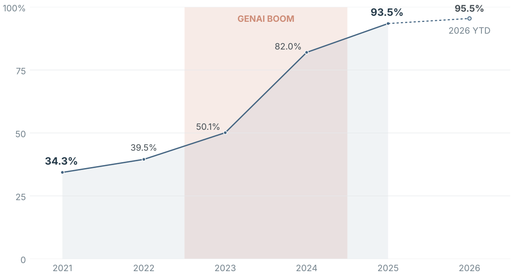{.chart .h-580}
:::
:::

::: note-line
S&amp;P 500, 499 firms fixed at 1 Jan 2021 · SEC filings 2021–2025, 2026 year to date · Thesis Fig. 3
:::

::: notes
- Diffusion: 34.3% of firms in 2021, 93.5% in 2025, 95.5% in 2026 YTD. A balanced cohort shows the same path, which rules out index churn.
- Investors must separate real adoption from promotional claims; managers must talk about AI without overstating its maturity.
- Keyword counts and dictionary tone give the same weight to a risk disclaimer and to a documented deployment. That is the measurement gap the thesis addresses.
:::

<!-- ============================ 2 · RQs ============================ -->

## Four research questions structure the inquiry from disclosure patterns to economic relevance

::: kicker
Research design
:::

::: {.card .sand style="padding:22px 30px"}
::: label
Main research question
:::

To what extent do public firms exhibit <strong>strategic heterogeneity</strong> in their corporate AI disclosures, and does distinguishing disclosure volume, communication posture and grounded operational substance carry incremental economic information?

:::

::: {.grid-4 .mt}
::: {.card .accent-petrol}
::: label
RQ1 · Evolution
:::
#### How did AI disclosure spread, and did the evidence keep up?

Institutional isomorphism

<strong>Expected:</strong> AI talk spreads fast; concrete activities grow more slowly.

:::

::: {.card .accent-teal}
::: label
RQ2 · Heterogeneity
:::
#### Do firms talk about AI in distinct, stable ways?

Signalling · organizational configurations

<strong>Expected:</strong> stable styles that predict reported activity beyond volume.

:::

::: {.card .accent-ochre}
::: label
RQ3 · Decoupling &amp; venue
:::
#### Does talk run ahead of evidence, and do calls differ from filings?

Decoupling · channel liability

<strong>Expected:</strong> unbacked promotion sits in calls; SEC scrutiny narrows the gap.

:::

::: {.card .accent-rust}
::: label
RQ4 · Market relevance
:::
#### Do markets price these differences?

Costly signalling

<strong>Expected:</strong> accumulated gaps, not one quarter's talk, show up in risk.

:::
:::

::: notes
- Each RQ has a theoretical mechanism and an expected outcome, as in the thesis's research-question table.
- RQ4 in full: markets price accumulated decoupling, cumulative disclosure intensity and a governance-weighted posture into systematic risk (beta), rather than reacting to single-quarter narrative volume.
- The market regressions are exploratory diagnostics, not confirmatory tests.
- The thesis closes with open questions on the final findings slide.
:::

<!-- ============================ 3 · METHOD ============================ -->

## An analytical methodology turns 9.7M paragraphs into six measures to explore the four questions

::: kicker
Methodology
:::

::: chart
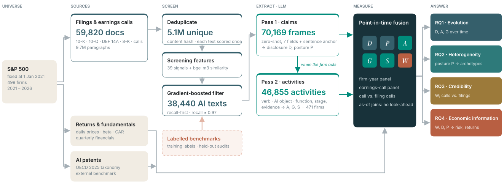{.chart}
:::

::: note-line
S&amp;P 500, 499 firms · 10-K, 10-Q, 8-K, DEF 14A and earnings calls, 2021–2026 year to date · Thesis Fig. 1 
communication &nbsp;&nbsp;&nbsp; disclosed activity &amp; evidence &nbsp;&nbsp;&nbsp; decoupling &nbsp;·&nbsp; Code, prompts, datasets and models are public and version-pinned.
:::

::: notes
- Two LLM passes: first, claims ("frames") with seven communicative dimensions; second, when the text reports the firm itself doing something with AI, an action triple (verb, AI object, business function) plus stage, provenance and evidence.
- D = AI frames per 1,000 words. P = seven-dimensional posture. A = activity count. G = share of five evidence attributes. S = log(1+A)×G. W = rank(D) − rank(S).
- Details and validation in annex A1–A4.
:::

<!-- ============================ 4a · NARRATIVE ============================ -->

## AI talk grew 7.3× and turned toward risk and governance

::: kicker
RQ1 / Narrative evolution
:::

::: chart
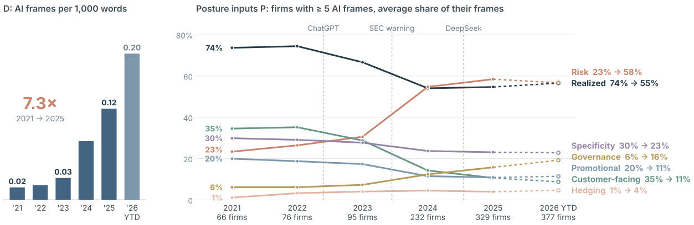{.chart}
:::

::: takeaway
The typical firm now talks about AI mostly as a **risk**: the share of its AI frames that name one rose from **23% to 58%**, while realized claims fell from 74% to 55% and customer-facing ones from 35% to 11%. The turn starts in 2023, ahead of the SEC warning (A12).
:::

::: note-line
Filings 2021–2025, 2026 year to date · Left: Thesis Fig. 3, Panel B 
Right: the seven archetypal-analysis inputs by year. Per firm, share of its 10-K, 8-K and DEF 14A AI frames carrying each dimension (≥ 5 frames, shrunk), averaged across firms.
:::

::: notes
- D is the mean firm-year rate of AI frames per 1,000 words: 0.017 in 2021, 0.125 in 2025.
- 2021 → 2025: realized 74 → 55, risk 23 → 58, customer-facing 35 → 11, specificity 30 → 23, promotional 20 → 11, governance 6 → 16, hedging 1 → 4.
- Firms entering the average: 66 in 2021, 329 in 2025. Much of the drift comes from new disclosers, who enter mostly as Defensive.
- The archetypes are fitted once, on each firm's frames pooled over the whole panel; this chart shows the same inputs year by year. D is not an input.
:::

<!-- ============================ 6 · GROUNDING ============================ -->

## Firms report many more AI activities, each backed by less evidence

::: kicker
RQ1 / Evolution of evidence
:::

::: chart
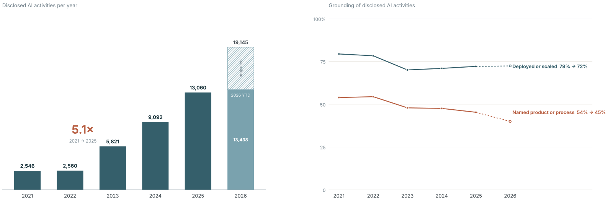{.chart}
:::

::: {.grid-3 .mt style="grid-template-columns:.28fr .45fr .27fr"}
::: {.card .sand style="padding:18px 24px"}

More activities

Firms report <strong>5.1×</strong> more AI activities in 2025 than in 2021.

:::
::: {.card .sand style="padding:18px 24px"}

Where evidence is missing

Most activities name a business function and are deployed. Few give a number for the result (<strong>13%</strong>) or name an outside vendor (<strong>3%</strong>).

:::
::: {.card .sand style="padding:18px 24px"}

Less evidence each

G = share of the 5 items an activity names, per firm. It fell <strong>0.44 → 0.37</strong>, also in firms already there in 2021.

:::
:::

::: note-line
Left: 2021–2025, 2026 YTD (hatched = projected), filings and calls · Middle: each attribute counted on its own, all 46,855 activities, pooled 2021–2026 YTD (Thesis Fig. 13, right) · Right: firm <i>G</i> from filings (Thesis Fig. 14)
:::

::: notes
- Activities grew 5.1× from 2021 to 2025. Mean firm G fell from 0.44 to 0.37. In filings, the share naming a product or process fell from 55% to 43% (36% in 2026 YTD) and deployed or scaled from 80% to 73%. Quantified outcomes (7%) and named providers (5–6%) were rare from the start.
- Pooling filings and calls over 2021–2026, 9.7% of activities name a function, are deployed and give a metric (calls carry more metrics, so this is above the 7% in filings).
- Not a composition effect: grounding falls inside the fixed 2021 cohort too (0.44 → 0.39). Annex A11.
- The decline is in documentary detail per activity; real execution may not have changed.
:::

<!-- ============================ 4 · POSTURES ============================ -->

## Almost every firm talks about AI, but in three distinct postures that also differ in what firms report doing

::: kicker
RQ2 / Heterogeneity
:::

::: row
::: {.chart style="width:760px;flex:none;margin-top:-20px"}
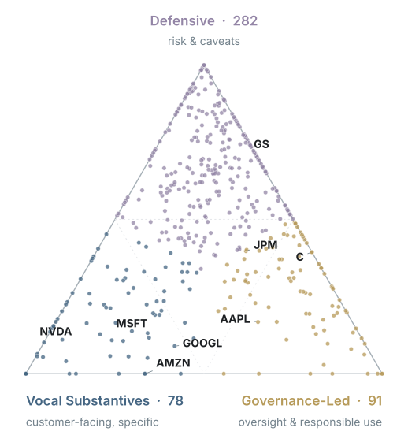{.chart .h-700}
:::

::: {.grow}
::: {.card .accent-petrol style="padding:20px 26px"}

78 firms

<h4 class="petrol">Vocal Substantives</h4>

Customer-facing, specific and promotional. Microsoft, NVIDIA, Alphabet, Amazon.

<strong>2.02×</strong> the activities of Defensive firms at equal volume

:::

::: {.card .accent-ochre .mt-s style="padding:20px 26px"}

91 firms

<h4 class="ochre">Governance-Led</h4>

Board oversight and responsible use; realized claims. Citigroup, Apple, BlackRock.

<strong>1.52×</strong> the activities of Defensive firms at equal volume

:::

::: {.card .accent-slate .mt-s style="padding:20px 26px"}

282 firms

<h4 class="slate">Defensive</h4>

AI as a risk in Item 1A; few realized claims. Goldman Sachs, J&amp;J.

:::

::: mt-s
Volume and activities are not used to find the postures

451 firms · 10-K, 8-K, DEF 14A · pooled 2021–2026 YTD · Thesis Fig. 5

:::
:::
:::

::: notes
- Archetypal analysis writes every firm as a mix of three extreme profiles; the simplex shows those mixes. 47 firms with fewer than five AI frames are labelled No AI and not fitted.
- Volume is deliberately not an input: how much a firm says and how it says it are different questions.
- Profiles (z-scores): Vocal customer-facing +2.6, specificity +2.8, promotional +2.1; Governance-Led governance +2.6, realized +1.9; Defensive risk +1.3, realized −1.6.
- Activities never enter the fit. Negative binomial of activity counts on posture, controlling for log(1 + AI frames): Vocal 2.02× (95% CI 1.67–2.44), Governance-Led 1.52×. Raw Vocal gap is 7.9×. Median activities: Vocal 222, Governance-Led 39, Defensive 24. Quantified outcomes are scarce in every posture (11–16%).
- Why three: k = 2 loses governance; k = 4 collapses (a fourth archetype falls to 0.37 Jaccard). Annex A5.
- Posture is not capability: Apple is Governance-Led in EDGAR because its product marketing happens at keynotes.
:::

<!-- ============================ 4b · POSTURES OVER TIME AND BY SECTOR ============================ -->

## New disclosers mostly enter as Defensive, and industry shapes which posture a firm takes

::: kicker
RQ2 / Postures over time and by sector
:::

::: row
::: {.chart style="width:760px;flex:none"}

Share of the index in each posture

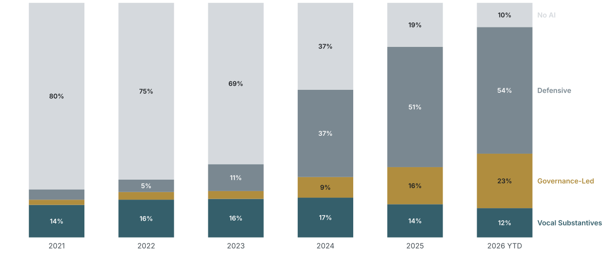{.chart .h-520}
:::
::: {.grow .chart}

By sector: share vs. the index average (1.0× = average)

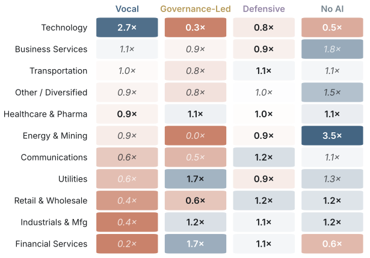{.chart .h-520}
:::
:::

::: takeaway
Defensive grew from **4% to 54%** of the index while Vocal stayed near **13–14%**: a risk warning is the cheapest first thing to write. Tech leans **Vocal (2.7×)**; banks and utilities lean **Governance-Led (1.7×)**.
:::

::: note-line
Left: all index firms each year, 2021–2025, 2026 year to date · Right: pooled 2021–2026 year to date · Thesis Figs. 8 (Panel A) and 7
:::

::: notes
- Each year's label uses only the firm's own text from 2021 up to that year, never a later one. Shares are of the whole index, including firms with no AI.
- Some Vocal firms also drift to Defensive year to year.
- Where firms write matters: Defensive tracks the Item 1A risk section (r = 0.77); Governance tracks the proxy statement, DEF 14A (r = 0.72). A 10-K-only reading misses much of the governance evidence.
- Heatmap: italic cells have fewer than 5 firms. Energy & Mining is 3.5× No AI: few firms there talk about AI at all.
- Compare a firm with its sector peers before calling its posture unusual.
:::

<!-- ============================ 7a · DECOUPLING ============================ -->

## Some firms' talk runs ahead of their evidence, and the gap persists year to year

::: kicker
RQ3 / Decoupling
:::

::: row
::: {.chart style="width:700px;flex:none"}
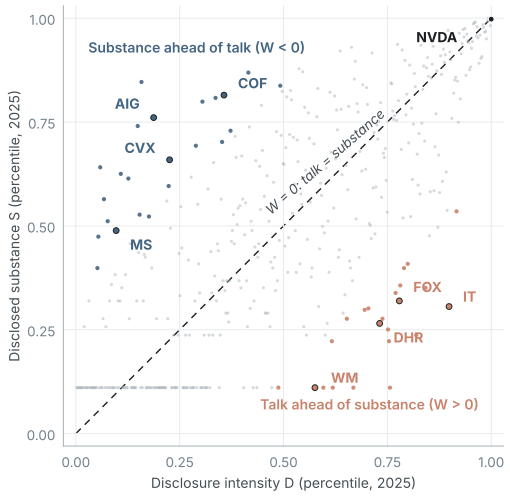{.chart}
:::

::: grow
::: {.card .sand style="padding:18px 24px"}

S = activities weighted by their evidence G

W = rank of talk D − rank of evidence S, within each year

W &gt; 0: talk ahead of evidence · W &lt; 0: quiet substance

:::

::: {.card .accent-ochre .mt-s}

ρ = 0.60

a firm's <i>W</i> this year predicts next year's: a stable trait, not noise

:::

::: {.card .sand .mt-s}

High <i>W</i>: "The Company <strong>may use</strong> artificial intelligence…" Low <i>W</i>: "Deploy AI… through our global <strong>Aon Business Services platform</strong>."

:::
:::
:::

::: note-line
One point per disclosing firm, ranked within 2025 · Thesis Fig. 20 
<i>W</i> ranks firms against each other. A high <i>W</i> is a reason to check, not proof of overstatement.
:::

::: notes
- S = log(1 + A) × G; W = rank(D) − rank(S), percentile ranks among disclosers each year, so W ∈ [−1, 1] with mean ~0.
- Ranks, not z-scores: D has a very heavy tail, so z-scores would push Microsoft or NVIDIA into the "washing" tail.
- Persistence: year-over-year ρ = 0.60; split-half ρ = 0.63. No association with market cap, beta or R&D intensity. Details in A7.
- A gap fits several explanations: competition, filing conventions, disorganisation, or overstatement.
:::

<!-- ============================ 8 · MARKETS ============================ -->

## Disclosure signals show selective associations with risk, returns and growth

::: kicker
RQ4 / Market relevance
:::

::: chart
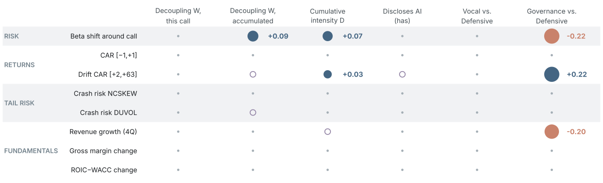{.chart}
:::

::: {.grid-3 .mt-s .tight}
::: small
Over time, not one call Past decoupling and cumulative volume go with a more positive beta shift; single-call decoupling shows no robust association in this sample.
:::
::: small
Governance vs. Defensive Lower beta shift, higher drift over the next quarter, slower revenue growth.
:::
::: small
No survivors Announcement return, crash risk, gross margin, ROIC–WACC.
:::
:::

::: note-line
survives BH-FDR 5% (6 of 48) &nbsp;&nbsp; nominal p &lt; 0.05 only &nbsp;·&nbsp; calls 2021–2026; sample varies by outcome (beta shift: 9,350 calls, 484 firms) &nbsp;·&nbsp; sector &amp; year FE &nbsp;·&nbsp; **association, not cause** &nbsp;·&nbsp; Thesis Table 46
:::

::: notes
- The claim is deliberately moderate: nothing here says "the market detects AI washing".
- Standardized coefficients: W_exp +0.09 and D +0.07 on the beta shift; Governance −0.22 on the beta shift, +0.22 on drift, −0.20 on revenue growth.
- All regressors are predetermined at the call date; lagged outcome controlled. Specification in A10; the grid above shows all 48 tests.
:::

<!-- ============================ 9 · FRAMEWORK ============================ -->

## [A four-step framework to prioritize and verify AI claims]{style="white-space:nowrap;"}

::: kicker
Managerial application
:::

::: {.grid-3 .tight style="margin:-10px 0 12px; font-size: 18px; line-height: 1.35;"}
::: xsmall
Due diligence 93% of firms mention AI in their filings; nobody can check every claim. This says which to check first, before you invest, lend or sign.
:::
::: xsmall
Credibility Overstated AI is a misstatement for the SEC, and inflated claims cost trust with investors long before a letter arrives.
:::
::: xsmall
Downstream Disclosure gaps, intensity and posture show selective associations with risk, returns and growth. Use it at scale or on one company.
:::
:::

::: {.flow style="grid-template-columns:repeat(4,1fr)"}
::: {.card .accent-slate}
1
<h4>Define</h4>

Start with the company: what role does AI play in its business, <strong>core or peripheral</strong>?

Then fix the channels to read and the decision on the table.

:::

::: {.card .accent-petrol}
2
<h4>Diagnose</h4>

Three questions, in order:

<ul class="small">
<li><strong>Posture:</strong> how does it talk about AI? (sets the peers)</li>
<li><strong>Evidence:</strong> is there substance behind the talk?</li>
<li><strong>Venue:</strong> are scope and evidence consistent across call and 10-K?</li>
</ul>

NLP at scale, or by hand.

:::

::: {.card .accent-ochre}
3
<h4>Prioritize &amp; verify</h4>

Start with the claims that <strong>matter most to the business</strong>. Look for:

<ul class="small" style="margin-top:4px">
<li>deployed or just a pilot?</li>
<li>named product? metric?</li>
<li>in-house or vendor?</li>
<li>same scope in call and 10-K?</li>
</ul>

Claims missing these go first.

NLP at scale, or by hand.

:::

::: {.card .accent-rust}
4
<h4>Act &amp; monitor</h4>

Log each claim in a <strong>claim register</strong> (owner, review date). Then:

<ul class="small" style="margin-top:4px">
<li><strong>Evidence not communicated:</strong> decide what to disclose.</li>
<li><strong>Nothing behind it:</strong> why talk about AI at all? Narrow it, back to step 1.</li>
<li><strong>Backed:</strong> keep it, review next cycle.</li>
</ul>
:::
:::

::: {.card .sand .mt-s style="padding:14px 26px"}

Beyond large listed firms

::: grid-3
::: small
**Private firms:** promises vs. board reports and contracts.
:::
::: small
**Startups:** demo, pilot or paying customers?
:::
::: small
**Everywhere:** is there proof? (S&amp;P 500 numbers don't carry over)
:::
:::
:::

::: notes
- Context: 93% of firms mention AI in their filings; nobody can verify every claim. Disclosure gaps, intensity and posture show selective associations with risk, returns and growth.
- Same routine for issuers (before publishing a claim) and investors (before committing capital).
- Why (thesis): with AI vocabulary everywhere, keyword screens no longer sort firms; ordering what to verify first is the scarce decision in disclosure review and due diligence. Before committing capital or approving a claim, the reader knows which uncertainty to resolve and what would resolve it. For issuers, promotional inflation costs credibility with investors long before a comment letter.
- Materiality comes from outside the framework (the business or the investment thesis) and can reverse the order: a central claim in a Deprioritize firm outranks a peripheral one in Investigate.
- Issuer side: where AI is a core differentiator, keep evidence dense and report milestones that can be falsified; where it is peripheral, resist promotional inflation. Reconcile call remarks with the signed 10-K before the call.
- The thesis also gives a six-line checklist (posture, activity & maturity, grounding, provenance, cross-venue consistency, supervision & governance) for issuers and investors.
- The 2026 screen of the index (Investigate 56, Validate 166, Explore 56, Deprioritize 187) is in A14; thesis cases in A15; examples per quadrant in A16.
- Startup example from the thesis: "uses AI to automate claims processing end to end" turns out to be one pilot with one insurer, intake step only, human review of every output. Narrow the claim to that, and set the criteria for the next pilot in advance.
:::

<!-- ============================ 9b · SCREEN AND CASES ============================ -->

## Applied at scale to the S&P 500 in 2026: the screen says where to look, the routine says what to do next

::: kicker
Managerial application / The routine in practice
:::

2026 screen · 465 index firms

::: {.quad style="grid-template-columns:repeat(4,1fr)"}

Investigate · 56

much talk, little evidence

Validate · 166

much talk, much evidence

Deprioritize · 187

little talk, little evidence

Explore · 56

little talk, much evidence

:::

One firm per quadrant, through the four steps · 2026

| | 1 · Define | 2 · Diagnose | 3 · Prioritize &amp; verify | 4 · Act &amp; monitor |
|:-----------|:-----------------|:-----------------|:---------------------|:---------------------|
| **Microsoft** Validate | AI is **core**: products and cloud. | Vocal. Talk 100th pct, evidence 97th pct, <i>W</i> +0.03. | 277 activities, 132 with a number. Do customers use them, and do they bring in money? | **Documentary alignment is strong; verify adoption and economic contribution.** |
| **Newell Brands** Investigate | AI is **peripheral**: housewares and pens. | Defensive. Talk 71st pct, evidence 39th pct, <i>W</i> +0.31. | 18 AI passages in the 10-K, half "we **may use** AI" risks. 11 of 13 activities name nothing. | **Little operational backing is disclosed; distinguish risk warnings from capability claims.** |
| **Wells Fargo** Explore | AI is **supporting**: operations and service. | Governance-Led. Talk 30th pct, evidence 84th pct, <i>W</i> −0.54. | AI tools in check processing and customer service, but few metrics. | **Documented activity exceeds narrative intensity; verify results and decide what to disclose.** |
| **ExxonMobil** Deprioritize | AI is **peripheral**: oil and gas. | Defensive. Talk 7th pct, evidence 12th pct, <i>W</i> −0.05. | Only 3 AI passages in the 10-K, but a call cites ~$750M saved with advanced modeling. | **A big number on a call:** ask for the backing. Materiality beats the queue. |

: {.compact}

::: note-line
Screening applied to the sample; managerial responses are illustrative and their effectiveness remains untested. 
2026 reporting season (year to date) · screen: median splits of <i>D</i> and <i>S</i> among 444 disclosers (Thesis Table 16) · percentiles within 2026 · more cases in A15, quadrant examples in A16.
:::

::: notes
- Presentation tip: explain two contrasting cases orally (e.g. Microsoft for high-disclosure validation vs. ExxonMobil for materiality overriding the queue), keeping Newell and Wells Fargo as reference contrast on the slide.
- Microsoft: 277 disclosed activities extracted in 2026 reporting (132 with quantitative metrics). Documentary alignment is strong; the routine targets business verification (adoption, revenue) rather than assuming economic validation.
- Newell Brands: third in 2026 Investigate queue; distinguishing defensive risk boilerplate ("may use AI") from operational capability claims.
- Wells Fargo: documented activities exceed narrative volume (persistent W −0.46); managerial task is verifying internal results and deciding strategically what to disclose vs. protect as confidential.
- ExxonMobil: ~$750M opex savings cited in call remarks under "advanced modeling"; 10-K barely mentions AI. Materiality overrides the low-priority quadrant; the analyst must probe whether "advanced modeling" represents AI/ML or conventional reservoir engineering before accepting the claim.
- Materiality from outside the framework can reverse the screening queue.
:::

<!-- ============================ 10 · ANSWER ============================ -->

## AI talk spread faster than its evidence, firms exhibit distinct postures, and selected disclosure signals carry economic information

::: kicker
Findings &amp; synthesis
:::

::: {.grid-4 .mt-s}
::: {.card .accent-petrol}
::: label
RQ1 · Evolution
:::

0.44 → 0.37

<strong>Evidence thinned as talk spread.</strong> AI reached 93% of firms and 7.3× more text, while average evidence per activity (<i>G</i>) fell.

:::
::: {.card .accent-teal}
::: label
RQ2 · Heterogeneity
:::

3 postures

<strong>Style predicts substance.</strong> At equal volume, Vocal firms report 2.02× the activities of Defensive ones; new disclosers enter as Defensive.

:::
::: {.card .accent-ochre}
::: label
RQ3 · Decoupling
:::

ρ = 0.60

<strong>The talk–evidence gap is a firm trait.</strong> A firm's <i>W</i> this year predicts next year's: a stable characteristic across reporting cycles.

:::
::: {.card .accent-rust}
::: label
RQ4 · Market relevance
:::

6 of 48

<strong>Accumulated, not one call.</strong> Past gaps and cumulative volume go with a higher beta shift; Governance-Led with lower beta shift and more drift.

:::
:::

::: {.grid-2 .mt}
::: {.card .sand}
::: label
What the thesis adds
:::
- **A way to measure** talk and evidence separately, at scale
- **A due-diligence framework** from the findings: which AI claims to check first, at scale or for one firm
- **Open and reproducible:** public code, data and models, adaptable to new questions
:::
::: {.card .sand}
::: label
What comes next
:::
- Does it hold in longer periods and wider samples?
- Does it work for private companies?
- Does the framework help analysts decide better?
- What do new analyses and crosstabs reveal across sectors and technologies?
:::
:::

::: notes
- RQ1: 34% → 93% of firms, 2021 → 2025; D grew 7.3×; mean firm G fell from 0.44 to 0.37 (0.44 → 0.39 inside the fixed 2021 cohort).
- RQ2: negative binomial of activities on posture controlling for log(1 + frames); new disclosers enter as Defensive (4% → 54% of the index).
- RQ3: W persists year to year (ρ = 0.60 across consecutive reporting cycles). Decoupled firms remain decoupled; the one firm under direct SEC scrutiny narrowed its gap (A12). Cross-venue comparison moved to Annex A8–A9.
- RQ4: all associations, not causal; Governance-Led also goes with slower revenue growth. Single-call W shows no robust association.
- The measurement is estimated; the claim register is a proposed application, not yet tested against real decisions.
- A gap can come from competition, filing conventions, overstatement or disorganisation; telling them apart needs internal evidence.
- Close: "Public text can't tell you who is lying. What the thesis gives you is where to look first, and what would settle the question."
:::

<!-- ============================ ANNEX ============================ -->

## {#annex .divider background-color="#263B4A"}

::: divider-wrap
::: cover-kicker
Questions &amp; answers
:::

::: divider-title
Annex
:::

::: toc
<a href="#/a1"><b>A1</b>The six constructs</a>
<a href="#/a2"><b>A2</b>RQ → components → analysis → finding</a>
<a href="#/a3"><b>A3</b>Extraction architecture</a>
<a href="#/a4" class="key"><b>A4</b>Validation</a>
<a href="#/a5"><b>A5</b>Why k = 3</a>
<a href="#/a6" class="key"><b>A6</b>No circularity</a>
<a href="#/a7" class="key"><b>A7</b>What W measures</a>
<a href="#/a8" class="key"><b>A8</b>Calls vs. filings: results</a>
<a href="#/a9"><b>A9</b>Call vs. filing design</a>
<a href="#/a10" class="key"><b>A10</b>Market specification</a>
<a href="#/a11"><b>A11</b>Grounding within firms</a>
<a href="#/a12"><b>A12</b>SEC scrutiny</a>
<a href="#/a13"><b>A13</b>DeepSeek shock</a>
<a href="#/a14"><b>A14</b>Framework in full</a>
<a href="#/a15"><b>A15</b>Worked cases</a>
<a href="#/a16"><b>A16</b>Quadrant examples</a>
<a href="#/supp"><b>S</b>Supplementary figures →</a>
:::
:::

<!-- A1 -->

## Six measures keep talk and evidence apart {#a1}

::: kicker
A1 / Constructs
:::
::: back
[↩ Annex index](#/annex)
:::

| | Construct | Definition | Reads as |
|:--|:--|:--|:--|
| D | AI disclosure intensity | AI frames per 1,000 words | How much the firm talks about AI |
| P | Communication posture | Shares of claims that are promotional, hedged, risk, governance, realized, customer-facing, specific | *How* it talks |
| A | Disclosed AI activity | Count of action triples (verb · AI object · business function) | Breadth of reported execution |
| G | Activity grounding | ⅕ Σ~k~ (activities naming *k* ÷ *A*) over 5 attributes *k*: function, deployed stage, named product, metric, provider. ∈ [0, 1]; shrunk when a firm has few activities | How verifiable each activity is |
| S | Disclosed substance | log(1 + *A*) × *G* | Grounded activity volume |
| W | Decoupling | rank(*D*) − rank(*S*) ∈ [−1, 1], ranks within year among disclosers | Talk ahead of substance (+) or quiet substance (−) |

: {.compact}

::: note-line
Firm-year values are the median document rate; thin evidence is shrunk toward the sector-year prior (empirical Bayes).
:::

<!-- A2 -->

## Each research question: its sources, measures and analysis {#a2}

::: kicker
A2 / Architecture
:::
::: back
[↩ Annex index](#/annex)
:::

| | Sources | Components and how each is computed | Analysis that answers the RQ | Finding |
|:-------------|:--------------------|:--------------------------|:--------------------|:---------------|
| **RQ1** Evolution Institutional isomorphism | 10-K, 10-Q, 8-K, DEF 14A + earnings calls for the activity count | *D* = AI frames per 1,000 words *A* = count of action triples (verb · AI object · function) *G* = ⅕ Σ~k~ (activities naming *k* ÷ *A*), 5 attributes | Yearly panel of *D*, *A*, *G*; fixed 2021 cohort to rule out composition | 34% → 93% of firms; activities 5.1×; *G* 0.44 → 0.37 |
| **RQ2** Heterogeneity Signalling; configurations | 10-K, 8-K, DEF 14A for *P* filings + calls for *A*; SIC codes | *P* = 7 frame shares (promotional, hedging, risk, governance, realized, customer-facing, specific) | Archetypal analysis on *P*, *k* = 3 by bootstrap Jaccard; negative binomial of *A* on posture + log(1 + frames) | Three postures; 2.02× / 1.52× activity at equal volume |
| **RQ3** Decoupling &amp; venue Decoupling; channel liability | Filings for *W* calls vs. 10-K + 10-Q of the same fiscal year; SEC comment letters | *S* = log(1 + *A*) × *G* *W* = rank(*D*) − rank(*S*), within year | Persistence of *W*; venue gap *Y* = α~i,t~ + β·1[call], firm × year FE | *W* persists (ρ 0.60); calls carry more evidence, filings more caveats |
| **RQ4** Market relevance Costly signalling | 9,350 earnings calls + prior filings FactSet prices, returns, market cap, S&amp;P 500 TR, quarterly fundamentals | *W*~call~ = *W* of the call; *W*~exp~ = mean of past call *W*; cumulative *D*; posture weights | Regression: predetermined regressors, lagged outcome, sector &amp; year FE; BH-FDR over 48 tests | 6 of 48 survive: beta shift, drift, revenue |

: {.compact}

::: note-line
Validation: AI patents from Google Patents, OECD taxonomy (A4). SEC warning and DeepSeek: interrupted time series on filings and calls (A12, A13).
:::

<!-- A3 -->

## From 9.7M paragraphs to 46,855 activities, each traceable to its sentence {#a3}

::: kicker
A3 / Pipeline detail
:::
::: back
[↩ Annex index](#/annex)
:::

::: row
::: grow
| Stage | Retained | Operation |
|:--|--:|:--|
| Raw corpus | 9,714,405 | Paragraph segmentation of 59,820 documents |
| Scorable | 8,891,944 | Prose only; tables, exhibits, graphics dropped |
| Unique | 5,122,492 | BLAKE2b content hash; each text scored once |
| AI candidates | 38,440 | GBDT, 39 features (bge-m3 anchor similarity, stems, entities, section), τ = 0.17 |
| Texts with ≥1 claim | 31,550 | Zero-shot LLM → 70,169 frames, 7 dimensions + sentence anchor |
| Texts with firm action | 28,229 | Second pass → 46,855 activities: triple, stage, provenance, evidence |

: {.compact}
:::

::: {style="width:560px;flex:none"}
::: {.card .accent-petrol}

Why this design

<ul class="small">
<li>Recall-first screen: a missed AI paragraph is lost for good; a false positive only costs one LLM call.</li>
<li>Deduplication stops boilerplate from being counted, or paid for, twice.</li>
<li>Every label keeps its sentence anchor, so any number traces back to text.</li>
<li>Extraction model chosen on a 7-model benchmark: no field contradictions, ≈3 s per paragraph.</li>
</ul>
:::
:::
:::

<!-- A4 -->

## Automated checks support the measures; the human audit is still pending {#a4}

::: kicker
A4 / Validation
:::
::: back
[↩ Annex index](#/annex)
:::

::: grid-3
::: {.card .accent-petrol}

Screen transfer · unseen forms

0.97 recall

precision 0.67 · DEF 14A + 8-K, 1,500 texts. Calls: recall 0.98, precision 0.59 (0.85 on strong positives).

:::
::: {.card .accent-teal}

External benchmark · AI patents

+0.43 p &lt; 0.001

log patents on log disclosed activity, 343 firms, size + SIC fixed effects; grounded activity +0.41.

:::
::: {.card .accent-ochre}

Aggregation robustness

ρ &gt; 0.96

posture scores and archetypes when borderline categories are collapsed or reweighted.

:::
:::

::: {.card .accent-rust .mt}

Limitation stated plainly

Accuracy labels come from a <strong>second, independent LLM</strong>, not from humans. A human validator is built (one factual question at a time, evidence highlighted) and stratified samples are drawn (300 prefilter paragraphs; 120 paragraphs with 267 activities), but they are <strong>not yet reviewed</strong>. No human-audited error rate is claimed.

:::

::: note-line
Screen: held-out texts from forms not used in training · Patents: 2021–2023 filings, 343 firms · Thesis Table 37
:::

<!-- A5 -->

## Three postures is the most stable choice {#a5}

::: kicker
A5 / Choosing k
:::
::: back
[↩ Annex index](#/annex)
:::

::: chart
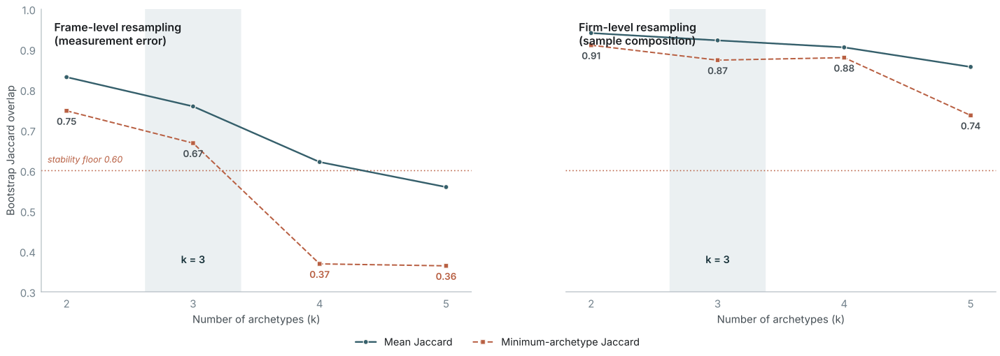{.chart .h-500}
:::

::: {.grid-3 .mt}
::: small
**k = 2** is stable but merges governance into promotion, so board oversight and a risk warning look the same.
:::
::: small
**k = 4** fails: the fourth archetype falls to Jaccard 0.37. There is no stable promotional-but-vague style.
:::
::: small
**Out of sample:** a model frozen on 2021–2025 recovers the 2026 partition (ARI 0.63); K-means reproduces the same three groups.
:::
:::

::: note-line
50 bootstrap replicates per k · Thesis Fig. 9
:::

<!-- A6 -->

## Postures come from how firms talk, not from volume or activities {#a6}

::: kicker
A6 / What the fit uses
:::
::: back
[↩ Annex index](#/annex)
:::

::: row
::: {.grow .chart}

Archetype vertices, fitted on seven posture shares only

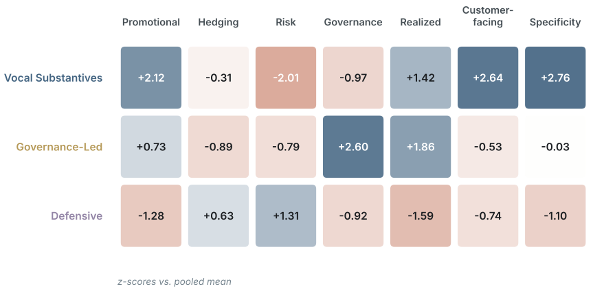{.chart}

::: {.card .accent-petrol style="padding:14px 22px;margin-top:10px"}

<strong>PCA of the seven inputs.</strong> PC1 (46%) sets promotional, specific, customer-facing and realized against risk: the Vocal–Defensive axis. PC2 (19%) is governance (+0.71), unrelated to risk (r = −0.02). Three components reach 78%, so posture is not one scale.

:::
:::

::: {style="width:560px;flex:none"}
::: {.card .accent-teal}

In the fit

Seven frame-level P shares: promotional, hedging, risk, governance, realized, customer-facing, specificity.

:::
::: {.card .accent-rust .mt-s}

Out of the fit

D (volume) and A (activities), both measured separately and used only afterwards as coherence checks.

:::
::: {.card .sand .mt-s}

Raw activity gap Vocal vs. Defensive: <strong>7.9×</strong>. Holding volume fixed: <strong>2.02×</strong> (CI 1.67–2.44). Volume matters; posture still adds.

:::
:::
:::

::: note-line
Pooled 2021–2026 year to date · z-scores against the pooled mean · Thesis Fig. 6
:::

<!-- A7 -->

## W ranks talk against evidence; it does not detect lying {#a7}

::: kicker
A7 / What W measures
:::
::: back
[↩ Annex index](#/annex)
:::

<i>W</i> = rank(<i>D</i>) − rank(<i>S</i>), &nbsp; <i>S</i> = log(1 + <i>A</i>) × <i>G</i>

::: grid-2
::: small
- **Relative, within year:** percentile ranks among disclosers, so the yearly mean is ~0 by design. It sorts firms; the market-wide decline shows in *G* instead.
- **Ranks, not z-scores:** *D* has a far heavier tail, so z-scores would push Microsoft or NVIDIA into the "washing" tail.
:::
::: small
- **Stable trait:** year-over-year ρ = 0.60; split-half ρ = 0.63; regression-residual version ρ = 0.81.
- **Not size or risk:** no association with market cap, beta or R&D intensity.
:::
:::

::: {.card .sand .mt}

Explanations for a high <i>W</i> include competition, editorial convention and disorganisation, as well as overstatement. Telling them apart needs internal evidence.

:::

<!-- A8 -->

## Same firm, same year: calls promote more and also provide more documentary evidence than filings {#a8}

::: kicker
A8 / Calls vs. filings
:::
::: back
[↩ Annex index](#/annex)
:::

::: row
::: {.grow .chart}

Earnings call minus statutory filing, same firm and fiscal year (pp, 95% CI)

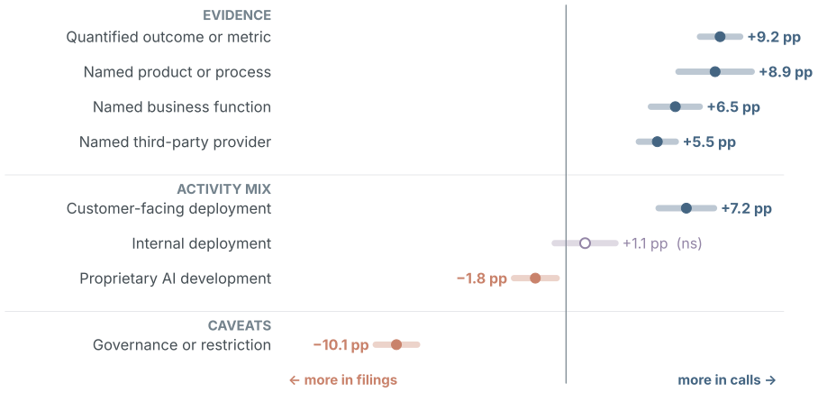{.chart .h-620}
:::

::: {style="width:520px;flex:none"}
::: {.card .accent-petrol}

Per 1,000 words, calls carry

16.8×

more promotional statements

18.7×

more quantified outcome claims

:::

::: {.takeaway style="font-size:23px"}
Calls carry the proof, filings the caveats. **The warning sign is a call claim the 10-K doesn't back.**
:::
:::
:::

::: note-line
790 firm-years (285 firms, ≥ 3 activities in each channel), pooled 2021–2026 year to date, firm × fiscal-year fixed effects, 95% CI · Thesis Fig. 22 · ratios per 1,000 words: Thesis Fig. 24
:::

<!-- A9 -->

## Calls vs. filings: same firm, same year {#a9}

::: kicker
A9 / Venue design
:::
::: back
[↩ Annex index](#/annex)
:::

<i>Y</i>i,t,venue = αi,t + β · 1[venue = call] + εi,t,venue

::: grid-3
::: card

Cells

790

firm-years, 285 firms, ≥ 3 activities in each channel

:::
::: card

Each cell

All calls of the fiscal year pooled vs. the 10-K and 10-Qs of that year; shares of activities or rates per 1,000 words.

:::
::: card

Inference

αi,t absorbs everything fixed about the firm that year; SE clustered by firm.

:::
:::

::: {.grid-2 .mt}
::: small
**By year:** the quantified-outcome premium in calls exists from 2021 and stays flat; the named-product gap opens with GenAI; governance caveats keep moving into filings.
:::
::: small
**Limit:** the comparison is at venue level. It does not track whether a specific call claim reappears, softened, in the next filing.
:::
:::

<!-- A10 -->

## The market tests measure association, not cause {#a10}

::: kicker
A10 / Identification
:::
::: back
[↩ Annex index](#/annex)
:::

<i>Y</i>i,t = α + β · Disclosurei,t⁻ + γ · <i>Y</i>i,t⁻ + δ · Controlsi,t⁻ + Sectori + Yeart + εi,t

::: row
::: grow
| Regressor | Measured |
|:--|:--|
| *W*~call~ | this call's own transcript |
| *W*~exp~ | expanding mean of past call *W* |
| *D* | cumulative filing intensity to prior quarter |
| has · *w*~voc~ · *w*~gov~ | trailing posture mix, Defensive = reference |
| Controls | log mkt cap, 60-day return, ROA (+ KLZ for crash risk) |

: {.compact}
:::
::: grow
| Outcome | Window |
|:--|:--|
| Beta shift (Brenner) | days [−63,−21) vs [+21,+63) |
| CAR [−1,+1] · drift [+2,+63] | market-model residuals |
| NCSKEW · DUVOL | 26 weeks after |
| Margin · ROIC−WACC · revenue | next 4 vs. prior 4 quarters |

: {.compact}
:::
:::

::: note-line
Predetermined regressors, lagged outcome, firm-clustered SE. Cross-sectional association: changing the wording would not mechanically change beta.
:::

<!-- A11 -->

## Evidence thins inside the same firms too, not only through new entrants {#a11}

::: kicker
A11 / Robustness
:::
::: back
[↩ Annex index](#/annex)
:::

::: row
::: {.grow .chart}
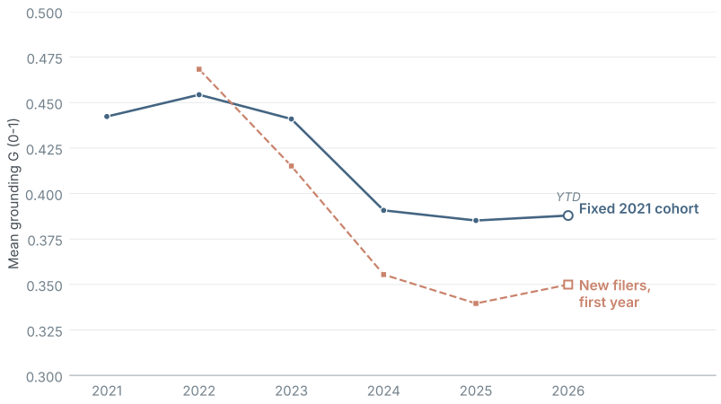{.chart}
:::
::: {style="width:560px;flex:none"}
- **Within firms:** the fixed 2021 cohort dilutes its own claims, 0.44 → 0.39.
- **Entry:** from 2023, new disclosers enter at or below incumbents.
- **Rollup:** activity- and firm-weighted versions agree, and calls are more grounded than filings under both.
- **Ladder:** pooling filings and calls, 2021–2026, only 9.7% of activities name a function, are deployed *and* give a metric.
:::
:::

::: note-line
Firm-years with a <i>W</i> score, 2021–2026 year to date · fixed cohort = firms already scored in 2021
:::

<!-- A12 -->

## Risk and governance talk rose before the SEC warning, not at it {#a12}

::: kicker
A12 / Regulatory scrutiny
:::
::: back
[↩ Annex index](#/annex)
:::

::: chart
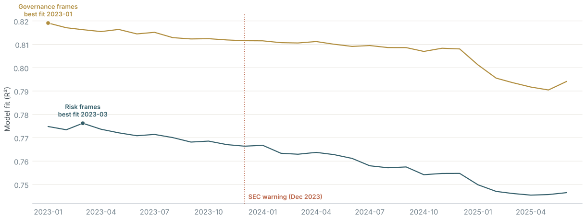{.chart .h-540}
:::

::: {.grid-2 .mt}
::: small
**Sweep:** refitting the break month from 2023 to 2025, the best fit is early 2023 (governance Jan, risk Mar). The step at December 2023 is indistinguishable from zero.
:::
::: small
**Direct scrutiny is rare:** 8 AI-term comment-letter threads in the universe, 1 on operational claims (Welltower, 2025). Its next 10-K cut claim density and moved *W* from +0.14 to −0.13.
:::
:::

::: note-line
Monthly AI frames per 1,000 words, all documents, from Jan 2021 (68 months) · break month tested from Jan 2023 to Jun 2025
:::

<!-- A13 -->

## A two-month spike in open-source talk around DeepSeek, with no detectable lasting shift {#a13}

::: kicker
A13 / Technology shock
:::
::: back
[↩ Annex index](#/annex)
:::

::: chart
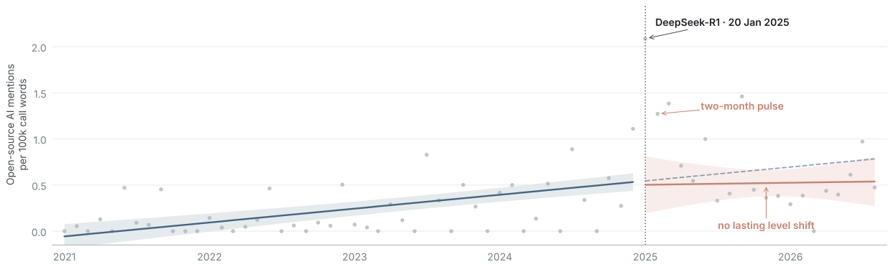{.chart .h-580}
:::

::: note-line
Earnings calls, Jan 2021–Aug 2026 · Thesis Fig. 19 
Interrupted time series, 68 months of calls, season and composition controls, Jan–Feb 2025 as pulse terms. January ≈ 10× the prior monthly mean; lasting level change p = 0.78. Analysts named the model (AT&amp;T, Corning calls).
:::

<!-- A14 -->

## The screen ranks what to check first; it does not score credibility {#a14}

::: kicker
A14 / Framework
:::
::: back
[↩ Annex index](#/annex)
:::

::: row
::: {style="width:720px;flex:none"}

2026 screen · 465 index firms

::: quad

Investigate

56

High <i>D</i>, low <i>S</i> · ask for proof; compare call and 10-K

Validate

166

High <i>D</i>, high <i>S</i> · check the proof still holds

Deprioritize

187

Low <i>D</i>, low <i>S</i> · incl. 21 non-disclosers

Explore

56

Low <i>D</i>, high <i>S</i> · find what they do but don't say

:::

Median splits among 444 disclosers; persistent <i>W</i> orders the queue inside a cell. Reconcile screen: 32 of 447 dual-channel issuers with promotional gap z &gt; 1.5.

:::

::: grow
| Verification finds | Issuer | Investor |
|:--|:--|:--|
| Real work, poor records | Write it down, name an owner | Ask for proof before believing it |
| Proof exists, never said | Decide what to tell | Look into it; don't assume a bargain |
| Claim bigger than reality | Say less | Wait for milestones |
| Works, but no money yet | Check cost and usage | Don't pay for it yet |
| Important and proven | Decide on the business case | Count it in the valuation |

: {.compact}
:::
:::

::: note-line
Empirically estimated: *D, P, A, G, S, W*. Proposed: the decision process around them. Materiality comes from outside and can reverse the queue.
:::

<!-- A15 -->

## The same routine leads to different next steps, firm by firm {#a15}

::: kicker
A15 / Worked cases
:::
::: back
[↩ Annex index](#/annex)
:::

| Firm | Posture | Talk *D* | Evidence *S* | *W* | What to check next |
|:-----------|:-----------|:------|:------|:----|:------------------------------------|
| **Microsoft** 2024 | Vocal | 100th pct | 99th pct | +0.01 | Its talk matches its proof. Check that people use the products and that they make money. |
| **JPMorgan** 2024 | Governance-Led | 29th pct | 64th pct | −0.34 | Does more than it says. Ask: is it hiding it on purpose, or just not telling? |
| **Goldman Sachs** 2024 | Defensive | 59th pct | 68th pct | −0.08 | Talks about AI mostly as a risk. Ask: is any of it actually running? |
| **Apple** 2024 | Governance-Led | 94th pct | 79th pct | +0.15 | Talks a lot about AI privacy and rules, shows little use. Ask: where is AI actually used? |
| **Welltower** 2025 | Defensive | 59th pct | 44th pct | +0.14 | Said more on the call than in the 10-K, and the SEC asked. Make the two say the same. |

: {.compact}

More examples, 2025 · three situations

| Situation | Firms · talk pct / evidence pct / *W* | What to check next |
|:----------|:------------------------------------------|:------------------------------|
| **Talk ahead** | Newell Brands 76 / 11 / +0.65 · Gartner 90 / 31 / +0.59 · IFF 82 / 24 / +0.58 | Ask for the proof: which product, which result? |
| **Aligned** | NVIDIA 100 / 100 / 0.00 · Amazon 99 / 99 / 0.00 · Centene 77 / 77 / 0.00 | Proof matches the talk. Keep checking it each year. |
| **Evidence ahead** | CVS 54 / 88 / −0.34 · Aon 55 / 87 / −0.33 · JPMorgan 52 / 83 / −0.31 | Ask what they do but don't say, and why. |

: {.compact}

::: note-line
Top: the five thesis cases (2024; Welltower 2025). Bottom: 2025 percentiles among disclosers; talk-ahead, evidence-ahead, Amazon and Centene cases from Thesis Fig. 21. 
Percentiles within year across the index. A negative <i>W</i> places a firm against peers; it does not prove hidden capability. A positive one is a reason to check, not proof of overstatement.
:::

<!-- A16 -->

## Each screen quadrant, with real firms from 2026 {#a16}

::: kicker
A16 / Quadrant examples
:::
::: back
[↩ Annex index](#/annex)
:::

::: grid-2
::: {.card .accent-rust}

Investigate · 56 firms · lots of talk, little evidence

<strong>First in line:</strong> KLA, Fox, Newell Brands

<strong>Familiar names:</strong> Procter &amp; Gamble, Verizon

Ask for proof, and check the call says the same as the 10-K.

:::
::: {.card .accent-petrol}

Validate · 166 firms · lots of talk, lots of evidence

<strong>First in line:</strong> Gartner, Lam Research, Cintas

<strong>Familiar names:</strong> Microsoft, NVIDIA, Alphabet, Amazon, Apple, JPMorgan

Proof is there. Check it still holds next year.

:::
::: {.card .accent-slate}

Deprioritize · 187 firms · little talk, little evidence

<strong>First in line:</strong> Skyworks, Crown Castle, International Paper

<strong>Familiar names:</strong> ExxonMobil, Johnson &amp; Johnson, Netflix, McDonald's

Little to check, unless AI matters a lot to your decision.

:::
::: {.card .accent-teal}

Explore · 56 firms · little talk, lots of evidence

<strong>First in line:</strong> American Electric Power, Wells Fargo, Regions Financial

<strong>Familiar names:</strong> Visa, Coca-Cola, Citigroup, AT&amp;T

They do more than they say. Find out what.

:::
:::

::: note-line
Quadrants split at the 2026 median of <i>D</i> and <i>S</i> among disclosers; Deprioritize includes 21 non-disclosers. "First in line" = highest persistent <i>W</i> (Explore: most negative), the thesis's order for the queue.
:::

<!-- ============================ SUPPLEMENTARY ============================ -->

## {#supp .divider background-color="#263B4A"}

::: divider-wrap
::: cover-kicker
Thesis figures not shown above
:::

::: divider-title
Supplementary
:::

::: toc
<a href="#/s1"><b>S1</b>Sample</a>
<a href="#/s2"><b>S2</b>Posture inputs</a>
<a href="#/s3"><b>S3</b>Posture transitions</a>
<a href="#/s4"><b>S4</b>Activities by sector</a>
<a href="#/s5"><b>S5</b>Activities by posture</a>
<a href="#/s6"><b>S6</b>Activity mix</a>
<a href="#/s7"><b>S7</b>Grounding ladder</a>
<a href="#/s8"><b>S8</b>Provenance</a>
<a href="#/s9"><b>S9</b>Ecosystems</a>
<a href="#/s10"><b>S10</b>Providers</a>
<a href="#/s11"><b>S11</b>SEC case</a>
<a href="#/s12"><b>S12</b>W examples</a>
<a href="#/s13"><b>S13</b>Venue by year</a>
<a href="#/s14"><b>S14</b>Promotion and evidence</a>
<a href="#/s15"><b>S15</b>Activities vs. Defensive</a>
<a href="#/s16"><b>S16</b>Market tests: all 48</a>
<a href="#/s17"><b>S17</b>Credibility checklist</a>
:::
:::

<!-- S1 -->

## Industrial distribution of the S&P 500 study universe (fixed at 2021-01-01, N=499) across three classification tiers {#s1}

::: kicker
S1 / Thesis Figure 2
:::
::: back
[↩ Supplementary index](#/supp)
:::

::: chart
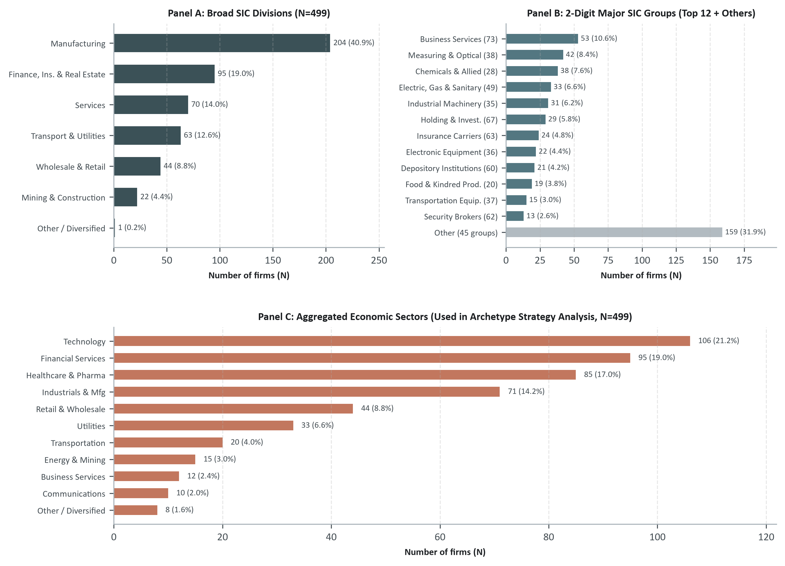{.chart .h-620}
:::

::: note-line
Panel A: broad SIC divisions. Panel B: two-digit SIC major groups (top 12 plus remaining). Panel C: 11 aggregated economic sectors.
:::

<!-- S2 -->

## Distribution of Seven AI Disclosure Posture Dimensions and Disclosure Intensity Across the S&P 500, pooled 2021–2026 YTD {#s2}

::: kicker
S2 / Thesis Figure 4
:::
::: back
[↩ Supplementary index](#/supp)
:::

::: chart
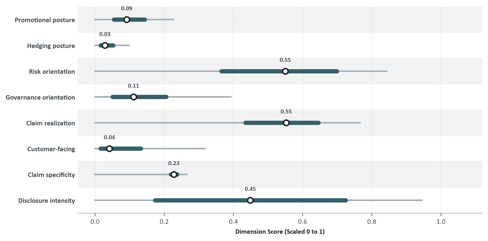{.chart .h-620}
:::

::: note-line
White circles denote medians; petrol bars interquartile ranges; grey whiskers the 5th–95th percentile. All measures are scaled from 0 to 1.
:::

<!-- S3 -->

## AI disclosure diffuses primarily through defensive reporting: annual composition and firm-level transitions, 2021–2026 YTD {#s3}

::: kicker
S3 / Thesis Figure 8
:::
::: back
[↩ Supplementary index](#/supp)
:::

::: chart
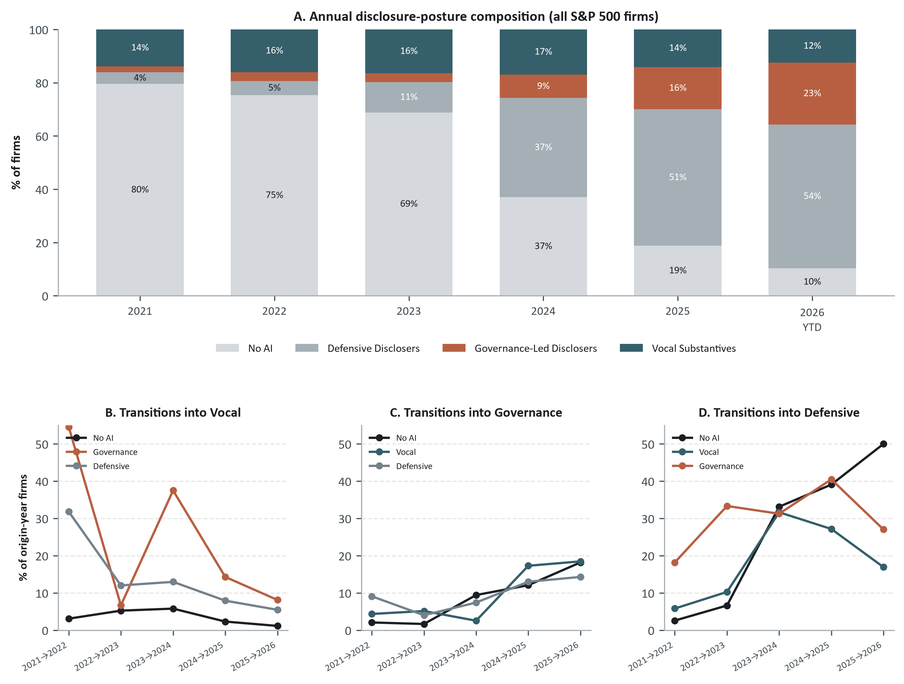{.chart .h-620}
:::

::: note-line
Each firm-year's archetype label comes from a fit on that firm's own text accumulated up to that year. Panels B-D show, for each year-to-year transition, the share of an origin archetype's firms classified into the named destination the following year, on a shared 0-60% axis.
:::

<!-- S4 -->

## Sectoral business purpose and operational action of disclosed AI activity, pooled 2021–2026 YTD {#s4}

::: kicker
S4 / Thesis Figure 10
:::
::: back
[↩ Supplementary index](#/supp)
:::

::: chart
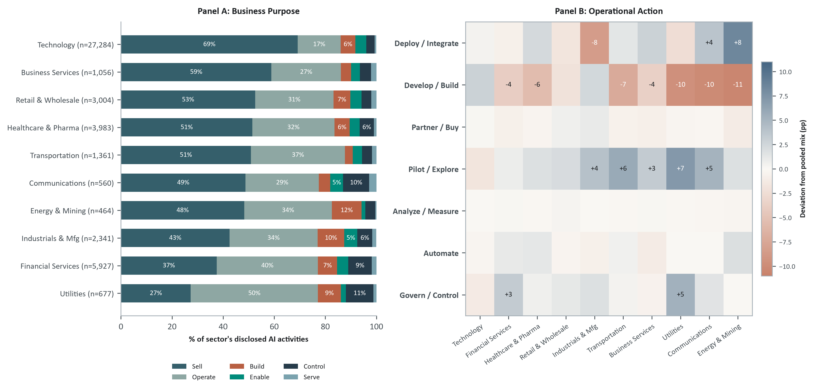{.chart .h-620}
:::

::: note-line
Panel A: each sector's row sums to 100%, ordered by Sell share descending. Panel B: each cell is a sector's share of that action type minus the pooled share across sectors (red = above, blue = below); labeled only where the gap is at least 3 points.
:::

<!-- S5 -->

## Archetypes differ most in activity volume and customer orientation: profile by archetype, pooled 2021–2026 YTD {#s5}

::: kicker
S5 / Thesis Figure 11
:::
::: back
[↩ Supplementary index](#/supp)
:::

::: chart
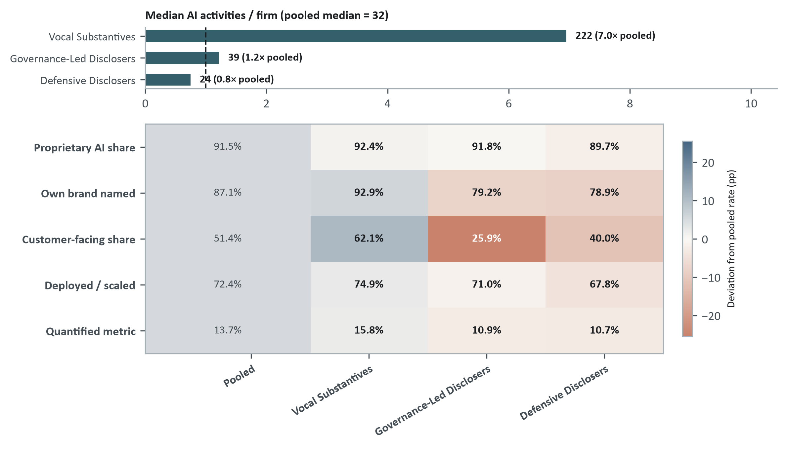{.chart .h-620}
:::

::: note-line
Top panel: median disclosed AI activities per firm relative to the full universe. Bottom panel: raw rates by archetype, with shading indicating percentage-point deviation from the pooled benchmark.
:::

<!-- S6 -->

## Mix of disclosed corporate AI activities by disclosure archetype, pooled 2021–2026 YTD {#s6}

::: kicker
S6 / Thesis Figure 12
:::
::: back
[↩ Supplementary index](#/supp)
:::

::: chart
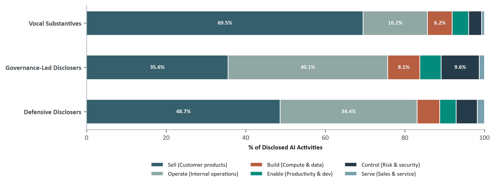{.chart .h-620}
:::

::: note-line
100% stacked horizontal bars: share of each archetype's disclosed AI activities across six business roles (Sell, Operate, Build, Enable, Control, Serve).
:::

<!-- S7 -->

## Decomposing AI activity grounding across all disclosed AI activities, pooled 2021–2026 YTD {#s7}

::: kicker
S7 / Thesis Figure 13
:::
::: back
[↩ Supplementary index](#/supp)
:::

::: chart
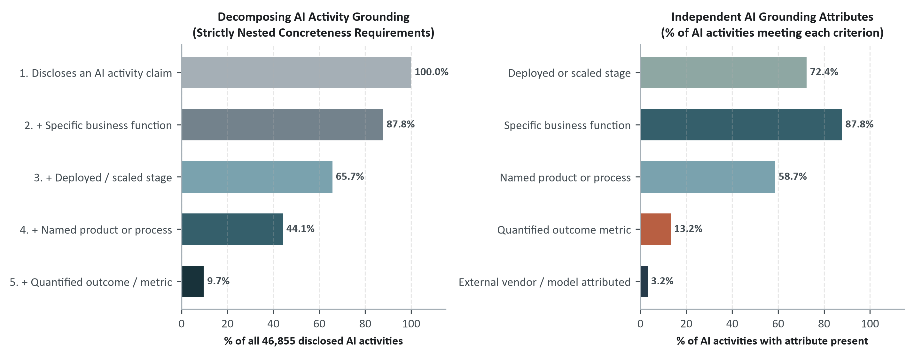{.chart .h-620}
:::

::: note-line
Left: cumulative nested progression of evidence requirements. Right: independent grounding attribute frequencies.
:::

<!-- S8 -->

## Corporate branding versus external-vendor attribution in disclosed AI activities, pooled 2021–2026 YTD {#s8}

::: kicker
S8 / Thesis Figure 15
:::
::: back
[↩ Supplementary index](#/supp)
:::

::: chart
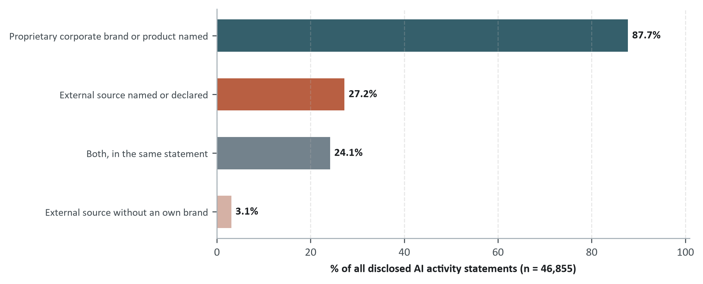{.chart .h-620}
:::

::: note-line
Indicator shares overlap across statements and do not sum to 100. External sources combine named vendors/foundation models, commercial partners, or declared third-party origin, identified via entity tagging and vendor lexicon matching.
:::

<!-- S9 -->

## Named technology ecosystems in AI disclosure across S&P 500 firms, 2021–2026 YTD {#s9}

::: kicker
S9 / Thesis Figure 16
:::
::: back
[↩ Supplementary index](#/supp)
:::

::: chart
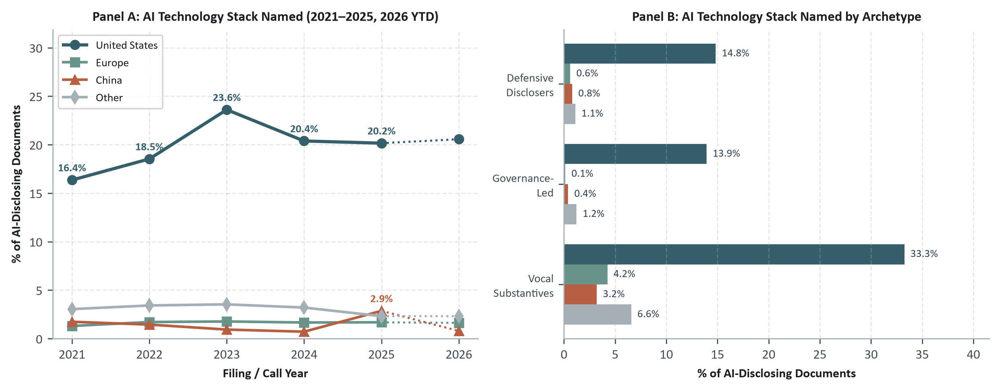{.chart .h-620}
:::

::: note-line
Panel A tracks the share of AI-disclosing documents naming each ecosystem's stack, with 2026 as a dotted, year-to-date segment; Panel B breaks the same rate down by archetype. The denominator is the 8,452 documents with an AI frame; rates are independent presence indicators, so the four series do not sum to 100.
:::

<!-- S10 -->

## Provider families most cited in AI disclosure, by ecosystem and stack role, pooled 2021–2026 YTD {#s10}

::: kicker
S10 / Thesis Figure 17
:::
::: back
[↩ Supplementary index](#/supp)
:::

::: chart
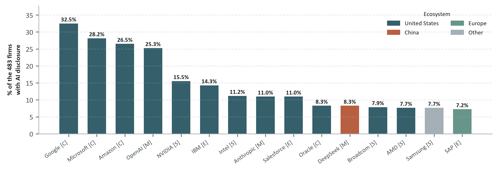{.chart .h-620}
:::

::: note-line
Bars: share of AI-disclosing firms naming each family, colored by ecosystem, with its stack role beside the name (M model, C cloud, S semiconductor, E enterprise software). The 15 most-named of 49 families in the corpus (full list, Thesis Appendix B.6); a firm's own products are excluded. Only disclosures containing sections identified as AI-related are included.
:::

<!-- S11 -->

## Welltower's annual-report AI disclosure around the SEC comment letter of 2025-04-28, against the mean of three matched real-estate peers {#s11}

::: kicker
S11 / Thesis Figure 18
:::
::: back
[↩ Supplementary index](#/supp)
:::

::: chart
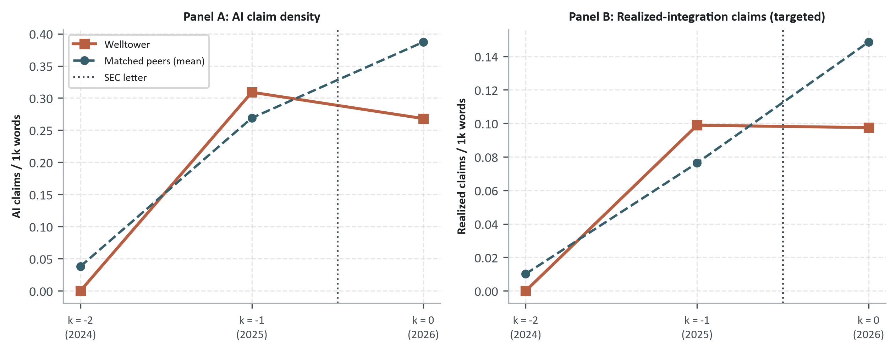{.chart .h-620}
:::

::: note-line
k = −1 is the FY2024 10-K the letter reviewed; k = 0 is the first 10-K filed after the letter. Panel A: AI claim density; Panel B: realized-integration claims, the dimension the staff asked about.
:::

<!-- S12 -->

## Disclosure intensity and disclosed substance for selected firms, with the gap between them, end of 2025 {#s12}

::: kicker
S12 / Thesis Figure 21
:::
::: back
[↩ Supplementary index](#/supp)
:::

::: chart
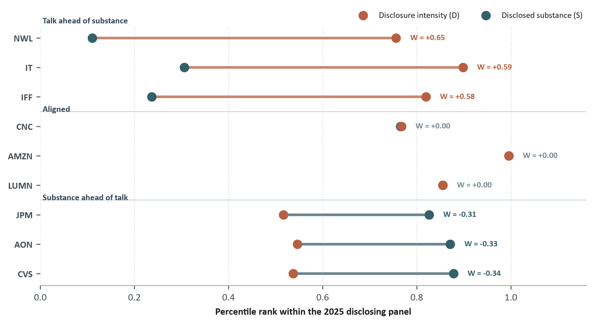{.chart .h-620}
:::

::: note-line
Each line joins a firm's percentile ranks of disclosure intensity (D) and disclosed substance (S); the gap between the two endpoints is W. Cases show the three largest positive, negative, and near-zero gaps among firms in the upper half of D in 2025.
:::

<!-- S13 -->

## Call-minus-filing gap by fiscal year on three evidentiary dimensions, 2021–2026 YTD {#s13}

::: kicker
S13 / Thesis Figure 23
:::
::: back
[↩ Supplementary index](#/supp)
:::

::: chart
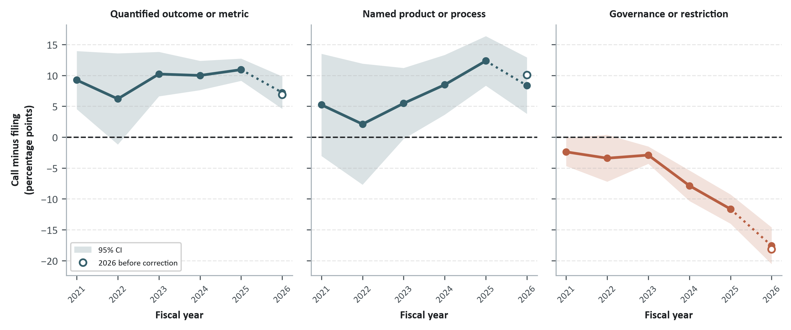{.chart .h-620}
:::

::: note-line
Each point: mean call-minus-filing gap across that year's firm × fiscal-year cells, with the 95% CI from a one-sample t-test. 2026 is still open at the 2026-09-03 cut-off and is seasonally corrected (Thesis Appendix A.3); the hollow marker is the uncorrected value. Cells per year: 2021: 57, 2022: 56, 2023: 103, 2024: 152, 2025: 228, 2026: 194.
:::

<!-- S14 -->

## Calls amplify both promotion and quantified evidence: call-to-filing amplification ratios per 1,000 words, pooled 2021–2026 YTD {#s14}

::: kicker
S14 / Thesis Figure 24
:::
::: back
[↩ Supplementary index](#/supp)
:::

::: chart
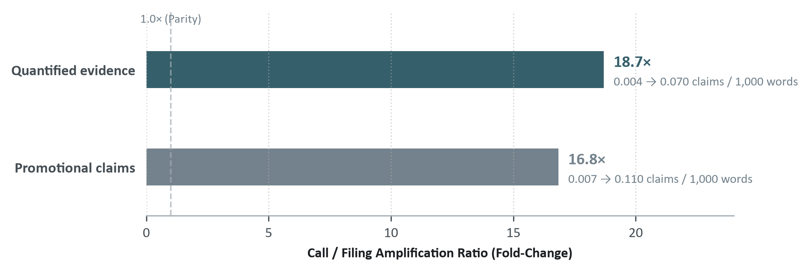{.chart .h-620}
:::

::: note-line
Relative amplification in quantified evidence exceeds that of promotional claims.
:::

<!-- S15 -->

## At equal disclosure volume, Vocal and Governance-Led firms report more activities; Vocal is most customer-facing {#s15}

::: kicker
S15 / Activities vs. Defensive
:::
::: back
[↩ Supplementary index](#/supp)
:::

::: row
::: {.grow .chart}

Disclosed AI activities vs. Defensive, at equal disclosure volume

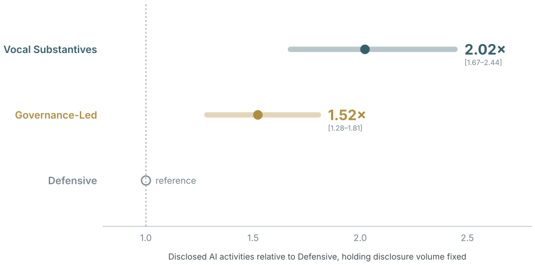{.chart}
:::
::: {.chart style="width:620px;flex:none"}

Customer-facing share of activities

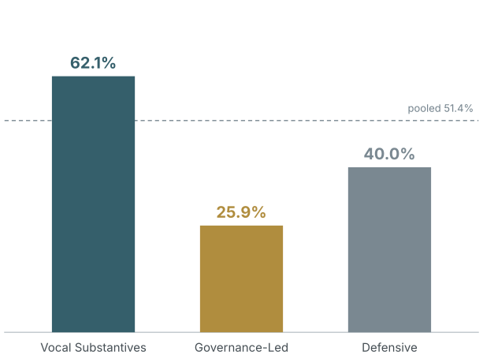{.chart}
:::
:::

::: note-line
Pooled 2021–2026 year to date, 451 active index firms · Thesis Table 40 
Left: negative binomial of activity counts on posture, controlling for log(1 + AI frames), 95% CI; Defensive = 1. Right: share of each posture's activities aimed at customers; dashed line = pooled share.
:::

<!-- S16 -->

## All 48 market tests: few clear the multiple-testing threshold {#s16}

::: kicker
S16 / Market tests
:::
::: back
[↩ Supplementary index](#/supp)
:::

::: chart
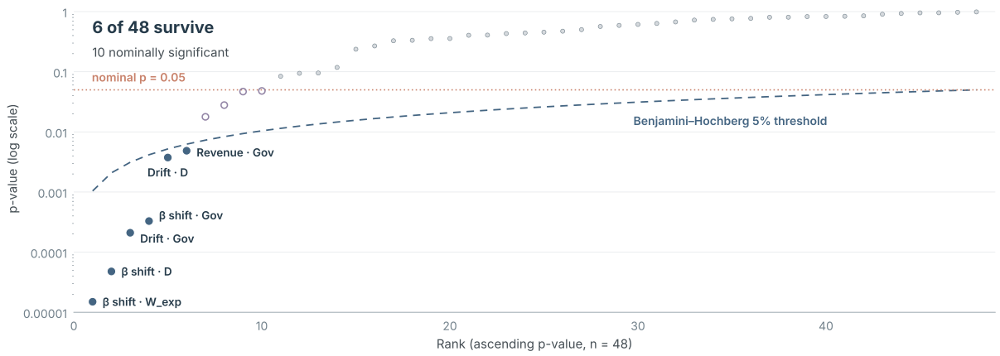{.chart .h-620}
:::

::: note-line
9,350 earnings calls by 484 firms, 2021–2026 · Thesis Table 46 
Benjamini–Hochberg false-discovery control over the whole family of 8 outcomes × 6 disclosure variables, not outcome by outcome.
:::

<!-- S17 -->

## The thesis checklist: the same six questions for an issuer writing and an investor reading {#s17}

::: kicker
S17 / Credibility checklist
:::
::: back
[↩ Supplementary index](#/supp)
:::

| | Issuer | Investor |
|:-------------|:-------------------------|:-------------------------|
| **0. Posture** | Know which posture your writing resembles; calibrate the rest to it. | Posture says how a firm writes, not whether it is backed. |
| **1. Activity &amp; maturity** | Separate pilots from deployed systems; name the function. | Discount vague "exploring"; check it reached production. |
| **2. Evidence** | Name products and tools; give metrics (cost, speed, revenue). | Look for metrics you could check; buzzwords need more checking. |
| **3. Provenance** | Say if it is built in-house, licensed, or co-developed. | Check vendor dependence; unstated origin sits in the weakest claims. |
| **4. Calls vs. 10-K** | Reconcile call remarks with the signed 10-K. | Question claims with less evidence in the 10-K than on the call. |
| **5. Oversight** | Board and audit oversight of AI risk in the proxy; named owners. | Are owners, controls and scope clearly identified? |

: {.compact}

::: note-line
Shortened from Thesis Table 20, the AI Disclosure Credibility Checklist (issuer guidance and investor read). Each line pairs a question with the action it implies.
:::

