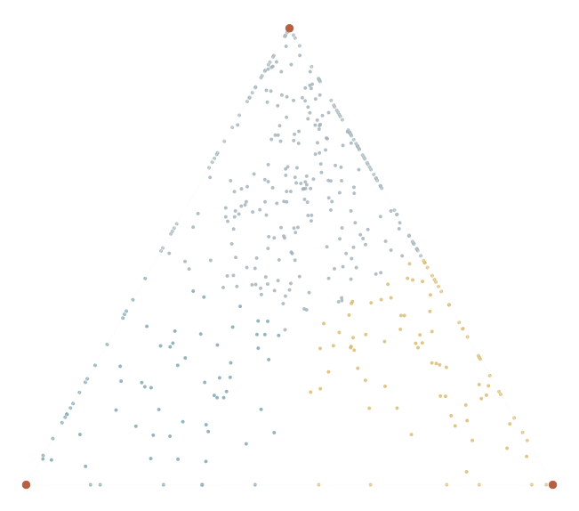

## {.cover background-color="#18323A"}

::: cover-wrap
{.cover-art}

::: cover-kicker
MBA in International Business &nbsp;·&nbsp; XXXVI edition &nbsp;·&nbsp; Final report
:::

::: cover-title
AI Washing or Credible Disclosure?
:::

::: cover-sub
Patterns and Clusters in Corporate AI Disclosures
:::

::: cover-rule
:::

::: cover-meta

Author

Germán Oviedo

Discussant

Prof. Francesco Venier

Evidence

S&amp;P 500 · 2021–2026

:::
:::

::: notes
Good morning. The thesis asks one question: now that almost every large firm talks about AI, how do we tell credible disclosure from talk?
:::

<!-- ============================ 1 · PROBLEM ============================ -->

## As AI disclosure became ubiquitous, credibility — not presence — became the managerial problem

::: kicker
The problem
:::

::: row
::: {.grow style="max-width:560px"}
::: label
S&P 500 firms mentioning AI in SEC filings
:::

::: {.num .xl}
34%→93%
:::

::: num-cap
2021 → 2025. Over the same years AI frames per 1,000 words grew **7.3×**.
:::

::: {.mt-l .small}
- Investors must separate real adoption from promotional claims.
- Managers must communicate AI without overstating its maturity.
- Regulators now treat overstated AI capability as a misstatement: the SEC named **“AI washing”** in December 2023.
:::
:::

::: {.grow .chart}
{.chart .h-580}
:::
:::

::: takeaway
When 93.5% of firms mention AI, **a mention separates almost nobody.** The question becomes *how* firms disclose — and what evidence stands behind it.
:::

::: notes
- Diffusion: 34.3% of firms in 2021, 93.5% in 2025, 95.5% in 2026 YTD. A balanced cohort shows the same path, so this is adoption, not index churn.
- Keyword counts and dictionary tone give the same weight to a risk disclaimer and to a documented deployment. That is the measurement gap the thesis addresses.
:::

<!-- ============================ 2 · RQs ============================ -->

## Four research questions turn the credibility problem into an analytical research design

::: kicker
Research design
:::

::: {.card .sand style="padding:22px 30px"}
::: label
Main research question
:::

To what extent do public firms show <strong>strategic heterogeneity</strong> in their AI disclosures — and does separating disclosure volume, communication posture and grounded operational substance carry incremental economic information?

:::

::: {.grid-4 .mt .rq}
::: {.card .accent-petrol}
::: label
RQ1 · Evolution
:::
#### How did AI disclosure diffuse — and did the evidence keep pace?

Institutional isomorphism

:::

::: {.card .accent-teal}
::: label
RQ2 · Heterogeneity
:::
#### Do firms follow distinct, stable communication postures?

Signalling · organizational configurations

:::

::: {.card .accent-ochre}
::: label
RQ3 · Credibility
:::
#### Does narrative run ahead of substance, and does it change with legal commitment?

Decoupling · channel liability

:::

::: {.card .accent-rust}
::: label
RQ4 · Economic information
:::
#### Do these distinctions carry information about risk, returns and fundamentals?

Costly signalling

:::
:::

::: band

Map

Discover

Test

Explain

:::

::: outputs

<b>Output</b>Diffusion of volume, activity and grounding, 2021–2026

<b>Output</b>Communication archetypes and their activity portfolios

<b>Output</b>Decoupling index and call-vs-filing evidence gap

<b>Output</b>Multiple-testing-corrected market and operating associations

:::

::: notes
- This is an analytical project: exploratory where the goal is pattern discovery (postures), hypothesis-guided where theory gives a prediction (decoupling, venue, pricing).
- Each RQ builds on the previous one: map the phenomenon, discover structure, test credibility, then ask whether markets care.
- The design also generates second-order questions, which I return to at the end.
:::

<!-- ============================ 3 · METHOD ============================ -->

## A reproducible NLP-to-finance pipeline converts 9.7M paragraphs into measures that answer the four questions

::: kicker
Methodology
:::

::: chart
{.chart}
:::

::: note-line
communication &nbsp;&nbsp;&nbsp; disclosed activity &amp; evidence &nbsp;&nbsp;&nbsp; decoupling &nbsp;·&nbsp; Code, prompts, datasets and models are public and version-pinned.
:::

::: notes
- Two LLM passes: first, claims (“frames”) with seven communicative dimensions; second, when the firm itself acts, an action triple — verb, AI object, business function — plus stage, provenance and evidence.
- D = AI frames per 1,000 words. P = seven-dimensional posture. A = activity count. G = share of five evidence attributes. S = log(1+A)×G. W = rank(D) − rank(S).
- Details and validation in backup B2–B5.
:::

<!-- ============================ 4 · POSTURES ============================ -->

## AI disclosure converged in prevalence but separated into three reproducible communication postures

::: kicker
RQ2 / Heterogeneity
:::

::: row
::: {.chart style="width:760px;flex:none;margin-top:-20px"}
{.chart .h-740}
:::

::: {.grow}
::: {.card .accent-petrol style="padding:20px 26px"}

78 firms

<h4 class="petrol">Vocal Substantives</h4>

Customer-facing <strong>+2.6 SD</strong>, specificity <strong>+2.8 SD</strong>, promotional <strong>+2.1 SD</strong>. Microsoft, NVIDIA, Alphabet, Amazon.

:::

::: {.card .accent-ochre .mt-s style="padding:20px 26px"}

91 firms

<h4 class="ochre">Governance-Led</h4>

Governance <strong>+2.6 SD</strong>, realized claims <strong>+1.9 SD</strong>. Board oversight and responsible use — Citigroup, Apple, BlackRock.

:::

::: {.card .accent-slate .mt-s style="padding:20px 26px"}

282 firms

<h4 class="slate">Defensive</h4>

Risk <strong>+1.3 SD</strong>, realization <strong>−1.6 SD</strong>. AI as a hazard in Item 1A — Goldman Sachs, J&amp;J.

:::

::: mt-s
Disclosure volume excluded from the fit
Only k = 3 stays above 0.60 Jaccard in both bootstraps
:::
:::
:::

::: notes
- Archetypal analysis writes every firm as a mix of three extreme profiles; the simplex shows those mixes. 47 firms with fewer than five AI frames are labelled No AI and not fitted.
- Volume is deliberately not an input: how much a firm says and how it says it are different questions.
- Stability: k = 2 is stable but erases governance; k = 4 collapses (a fourth archetype falls to 0.37 Jaccard). Backup B6.
- Posture is not capability: Apple is Governance-Led in EDGAR because its product marketing happens at keynotes.
:::

<!-- ============================ 5 · ACTIVITIES ============================ -->

## The postures extend beyond language: independently extracted activities differ even at comparable disclosure intensity

::: kicker
RQ2 / External coherence
:::

::: row
::: {.grow .chart}

Disclosed AI activities vs. Defensive, at equal disclosure volume

{.chart}
:::

::: {.chart style="width:620px;flex:none"}

Customer-facing share of activities

{.chart}
:::
:::

::: takeaway
Activities were **never an input** to the posture fit, yet Vocal Substantives report **2.02×** and Governance-Led **1.52×** the activities of Defensive firms at the same volume. Posture tells a reviewer *where to start* — quantified outcomes stay scarce in every group (11–16%).
:::

::: notes
- Negative binomial of activity counts on archetype, controlling for log(1 + AI frames). Raw ratio for Vocal is 7.9×; volume explains much of it, 2.02× survives (95% CI 1.67–2.44).
- Median activities per firm: Vocal 222, Governance-Led 39, Defensive 24.
- This is the circularity check: backup B7.
:::

<!-- ============================ 6 · GROUNDING ============================ -->

## The AI boom expanded disclosed activity without a matching improvement in documentary grounding

::: kicker
RQ1 · RQ3 / Evolution of evidence
:::

::: chart
{.chart .h-500}
:::

::: {.grid-3 .mt}
::: {.card .sand style="padding:18px 24px"}

Grounding

G = share of five evidence attributes an activity names: function, deployed stage, product, metric, provider.

:::
::: {.card .sand style="padding:18px 24px"}

Disclosed substance

S = log(1 + A) × G — activity volume weighted by how well it is documented.

:::
::: {.card .sand style="padding:18px 24px"}

Decoupling

W = rank(D) − rank(S) — talk ahead of substance when positive; persistent year to year (ρ = 0.60).

:::
:::

::: notes
- Activities grew 5.1× from 2021 to 2025; the share naming a product or process fell from 54% to 45% (40% in 2026 YTD); deployed or scaled fell from 79% to 72%.
- Only 9.7% of all activities reach the top of the ladder: deployed, named, and quantified.
- Not a composition effect: grounding falls inside the fixed 2021 cohort too (0.44 → 0.39). Backup B14.
- What declines is documentary detail per activity, not necessarily real execution.
:::

<!-- ============================ 7 · VENUE ============================ -->

## Disclosure credibility changes with commitment: calls and statutory filings portray the same firms differently

::: kicker
RQ3 / Venue
:::

::: row
::: {.grow .chart}

Earnings call minus statutory filing, same firm and fiscal year (pp, 95% CI)

{.chart .h-620}
:::

::: {style="width:520px;flex:none"}
::: {.card .accent-petrol}

Per 1,000 words, calls carry

16.8×

more promotional statements

18.7×

more quantified outcome claims

:::

::: {.takeaway style="font-size:23px"}
Promotion is **not the opposite of evidence.** The activity mix barely moves; calls carry the proof, filings the caveats. A gap in *claimed scope* — not in detail — is the red flag.
:::
:::
:::

::: notes
- Design: firm × fiscal-year fixed effects, 790 balanced cells, 285 firms, at least three activities per channel; SE clustered by firm. The fixed effect holds the firm and the year constant.
- Consistent with channel liability: statutory filings carry strict liability, calls a wider safe harbor.
- The quantified-outcome premium in calls already existed in 2021 — an old managerial habit, not a GenAI effect. Backup B11.
:::

<!-- ============================ 8 · MARKETS ============================ -->

## Disclosure differences carry incremental economic information — but only for selected outcomes

::: kicker
RQ4 / Economic information
:::

::: chart
{.chart}
:::

::: {.grid-3 .mt-s .tight}
::: small
Accumulated, not episodic Past decoupling and cumulative volume go with a more positive beta shift; a single call’s decoupling never does.
:::
::: small
Governance vs. Defensive Lower beta shift, higher drift over the next quarter, slower revenue growth.
:::
::: small
No survivors Announcement return, crash risk, gross margin, ROIC–WACC.
:::
:::

::: note-line
survives BH-FDR 5% (6 of 48) &nbsp;&nbsp; nominal p &lt; 0.05 only &nbsp;·&nbsp; 9,350 calls, 484 firms &nbsp;·&nbsp; sector and year FE, firm-clustered SE &nbsp;·&nbsp; **association, not causal effect**
:::

::: notes
- Deliberately moderate claim: this does not say “the market detects AI washing”.
- Standardized coefficients: W_exp +0.09 and D +0.07 on the beta shift; Governance −0.22 on the beta shift, +0.22 on drift, −0.20 on revenue growth.
- All regressors are predetermined at the call date; lagged outcome controlled. Specification in B12, full battery in B13.
:::

<!-- ============================ 9 · FRAMEWORK ============================ -->

## The findings turn credibility assessment from a binary judgment into a structured verification process

::: kicker
Managerial application
:::

::: flow
::: {.card .pre}
0
<h4>Define</h4>

Firm, period, channels and the decision at stake: a filing to sign, a position to take, a supplier to choose.

:::

::: {.card .accent-petrol}
1
<h4>Diagnose</h4>

<strong>Posture</strong> sets the peer set · <strong>grounding</strong> places the firm on D × S · <strong>venue</strong> checks call vs. 10-K.

::: {.quad .mt-s}

Investigate

56

high D · low S

Validate

166

high D · high S

Deprioritize

187

low D · low S

Explore

56

low D · high S

:::

S&amp;P 500 firms, 2026 screen

:::

::: {.card .accent-ochre}
2
<h4>Verify</h4>

Rank material claims; claims naming <strong>no product, no provider and no metric</strong> go first. Persistent W orders the queue.

Output: a <strong>claim register</strong> — claim, source, maturity, evidence, owner, next review.

:::

::: {.card .accent-rust}
3
<h4>Act</h4>

<strong>Issuer:</strong> narrow the claim, close the measurement gap, reconcile remarks with the 10-K.

<strong>Investor:</strong> credit, condition on milestones, or drop the assumption.

:::
:::

::: {.mt}

Claim register · one illustrative row

| Claim | Source | Diagnosis | Verification needed | Owner |
|:--|:--|:--|:--|:--|
| “AI automates claims processing end to end” | Q3 call | Named function; no product, provider or metric; absent from 10-K | Deployment scope, pilot results, human-review share | Head of Operations · before next 10-K |

: {.register .compact}
:::

::: note-line
Proposed application built on the estimated constructs — **not yet validated** against real decisions. It diagnoses documentary distance, not fraud.
:::

::: notes
- 2026 screen of the index: 56 firms Investigate, 166 Validate, 56 Explore, 187 Deprioritize (incl. 21 non-disclosers).
- Materiality comes from outside the framework and can reverse the order: a central claim in Deprioritize outranks a peripheral one in Investigate.
- Same register works for issuers (before publishing) and for investors (before committing capital). Full version in B18.
:::

<!-- ============================ 10 · ANSWER ============================ -->

## AI disclosure is ubiquitous but not homogeneous — and richer measurement makes the next questions testable

::: kicker
Answer to the research question
:::

::: {.card .sand style="padding:22px 30px"}

<strong>Yes, strongly heterogeneous.</strong> Three stable postures that track what firms report doing; narrative outgrew its evidence; venue changes the evidence, not the story. The economic information is real but selective: accumulated decoupling, cumulative volume and governance posture.

:::

::: {.grid-3 .mt}
::: {.card .accent-petrol}
::: label
Empirical contribution
:::
- Three postures, sorted by sector and channel
- Activity growth with thinning grounding
- Call–filing evidence asymmetry
- Market associations, BH-corrected
:::

::: {.card .accent-teal}
::: label
Managerial contribution
:::
- Six constructs that separate talk from evidence
- Diagnose → Verify → Act claim register
- Same routine for issuers and investors
:::

::: {.card .accent-rust}
::: label
Research agenda
:::
- Link disclosure to actual implementation
- Sector × activity × grounding interactions
- Posture transitions and future behavior
- Human validation of the extraction
- Does the framework improve decisions?
:::
:::

::: note-line
Documentary distance ≠ fraud, intent or technological maturity.
:::

::: notes
- Contribution 1 and 2 are estimated; contribution 3 (the framework) is a proposed application.
- Close: “The thesis does not tell you who is lying. It tells you where to look first, and what would settle the question.”
:::

<!-- ============================ BACKUP ============================ -->

## {#backup .divider background-color="#18323A"}

::: divider-wrap
::: cover-kicker
Questions &amp; answers
:::

::: divider-title
Backup
:::

::: toc
<a href="#/b1"><b>B1</b>RQ → construct → method → finding</a>
<a href="#/b2"><b>B2</b>The six constructs</a>
<a href="#/b3"><b>B3</b>Pipeline at a glance</a>
<a href="#/b4"><b>B4</b>Extraction architecture</a>
<a href="#/b5" class="key"><b>B5</b>Validation</a>
<a href="#/b6"><b>B6</b>Why k = 3</a>
<a href="#/b7" class="key"><b>B7</b>No circularity</a>
<a href="#/b8"><b>B8</b>No temporal leakage</a>
<a href="#/b9" class="key"><b>B9</b>What W measures</a>
<a href="#/b10" class="key"><b>B10</b>Disclosure ≠ implementation</a>
<a href="#/b11"><b>B11</b>Call vs. filing design</a>
<a href="#/b12" class="key"><b>B12</b>Market specification</a>
<a href="#/b13"><b>B13</b>Multiple testing</a>
<a href="#/b14"><b>B14</b>Grounding within firms</a>
<a href="#/b15"><b>B15</b>SEC scrutiny</a>
<a href="#/b16"><b>B16</b>DeepSeek shock</a>
<a href="#/b17"><b>B17</b>Sector differences</a>
<a href="#/b18"><b>B18</b>Framework in full</a>
<a href="#/b19"><b>B19</b>Second-order agenda</a>
:::
:::

<!-- B1 -->

## Each research question maps to a distinct construct, method and empirical output {#b1}

::: kicker
B1 / Architecture
:::
::: back
[↩ Backup index](#/backup)
:::

| | Theory | Construct | Method | Finding |
|:--|:--|:--|:--|:--|
| **RQ1** Evolution | Institutional isomorphism | *D*, *A*, *G* by year | Panel descriptives; fixed-cohort check | 34% → 93% of firms; activities 5.1×; grounding thins |
| **RQ2** Heterogeneity | Signalling; configurations | *P* (7 dimensions) | Archetypal analysis, bootstrap stability, NB on activity | Three postures; 2.02× / 1.52× activity at equal volume |
| **RQ3** Credibility | Decoupling; channel liability | *S*, *W*; venue gap | Rank gap; firm × year FE, calls vs. filings | *W* persists (ρ 0.60); calls carry more evidence, filings more caveats |
| **RQ4** Economic information | Costly signalling; opacity | *W*~call~, *W*~exp~, *D*, *P* weights | ANCOVA on 9,350 calls, sector & year FE, BH-FDR | 6 of 48 survive: β shift, drift, revenue |

: {.compact}

::: note-line
Exogenous events (SEC warning, DeepSeek) are treated as interrupted time series — B15, B16.
:::

<!-- B2 -->

## Six constructs separate disclosure volume from posture, activity, evidence and decoupling {#b2}

::: kicker
B2 / Constructs
:::
::: back
[↩ Backup index](#/backup)
:::

| | Construct | Definition | Reads as |
|:--|:--|:--|:--|
| D | AI disclosure intensity | AI frames per 1,000 words | How much the firm talks about AI |
| P | Communication posture | Shares of claims that are promotional, hedged, risk, governance, realized, customer-facing, specific | *How* it talks |
| A | Disclosed AI activity | Count of action triples (verb · AI object · business function) | Breadth of reported execution |
| G | Activity grounding | Mean share of 5 attributes: function, deployed stage, named product, metric, provider — ∈ [0, 1] | How verifiable each activity is |
| S | Disclosed substance | log(1 + *A*) × *G* | Grounded activity volume |
| W | Decoupling | rank(*D*) − rank(*S*) ∈ [−1, 1], ranks within year among disclosers | Talk ahead of substance (+) or quiet substance (−) |

: {.compact}

::: note-line
Firm-year values are the median document rate; thin evidence is shrunk toward the sector-year prior (empirical Bayes).
:::

<!-- B3 -->

## Each pipeline stage feeds a construct, and each construct answers a research question {#b3}

::: kicker
B3 / Pipeline at a glance
:::
::: back
[↩ Backup index](#/backup)
:::

::: pipe
::: stage

Corpus

59,820

10-K, 10-Q, DEF 14A, 8-K and earnings calls · S&amp;P 500 (499 firms), 2021–2026 · <strong>9.7M paragraphs</strong>

:::
::: stage

Deduplicate

5.1M

unique paragraphs; boilerplate scored once, mapped back to every filing

:::
::: stage

Screen

38,440

AI candidates kept by a gradient-boosted filter tuned for recall (≈0.97)

:::
::: stage

Extract · LLM

46,855

operational AI activities in 471 firms, from 70,169 claims — each anchored to its sentence

:::
::: {.stage .dark}

Measure

<i>D P A G S W</i>

six constructs at the firm-year and call level

:::
:::

::: {.grid-4 .mt-l}
::: card
::: label
RQ1 · Evolution
:::

D A G

Volume, activity and grounding tracked year by year

:::
::: card
::: label
RQ2 · Heterogeneity
:::

P

Seven posture dimensions → archetypal analysis, <em>k</em> = 3

:::
::: card
::: label
RQ3 · Credibility
:::

S W

Talk-vs-substance gap; calls vs. filings within firm-year

:::
::: card
::: label
RQ4 · Economic information
:::

W D P

9,350 earnings calls; ANCOVA with FE; BH-FDR correction

:::
:::

<!-- B4 -->

## The extraction architecture reduces 9.7M paragraphs while preserving claim-level information {#b4}

::: kicker
B4 / Pipeline detail
:::
::: back
[↩ Backup index](#/backup)
:::

::: row
::: grow
| Stage | Retained | Operation |
|:--|--:|:--|
| Raw corpus | 9,714,405 | Paragraph segmentation of 59,820 documents |
| Scorable | 8,891,944 | Prose only; tables, exhibits, graphics dropped |
| Unique | 5,122,492 | BLAKE2b content hash — each text scored once |
| AI candidates | 38,440 | GBDT, 39 features (bge-m3 anchor similarity, stems, entities, section), τ = 0.17 |
| Texts with ≥1 claim | 31,550 | Zero-shot LLM → 70,169 frames, 7 dimensions + sentence anchor |
| Texts with firm action | 28,229 | Second pass → 46,855 activities: triple, stage, provenance, evidence |

: {.compact}
:::

::: {style="width:560px;flex:none"}
::: {.card .accent-petrol}

Why this design

<ul class="small">
<li>Recall-first screen: a missed AI paragraph is lost for good; a false positive only costs one LLM call.</li>
<li>Deduplication stops boilerplate from being counted — or paid for — twice.</li>
<li>Every label keeps its sentence anchor, so any number traces back to text.</li>
<li>Extraction model chosen on a 7-model benchmark: no field contradictions, ≈3 s per paragraph.</li>
</ul>
:::
:::
:::

<!-- B5 -->

## Validation supports scalable measurement, while systematic human verification remains an important next step {#b5}

::: kicker
B5 / Validation
:::
::: back
[↩ Backup index](#/backup)
:::

::: grid-3
::: {.card .accent-petrol}

Screen transfer · unseen forms

0.97 recall

precision 0.67 · DEF 14A + 8-K, 1,500 texts. Calls: recall 0.98, precision 0.59 (0.85 on strong positives).

:::
::: {.card .accent-teal}

External benchmark · AI patents

+0.43 p &lt; 0.001

log patents on log disclosed activity, 343 firms, size + SIC fixed effects; grounded activity +0.41.

:::
::: {.card .accent-ochre}

Aggregation robustness

ρ &gt; 0.96

posture scores and archetypes when borderline categories are collapsed or reweighted.

:::
:::

::: {.card .accent-rust .mt}

Limitation stated plainly

Accuracy labels come from a <strong>second, independent LLM</strong>, not from humans. A human validator is built (one factual question at a time, evidence highlighted) and stratified samples are drawn — 300 prefilter paragraphs; 120 paragraphs / 267 activities — but <strong>not yet reviewed</strong>. No human-audited error rate is claimed.

:::

<!-- B6 -->

## Three archetypes provide the most reproducible representation of disclosure posture {#b6}

::: kicker
B6 / Choosing k
:::
::: back
[↩ Backup index](#/backup)
:::

::: chart
{.chart .h-500}
:::

::: {.grid-3 .mt}
::: small
**k = 2** is stable but merges governance into promotion — it erases the difference between board oversight and a risk warning.
:::
::: small
**k = 4** fails: the fourth archetype falls to Jaccard 0.37 — a promotional-but-vague cluster does not exist as a style.
:::
::: small
**Out of sample:** a model frozen on 2021–2025 recovers the 2026 partition (ARI 0.63); K-means reproduces the same three groups.
:::
:::

<!-- B7 -->

## Posture is identified independently of both disclosure volume and operational activity {#b7}

::: kicker
B7 / Circularity
:::
::: back
[↩ Backup index](#/backup)
:::

::: row
::: {.grow .chart}

Archetype vertices — the only inputs are seven posture shares

{.chart}
:::

::: {style="width:560px;flex:none"}
::: {.card .accent-teal}

In the fit

Seven frame-level P shares: promotional, hedging, risk, governance, realization, customer-facing, specificity.

:::
::: {.card .accent-rust .mt-s}

Out of the fit

D (volume) and A (activities) — both measured separately and used only afterwards as coherence checks.

:::
::: {.card .sand .mt-s}

Raw activity gap Vocal vs. Defensive: <strong>7.9×</strong>. Holding volume fixed: <strong>2.02×</strong> (CI 1.67–2.44). Volume matters; posture still adds.

:::
:::
:::

<!-- B8 -->

## Expanding estimation windows prevent future information from defining historical posture {#b8}

::: kicker
B8 / Temporal leakage
:::
::: back
[↩ Backup index](#/backup)
:::

::: chart
{.chart .h-500}
:::

::: {.grid-2 .mt}
::: small
**Rule.** A firm's label in year *t* uses only its own text from 2021 up to *t* — one vector per firm per fit. No label ever uses a later year. Market regressors are joined as-of the call date.
:::
::: small
**Reading.** New disclosers enter as Defensive (4% → 54% of the index), not as Vocal (14% → 13%): boilerplate is cheap on short notice, a Vocal claim is not.
:::
:::

<!-- B9 -->

## W captures relative disclosure–substance decoupling rather than deception {#b9}

::: kicker
B9 / Construct validity
:::
::: back
[↩ Backup index](#/backup)
:::

::: row
::: {.chart style="width:700px;flex:none"}
{.chart}
:::

::: grow

<i>W</i> = rank(<i>D</i>) − rank(<i>S</i>)

- **Relative, within year:** percentile ranks among disclosers, so the yearly mean is ~0 by design. It sorts firms; market-wide dilution is read from grounding (slide 6).
- **Ranks, not z-scores:** *D* has a far heavier tail — z-scores would push Microsoft or NVIDIA into the “washing” tail.
- **Stable trait:** year-over-year ρ = 0.60; split-half ρ = 0.63; regression-residual version ρ = 0.81.
- **Not size or risk:** no association with market cap, beta or R&D intensity.

::: {.card .sand .mt}

High <i>W</i>: “The Company <strong>may use</strong> artificial intelligence…” (no system, stage or result). Low <i>W</i>: “Deploy AI… through our global <strong>Aon Business Services platform</strong>.” Explanations include competition, editorial convention, disorganisation — or overstatement.

:::
:::
:::

<!-- B10 -->

## Public disclosures reveal reported operational behavior — not independently verified implementation {#b10}

::: kicker
B10 / What is observed
:::
::: back
[↩ Backup index](#/backup)
:::

::: chain
::: {.card .accent-petrol}

Observed

<h4>Communication</h4>

How the firm talks about AI: volume D and posture P.

:::
::: {.card .accent-teal}

Observed

<h4>Disclosed activity</h4>

What the firm says it does, and with what evidence: A, G, S.

:::
::: {.card .ghost}

Not observed

<h4>Actual implementation</h4>

What was really built, adopted and paid off. Needs internal access, audits or usage data.

:::
:::

::: {.grid-2 .mt-l}
::: small
**What the thesis can claim:** documentary distance between the first two layers, its persistence, venue pattern and market associations.
:::
::: small
**Partial external anchor:** disclosed activity orders firms like AI patents (B5) — but patents track capacity, not operational use.
:::
:::

<!-- B11 -->

## Channel comparisons hold the firm and period constant to isolate disclosure-context differences {#b11}

::: kicker
B11 / Venue design
:::
::: back
[↩ Backup index](#/backup)
:::

<i>Y</i>i,t,venue = αi,t + β · 1[venue = call] + εi,t,venue

::: grid-3
::: card

Cells

790

firm-years, 285 firms, ≥ 3 activities in each channel

:::
::: card

Each cell

All calls of the fiscal year pooled vs. the 10-K and 10-Qs of that year; shares of activities or rates per 1,000 words.

:::
::: card

Inference

αi,t absorbs everything fixed about the firm that year; SE clustered by firm.

:::
:::

::: {.grid-2 .mt}
::: small
**By year:** the quantified-outcome premium in calls exists from 2021 and stays flat; the named-product gap opens with GenAI; governance caveats keep moving into filings.
:::
::: small
**Limit:** composition at venue level — it does not track whether a specific call claim reappears, softened, in the next filing.
:::
:::

<!-- B12 -->

## Market tests ask whether disclosure signals add information — not whether disclosure causes returns {#b12}

::: kicker
B12 / Identification
:::
::: back
[↩ Backup index](#/backup)
:::

<i>Y</i>i,t = α + β · Disclosurei,t⁻ + γ · <i>Y</i>i,t⁻ + δ · Controlsi,t⁻ + Sectori + Yeart + εi,t

::: row
::: grow
| Regressor | Measured |
|:--|:--|
| *W*~call~ | this call's own transcript |
| *W*~exp~ | expanding mean of past call *W* |
| *D* | cumulative filing intensity to prior quarter |
| has · *w*~voc~ · *w*~gov~ | trailing posture mix, Defensive = reference |
| Controls | log mkt cap, 60-day return, ROA (+ KLZ for crash risk) |

: {.compact}
:::
::: grow
| Outcome | Window |
|:--|:--|
| Beta shift (Brenner) | days [−63,−21) vs [+21,+63) |
| CAR [−1,+1] · drift [+2,+63] | market-model residuals |
| NCSKEW · DUVOL | 26 weeks after |
| Margin · ROIC−WACC · revenue | next 4 vs. prior 4 quarters |

: {.compact}
:::
:::

::: note-line
Predetermined regressors, lagged outcome, firm-clustered SE. Cross-sectional association: changing the wording would not mechanically change beta.
:::

<!-- B13 -->

## Multiple-testing correction leaves a narrower set of market associations than raw significance suggests {#b13}

::: kicker
B13 / 48 tests
:::
::: back
[↩ Backup index](#/backup)
:::

::: chart
{.chart .h-620}
:::

::: note-line
Benjamini–Hochberg false-discovery control over the whole family — 8 outcomes × 6 disclosure variables — not outcome by outcome.
:::

<!-- B14 -->

## The grounding decline persists beyond changes in the composition of firms and documents {#b14}

::: kicker
B14 / Robustness
:::
::: back
[↩ Backup index](#/backup)
:::

::: row
::: {.grow .chart}
{.chart}
:::
::: {style="width:560px;flex:none"}
- **Within firms:** the fixed 2021 cohort dilutes its own claims, 0.44 → 0.39.
- **Entry:** from 2023, new disclosers enter at or below incumbents.
- **Rollup:** activity- and firm-weighted versions agree — calls more grounded than filings under both.
- **Ladder:** only 9.7% of activities are deployed, named *and* quantified.
:::
:::

<!-- B15 -->

## Risk and governance language accelerated before the SEC's AI-washing warning, not at it {#b15}

::: kicker
B15 / Regulatory scrutiny
:::
::: back
[↩ Backup index](#/backup)
:::

::: chart
{.chart .h-540}
:::

::: {.grid-2 .mt}
::: small
**Sweep:** refitting the break month from 2023 to 2025, the best fit is early 2023 (governance Jan, risk Mar) — the step at December 2023 is indistinguishable from zero.
:::
::: small
**Direct scrutiny is rare:** 8 AI-term comment-letter threads in the universe, 1 on operational claims (Welltower, 2025). Its next 10-K cut claim density and moved *W* from +0.14 to −0.13.
:::
:::

<!-- B16 -->

## The DeepSeek shock produced a two-month burst of open-source language in earnings calls, not a lasting shift {#b16}

::: kicker
B16 / Technology shock
:::
::: back
[↩ Backup index](#/backup)
:::

::: chart
{.chart .h-580}
:::

::: note-line
Interrupted time series, 68 months of calls, season and composition controls, Jan–Feb 2025 as pulse terms. January ≈ 10× the prior monthly mean; lasting level change p = 0.78. Analysts named the model (AT&amp;T, Corning calls).
:::

<!-- B17 -->

## Sector differences show why credibility signals should be interpreted relative to operating context {#b17}

::: kicker
B17 / Heterogeneity
:::
::: back
[↩ Backup index](#/backup)
:::

::: row
::: {.chart style="width:1060px;flex:none"}
{.chart}
:::
::: grow
- **Technology** sorts Vocal: capability and a commercial reason to market AI.
- **Financials & Utilities** sort Governance-Led: model-risk and oversight regimes.
- **Channels:** Defensive weight tracks Item 1A share (r = 0.77); Governance tracks DEF 14A (r = 0.72).
- A 10-K-only reading misses much of the governance evidence.

::: {.card .sand .mt}

Judge a firm against its <strong>sector peers</strong> before calling any posture exceptional.

:::
:::
:::

<!-- B18 -->

## The framework translates empirical signals into verification priorities without claiming to score firm credibility {#b18}

::: kicker
B18 / Framework
:::
::: back
[↩ Backup index](#/backup)
:::

::: row
::: {style="width:720px;flex:none"}

2026 screen · 465 index firms

::: quad

Investigate

56

High <i>D</i>, low <i>S</i> · audit claims, reconcile call vs. 10-K

Validate

166

High <i>D</i>, high <i>S</i> · confirm evidence stays consistent

Deprioritize

187

Low <i>D</i>, low <i>S</i> · incl. 21 non-disclosers

Explore

56

Low <i>D</i>, high <i>S</i> · catalogue quiet execution

:::

Median splits among 444 disclosers; persistent <i>W</i> orders the queue inside a cell. Reconcile screen: 32 of 447 dual-channel issuers with promotional gap z &gt; 1.5.

:::

::: grow
| Verification finds | Issuer | Investor |
|:--|:--|:--|
| Execution, evidence unorganised | Fix measurement & ownership | Ask for backing first |
| Evidence, not communicated | Decide what to disclose | Look into it; don't assume mispricing |
| Claim ahead of execution | Narrow the claim | Condition on milestones |
| Execution, value unproven | Review cost & adoption | Separate capability from value |
| Material, supported | Decide on the economics | Take into the thesis |

: {.compact}
:::
:::

::: note-line
Empirically estimated: *D, P, A, G, S, W*. Proposed: the decision process around them. Materiality comes from outside and can reverse the queue.
:::

<!-- B19 -->

## The analytical architecture creates a second-order research agenda that this dissertation does not claim to resolve {#b19}

::: kicker
B19 / Next questions
:::
::: back
[↩ Backup index](#/backup)
:::

::: grid-3
::: {.card .accent-petrol}
<h4>Actual implementation</h4>

Link claims to hiring, cloud spend, product telemetry or audits — the unobserved third layer.

:::
::: {.card .accent-teal}
<h4>Sector × W, activity × grounding</h4>

Where does decoupling concentrate, and which activity types lose evidence fastest?

:::
::: {.card .accent-ochre}
<h4>Posture transitions</h4>

Do firms moving Defensive → Vocal later ground their claims — or get scrutinised?

:::
::: {.card .accent-rust}
<h4>Human validation</h4>

Run the built validator on the drawn samples to bound the extraction error rate.

:::
::: {.card .accent-slate}
<h4>Decision utility</h4>

Do analysts using a claim register reach better-calibrated judgments than those reading raw filings?

:::
::: {.card .accent-petrol}
<h4>Beyond the S&amp;P 500</h4>

Longer panels, broader universes, and private / early-stage settings with milestone-based evidence.

:::
:::

::: note-line
Stated as questions the measurement makes testable — not as results.
:::
